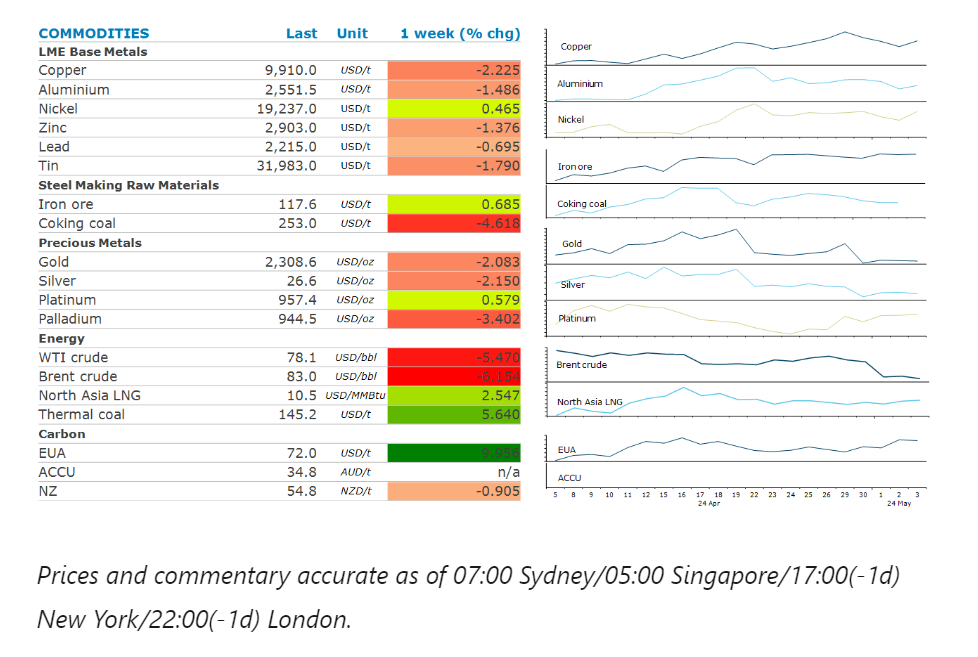
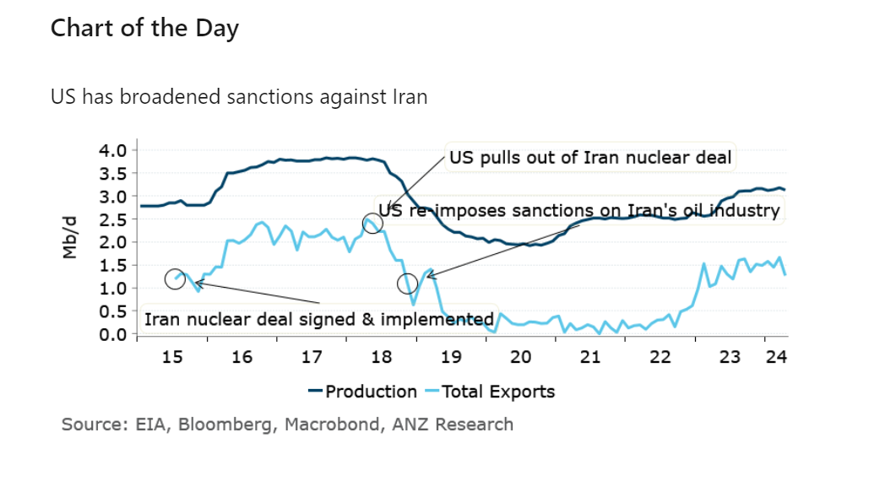

# Oil extends losses as supply risks fade

**Date:** May 06, 2024  
**Publisher:** Breakwave Advisors | **Category:** Market Insights  
**Original URL:** [https://www.breakwaveadvisors.com/insights/2024/5/6/oil-extends-losses-as-supply-risks-fade](https://www.breakwaveadvisors.com/insights/2024/5/6/oil-extends-losses-as-supply-risks-fade)  

---

Shifts in the macro-economic backdrop left the market in two minds for most of the week. However, elevated supply risks continued to provide a strong level of support for energy and metal markets.

*By*[*Daniel Hynes*](https://www.linkedin.com/in/dahynes/)

> **Figure 1: Στιγμιότυπο Οθόνης 2024 05 06 095250**  
> **Interactive Data & Source:** [Linkedin](https://www.linkedin.com/newsletters/commodities-wrap-6692196755876012032/?fbclid=IwAR3kiXJqZdxmp9ZcRwBNI7FsBySI-XSC0pfPur1qzjt7OZp7PTE59Tsl1QI) | [Local Asset](file:///C:/Users/Dell/Github/Shipping/corpus/03-breakwave/insights/2024/assets/2024-05-06_oil-extends-losses-as-supply-risks-fade_img_cea3cf84ceb9ceb3cebcceb9cf8ccf84cf85_fd16b0ccef38.png)

**Gold**ended the week lower amid the fallout from last week’s FOMC meeting. The Fed left rates unchanged but kept the language referring to a future reduction in rates. However, stubbornly high inflation is likely to lead to interest rates remaining higher for longer. This weighed on sentiment, which wasn’t helped by easing safe haven buying. The mood shifted again on Friday after a soft US jobs report lifted hopes of rate cuts.

**Copper**snapped three days of losses on Friday after the US jobs report triggered a fall in the USD. This led to a risk on tone across markets, which boosted sentiment across the base metals sector. Copper ended the week unchanged, after hitting USD10,000/t before the mid-week selloff. Expectations that global supply will struggle to meet growing demand from clean energy sectors has seen prices rally strongly. This has been aided by better-than-expected economic data from China. First quarter GDP growth rose to 1.6% q/q, suggesting a significant gain in growth momentum. However, the composition of growth continues to shift in favour of commodity demand. New power generating capacity continues to be dominated by renewable energy. The electric vehicle (EV) sector saw a strong rebound after a weak start to the year. Overall, the green economy has become China’s biggest growth driver for demand of some commodities, such as metals.

**Battery metals**including lithium rose amid an improving EV market in China. BYD and a host of other Chinese EV makers posted higher sales and deliveries in April, raising hopes of stronger demand. This comes as they responded to overcapacity in the industry with rounds of price reductions. This could be aided further by government support. Beijing announced it will offer consumers replacing cars with electric or hybrid vehicles up to the equivalent of nearly USD1400.

**Crude oil**recorded its biggest weekly decline in three months as the risk of supply disruptions continue to ease lower. Hamas is studying a proposal for a temporary ceasefire with Israel and plans to send a delegation to Egypt to continue negotiations. This follows reports that the US and Saudi Arabia are nearing a historic pact that would offer the kingdom security guarantees and lay out a possible pathway to diplomatic ties with Israel. The outlook for demand took a turn for the worst with an unexpected rise in inventories in the US last week. Nevertheless, the losses were limited as the market contemplates OPEC extending its current output cuts. A Bloomberg survey predicted the group would extend the curbs when it meets on 1 June. This was aided by the prospect of limited growth from US producers. US producer EOG Resources predicted growth in supply would be only 300kb/d this year, about half of the increase achieved in 2023.

**European gas**prices held above EUR30/MWh as traders ponder increasing competitiveness for LNG cargoes. Despite storage levels ending the heating season near record levels, strong demand from Asia could make replenishing those facilities harder in 2024. Strong buying from India helped support**LNG North Asia**LNG prices.

> **Figure 2: Στιγμιότυπο Οθόνης 2024 05 06 095834**  
> **Interactive Data & Source:** [Linkedin](https://www.linkedin.com/newsletters/commodities-wrap-6692196755876012032/?fbclid=IwAR3kiXJqZdxmp9ZcRwBNI7FsBySI-XSC0pfPur1qzjt7OZp7PTE59Tsl1QI) | [Local Asset](file:///C:/Users/Dell/Github/Shipping/corpus/03-breakwave/insights/2024/assets/2024-05-06_oil-extends-losses-as-supply-risks-fade_img_cea3cf84ceb9ceb3cebcceb9cf8ccf84cf85_aead6b9dfbb8.png)

Data source:[Commodities Wrap](https://www.linkedin.com/newsletters/commodities-wrap-6692196755876012032/?fbclid=IwAR3kiXJqZdxmp9ZcRwBNI7FsBySI-XSC0pfPur1qzjt7OZp7PTE59Tsl1QI)

---

**Tags:** Commodities, Economy, Markets  
