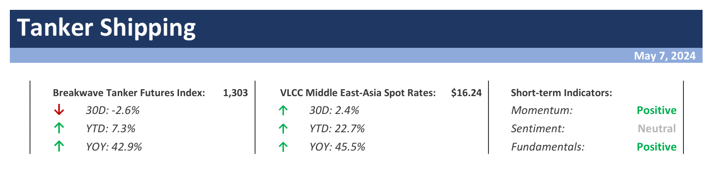
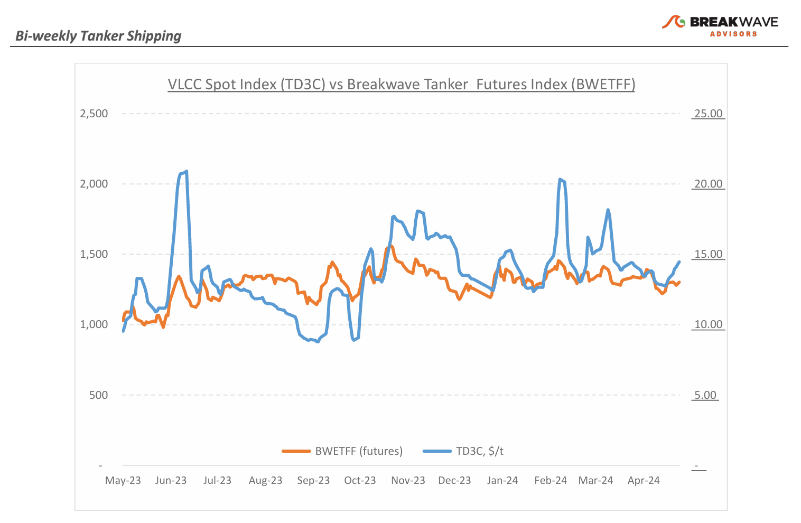
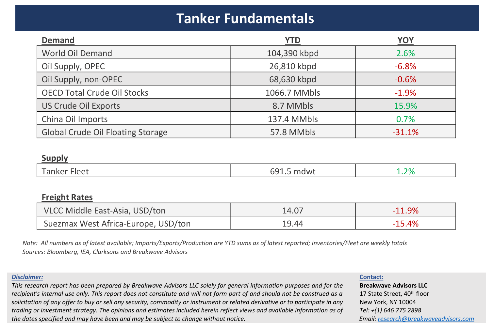

# Breakwave Bi-Weekly Tanker Report - May 7, 2024

**Date:** May 07, 2024  
**Publisher:** Breakwave Advisors | **Category:** Market Insights  
**Original URL:** [https://www.breakwaveadvisors.com/insights/202457wet](https://www.breakwaveadvisors.com/insights/202457wet)  

---

> **Figure 1: Tankerreporttop**  
> [Local Asset](file:///C:/Users/Dell/Github/Shipping/corpus/03-breakwave/insights/2024/assets/2024-05-07_202457wet_img_tankerreporttop_518a95c9909f.png)

**· Early May Sees Strong VLCC Market Activity Despite Chinese Labor Day Holiday –**In the early days of May, the VLCC freight market showed significant progress in terms of activity despite the occurrence of the Chinese Labor Day holiday from May 1st to May 5th. Although there was only a marginal weekly uptick of about 7% in spot VLCC rates, the market is still well below the peak observed in mid-February and more gains are anticipated soon. Owners maintain a cautiously optimistic outlook, foreseeing the possibility of even stronger gains if increased vessel activity continues, especially amidst positive indications for Asian crude oil demand. The Atlantic basin remains the main area of strength for the VLCC market, as the number of available units open for fixing has now declined, which in turn has further increased owners’ confidence about the progression of rates, and the recent strength in spot VLCC rates should remain in the near term. Although OPEC+ is expected to maintain its production targets, increased production from the Atlantic is adding more long-haul barrels into the shipping market, something that remains the main pilar of support for the VLCC segment. With the end of the Chinese refinery maintenance upon us, crude oil futures in China are trading at premiums to the respective ones in the Middle East and the US Gulf, a “price arbitrage” that should boost exports to the East.

**· As Oil Price Differentials come into Play, Heavy Crude Oil Suddenly Becomes Scarce –**The global oil market is suddenly grappling with a shortage of heavy crude oil, leading to increased prices and refining costs worldwide, particularly impacting industries such as shipping (i.e. bunkers) and road construction (i.e. asphalt), which should intensify during the upcoming summer months. Such scarcity is exacerbated by reduced exports from Mexico and the imminent expansion of the Trans Mountain Pipeline in Canada, diverting more heavy crude to the Pacific and tightening global heavy oil supply further. Moreover, Middle Eastern producers are retaining more heavy crude for domestic refining and reducing fuel oil exports to meet summer power demands, further tightening the global heavy crude market, in the process affecting dependent industries (interestingly, the spread between high sulphur and low sulphur bunker price is back below $100/ton, the lowest in almost 10 months, lessening the implied benefit of scrubbers). Last week, Brent crude climbed towards $84 a barrel following its largest weekly loss since February, with Saudi Aramco raising selling prices for all its grades to Asia for June, including a significant increase for their key Arab Light grade. Overall, crude oil traders’ focus has now turned back on fundamentals rather than geopolitics, but as we know, such a trend can change instantaneously if and when uncertainty related to oil supply resurfaces.

**· Our Long-term View –**The tanker market is recovering from a long period of staggered rates as the growth in new vessel supply shrinks while oil demand is recovering in line with the global economy. A historically low orderbook combined with favorable demand fundamentals should continue to support increased spot rate volatility, which combined with the ongoing geopolitical turmoil, should support freight rates in the medium to long term.

> **Figure 2: Tankerreportchart**  
> [Local Asset](file:///C:/Users/Dell/Github/Shipping/corpus/03-breakwave/insights/2024/assets/2024-05-07_202457wet_img_tankerreportchart_2e13530accf6.png)

> **Figure 3: Tankerreportbottom**  
> [Local Asset](file:///C:/Users/Dell/Github/Shipping/corpus/03-breakwave/insights/2024/assets/2024-05-07_202457wet_img_tankerreportbottom_f94ecb3901aa.png)

### Subscribe:
