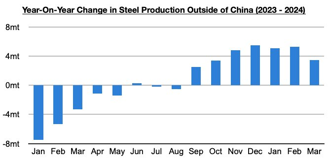

# Jump in Capesize Rates

**Date:** May 08, 2024  
**Publisher:** Breakwave Advisors | **Category:** Market Insights  
**Original URL:** [https://www.breakwaveadvisors.com/insights/2024/5/8/pi5qfapor7rg6e5oc8s288c7f8uzad](https://www.breakwaveadvisors.com/insights/2024/5/8/pi5qfapor7rg6e5oc8s288c7f8uzad)  

---

*By*[*Jeffrey Landsberg*](https://www.linkedin.com/in/jeffrey-landsberg-70ab957/)

As we discussed in our most recent Weekly Dry Bulk Report (published before the start of every week), it was very significant to us that capesize rates stayed basically flat last Tuesday and Wednesday and that Thursday then saw a sudden 12% jump followed by an even larger 13% jump on Friday. This all occurred with China on holiday during the second half of last week. With China returning to the market this week, we predicted rates would climb higher -- and rates have in fact surged.

Overall, a lot continues to go right in the dry bulk market and global economy (where dry bulk is concerned). The dry bulk market is continuing to benefit from three major new changes this year. Chief among them has remained the return of growth in steel production outside of China. This has been particularly helpful for iron ore trade and capesize demand.

> **Figure 1: Chart**  
> [Local Asset](file:///C:/Users/Dell/Github/Shipping/corpus/03-breakwave/insights/2024/assets/2024-05-08_pi5qfapor7rg6e5oc8s288c7f8uzad_img_chart_5ff446917802.jpg)

In addition, the entire dry bulk market continues to benefit from the return of growth in global grain trade and this year’s extremely rare contraction in Chinese coal production. At the same time, the overall dry bulk fleet this year continues to expand by only a moderate amount.

---

**Tags:** Drybulk, China, Economy  
