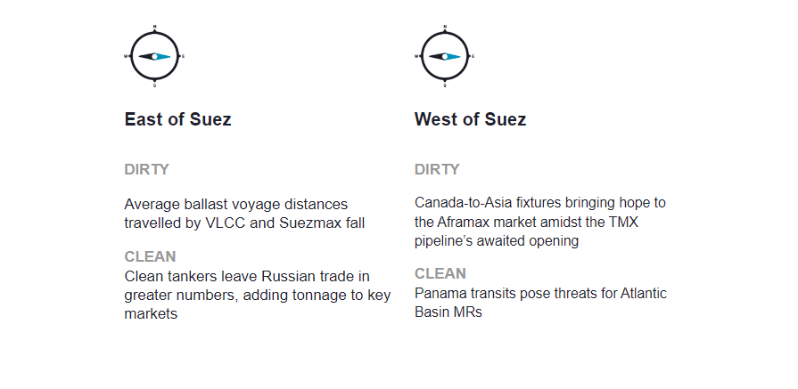
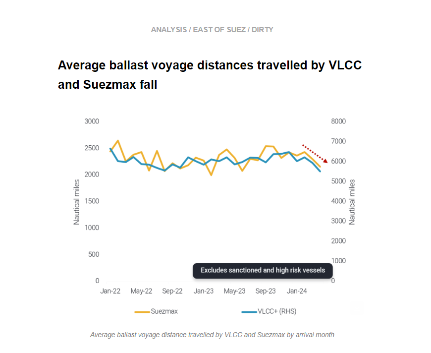
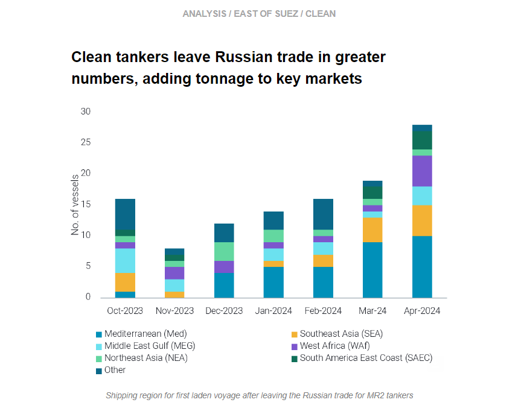
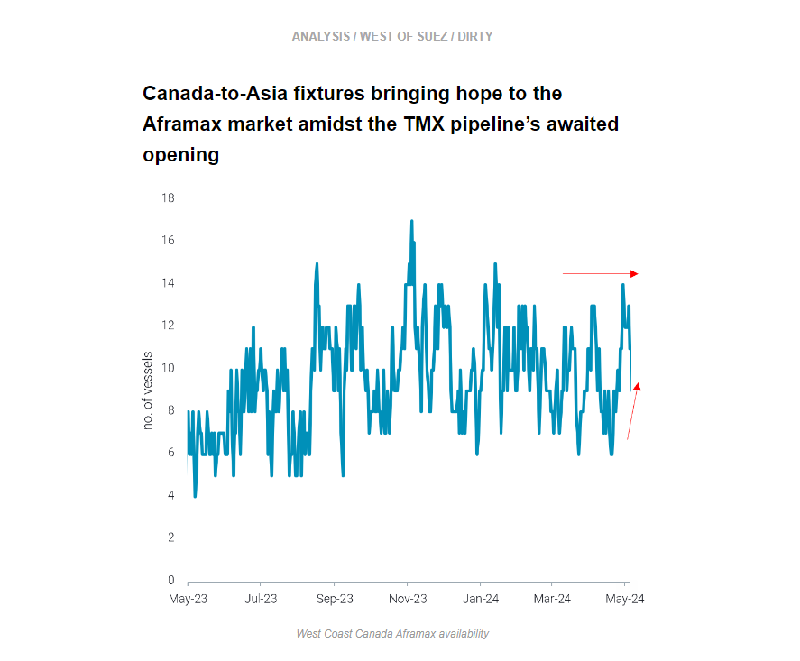
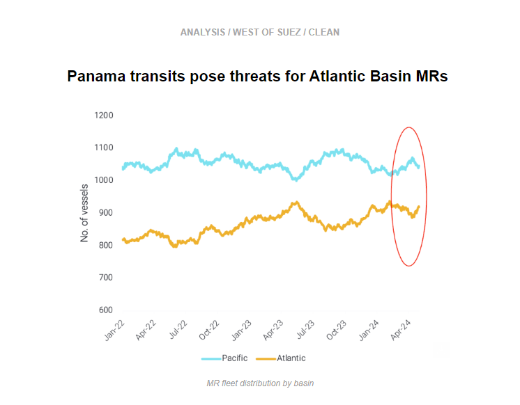

# Shorter VLCC and Suezmax ballast voyages

**Date:** May 09, 2024  
**Publisher:** Breakwave Advisors | **Category:** Market Insights  
**Original URL:** [https://www.breakwaveadvisors.com/insights/2024/5/9/kiw6gdlrto0iop2nl3av7rm3yq17wl](https://www.breakwaveadvisors.com/insights/2024/5/9/kiw6gdlrto0iop2nl3av7rm3yq17wl)  

---

This week, in the East, we discuss falling average mileage for VLCC and Suezmax ballast voyages. On the clean side, we investigate where the tankers leaving Russian trade are going. In the West, we look at increased signs of Aframax demand to Asia as the TMX opens, and we explore why increasing Panama Canal transits might be bad news for Atlantic Basin MRs.

*By*[*Mary Melton*](https://www.linkedin.com/search/results/all/?fetchDeterministicClustersOnly=true&heroEntityKey=urn%3Ali%3Afsd_profile%3AACoAABXVyecBtg-pRnIrZe0BoWk0ygPiUfbvhsw&keywords=mary%20melton&origin=RICH_QUERY_SUGGESTION&position=0&searchId=40e8d7d2-c4d0-4022-81e7-176f6eba418b&sid=H_Y&spellCorrectionEnabled=false)

> **Figure 1: Στιγμιότυπο Οθόνης 2024 05 09 102353**  
> **Interactive Data & Source:** [Marketingmail Vortexa](https://marketingmail.vortexa.com/ODM3LU1aRS01NzgAAAGS97ELhCfCrH4cPWOi7bQxofLoSzzASQPUM7lCEPwiB4-mtxXwNy3jkJmUQR7qLvFa3GkWZy8=) | [Local Asset](file:///C:/Users/Dell/Github/Shipping/corpus/03-breakwave/insights/2024/assets/2024-05-09_kiw6gdlrto0iop2nl3av7rm3yq17wl_img_cea3cf84ceb9ceb3cebcceb9cf8ccf84cf85_ac43d1f525fc.png)

> **Figure 2: Στιγμιότυπο Οθόνης 2024 05 09 102416**  
> **Interactive Data & Source:** [Marketingmail Vortexa](https://marketingmail.vortexa.com/ODM3LU1aRS01NzgAAAGS97ELhCfCrH4cPWOi7bQxofLoSzzASQPUM7lCEPwiB4-mtxXwNy3jkJmUQR7qLvFa3GkWZy8=) | [Local Asset](file:///C:/Users/Dell/Github/Shipping/corpus/03-breakwave/insights/2024/assets/2024-05-09_kiw6gdlrto0iop2nl3av7rm3yq17wl_img_cea3cf84ceb9ceb3cebcceb9cf8ccf84cf85_acaf4fb3aed2.png)

- [Average ballast voyage distances travelled by VLCCs](https://marketingmail.vortexa.com/ODM3LU1aRS01NzgAAAGS97ELhCfCrH4cPWOi7bQxofLoSzzASQPUM7lCEPwiB4-mtxXwNy3jkJmUQR7qLvFa3GkWZy8=)have dipped to multi-year lows in April, a result of fewer long-haul voyages from Asia to West of Suez.

- [Weaker crude import appetite from China](https://marketingmail.vortexa.com/ODM3LU1aRS01NzgAAAGS97ELhYyX_-BGMDqyiJwLPot2kTStckqSJtwIPToxhvPpEGbZeaWB0oFMN09pB-LD_WCjY8A=), combined with ample supplies from Mideast Gulf and Russia, have led to a slowdown in the country’s Atlantic Basin crude purchases. Some upside however, could present itself as Chinese refiners step up crude purchases to ramp up refinery runs starting next month after turnaround.
- Suezmax tankers have similarly seen a decline in their[ballast voyage distance travelled](https://marketingmail.vortexa.com/ODM3LU1aRS01NzgAAAGS97ELhXC0rg5s-SzdBUhrFfeOpZZV11sxQF8hd2wGA1zG53PTqX1VUJeqlpF_bs4nzTB32ME=)last month, falling to the lowest since last July. An increasing share of[vessels staying in Europe instead of ballasting to the Atlantic](https://marketingmail.vortexa.com/ODM3LU1aRS01NzgAAAGS97ELhb9OgwfLHYOjLzWy2hGZuO5AwaMFl5CiPQJb8Bf0iNk8D1wr4DbdOlFCzG8rLVpNaTo=)were the drivers of the decline in ballast mileage.

> **Figure 3: Στιγμιότυπο Οθόνης 2024 05 09 102437**  
> **Interactive Data & Source:** [Marketingmail Vortexa](https://marketingmail.vortexa.com/ODM3LU1aRS01NzgAAAGS97ELhQT1hGiuFirn6G3knx7ke2SaHGePZ6kYgvO2Si36Q7lGgMbQxziK3wHMYR7piKLlSNU=) | [Local Asset](file:///C:/Users/Dell/Github/Shipping/corpus/03-breakwave/insights/2024/assets/2024-05-09_kiw6gdlrto0iop2nl3av7rm3yq17wl_img_cea3cf84ceb9ceb3cebcceb9cf8ccf84cf85_6c70d0eefb79.png)

- 47 MR2s which were trading in Russia loaded in other markets in March and April, likely pushed out due to lower export volumes after attacks on Russian refineries. This is a significant amount of tonnage to be competing for employment in an MR2 market that has recently been under pressure. This extra tonnage is weighing on MR2 freight rates which are lacklustre across the board.

- The most popular new market for these MR2 leavers has been the Med, likely an opportunity after a Turkey discharge. However, increasing numbers of tankers recently went to East Asia over the last two months, likely because of strong demand in the region. Also of interest are the tankers which have begun trading in WAf and in Brazil, as the Atlantic Basin MR market is particularly oversubscribed ([read more here](https://marketingmail.vortexa.com/ODM3LU1aRS01NzgAAAGS97ELhQT1hGiuFirn6G3knx7ke2SaHGePZ6kYgvO2Si36Q7lGgMbQxziK3wHMYR7piKLlSNU=)).
- Though fewer in terms of numbers, the LRs which left the Russian CPP trade are likely to have done so temporarily, in an attempt to optimise their laden times by switching between mainstream and Russian trade. These LRs which discharged Russian cargo East of Suez are reloading middle distillates in the region with Europe as a destination. This extra vessel supply in the East of Suez can be absorbed much easier in the context of continued rerouting around the Cape of Good Hope and LR rates oscillating around historic highs and well above 2023 averages.

> **Figure 4: Στιγμιότυπο Οθόνης 2024 05 09 102517**  
> **Interactive Data & Source:** [Marketingmail Vortexa](https://marketingmail.vortexa.com/ODM3LU1aRS01NzgAAAGS97ELhTmXpUHfYEpwa5L6KDEP88AcYalrYIGFIENhVLw3oPLrKSrTFu4bhswkmNP4XVxlz8I=) | [Local Asset](file:///C:/Users/Dell/Github/Shipping/corpus/03-breakwave/insights/2024/assets/2024-05-09_kiw6gdlrto0iop2nl3av7rm3yq17wl_img_cea3cf84ceb9ceb3cebcceb9cf8ccf84cf85_1006952de6b9.png)

- With excitement surrounding the opening of the TMX pipeline, we have not yet seen a large increase in[Aframax availability](https://marketingmail.vortexa.com/ODM3LU1aRS01NzgAAAGS97ELhTmXpUHfYEpwa5L6KDEP88AcYalrYIGFIENhVLw3oPLrKSrTFu4bhswkmNP4XVxlz8I=). There was an uptick in late April as the TMX opening date approached, but vessel supply is still significantly lower than highs we have observed in the past.

- Suncor[fixed the Aframax DUBAI ANGEL](https://marketingmail.vortexa.com/ODM3LU1aRS01NzgAAAGS97ELhQCJNlVVqFktxKOf2z300dbmJ7jHiONoaZWR3F5vkCL0eOX5zXZnVm2L2ifv-3TO824=)from Vancouver to China around 17 May. This will be the first direct Aframax voyage from Vancouver to Asia after the TMX opening. Additionally, Petrochina has a fixture for[AQUALEADER](https://marketingmail.vortexa.com/ODM3LU1aRS01NzgAAAGS97ELhfP9RGppmiH_usn7IFlQzL5z3XCeJVo75Z5iAjuzEw_9bAd37FYEgQMY25XTTk8FtJU=)loading from Vancouver which is[currently ballasting](https://marketingmail.vortexa.com/ODM3LU1aRS01NzgAAAGS97ELhbvdnfd5JR6znh9_evheRXUPzEXTl7wOTx5HlvxPLFKxX1aogBbhtSPnjxFFhJvISr0=)towards Canada. It is unclear if it will go directly to China or STS somewhere beforehand, but nevertheless this is clear evidence of demand from NE Asia for Vancouver loadings.
- If these Vancouver-to-China voyages do materialise, this suggests the best-case scenario for Aframax tonne-mile demand. This long-haul Aframax demand could provide support to a vessel class that has suffered from flagging employment in the Americas market over the last few months.

> **Figure 5: Στιγμιότυπο Οθόνης 2024 05 09 102542**  
> **Interactive Data & Source:** [Marketingmail Vortexa](https://marketingmail.vortexa.com/ODM3LU1aRS01NzgAAAGS97ELhXMqvcajBtqrQnwH9ouE2fSD1jC1iZBhfRaWksbcYAmEBfwVR1Hlu5BYKfVl1ZTPj20=) | [Local Asset](file:///C:/Users/Dell/Github/Shipping/corpus/03-breakwave/insights/2024/assets/2024-05-09_kiw6gdlrto0iop2nl3av7rm3yq17wl_img_cea3cf84ceb9ceb3cebcceb9cf8ccf84cf85_b1db2970d4de.png)

- As we approach the summer driving season, Atlantic MR demand seems muted as reflected in[TC2 gasoline transatlantic freight rates](https://marketingmail.vortexa.com/ODM3LU1aRS01NzgAAAGS97ELhXMqvcajBtqrQnwH9ouE2fSD1jC1iZBhfRaWksbcYAmEBfwVR1Hlu5BYKfVl1ZTPj20=), which have been on a downward trajectory since mid-March, currently down by 10% m-o-m.

- There are a few factors at play for this development. Zooming into regional short-term fluctuations,[gasoline imports to PADD 1](https://marketingmail.vortexa.com/ODM3LU1aRS01NzgAAAGS97ELhPt8XYzCfPJ3U6zsla12S-vhyQQYp32C_zuQk-TmcAoxxyTsk4mzHU4tMnwgezzkyUM=)have come off to a slow start alongside seasonal averages - but below y-o-y values - despite stocks hovering at the bottom of the 5-year range according to the EIA, which ultimately does not help in absorbing the current levels of MR tanker supply in the Atlantic Basin.
- Supply is also increasing on the back of favourable weather conditions in the Panama Canal, which has pushed transits upwards, although they have not yet recovered to historical levels. In turn this has facilitated MR tonnage fluidity between Basins, from the[Pacific](https://marketingmail.vortexa.com/ODM3LU1aRS01NzgAAAGS97ELhRx9vxBOGsxOHIh_GMKi13yBzBr9fxb4DACpP6WeeGv_Sx0eSBqtsy8mwvlbzEvlHjo=)to the[Atlantic](https://marketingmail.vortexa.com/ODM3LU1aRS01NzgAAAGS97ELhUy-zDcwpaeHr0PYFtirfLfokjPFLQ6oTYeGjbKn4c2h5ZDRaES_RdXRgBaMiwLKY-g=)as of late.

Data Source:[Vortexa](https://www.vortexa.com//oil-gas-data-traders-analysts-data-scientists?gclid=Cj0KCQjw8_qRBhCXARIsAE2AtRZKOvMnbilZ_6_91d7huSFFy71pWLrnPwGwOHVzXsmsG-1a1mZnQw8aAt89EALw_wcB&hsa_acc=1782073842&hsa_ad=548425387665&hsa_cam=14746637662&hsa_grp=125038601902&hsa_kw=&hsa_mt=&hsa_net=adwords&hsa_src=g&hsa_tgt=dsa-1431852288425&hsa_ver=3&utm_campaign=%5BCD%5D%20-%20DSA%20-%20EMEA&utm_medium=cpc&utm_medium=ppc&utm_source=google&utm_source=adwords&utm_term=)

---

**Tags:** Shipping, Crude Oil, Tankers  
