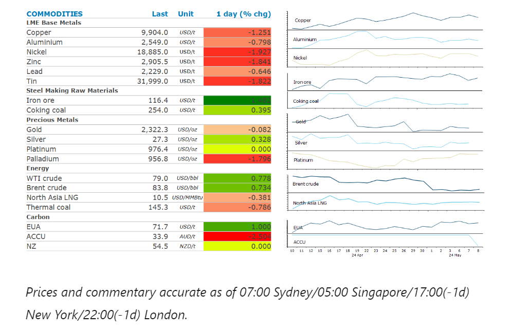
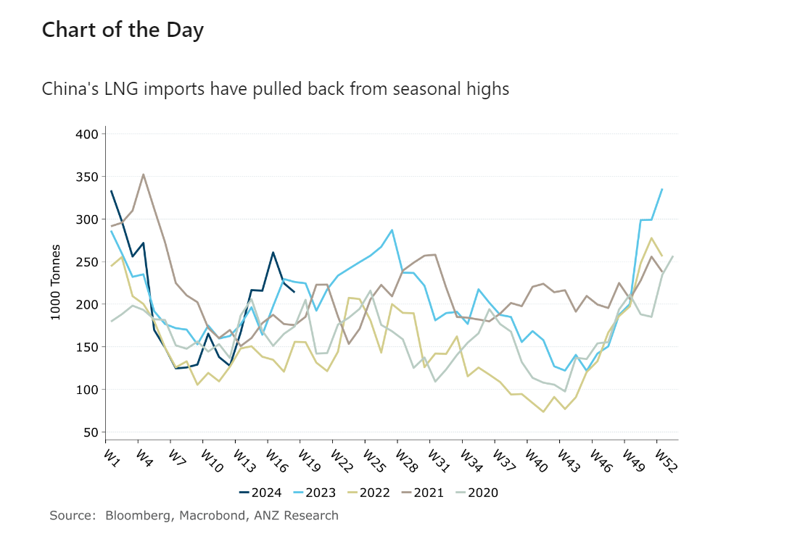

# Oil gains after an unexpected fall in US inventories

**Date:** May 09, 2024  
**Publisher:** Breakwave Advisors | **Category:** Market Insights  
**Original URL:** [https://www.breakwaveadvisors.com/insights/2024/5/9/oil-gains-after-an-unexpected-fall-in-us-inventories](https://www.breakwaveadvisors.com/insights/2024/5/9/oil-gains-after-an-unexpected-fall-in-us-inventories)  

---

A risk-off tone across markets weighed on sentiment. A stronger USD led to lower interest from investors. Falling inventories provided support to oil.

*By*[*Daniel Hynes*](https://www.linkedin.com/in/dahynes/)

> **Figure 1: Στιγμιότυπο Οθόνης 2024 05 09 123853**  
> **Interactive Data & Source:** [Linkedin](https://www.linkedin.com/newsletters/commodities-wrap-6692196755876012032/?fbclid=IwAR3kiXJqZdxmp9ZcRwBNI7FsBySI-XSC0pfPur1qzjt7OZp7PTE59Tsl1QI) | [Local Asset](file:///C:/Users/Dell/Github/Shipping/corpus/03-breakwave/insights/2024/assets/2024-05-09_oil-gains-after-an-unexpected-fall-in-us-inventories_img_cea3cf84ceb9ceb3cebcceb9cf8ccf84cf85_56f3cd26a76b.png)

### Market Commentary

**Crude oil**prices gained after a fall in US inventories signalled a tight physical market. The Energy Information Administration’s weekly report showed that stockpiles of crude oil fell 1,362kbbl last week. This was against expectations of another build in inventories. The market shrugged off the builds in gasoline and distillate fuels as refiners ramp up for the upcoming driving season. The surprise drawdown in US inventories helped reverse losses earlier in the session. A stronger USD has been denting investors’ appetite. Hawkish commentary from Fed officials is raising doubts about a rate cut. Easing tensions in the Middle East have also seen the geopolitical risk premium unwind in recent weeks. However, prices may find some support from government buying. The Biden administration raised the price it is willing to pay to refill the country’s depleted strategic oil reserve. The Energy Department said it will pay as much as USD79.99/bbl, up from an informal cap of USD79/bbl. With WTI crude currently trading below that level, buying from the US may tighten the market.

**European gas**prices fell for a second day amid signs of tepid demand. The end of the heating season has lowered gas consumption levels. Moreover, European gas prices remain below coal generation costs, indicating gas balances will remain comfortable this summer. And with storage facilities at seasonal highs of 64%, there is little incentive to compete with Asia for LNG. That could change quickly, with the risk of supply disruptions remaining high amid the Russia-Ukraine war.**North Asia LNG**prices edged lower as China offers supply to the market. China’s biggest LNG importers, including CNOOC and PetroChina, are offering to sell spot shipments for delivery over the summer. This suggests the region’s end users aren’t in dire need of more supply. Australia is calling for the development of new natural gas reserves to ensure it remains a major exporter. This is part of the government’s Future Gas Strategy, which reiterates the role of gas in the energy transition.

**Gold**edged lower following those hawkish comments from Fed officials. Neel Kashkari said the central bank would keep rates where they are for an extended period and declined to rule out future hikes. This saw the USD and US Treasury yields move higher, both headwinds for investor demand.

The risk-off tone across markets also weighed on sentiment across the**base metal**sector.**Copper**slid back below USD10,000/t as the stronger USD tempered investor appetite. Nevertheless, tight supplies continue to underpin the market. The recent closure of copper mines and the difficult operating conditions many mining regions are now facing are raising doubts over future growth from the industry. This was magnified by BHP’s takeover proposal for Anglo American, as it looks to increase its exposure to the metal via acquisitions rather than development of new resources.

**Iron ore**futures fell despite a more upbeat assessment on demand. One of the world’s biggest exporters, Brazil’s Vale SA, said China’s real estate market is poised to improve in the second half of the year. It pointed to government stimulus as a reason for its more bullish outlook. It also sees strong demand from the infrastructure and manufacturing sectors.

> **Figure 2: Στιγμιότυπο Οθόνης 2024 05 09 124023**  
> **Interactive Data & Source:** [Linkedin](https://www.linkedin.com/newsletters/commodities-wrap-6692196755876012032/?fbclid=IwAR3kiXJqZdxmp9ZcRwBNI7FsBySI-XSC0pfPur1qzjt7OZp7PTE59Tsl1QI) | [Local Asset](file:///C:/Users/Dell/Github/Shipping/corpus/03-breakwave/insights/2024/assets/2024-05-09_oil-gains-after-an-unexpected-fall-in-us-inventories_img_cea3cf84ceb9ceb3cebcceb9cf8ccf84cf85_bc51f21dd5d0.png)

Data source:[Commodities Wrap](https://www.linkedin.com/newsletters/commodities-wrap-6692196755876012032/?fbclid=IwAR3kiXJqZdxmp9ZcRwBNI7FsBySI-XSC0pfPur1qzjt7OZp7PTE59Tsl1QI)

---

**Tags:** Commodities, Economy, Markets  
