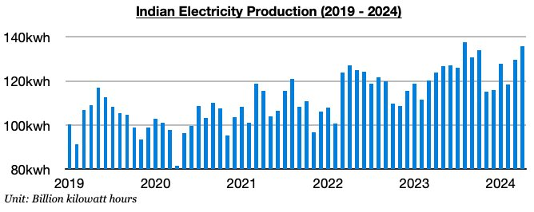
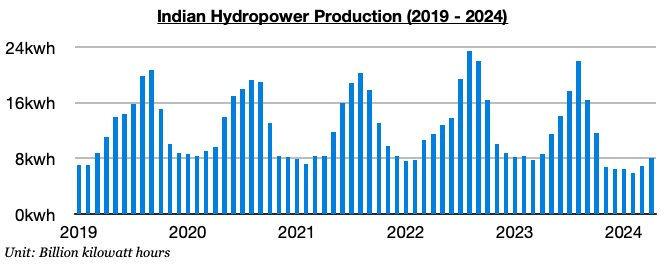
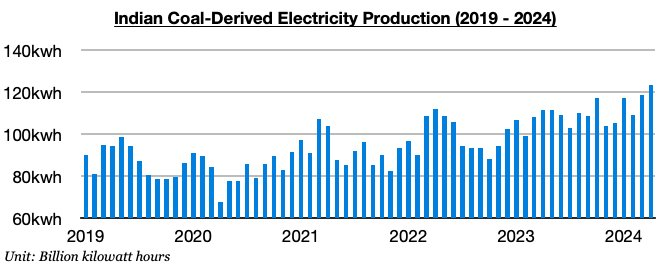

# India's Coal-Derived Electricity Generation Sets Another Record as Predicted

**Date:** May 10, 2024  
**Publisher:** Breakwave Advisors | **Category:** Market Insights  
**Original URL:** [https://www.breakwaveadvisors.com/insights/2024/5/10/indias-coal-derived-electricity-generation-sets-another-record-as-predicted](https://www.breakwaveadvisors.com/insights/2024/5/10/indias-coal-derived-electricity-generation-sets-another-record-as-predicted)  

---

*By*[*Jeffrey Landsberg*](https://www.linkedin.com/in/jeffrey-landsberg-70ab957/)

As we discussed in our most recent Weekly Dry Bulk Report (published before the start of every week), India produced approximately 135.8 billion kilowatt hours of electricity last month. This is up month-on-month by 6.3 billion kilowatt hours (5%) and up year-on-year by 12.1 billion kilowatt hours (10%). India’s electricity output has remained strong as anticipated and has now increased on a year-on-year basis for twelve straight months. Hydropower output continues to contract in India, but coal-derived electricity generation has continued to grow and set new records as we have been predicting.

> **Figure 1: Chart 1**  
> [Local Asset](file:///C:/Users/Dell/Github/Shipping/corpus/03-breakwave/insights/2024/assets/2024-05-10_indias-coal-derived-electricity-generation-sets-another-record-as-predicted_img_chart1_79429ba0c97a.jpg)

Hydropower output totaled approximately 8 billion kilowatt hours last month. This is up month-on-month by 1.1 billion kilowatt hours (16%) but down year-on-year by 700 million kilowatt hours (-8%). India’s hydropower output has now contracted on a year-on-year basis for ten straight months as rainfall has remained lower than usual.

> **Figure 2: Chart 2**  
> [Local Asset](file:///C:/Users/Dell/Github/Shipping/corpus/03-breakwave/insights/2024/assets/2024-05-10_indias-coal-derived-electricity-generation-sets-another-record-as-predicted_img_chart2_4a2d791470b6.jpg)

Coal-derived electricity generation totaled approximately 123.5 billion kilowatt hours last month. This is up month-on-month by 4.9 billion kilowatt hours (4%), up year-on-year by 12.1 billion kilowatt hours (11%), and is a new record. India’s coal-derived electricity generation has now grown on a year-on-year basis during each of the last twelve months and has set records during each of the last two months. We had predicted that coal-derived generation production records would start being set in March, and this has occurred as expected. We also expected that India’s total electricity production would begin setting records in March, but the ongoing contraction in hydropower output has continued to stop this from occurring. For the dry bulk market, it has remained great that coal-derived electricity generation has been so strong.

> **Figure 3: Chart 3**  
> [Local Asset](file:///C:/Users/Dell/Github/Shipping/corpus/03-breakwave/insights/2024/assets/2024-05-10_indias-coal-derived-electricity-generation-sets-another-record-as-predicted_img_chart3_b76bfa919d42.jpg)

---

**Tags:** Drybulk, Economy, Energy  
