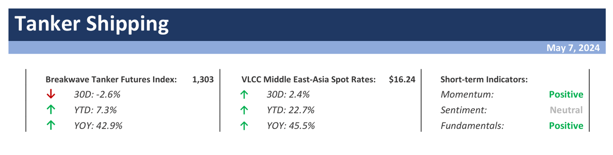

# Weekly Insights Review

**Date:** May 10, 2024  
**Publisher:** Breakwave Advisors | **Category:** Market Insights  
**Original URL:** [https://www.breakwaveadvisors.com/insights/2024/5/10/weekly-insights-review](https://www.breakwaveadvisors.com/insights/2024/5/10/weekly-insights-review)  

---

## Welcome to Our Weekly Insights Review

## Read Here Everything You Need to Know

## Breakwave Tanker Report

**Early May Sees Strong VLCC Market Activity Despite Chinese Labor Day Holiday –**In the early days of May, the VLCC freight market showed significant progress in terms of activity despite the occurrence of the Chinese Labor Day holiday from May 1st to May 5th.

> **Figure 1: Tanker+report+top**  
> **Interactive Data & Source:** [Breakwave Advisors Market Insights](https://www.breakwaveadvisors.com/insights/2024/5/6/m29ghpwmwa0kza1jkk1sheee0mtjt9) | [Local Asset](file:///C:/Users/Dell/Github/Shipping/corpus/03-breakwave/insights/2024/assets/2024-05-10_weekly-insights-review_img_tanker2breport2btop_4bab956ee313.png)

> **Figure 2: Read More**  
> **Interactive Data & Source:** [Breakwave Advisors Market Insights](https://www.breakwaveadvisors.com/insights/2024/5/6/m29ghpwmwa0kza1jkk1sheee0mtjt9) | [Local Asset](file:///C:/Users/Dell/Github/Shipping/corpus/03-breakwave/insights/2024/assets/2024-05-10_weekly-insights-review_img_image-asset_756610f987eb.jpeg)

## Global Economic Activity Is Displaying Resilience

Doric Weekly Market Insight

Looking ahead, recent high-frequency indicators suggest that the recovery of global trade has persisted into early 2024, albeit with fragility and a strong reliance on the performance of key economies such as the United States and China.

> **Figure 3: Market Chart 3**  
> **Interactive Data & Source:** [Breakwave Advisors Market Insights](https://www.breakwaveadvisors.com/insights/2024/5/6/oil-extends-losses-as-supply-risks-fade) | [Local Asset](file:///C:/Users/Dell/Github/Shipping/corpus/03-breakwave/insights/2024/assets/2024-05-10_weekly-insights-review_img_image-asset28129_8aa4de20b0dc.jpeg)

## Oil Extends Losses As Supply Risks Fade

Commodities Wrap

Shifts in the macro-economic backdrop left the market in two minds for most of the week.

[Read More](https://www.breakwaveadvisors.com/insights/2024/5/6/oil-extends-losses-as-supply-risks-fade)

> **Figure 4: Seanergy6**  
> **Interactive Data & Source:** [Breakwave Advisors Market Insights](https://www.breakwaveadvisors.com/insights/2024/5/7/capesizes-on-dizzy-heights) | [Local Asset](file:///C:/Users/Dell/Github/Shipping/corpus/03-breakwave/insights/2024/assets/2024-05-10_weekly-insights-review_img_seanergy6_1e2e88674e2d.jpeg)

## Capesizes on Dizzy Heights

The Fix - Global Market Update

The past week saw the Baltic Dry Index recovering large parts of the losses realised during the final stages of April, with the capesizes chiefly responsible for the positive development.

> **Figure 5: Market Chart 5**  
> **Interactive Data & Source:** [Breakwave Advisors Market Insights](https://www.breakwaveadvisors.com/insights/2024/5/8/pi5qfapor7rg6e5oc8s288c7f8uzad) | [Local Asset](file:///C:/Users/Dell/Github/Shipping/corpus/03-breakwave/insights/2024/assets/2024-05-10_weekly-insights-review_img_image-asset28229_df13fe25bd57.jpeg)

## Jump in Capesize Rates

From Commodore's Weekly Dry Bulk Reports

As we discussed in our most recent Weekly Dry Bulk Report (published before the start of every week), it was very significant to us that capesize rates stayed basically flat last Tuesday and Wednesday and that Thursday then saw a sudden 12% jump followed by an even larger 13% jump on Friday.

> **Figure 6: Market Chart 6**  
> **Interactive Data & Source:** [Breakwave Advisors Market Insights](https://www.breakwaveadvisors.com/insights/2024/5/8/tankers-research) | [Local Asset](file:///C:/Users/Dell/Github/Shipping/corpus/03-breakwave/insights/2024/assets/2024-05-10_weekly-insights-review_img_image-asset28329_08aa0e8b7edf.jpeg)

## Tankers Research

Braemar Research Update

VLCC voyage numbers decline in April following record March highs

- The number of VLCC voyages dropped by 11% in April following record highs in March.
...

> **Figure 7: Market Chart 7**  
> **Interactive Data & Source:** [Breakwave Advisors Market Insights](https://www.breakwaveadvisors.com/insights/2024/5/9/kiw6gdlrto0iop2nl3av7rm3yq17wl) | [Local Asset](file:///C:/Users/Dell/Github/Shipping/corpus/03-breakwave/insights/2024/assets/2024-05-10_weekly-insights-review_img_image-asset28429_0cbd7d8626a0.jpeg)

## Shorter VLCC and Suezmax Ballast Voyages

Vortexa Freight Weekly

This week, in the East, we discuss falling average mileage for VLCC and Suezmax ballast voyages.

[Read More](https://www.breakwaveadvisors.com/insights/2024/5/9/kiw6gdlrto0iop2nl3av7rm3yq17wl)

> **Figure 8: Market Chart 8**  
> **Interactive Data & Source:** [Breakwave Advisors Market Insights](https://www.breakwaveadvisors.com/insights/2024/5/9/oil-gains-after-an-unexpected-fall-in-us-inventories) | [Local Asset](file:///C:/Users/Dell/Github/Shipping/corpus/03-breakwave/insights/2024/assets/2024-05-10_weekly-insights-review_img_image-asset28529_a89eda7f2b73.jpeg)

## Oil Gains After an Unexpected Fall in Us Inventories

Commodities Wrap

A risk-off tone across markets weighed on sentiment. A stronger USD led to lower interest from investors. Falling inventories provided support to oil.

> **Figure 9: Market Chart 9**  
> **Interactive Data & Source:** [Breakwave Advisors Market Insights](https://www.breakwaveadvisors.com/insights/2024/5/10/indias-coal-derived-electricity-generation-sets-another-record-as-predicted) | [Local Asset](file:///C:/Users/Dell/Github/Shipping/corpus/03-breakwave/insights/2024/assets/2024-05-10_weekly-insights-review_img_image-asset28629_47b78362e9ba.jpeg)

## India's Coal-Derived Electricity Generation Sets Another Record As Predicted

From Commodore's Weekly Dry Bulk Reports

As we discussed in our most recent Weekly Dry Bulk Report (published before the start of every week), India produced approximately 135.8 billion kilowatt hours of electricity last month.

[Read More](https://www.breakwaveadvisors.com/insights/2024/5/10/indias-coal-derived-electricity-generation-sets-another-record-as-predicted)

> **Figure 10: Market Chart 10**  
> **Interactive Data & Source:** [Breakwave Advisors Market Insights](https://www.breakwaveadvisors.com/insights/2024/5/10/us-gulf-coast-sour-crude-markets-tighten) | [Local Asset](file:///C:/Users/Dell/Github/Shipping/corpus/03-breakwave/insights/2024/assets/2024-05-10_weekly-insights-review_img_image-asset28729_5ed0560c4938.jpeg)

## Us Gulf Coast Sour Crude Markets Tighten

Vortexa Freight Weekly

US Gulf Coast sour crude crude markets have recently experienced tightness amid new developments in the region, chief amongst them being TMX start up

---

**Tags:** Shipping, Economy, Markets  
