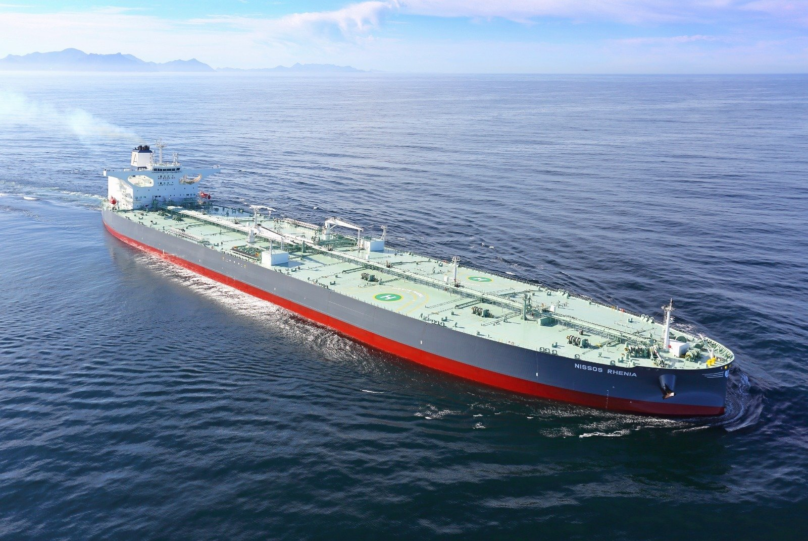
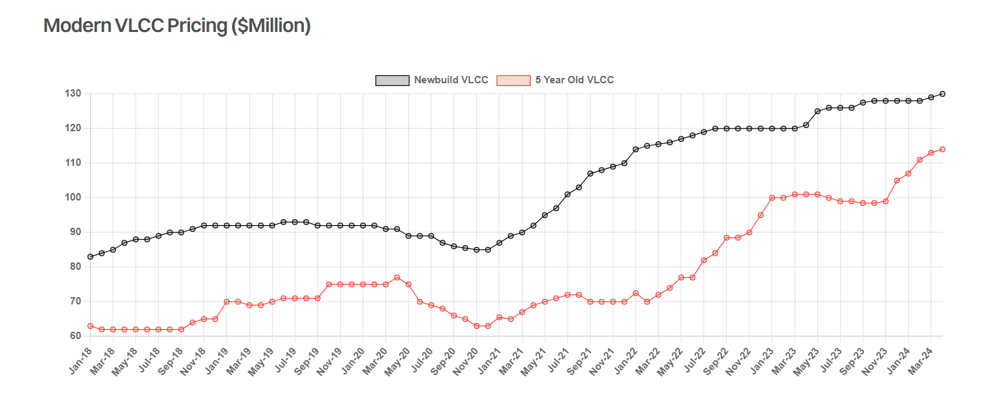

# Asset Price Ambiguity

**Date:** May 13, 2024  
**Publisher:** Breakwave Advisors | **Category:** Market Insights  
**Original URL:** [https://www.breakwaveadvisors.com/insights/2024/5/13/asset-price-ambiguity](https://www.breakwaveadvisors.com/insights/2024/5/13/asset-price-ambiguity)  

---

> **Figure 1: Nissos Nikouria 4**  
> **Interactive Data & Source:** [Gibsons Co](https://www.gibsons.co.uk/market-reports) | [Local Asset](file:///C:/Users/Dell/Github/Shipping/corpus/03-breakwave/insights/2024/assets/2024-05-13_asset-price-ambiguity_img_nissos-nikouria-4_967132817018.jpg)

VLCC asset prices appear to be caught in a paradoxical market scenario. While conventional market sentiment and pricing models would suggest that prices are reaching overheated levels, mirroring the peaks seen in 2008, the underlying supply dynamics seem to justify these increases for now.

A key indicator signaling that the secondhand asset market might be overheating is the price differential between the five-year-old benchmark and the current benchmark for newbuildings. This gap has narrowed to approximately 12%, marking the narrowest gap since the OPEC battle for market share in 2015 caused secondhand values to briefly appreciate out of step with newbuilding prices. The surge in prices and demand for modern tonnage can be attributed to the underlying belief that promptly delivered ships can yield enhanced returns in the short to medium term, a sentiment buttressed by disjointed fundamentals.

In the short term, mounting geopolitical uncertainties have driven a gradual appreciation in VLCC freight rates. The fragmentation of maritime trade, notably spurred by Red Sea attacks, has favored larger vessels for long haul voyages. More importantly, in recent years, a significant portion of the fleet, especially on the older side of the spectrum, has transitioned into the dark fleet trading entirely sanctioned barrels. Currently, we count 19% of the existing fleet is engaged in that trade and is unavailable to the mainstream international market. In the longer run, anticipated increases in Americas crude production coupled with continued demand growth East of Suez also points towards structural growth in long haul crude trade.

Despite a resurgence in new building orders this year, the overall percentage of VLCC fleet on order remains relatively low at just under 7%. Although this figure has risen in the past 3-4 months from approximately 3% in November last year, the bulk of deliveries are slated for 2027 and beyond, with only a few expected in 2025 and 2026, supporting the case for strong secondhand values in the near term. Additionally, a significant portion of the fleet is aging, with nearly a third surpassing 15 years, potentially limiting tradability in many regions going into the future. Hence, such an increase in the orderbook is likely to be offset by the ageing of the fleet.

Furthermore, an aspect frequently omitted in such asset price assessments is the impact of inflation. While prices may appear relatively high, they might not be as elevated as they seem at first glance. For instance, when adjusted for US CPI, a VLCC newbuilding priced at $160 million in 2008 would equate to $232 million today. While current prices aren’t at that level in real money terms, neither are spot market earnings. Back in 2008 market earnings averaged $113,000/day, equivalent to approximately $164,000/day in today’s money. With current spot market earnings of around $50,000-$60,0000 today, this might hint at overvaluation albeit not to the same level of irrational exuberance witnessed during the mid noughties.

However, the combination of geopolitical tensions, reasonably low orderbook and an ageing fleet show little sign of major downward pressure on freight rates over the next two to three years. When valued against forward earnings potential, it could be argued that both newbuild and secondhand values are reasonable and may remain at elevated levels for some time.

> **Figure 2: Στιγμιότυπο Οθόνης 2024 05 13 133919**  
> **Interactive Data & Source:** [Gibsons Co](https://www.gibsons.co.uk/market-reports) | [Local Asset](file:///C:/Users/Dell/Github/Shipping/corpus/03-breakwave/insights/2024/assets/2024-05-13_asset-price-ambiguity_img_cea3cf84ceb9ceb3cebcceb9cf8ccf84cf85_53b0ef0d3c67.png)

Data source:[Gibson Shipbrokers](https://www.gibsons.co.uk/market-reports)

---

**Tags:** Tankers, Shipping, Crude Oil  
