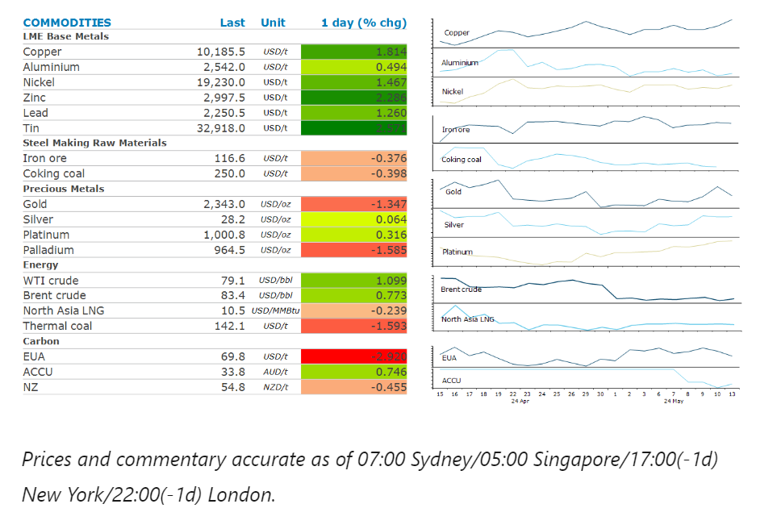
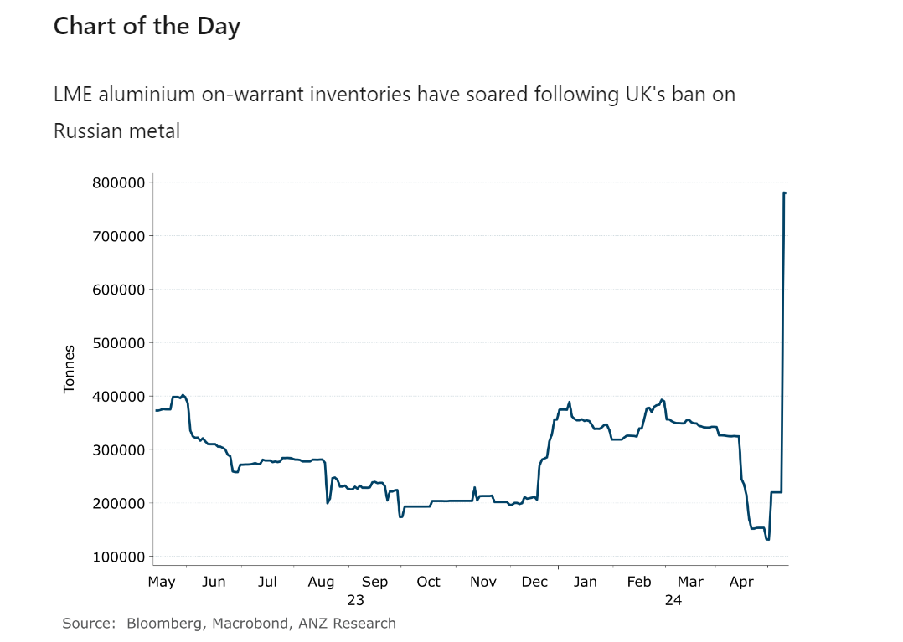

# Metals gain as China looks to boost stimulus measures

**Date:** May 14, 2024  
**Publisher:** Breakwave Advisors | **Category:** Market Insights  
**Original URL:** [https://www.breakwaveadvisors.com/insights/2024/5/14/1bbo0t8vvlasaj6t8x0inogzg7domp](https://www.breakwaveadvisors.com/insights/2024/5/14/1bbo0t8vvlasaj6t8x0inogzg7domp)  

---

Supply side issues were the focus for energy and metals markets. The prospect of stimulus measures in China boosted sentiment across sectors.

*By*[*Daniel Hynes*](https://www.linkedin.com/in/dahynes/)

> **Figure 1: Στιγμιότυπο Οθόνης 2024 05 14 140651**  
> **Interactive Data & Source:** [Linkedin](https://www.linkedin.com/newsletters/commodities-wrap-6692196755876012032/?fbclid=IwAR3kiXJqZdxmp9ZcRwBNI7FsBySI-XSC0pfPur1qzjt7OZp7PTE59Tsl1QI) | [Local Asset](file:///C:/Users/Dell/Github/Shipping/corpus/03-breakwave/insights/2024/assets/2024-05-14_1bbo0t8vvlasaj6t8x0inogzg7domp_img_cea3cf84ceb9ceb3cebcceb9cf8ccf84cf85_d5549b83968e.png)

### Market Commentary

**Crude oil**edged higher on signs of tightening supplies. Iraq’s oil minister, Hayyan Abdul Ghani, said the country would stick to whatever OPEC decides at its upcoming meeting. But this came after Iraq said it had cut enough and wouldn’t agree to more. Iraq is the second largest producers in the group and has been reluctant to reduce output as promised. The market remains beholden to OPEC’s supply policy, with expectations high that it will extend current production cuts until the end of the year. A Bloomberg survey showed 87% of respondents expect an extension. The pressure on the group ramped up after the International Energy Agency warned OPEC shouldn’t take action that would push oil prices up and boost inflation.

**North Asian LNG**prices were steady as traders await the outcome of Japan’s nuclear power plant restarts. Five are due to brought back online over the next 12 months but have been beset by cost overruns and delays. This could lead to shortfalls in electricity generation, which would need to be met by LNG.**European gas**futures were lower as relatively high storage levels ease concerns about shortages. Such facilities are currently 65% full, which is likely to lessen competition for LNG over coming months.

**Copper**rallied as prospect of further stimulus in China boosted sentiment. The contraction in credit issued in China last month prompted the government to ramp up spending. The Finance Ministry said it will start selling the first batch of CNY1trn of special bonds, which will be used on infrastructure investment. This follows the easing of restrictions on residential property purchases in the major cities of Hangzhou and Xi’an last week. Supply tightness also remains in focus. New data from the Chilean copper commission, Cochilco, shows the country’s output fell 0.7% y/y to 433.3kt in March. The difficulty in finding large world-class greenfield copper projects is likely behind BHP’s proposed takeover offer for Anglo American. However, an offer from BHP was rebuffed yesterday. Even when potential projects are discovered, current copper prices are still too low to make them economically viable. We estimate developers need at least USD12,000/t to proceed.

**Iron ore**futures are likely to find support after a train collision at Rio Tinto’s Western Australian operations. An autonomous train used to deliver ore to port collided with a set of stationary wagons. The potential disruption to supply comes as the outlook for demand picks up. China’s increase spending on infrastructure, as well as the loosening of restrictions on residential housing builds should boost demand for steel and iron ore.

**Gold**pulled back from a three-week high amidst ongoing inflationary pressures. The Fed’s Lorie Logan said it’s still too early to think about reducing rates, while Michelle Bowman said she doesn’t expect it will be appropriate to cut rates in 2024. However, a potential slowdown in the US economy could force the Fed’s hand. A report showed that US consumer sentiment declined to a six-month low, suggesting key parts of the economy are cooling.

> **Figure 2: Στιγμιότυπο Οθόνης 2024 05 14 140723**  
> **Interactive Data & Source:** [Linkedin](https://www.linkedin.com/newsletters/commodities-wrap-6692196755876012032/?fbclid=IwAR3kiXJqZdxmp9ZcRwBNI7FsBySI-XSC0pfPur1qzjt7OZp7PTE59Tsl1QI) | [Local Asset](file:///C:/Users/Dell/Github/Shipping/corpus/03-breakwave/insights/2024/assets/2024-05-14_1bbo0t8vvlasaj6t8x0inogzg7domp_img_cea3cf84ceb9ceb3cebcceb9cf8ccf84cf85_d1fb4194561e.png)

Data source:[Commodities Wrap](https://www.linkedin.com/newsletters/commodities-wrap-6692196755876012032/?fbclid=IwAR3kiXJqZdxmp9ZcRwBNI7FsBySI-XSC0pfPur1qzjt7OZp7PTE59Tsl1QI)

---

**Tags:** Commodities, Economy, Markets  
