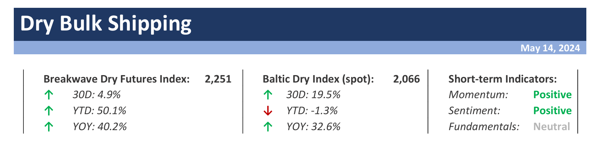
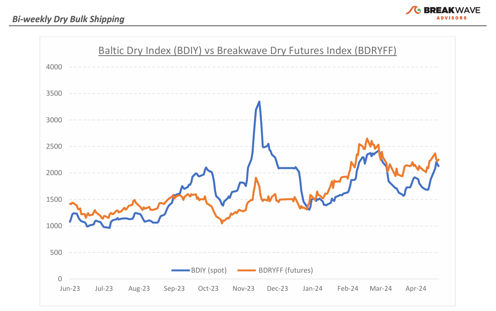
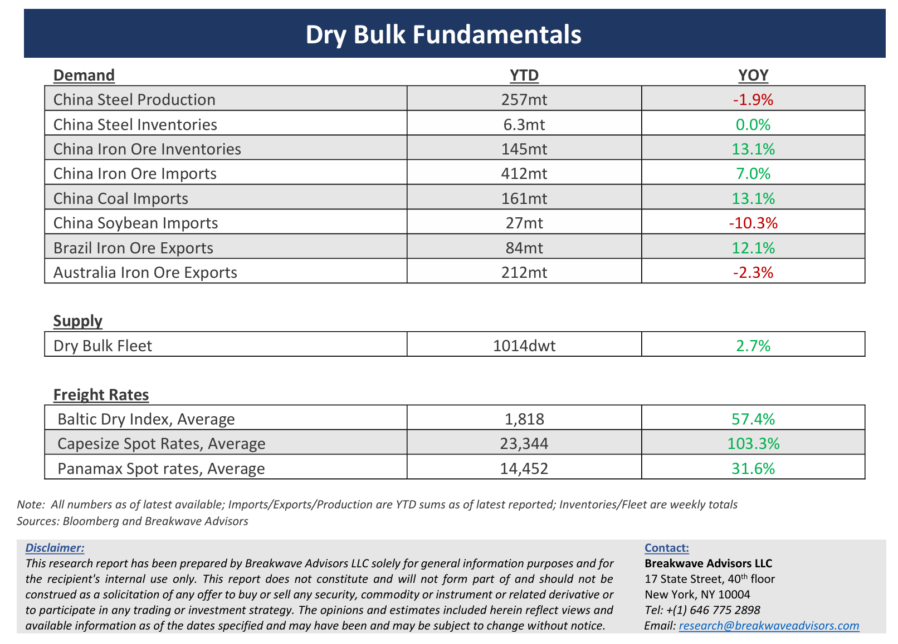

# Breakwave Bi-Weekly Dry Bulk Report - May 14, 2024

**Date:** May 14, 2024  
**Publisher:** Breakwave Advisors | **Category:** Market Insights  
**Original URL:** [https://www.breakwaveadvisors.com/insights/2024514dry](https://www.breakwaveadvisors.com/insights/2024514dry)  

---

> **Figure 1: Dryreporttop**  
> [Local Asset](file:///C:/Users/Dell/Github/Shipping/corpus/03-breakwave/insights/2024/assets/2024-05-14_2024514dry_img_dryreporttop_ff2aca03d5ef.png)

**· Dry Bulk Spot Rate Volatility Points to Ongoing Positional Imbalances Amidst Solid Volumes –**After bottoming in the high-teens, the Capesize Spot Index posted a**solid recovery**, pushing freight rates back towards the high-20,000 level,**in line with**where the**futures market**has been trading for weeks now. The**Atlantic**market remains the most**volatile**area where rates managed to surge from 8,000 to 33,000 in less than a week. Such positional imbalances, combined with solid sentiment for the overall shipping sector, are the main reasons for the elevated volatility the market has observed so far this year. With**solid commodity import volumes**into China, there has been little concern regarding the health of the current cycle. However,**one should not forget**that the past has little to do with the future when it comes to**cyclical industries**, and given the significant imports into China, especially for iron ore, a**mean reversion could very well be in the cards**, if history is any guide. As we look into the summer months, a potential**slowdown of iron ore trading**combined with**weather-related issues for bauxite**exports out of West Africa could**pose a risk**for the robust**Capesize**market that futures are currently predicting. Although we**remain optimistic**for the duration and intensity of the current upcycle, we also are**well aware of the brutal corrections**that are part of the nature of dry bulk shipping and could lead to significant drawdowns (see last two years) irrespective of the longer-term underlying fundamentals.

**· Iron Ore Imports to China Continue to Surge Despite Declining Steel Production –**The**mismatch**between**steel**fundamentals and**iron ore**imports continue to dominate China’s steel complex, with year-to-date iron ore**imports****up some 7%,**way above**steel production**that hovers just below the**unchanged**level of roughly 1 billion tons per annum, a level that has remained relatively constant for more than three years in a row. The bizarre divergence has led to a**surge**in observable iron ore portside**inventories**, which, although they are below the all-time highs reached in 2018, now stand well above the 5-year average. We remain**cautious**on the future development of iron ore imports into China**until the balance**between imports and steel production is**restored**, and we**anticipate a slower****pace of iron trading**during the second half of the year. Iron ore prices, which have been supported above the $100/ton level, are now some 10% below last year, while when compared to the impressive rally in other industrial-related commodities (Copper, Silver, Aluminum, etc.), they have vastly**underperformed**.**Slower iron ore imports**into China could also**pose headwinds**for**Capesize demand,**if such a trend materializes, as the current run rate of imports is now above 1.2 billion tons per year, a rather high rate for a steel industry that remains under pressure.

**· Our Long-term View –**The last few years have been characterized by increased geopolitical uncertainty. Going forward, we expect such events to continue to affect global trade and have a meaningful impact on effective vessel supply. Combined with the potential for a multi-year cyclical rebound in China’s economic activity following the recent economic turmoil, dry bulk shipping should experience higher volatility on top of a secular tightness driven by increasing bulk commodity demand and a slower fleet growth as a result of a relatively low orderbook.

> **Figure 2: Dryreportchart**  
> [Local Asset](file:///C:/Users/Dell/Github/Shipping/corpus/03-breakwave/insights/2024/assets/2024-05-14_2024514dry_img_dryreportchart_3eed652a0d64.png)

> **Figure 3: Dryreportbottom**  
> [Local Asset](file:///C:/Users/Dell/Github/Shipping/corpus/03-breakwave/insights/2024/assets/2024-05-14_2024514dry_img_dryreportbottom_05d76f060468.png)

### Subscribe:
