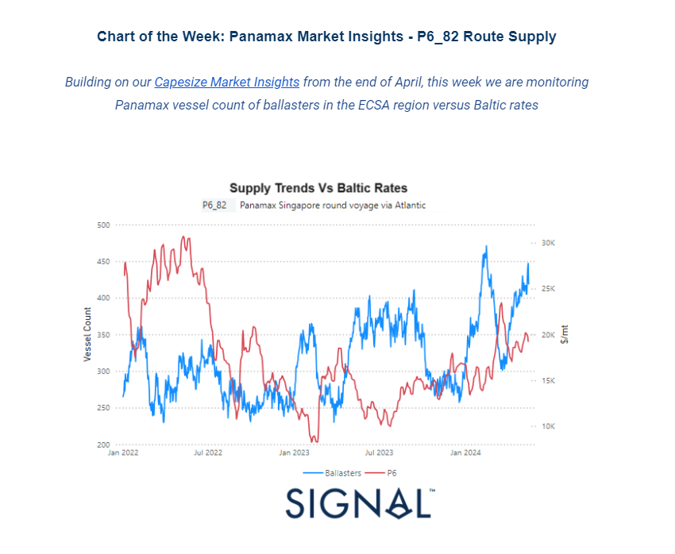
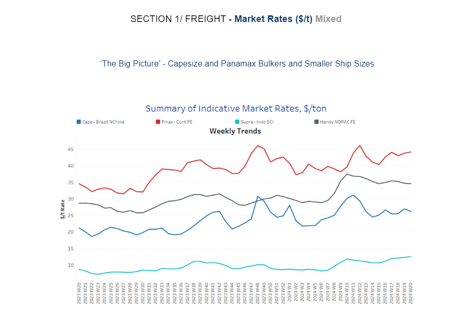
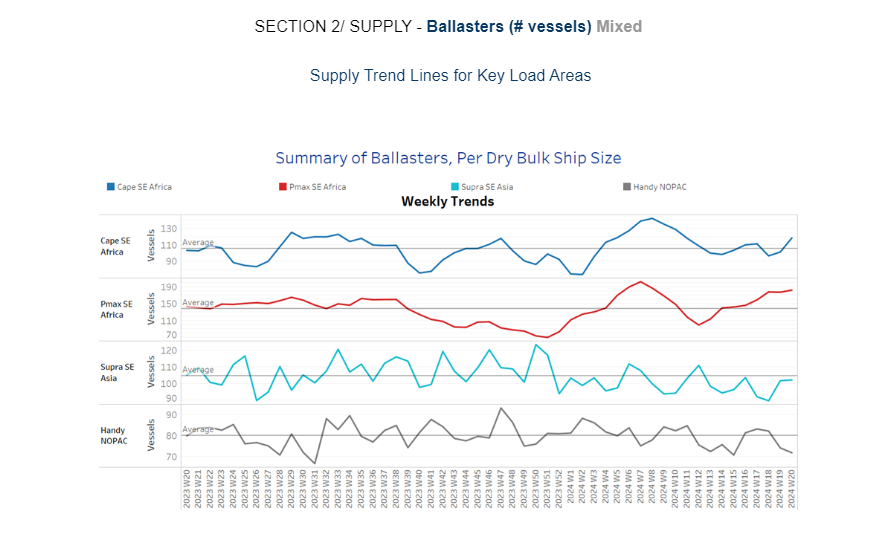
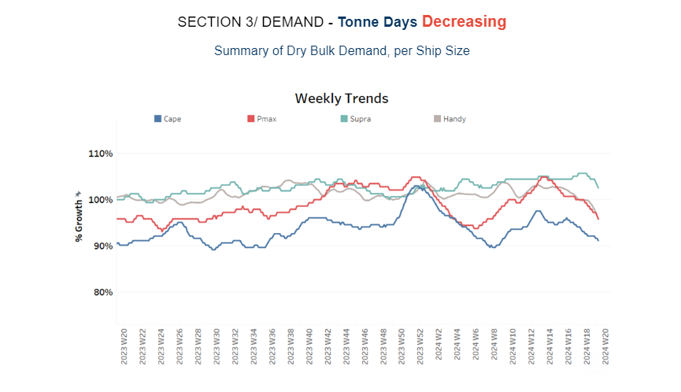
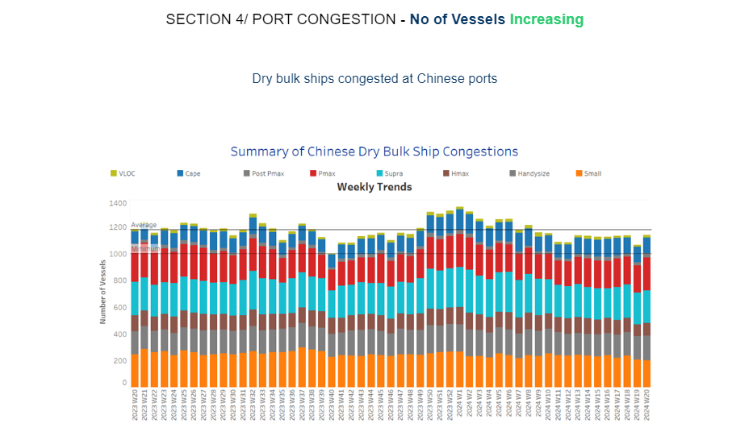

# Panamax Market Insights

**Date:** May 15, 2024  
**Publisher:** Breakwave Advisors | **Category:** Market Insights  
**Original URL:** [https://www.breakwaveadvisors.com/insights/2024/5/15/panamax-market-insights](https://www.breakwaveadvisors.com/insights/2024/5/15/panamax-market-insights)  

---

**Dry Weekly Market Monitor - Week 20.2024**
Snapshot of Spot Freight Rates, Supply-Demand Trends, Port Congestions
May 15, 2024

> **Figure 1: Στιγμιότυπο Οθόνης 2024 05 15 170056**  
> **Interactive Data & Source:** [Signal Ocean Platform](https://go.signalocean.com/e/983831/ess-ahead-of-fridays-data-html/2q68qh/408050057/h/sVNa-wsIgJzQVaN4if93yG9I0CcX6ScLPI2OsAdl8dM) | [Local Asset](file:///C:/Users/Dell/Github/Shipping/corpus/03-breakwave/insights/2024/assets/2024-05-15_panamax-market-insights_img_cea3cf84ceb9ceb3cebcceb9cf8ccf84cf85_860880412a05.png)

The month of May presents challenges for the Capesize freight market prices, as uncertainties loom over Chinese macroeconomic fundamentals, potentially impacting future growth and demand. As China moves into the second quarter,[various indicators](https://go.signalocean.com/e/983831/ess-ahead-of-fridays-data-html/2q68qh/408050057/h/sVNa-wsIgJzQVaN4if93yG9I0CcX6ScLPI2OsAdl8dM)hint at the possibility of sluggish economic expansion unless conditions improve, leading to heightened expectations for monetary policy adjustments. Over the weekend, the People’s Bank of China disclosed April’s new loan data, revealing a significant decline in demand. Several metrics hit their lowest levels in at least two decades, painting a concerning picture of the economic landscape. Moreover, on Friday, China is slated to issue its inaugural 30-year ultra-long bond, signalling the commencement of a previously announced initiative aimed at raising 1 trillion yuan ($138.25 billion) for pivotal strategic projects.

This week's chart delves into the correlation between the number of ballast Panamax vessels for the Baltic Panamax P6_82 Singapore route via the Atlantic and the performance of Baltic freight assessments for this route since January 2022. As depicted in the graph above, the count of Panamax ballasters in ECSA has exhibited a continuous upward trend since the end of January 2024, exerting downward pressure on the evolution of freight assessments. While the end of the third quarter of the year saw a somewhat more stable environment, it remained weaker than the peak observed in mid-March.

> **Figure 2: Στιγμιότυπο Οθόνης 2024 05 15 170335**  
> **Interactive Data & Source:** [Signal Ocean Platform](https://www.thesignalgroup.com/signal-ocean-platform) | [Local Asset](file:///C:/Users/Dell/Github/Shipping/corpus/03-breakwave/insights/2024/assets/2024-05-15_panamax-market-insights_img_cea3cf84ceb9ceb3cebcceb9cf8ccf84cf85_0b03c6c5ac2a.png)

In the second week of May, there is a mixed outlook in the evolution of market prices. The Panamax Continent FE route shows signs of recovery, while rates in the Capesize Brazil-N China route remain under a negative pressure.

- **Capesize**vessel freight rates for shipments from Brazil to North China currently stand at approximately $26 per ton, reflecting a 4% decrease compared to the previous week. Nonetheless, it's noteworthy that present levels are still 19% higher than they were a year ago.
- **Panamax**vessel freight rates from the Continent to the Far East have remained robust, around $46 per ton. Recent data indicates a notable 23% surge compared to levels observed a year ago.
- **Supramax**vessel freight rates on the Indo-ECI route rose to $13 per ton, marking a 44% increase compared to a comparable week from a year ago.
- **Handysize**freight rates for the NOPAC Far East route experienced a decline of approximately $35 per ton. Despite this, they exhibit a notable 20% annual upswing.

> **Figure 3: Στιγμιότυπο Οθόνης 2024 05 15 170452**  
> **Interactive Data & Source:** [Signal Ocean Platform](https://www.thesignalgroup.com/signal-ocean-platform) | [Local Asset](file:///C:/Users/Dell/Github/Shipping/corpus/03-breakwave/insights/2024/assets/2024-05-15_panamax-market-insights_img_cea3cf84ceb9ceb3cebcceb9cf8ccf84cf85_c46539435eef.png)

During the second week of May, there is a mixed picture regarding the number of ballasters. While there is an increase in Southeast Africa for the Capesize and Panamax vessel size segments, indications of a downward trend have emerged for Supramax in Southeast Asia and Handy in NOPAC.

- **Capesize SE Africa**: The count of ballast ships has now risen above 110, this represents a 15% increase from the low recorded during week 18.
- **Panamax SE Africa**: The number of ballast ships rose to excess 180, almost 80% higher than the bottom recorded during week 13.
- **Supramax SE Asia**: The count of ballast ships is now hovering just below the annual average of 100, following two consecutive weeks of persistent increases.
- **Handysize NOPAC**: Since the conclusion of week 17, the count of ballast ships has consistently remained below the annual average of 80, signalling a downward trend for the remainder of May.

> **Figure 4: Στιγμιότυπο Οθόνης 2024 05 15 170557**  
> **Interactive Data & Source:** [Signal Ocean Platform](https://www.thesignalgroup.com/signal-ocean-platform) | [Local Asset](file:///C:/Users/Dell/Github/Shipping/corpus/03-breakwave/insights/2024/assets/2024-05-15_panamax-market-insights_img_cea3cf84ceb9ceb3cebcceb9cf8ccf84cf85_630620c20a13.png)

A consistent downward trend in tonne-day growth is evident across all vessel size segments in early May, with the most significant declines seen in the Capesize, Panamax, and Handysize categories.

- **Capesize**: Since the end of week 14, a downward trend has been evident, with current levels dropping to their lowest point since the peak in week 12.
- **Panamax**: The decline in tonne-day growth persists, mirroring the weakening trend seen in the Handysize category. Recent estimates suggest an additional drop in the second half of the month.
- **Supramax**: Despite earlier signs of stabilisation, the growth rate in May has further decreased from the levels recorded two weeks ago.
- **Handysize**: The growth rate of tonne days persisted in its decline over the last three weeks, with the recent pace still continuing slower than the slowest observed since the conclusion of the 9th week.

> **Figure 5: Στιγμιότυπο Οθόνης 2024 05 15 170721**  
> **Interactive Data & Source:** [Signal Ocean Platform](https://www.thesignalgroup.com/signal-ocean-platform) | [Local Asset](file:///C:/Users/Dell/Github/Shipping/corpus/03-breakwave/insights/2024/assets/2024-05-15_panamax-market-insights_img_cea3cf84ceb9ceb3cebcceb9cf8ccf84cf85_728b815ea7ae.png)

In the second week of May, there are indications of a rise in Chinese dry bulk congestion compared to the levels observed at the end of April. However, the previous week ended with a noticeable downward trend. The recent uptick appears to be primarily driven by the Panamax, Supramax and Handysize vessel size categories.

- **Capesize**: Capesize ship congestion has declined to below 120, reflecting a decrease of 15 from the levels observed three weeks ago.
- **Panamax**: The number of Panamax vessels has surged, now surpassing 240, which is nearly 40 vessels higher than the figures reported just a week ago.
- **Supramax**: Congestion levels have risen, surpassing the 240 mark, which is nearly 40 vessels higher than the level recorded during week 16.
- **Handysize**: Congestion levels rose at around 180, 10 higher than the low recorded four weeks ago.

Data Source:[Signal Ocean Platform](https://www.thesignalgroup.com/signal-ocean-platform)

---

**Tags:** Drybulk, Shipping, Freightrates  
