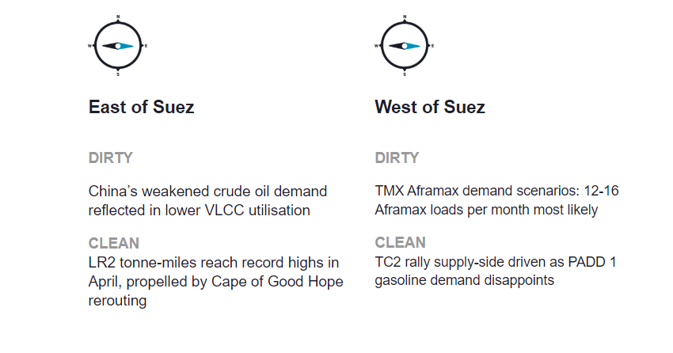
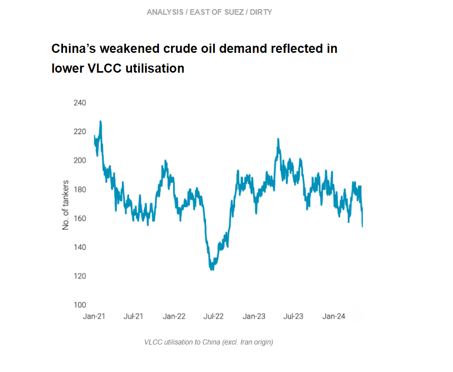
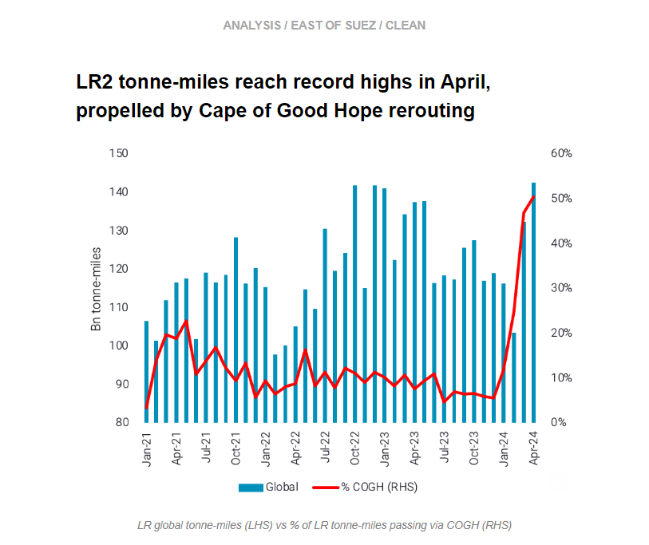
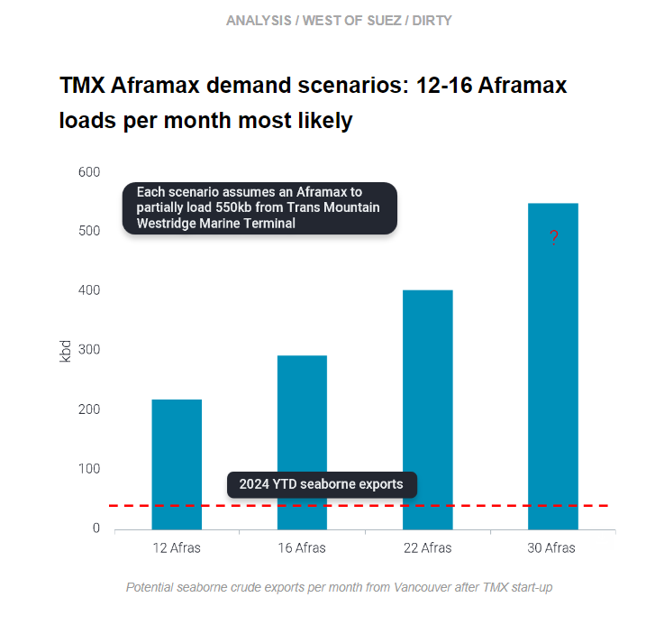
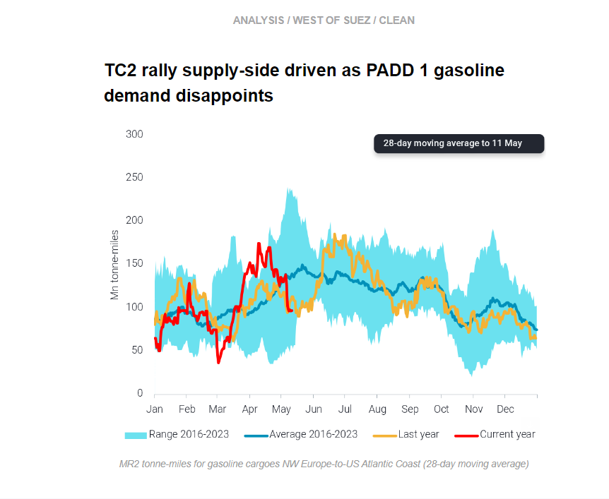

# China’s weakened crude oil

**Date:** May 16, 2024  
**Publisher:** Breakwave Advisors | **Category:** Market Insights  
**Original URL:** [https://www.breakwaveadvisors.com/insights/2024/5/16/no1wtz13cs03vxx5tbkjtfmz691yzt](https://www.breakwaveadvisors.com/insights/2024/5/16/no1wtz13cs03vxx5tbkjtfmz691yzt)  

---

This week, in the East, we discuss falling VLCC utilisation to China and record-high LR2 global tonne-miles in April. In the West, we look at the most likely Aframax demand scenarios after the TMX opening, and we explore the outlook for TC2 and Atlantic Basin MRs.

*By*[*Mary Melton*](https://www.linkedin.com/search/results/all/?fetchDeterministicClustersOnly=true&heroEntityKey=urn%3Ali%3Afsd_profile%3AACoAABXVyecBtg-pRnIrZe0BoWk0ygPiUfbvhsw&keywords=mary%20melton&origin=RICH_QUERY_SUGGESTION&position=0&searchId=40e8d7d2-c4d0-4022-81e7-176f6eba418b&sid=H_Y&spellCorrectionEnabled=false)

> **Figure 1: Στιγμιότυπο Οθόνης 2024 05 16 101526**  
> **Interactive Data & Source:** [Marketingmail Vortexa](https://marketingmail.vortexa.com/ODM3LU1aRS01NzgAAAGTG7S3KxNN7We8o279n0hYBSzpH0bJx3PqAE0_ScUV45VTfXJtSti8T1AxVXWXn9CnUPGX4r4=) | [Local Asset](file:///C:/Users/Dell/Github/Shipping/corpus/03-breakwave/insights/2024/assets/2024-05-16_no1wtz13cs03vxx5tbkjtfmz691yzt_img_cea3cf84ceb9ceb3cebcceb9cf8ccf84cf85_f8f708ad8bd0.png)

> **Figure 2: Στιγμιότυπο Οθόνης 2024 05 16 101708**  
> **Interactive Data & Source:** [Marketingmail Vortexa](https://marketingmail.vortexa.com/ODM3LU1aRS01NzgAAAGTG7S3KxNN7We8o279n0hYBSzpH0bJx3PqAE0_ScUV45VTfXJtSti8T1AxVXWXn9CnUPGX4r4=) | [Local Asset](file:///C:/Users/Dell/Github/Shipping/corpus/03-breakwave/insights/2024/assets/2024-05-16_no1wtz13cs03vxx5tbkjtfmz691yzt_img_cea3cf84ceb9ceb3cebcceb9cf8ccf84cf85_efa8e659cc50.png)

- China’s crude oil demand is slowing down amidst declining refinery run rates among Shandong teapot refiners and the Yulong startup delay.[Crude/condensate exports to China (excl. Iran)](https://marketingmail.vortexa.com/ODM3LU1aRS01NzgAAAGTG7S3KxNN7We8o279n0hYBSzpH0bJx3PqAE0_ScUV45VTfXJtSti8T1AxVXWXn9CnUPGX4r4=)are sitting at 7.8mbd (May-24 days 1-12), a 1.3mb decline m-o-m.

- This decline is reflected in[VLCC utilisation to China](https://marketingmail.vortexa.com/ODM3LU1aRS01NzgAAAGTG7S3LvBvuOLcsvQxlIQHvqVokCB1UO_jyGxRWAXq_xg2-YJLtcJS18oP95XfQCCxSMVNL4A=)hitting the lowest levels in 20 months. This decline is driven by lower flows from the Middle East to China, as crude exports on VLCCs from[Saudi Arabia and Iraq to China have declined.](https://marketingmail.vortexa.com/ODM3LU1aRS01NzgAAAGTG7S3Lpot1rnVPFGYmSMNyKx7kl5h-GCnSp3sbwXVK7ytuAgBpjchPLoa8D6lKKrWT4NOXjg=)The decline in VLCC utilisation to China is further supported by the reduction in Atlantic Basin crude exports to China in May (days 1-12), which is reducing[employment to China from the Atlantic Basin](https://marketingmail.vortexa.com/ODM3LU1aRS01NzgAAAGTG7S3LHSgZj9iszPNWavuqRurwtht_vPL1aOB25PDyW4AsgWU_Gr23eCik8Iw-KDJ34qOJsc=), especially y-o-y.
- Despite this low utilisation, VLCC rates to China are increasing due to charterers releasing all cargoes for the remainder of May loading dates, which will likely increase utilisation temporarily. However, the high June OSPs announced by Saudi will likely temper Chinese buying and therefore cap VLCC demand.

> **Figure 3: Στιγμιότυπο Οθόνης 2024 05 16 101904**  
> **Interactive Data & Source:** [Marketingmail Vortexa](https://marketingmail.vortexa.com/ODM3LU1aRS01NzgAAAGTG7S3K8eblCDuA9lRG1SXfP3apYa6RLHgEGc9TS5QgtEaZ8p7M_wPjV8Cv4E19fMtgUIGbbY=) | [Local Asset](file:///C:/Users/Dell/Github/Shipping/corpus/03-breakwave/insights/2024/assets/2024-05-16_no1wtz13cs03vxx5tbkjtfmz691yzt_img_cea3cf84ceb9ceb3cebcceb9cf8ccf84cf85_fa0fa54ad5ee.png)

- The contribution of Cape of Good Hope (COGH) re-routings to LR2 global demand continues to[increase](https://marketingmail.vortexa.com/ODM3LU1aRS01NzgAAAGTG7S3K8eblCDuA9lRG1SXfP3apYa6RLHgEGc9TS5QgtEaZ8p7M_wPjV8Cv4E19fMtgUIGbbY=), surpassing 50% for the month of April. This has assisted in bringing[LR2 global tonne-miles](https://marketingmail.vortexa.com/ODM3LU1aRS01NzgAAAGTG7S3LmBcmY0GoMoCbHX1yuJfW7eAbHA-akPc1LDEBnPeDY7mjSJWBKX6MqKnYAphe5P0YLc=)to record highs.

- This is happening at a time when demand for traditional LR cargoes in the Atlantic Basin is softer. In turn, an increasing share of these vessels have to[travel all the way back to the East of Suez - via COGH - to pick up a cargo](https://marketingmail.vortexa.com/ODM3LU1aRS01NzgAAAGTG7S3LL0xfXznma7nqVzriOSkAJg4KsDNclru5P_kzXFLGkBeWP5CsDGY6FU8UZ3jmTWCz10=).
- These long-haul laden and ballast voyages have naturally increased the fleet requirements as well as rates with[TC18 MEG-to-Europe up by 35% m-o-m](https://marketingmail.vortexa.com/ODM3LU1aRS01NzgAAAGTG7S3LFrmoglovnMKk9mIyhB0m08hSRDYErxgsiPckA5jGuTzxCdmR4J5TosPDcD6JSGAN68=). This in turn has widened the profitability between LR2 and Aframaxes, prompting the resumption of the[dirty](https://marketingmail.vortexa.com/ODM3LU1aRS01NzgAAAGTG7S3K1SEbiXmWHRKWIJEwOVTj5fbOd8IUcWapw4qXk8IvwDWSF-fsWjcqd45s27JreopNgI=)-to-[clean](https://marketingmail.vortexa.com/ODM3LU1aRS01NzgAAAGTG7S3LMI3PN-wDd5kWsomTgoWk339ByArElBr1MQFH4wEfYd_8H4ssRqJC8FxJ1l53Tg45Yk=)LR2 switching pattern.

> **Figure 4: Στιγμιότυπο Οθόνης 2024 05 16 102012**  
> **Interactive Data & Source:** [Marketingmail Vortexa](https://marketingmail.vortexa.com/ODM3LU1aRS01NzgAAAGTG7S3K97xYzZ1FN0gIzkKzW4P7NihkTUL-KhxlhdWw0-Omu0gpSrHV5HITesloH7jGIdg2Pk=) | [Local Asset](file:///C:/Users/Dell/Github/Shipping/corpus/03-breakwave/insights/2024/assets/2024-05-16_no1wtz13cs03vxx5tbkjtfmz691yzt_img_cea3cf84ceb9ceb3cebcceb9cf8ccf84cf85_e20f20d79d82.png)

- With the TMX opening, Westridge Terminal- which currently loads 2-3 Aframaxes a month - is expected to load around 30-40 Aframaxes a month. To demonstrate a realistic scenario, we looked at this from the perspective of potential monthly exports out of Vancouver. We believe 12 to 16 Aframaxes loaded per month are more likely in terms of seaborne exports (~300 kbd).

- These Aframaxes will then either travel directly to Asia and ballast back to Vancouver (high freight cost) or travel to US West Coast refiners, a more likely scenario. Another option is an STS transfer to a VLCC which is not possible off Vancouver due to rough seas. Therefore, the likely option will be to STS further south near Panama or California (where permission is required from California authorities for loading VLCCs and is unlikely to be granted). This will likely displace[long haul crude arrivals into US West Coast](https://marketingmail.vortexa.com/ODM3LU1aRS01NzgAAAGTG7S3K97xYzZ1FN0gIzkKzW4P7NihkTUL-KhxlhdWw0-Omu0gpSrHV5HITesloH7jGIdg2Pk=)as well as some ANS barrels which then might have to find buyers in Asia.
- However, only once cargoes actually start loading in greater numbers will we see the true impact to the Americas Aframax market from the TMX start-up. ([Read more here](https://marketingmail.vortexa.com/ODM3LU1aRS01NzgAAAGTG7S3LNyzbxCgFvwboisiRzJZkJSYfI62f8LWGnuXg5RUrCDVhaHd00TaP3LIlzFsL-VrFj0=)about the impact on the crude market)

> **Figure 5: Στιγμιότυπο Οθόνης 2024 05 16 102159**  
> **Interactive Data & Source:** [Marketingmail Vortexa](https://marketingmail.vortexa.com/ODM3LU1aRS01NzgAAAGTG7S3LnuBqBMAA6ZjEZ8-eQq9cER5cOfimRaXb_xjTKbnoJdrt4deQPRJRFGjWuDQQ1F6OqI=) | [Local Asset](file:///C:/Users/Dell/Github/Shipping/corpus/03-breakwave/insights/2024/assets/2024-05-16_no1wtz13cs03vxx5tbkjtfmz691yzt_img_cea3cf84ceb9ceb3cebcceb9cf8ccf84cf85_c36b8f75ce05.png)

- Transatlantic MR demand is muted, despite hopes of a seasonal pick-up in PADD 1 gasoline demand as the summer driving season approaches.[MR tonne-mile demand](https://marketingmail.vortexa.com/ODM3LU1aRS01NzgAAAGTG7S3LnuBqBMAA6ZjEZ8-eQq9cER5cOfimRaXb_xjTKbnoJdrt4deQPRJRFGjWuDQQ1F6OqI=)on this route is currently well below seasonal norms and slightly below last year’s level. PADD 1 gasoline stocks are currently at the bottom of the five-year range (EIA). However, the arbitrage for gasoline to PADD 1 via the Colonial Pipeline is open, suggesting that if PADD 1 does build stocks in the near-future it will mostly be with pipeline volumes.

- Freight rates for transatlantic MR voyages NW Europe-to-US Atlantic Coast ([TC2](https://marketingmail.vortexa.com/ODM3LU1aRS01NzgAAAGTG7S3K7Lq-6ECut0LSGsAun63W3_C1Qm_bDEneFzycknyluJeu8Ylyp9JDyIscd2WjylB4d8=)) have increased since the start of May, but this is supply-side driven due to[declining prompt availability](https://marketingmail.vortexa.com/ODM3LU1aRS01NzgAAAGTG7S3LAv_z-zQInGFyYutxuuoLc9YNmGx_jky_YEUXgfdgkK0gE7bKPkATQWvZR7aQaw-tHE=)in NW Europe rather than increased tanker demand. One of the drivers behind this is[fewer ballasters returning directly to Europe after a PADD 1 discharge](https://marketingmail.vortexa.com/ODM3LU1aRS01NzgAAAGTG7S3LG18ejAKGl_gYMvp64IzcCr-byqKLDziXUfsnc4FcaIMbqL9w4O3MHsRp9HiqD3T7a0=), which is keeping available vessel supply in check. In past years, more vessels returned directly to Europe.
- Instead, after a PADD 1 discharge, vessels are increasingly[heading to the US Gulf](https://marketingmail.vortexa.com/ODM3LU1aRS01NzgAAAGTG7S3LtAVpJudNLDIy7afGslCc1db3lRRRv8M77C95cl4YN-mQjz9I7ci9vVx_rBg1LBD4qk=), where MR freight rates are healthy as[CPP exports increase](https://marketingmail.vortexa.com/ODM3LU1aRS01NzgAAAGTG7S3LlESpHwcyDrut4F7Eehx1MHL_7joZxuQ4vcCpoMWCM3m5s9Mas6UMJvHM7iJTidIKF0=). It is likely that this extra supply can be absorbed if exports remain strong. Additionally, it looks likely that Mexico’s demand for US CPP will increase, as some refineries are malfunctioning after exceptionally high run rates in recent months.

Data Source:[Vortexa](https://www.vortexa.com//oil-gas-data-traders-analysts-data-scientists?gclid=Cj0KCQjw8_qRBhCXARIsAE2AtRZKOvMnbilZ_6_91d7huSFFy71pWLrnPwGwOHVzXsmsG-1a1mZnQw8aAt89EALw_wcB&hsa_acc=1782073842&hsa_ad=548425387665&hsa_cam=14746637662&hsa_grp=125038601902&hsa_kw=&hsa_mt=&hsa_net=adwords&hsa_src=g&hsa_tgt=dsa-1431852288425&hsa_ver=3&utm_campaign=%5BCD%5D%20-%20DSA%20-%20EMEA&utm_medium=cpc&utm_medium=ppc&utm_source=google&utm_source=adwords&utm_term=)

---

**Tags:** Shipping, Crude Oil, Tankers  
