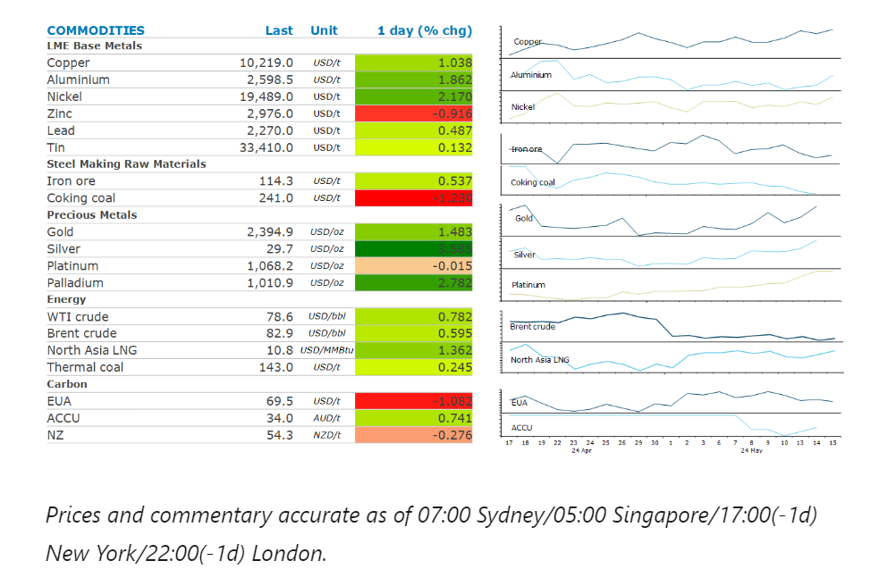
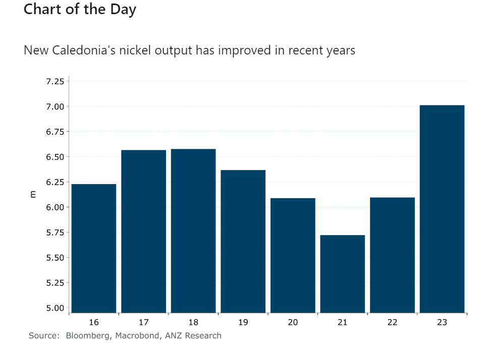

# Oil gains amid signs of stronger demand

**Date:** May 16, 2024  
**Publisher:** Breakwave Advisors | **Category:** Market Insights  
**Original URL:** [https://www.breakwaveadvisors.com/insights/2024/5/16/oil-gains-amid-signs-of-stronger-demand](https://www.breakwaveadvisors.com/insights/2024/5/16/oil-gains-amid-signs-of-stronger-demand)  

---

A risk-on tone across markets was sparked by signs of falling inflation and a weaker USD. Renewed supply side issues also supported the gains.

*By*[*Daniel Hynes*](https://www.linkedin.com/in/dahynes/)

> **Figure 1: Στιγμιότυπο Οθόνης 2024 05 16 103129**  
> **Interactive Data & Source:** [Linkedin](https://www.linkedin.com/newsletters/commodities-wrap-6692196755876012032/?fbclid=IwAR3kiXJqZdxmp9ZcRwBNI7FsBySI-XSC0pfPur1qzjt7OZp7PTE59Tsl1QI) | [Local Asset](file:///C:/Users/Dell/Github/Shipping/corpus/03-breakwave/insights/2024/assets/2024-05-16_oil-gains-amid-signs-of-stronger-demand_img_cea3cf84ceb9ceb3cebcceb9cf8ccf84cf85_e482675a3582.png)

### Market Commentary

**Copper**surged to a new record high as investors pile into the metal at the centre of the energy transition. The rally was triggered earlier in the year when mine closures tightened the market. This has been exacerbated by rising competition from end users for critical minerals and is likely behind the US move to apply new tariffs on Chinese imports, including electric vehicles, critical minerals, steel and aluminium. However, the latest surge has been supported by rising investor interest. CFTC data show that, at the end of April, non-commercial speculative investors amassed the biggest net long position in the metal since 2021.**Nickel**jumped more than 2% after unrest in New Caledonia, the world’s third largest nickel producer. France’s president, Emmanuel Macron, imposed a state of emergency in the South Pacific territory, after pro-independence protests left three dead and disrupted nickel production. Eramet SA has halted its nickel operations there, while operations at the vast majority of mines have been suspended.

**Gold**rallied after US data showed inflation cooling, opening the way for the Fed to cut rates. A measure of underlying US inflation fell in April for the first time in six months. Separate data showed retail sales stagnated in the same month, as borrowing costs and high debt levels create caution among consumers. Investor demand was also boosted by a weaker USD. This comes despite physical demand from gold-backed ETFs remaining weak. Investors remain net sellers of such funds this year, with total holdings down 5.9%. A strong US equity market may be the likely source.

**Iron ore**fell for a second consecutive day around concerns over demand in China. Sentiment remains weak despite efforts to support the Chinese property sector. Investors were not impressed with a proposal for local governments to buy millions of unsold homes. The financial state of property developers remains poor. Agile Group Holdings, a Chinese developer of apartments and high-rise homes, defaulted for the first time on publicly issued dollar bonds.

**Crude oil**gained amid a broader risk on tone across markets. This was supported by signs of stronger demand. US inventories of crude oil fell 2,508kbbls last week, more than expected. More importantly, gasoline and jet fuel demand increased on a four-week seasonal average, according to EIA data. However, the market’s mood was tempered after the International Energy Agency cut its growth forecast for oil demand. It now expects a 1.1mb/d increase in 2024, about 140kb/d less than its previous forecast. However, it also lowered its forecast for gains in non-OPEC supply. Geopolitical tensions remain elevated. Israel appears to have commenced an invasion of Rafah, while Hezbollah fired missiles and rockets at the Jewish state. Ceasefire talks have reached an impasse, according to Qatar's prime minister, Sheikh Mohammed bin Abdulrahman.

**North Asian LNG**prices edged higher as hotter weather tempts buyers back into the market. Utilities are stocking up in anticipation of strong cooling demand. Temperatures are expected to rise above their 10y average in Japan, South Korea and China over the next two weeks.

> **Figure 2: Στιγμιότυπο Οθόνης 2024 05 16 103150**  
> **Interactive Data & Source:** [Linkedin](https://www.linkedin.com/newsletters/commodities-wrap-6692196755876012032/?fbclid=IwAR3kiXJqZdxmp9ZcRwBNI7FsBySI-XSC0pfPur1qzjt7OZp7PTE59Tsl1QI) | [Local Asset](file:///C:/Users/Dell/Github/Shipping/corpus/03-breakwave/insights/2024/assets/2024-05-16_oil-gains-amid-signs-of-stronger-demand_img_cea3cf84ceb9ceb3cebcceb9cf8ccf84cf85_2c9f26749e55.png)

Data source:[Commodities Wrap](https://www.linkedin.com/newsletters/commodities-wrap-6692196755876012032/?fbclid=IwAR3kiXJqZdxmp9ZcRwBNI7FsBySI-XSC0pfPur1qzjt7OZp7PTE59Tsl1QI)

---

**Tags:** Commodities, Economy, Markets  
