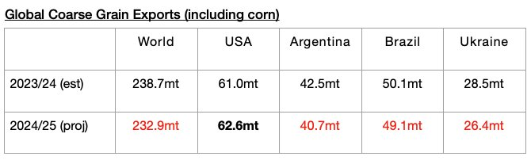
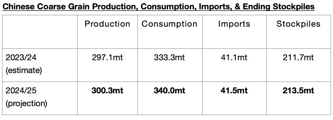

# Even More Global Grain Exports Expected

**Date:** May 17, 2024  
**Publisher:** Breakwave Advisors | **Category:** Market Insights  
**Original URL:** [https://www.breakwaveadvisors.com/insights/2024/5/17/lmaejjhl32np15oz4y72du2v5g64lk](https://www.breakwaveadvisors.com/insights/2024/5/17/lmaejjhl32np15oz4y72du2v5g64lk)  

---

*By*[*Jeffrey Landsberg*](https://www.linkedin.com/in/jeffrey-landsberg-70ab957/)

As we discussed in Commodore Research's most recent Weekly Dry Bulk Report (published before the start of every week), the United States Department of Agriculture (USDA) has released their first grain export forecast for the 2024/25 season and is predicting that global coarse grain, wheat, soybean, and soymeal exports will collectively total 703.6 million tons. While extremely preliminary, this would mark a year-on-year rise of 5.7 million tons (1%) from the already robust 697.9 million tons that is expected for 2023/24. Taking into account the several times that the forecast for 2023/24 was raised, predictions for global grain exports have now been raised for seven straight months.

Of note is that the USDA is forecasting that global coarse grain exports in 2024/25 will total 232.9 million tons, which would mark a year-on-year decline of 5.8 million tons (-2%). Coarse grain will continue to serve as the dry bulk market’s largest volume grain cargo, but for 2024/25 a contraction is expected. Year-on-year declines are again expected for Brazil and Ukraine, and a year-on-year increase is again expected for the United States (although much smaller than 2023/24’s increase). A year-on-year decline in exports is expected from Argentina, which would mark a reversal from a significant 2023/24 year-on-year increase.

> **Figure 1: Chart 1**  
> [Local Asset](file:///C:/Users/Dell/Github/Shipping/corpus/03-breakwave/insights/2024/assets/2024-05-17_lmaejjhl32np15oz4y72du2v5g64lk_img_chart1_d032e00983ba.jpg)

Also of note is that while China’s primary grain imports remain soybeans, China’s coarse grain imports are expected to continue to strengthen due to both stronger domestic consumption and an increase in stockpiling. Even more imports are now expected, with the USDA predicting that China's coarse grain imports in 2024/25 will climb to 41.5 million tons. For 2023/24, imports are expected to total 41.1 million tons.

> **Figure 2: Chart 2**  
> [Local Asset](file:///C:/Users/Dell/Github/Shipping/corpus/03-breakwave/insights/2024/assets/2024-05-17_lmaejjhl32np15oz4y72du2v5g64lk_img_chart2_799e3dbcd64e.jpg)

---

**Tags:** Drybulk, Economy, Markets  
