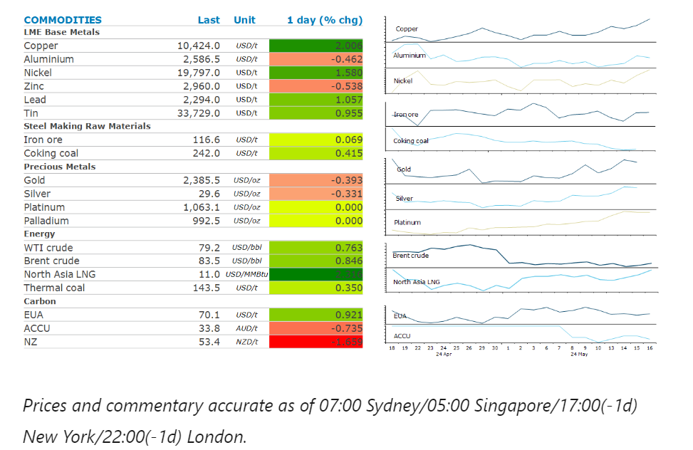
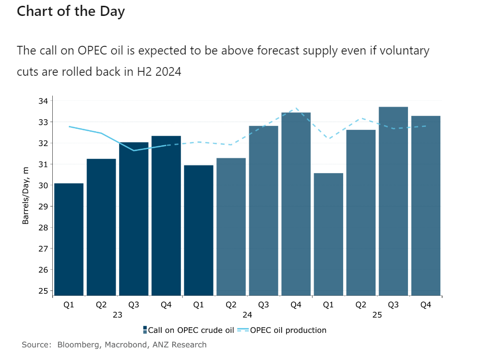

# Oil gains as market contemplates OPEC's next move

**Date:** May 17, 2024  
**Publisher:** Breakwave Advisors | **Category:** Market Insights  
**Original URL:** [https://www.breakwaveadvisors.com/insights/2024/5/17/oil-gains-as-market-contemplates-opecs-next-move](https://www.breakwaveadvisors.com/insights/2024/5/17/oil-gains-as-market-contemplates-opecs-next-move)  

---

Investor sentiment remained buoyed by the prospect of easing US monetary policy. Ongoing supply side issues in energy and metal markets also added support.

*By*[*Daniel Hynes*](https://www.linkedin.com/in/dahynes/)

> **Figure 1: Στιγμιότυπο Οθόνης 2024 05 17 112143**  
> [Local Asset](file:///C:/Users/Dell/Github/Shipping/corpus/03-breakwave/insights/2024/assets/2024-05-17_oil-gains-as-market-contemplates-opecs-next-move_img_cea3cf84ceb9ceb3cebcceb9cf8ccf84cf85_f0099258f31e.png)

### Market Commentary

**Crude oil**edged higher as the market ponders falling inventories and an uncertain economic backdrop. Sentiment remained supported by the second consecutive weekly fall in US crude oil stockpiles. Signs of slowing inflation added to the risk-on tone. The market was largely rangebound as it contemplates OPEC’s next move. We see[**three possible scenarios**](../pdfs/2024-05-17_oil-gains-as-market-contemplates-opecs-next-move_commodity-call-opec-s-delicate-balan_cb21eed520b7.pdf)for the outcome of the 1 June meeting: extend, unwind or complete removal of the voluntary cuts of 2.2mb/d. Our current model is based on a gradual unwinding of the cuts in H2 2024. Even with that, we see the market moving into a deficit, with the future call on OPEC production well above current output. This is the basis for our forecast of USD90/bbl in H2 2024. Should OPEC choose to remove the cuts, our fair value models suggest prices could fall as low as USD75/bbl. However, an extension could produce eye-watering deficits and push prices to USD100/bbl. Fundamentals suggest the market could handle a rise in OPEC+ output in the second half of the year. But the optics of ending the voluntary cuts could lead to a heavy selloff in the futures market. As such, an extension is the most likely outcome.

**North Asian LNG**prices extended recent gains as buyers from India to Thailand increase activity in the spot market. The prospect of hotter weather has tempted them to secure cargo ahead of the stronger demand for cooling. Price sensitive buyers are also left with a limited pool of suppliers, as vessels rerouting around Africa due to the Israel-Hamas war are charging higher shipping costs.**European gas**prices rose as traders begin restocking inventories just as disruptions limit availability of LNG cargo.

**Copper’s**rally continued unabated despite a short squeeze on the Comex easing. Margins on the New York based exchange were raised by 11%, which resulted in the July contract falling 1.2%. At the same time, LME copper for delivery in three months gained 1.9%. After hitting USD1,000/t earlier this week, the spread between the contracts on the two exchanges fell to USD300/t. Broader sentiment remained supported by the prospect of rate cuts in the US following data released earlier this week that showed a fall in US inflation.**Nickel**prices remained well bid as traders contemplate supply disruptions in New Caledonia. Mining operations in the world’s third largest nickel producer were suspended after pro-independence protests left three dead.**Aluminium**bucked the trend to end the session lower as European aluminium output starts to recover. Trimet Aluminium SE said it is increasing output from smelters in France and Germany – a sign that energy costs have eased following the shortages in recent years.

**Iron ore**rose amid renewed optimism over Beijing’s efforts to tackle property crisis. Bloomberg reported that authorities are considering a proposal to get local governments to buy unsold homes from distressed developers. This follows reports that China will start selling CNY1trn of special bonds this week centred on boosting infrastructure spending.

**Gold**dipped lower as Fed speakers talked down the prospect of an imminent rate cut. A stronger USD also weighed on investor demand.

> **Figure 2: Στιγμιότυπο Οθόνης 2024 05 17 112205**  
> **Interactive Data & Source:** [Linkedin](https://www.linkedin.com/newsletters/commodities-wrap-6692196755876012032/?fbclid=IwAR3kiXJqZdxmp9ZcRwBNI7FsBySI-XSC0pfPur1qzjt7OZp7PTE59Tsl1QI) | [Local Asset](file:///C:/Users/Dell/Github/Shipping/corpus/03-breakwave/insights/2024/assets/2024-05-17_oil-gains-as-market-contemplates-opecs-next-move_img_cea3cf84ceb9ceb3cebcceb9cf8ccf84cf85_70e414ef988b.png)

Data source:[Commodities Wrap](https://www.linkedin.com/newsletters/commodities-wrap-6692196755876012032/?fbclid=IwAR3kiXJqZdxmp9ZcRwBNI7FsBySI-XSC0pfPur1qzjt7OZp7PTE59Tsl1QI)

---

**Tags:** Commodities, Economy, Markets  
