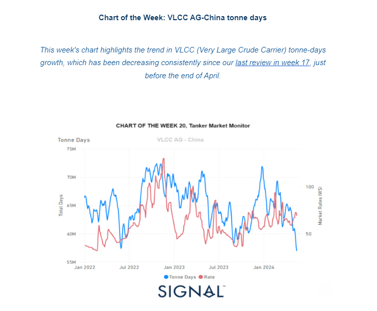
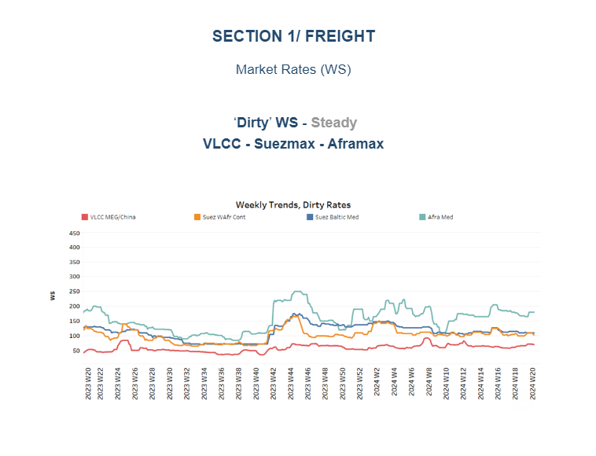
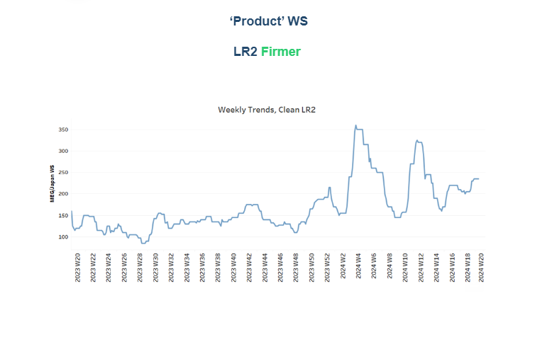
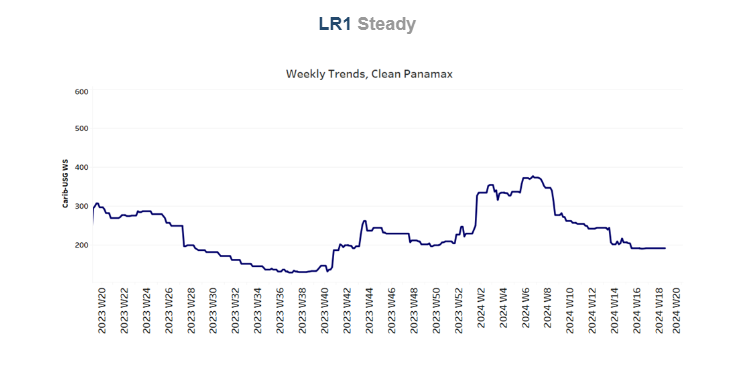
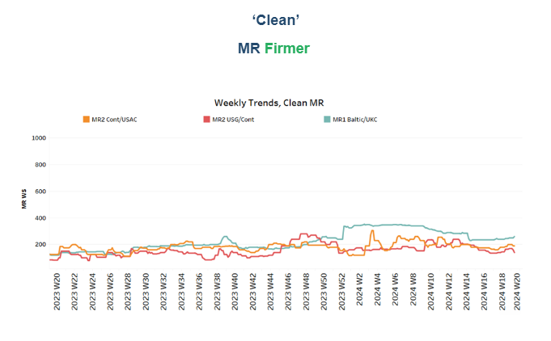
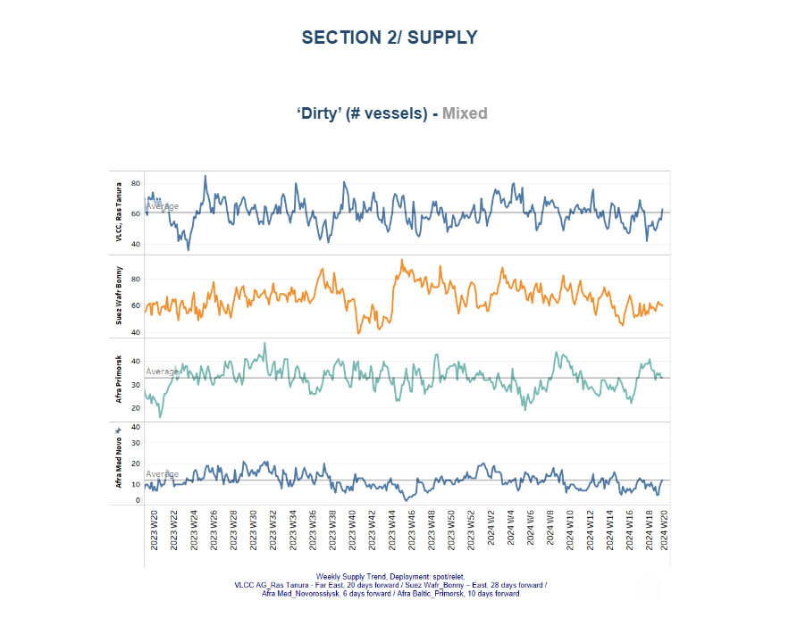
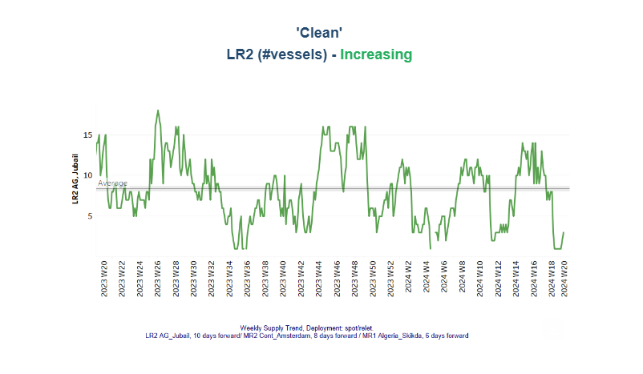
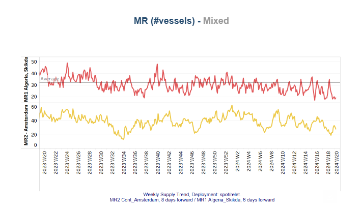
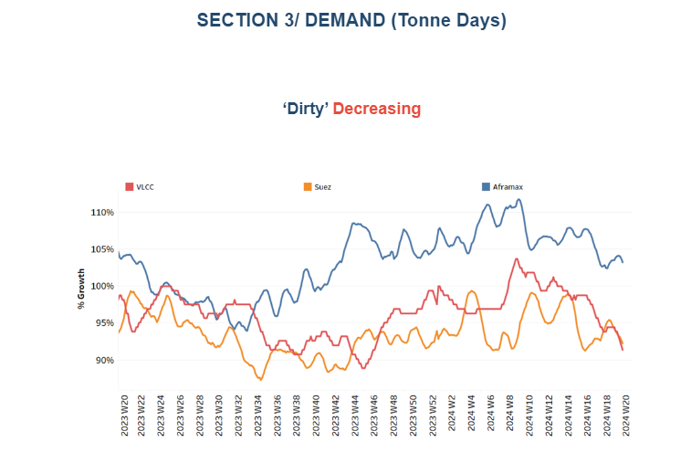
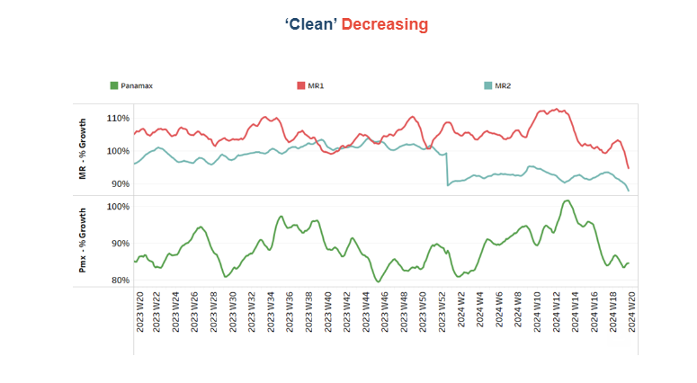

# VLCC AG-China tonne days

**Date:** May 17, 2024  
**Publisher:** Breakwave Advisors | **Category:** Market Insights  
**Original URL:** [https://www.breakwaveadvisors.com/insights/2024/5/17/vlcc-ag-china-tonne-days](https://www.breakwaveadvisors.com/insights/2024/5/17/vlcc-ag-china-tonne-days)  

---

## Tanker - Weekly Market Monitor

Snapshot of Crude and Product Freight Rates, Supply-Demand

Week 20, May 17, 2024

> **Figure 1: Στιγμιότυπο Οθόνης 2024 05 17 151213**  
> **Interactive Data & Source:** [Signal Ocean Platform](https://go.signalocean.com/e/983831/-545-previous-year-2024-05-09-/2q6gj9/408802754/h/oKL9eG4y0nyYA6koZ-dzej1RcIhQWWzC122fbZPpbzA) | [Local Asset](file:///C:/Users/Dell/Github/Shipping/corpus/03-breakwave/insights/2024/assets/2024-05-17_vlcc-ag-china-tonne-days_img_cea3cf84ceb9ceb3cebcceb9cf8ccf84cf85_4d805eba90cb.png)

At the end of the second week of May, the demand growth for dirty tonne-days continues to challenge the solid improvement in market prices, particularly on the VLCC MEG-China route. However, a positive factor is the pace of[Chinese crude oil imports](https://go.signalocean.com/e/983831/-545-previous-year-2024-05-09-/2q6gj9/408802754/h/oKL9eG4y0nyYA6koZ-dzej1RcIhQWWzC122fbZPpbzA), which rose significantly in April, increasing by 5.5% compared to the previous year. This increase is partly due to refiners ramping up imports in anticipation of a fully recovered Labor Day holiday travel season.

According to data from the General Administration of Customs, China imported 44.72 million metric tons of crude oil in April, equivalent to about 10.88 million barrels per day (bpd). This marks a 5.45% rise from the relatively low 10.4 million bpd imported in April 2023. The boost in crude oil imports is a promising sign, indicating robust demand and potential support for market prices despite the ongoing challenges in the dirty tonne-day growth. Overall, while the VLCC MEG-China route faces pressure from declining tonne-day growth, the uptick in Chinese crude imports provides a hopeful outlook for future market stability and price improvements.

> **Figure 2: Στιγμιότυπο Οθόνης 2024 05 17 151323**  
> **Interactive Data & Source:** [Signal Ocean Platform](https://www.thesignalgroup.com/signal-ocean-platform) | [Local Asset](file:///C:/Users/Dell/Github/Shipping/corpus/03-breakwave/insights/2024/assets/2024-05-17_vlcc-ag-china-tonne-days_img_cea3cf84ceb9ceb3cebcceb9cf8ccf84cf85_3197c4a9e4b0.png)

The sentiment surrounding crude oil market prices has remained steady, while Aframax Med rates are attempting to gain stronger momentum.

- The**VLCC MEG-China**freight rates remained above 65WS, marking a notable 49% increase compared to the same week in May last year. However, the market struggles to reach the high levels of 70WS observed in mid-February due to the continued decline in VLCC tonne-days growth.
- **Suezmax**freight rates for shipments originating from**West Africa to continental Europe**dropped nearly a level below 100WS from the end of the previous week, indicating a 23% annual increase. Rates on the Suez Baltic Med route remain steady at around 110WS, showing no change from the previous week and reflecting a nearly 15% decline compared to the same week last year.
- Aframax**Med**freight rates are currently hovering around WS180, up 20 points from the end of the previous week. These recent levels reflect a momentum similar to that of a year ago.

> **Figure 3: Στιγμιότυπο Οθόνης 2024 05 17 151429**  
> **Interactive Data & Source:** [Signal Ocean Platform](https://www.thesignalgroup.com/signal-ocean-platform) | [Local Asset](file:///C:/Users/Dell/Github/Shipping/corpus/03-breakwave/insights/2024/assets/2024-05-17_vlcc-ag-china-tonne-days_img_cea3cf84ceb9ceb3cebcceb9cf8ccf84cf85_e62fed335683.png)

- **LR2**AG freight rates sustained levels above WS200 from mid-April nearing WS250, currently standing 96% higher than during a comparable week a year ago.

> **Figure 4: Στιγμιότυπο Οθόνης 2024 05 17 151541**  
> **Interactive Data & Source:** [Signal Ocean Platform](https://www.thesignalgroup.com/signal-ocean-platform) | [Local Asset](file:///C:/Users/Dell/Github/Shipping/corpus/03-breakwave/insights/2024/assets/2024-05-17_vlcc-ag-china-tonne-days_img_cea3cf84ceb9ceb3cebcceb9cf8ccf84cf85_303b2abe6d44.png)

**Panamax**Carib-to-USG rates sustained levels around WS190 from mid April, currently standing 38% weaker than during a comparable week a year ago.

> **Figure 5: Στιγμιότυπο Οθόνης 2024 05 17 151831**  
> **Interactive Data & Source:** [Signal Ocean Platform](https://www.thesignalgroup.com/signal-ocean-platform) | [Local Asset](file:///C:/Users/Dell/Github/Shipping/corpus/03-breakwave/insights/2024/assets/2024-05-17_vlcc-ag-china-tonne-days_img_cea3cf84ceb9ceb3cebcceb9cf8ccf84cf85_62db2ec39064.png)

- **MR1**rates for shipments from the**Baltic**to the continent are hovering above 250WS, reflecting a 110% increase compared to the same week last year. Meanwhile,**MR2**rates for shipments from the**continent**to the**USAC**stand at 190WS, marking a 50% increase over the rates observed during the comparable week a year ago.

> **Figure 6: Στιγμιότυπο Οθόνης 2024 05 17 151950**  
> **Interactive Data & Source:** [Signal Ocean Platform](https://www.thesignalgroup.com/signal-ocean-platform) | [Local Asset](file:///C:/Users/Dell/Github/Shipping/corpus/03-breakwave/insights/2024/assets/2024-05-17_vlcc-ag-china-tonne-days_img_cea3cf84ceb9ceb3cebcceb9cf8ccf84cf85_223c18d0c765.png)

The supply trend for crude tankers is showing an upward trajectory in the VLCC Ras Tanura and Suez WAfr segments, while a downward trend appears for the Aframax Primosk segment.

- **VLCC Ras Tanura**: The number of ships has risen to nearly above the annual average of 60, which is almost 20 more than the last low recorded in week 18.
- **Suezmax Wafr**:The current ship count remains around 60, reflecting the steady trend observed since the end of week 18.
- **Aframax Primorsk**: The number of ships dropped to the annual average of 35, 5 lower than the previous week, but significantly higher from the bottom recorded at week 17.
- **Aframax Med Novo**: The vessel count has remained below the annual average of 10 since the end of week 17. However, signs of an upward reversal began to appear at the end of the second week.

> **Figure 7: Στιγμιότυπο Οθόνης 2024 05 17 152011**  
> **Interactive Data & Source:** [Signal Ocean Platform](https://www.thesignalgroup.com/signal-ocean-platform) | [Local Asset](file:///C:/Users/Dell/Github/Shipping/corpus/03-breakwave/insights/2024/assets/2024-05-17_vlcc-ag-china-tonne-days_img_cea3cf84ceb9ceb3cebcceb9cf8ccf84cf85_ae05d2435bc3.png)

> **Figure 8: Στιγμιότυπο Οθόνης 2024 05 17 152028**  
> **Interactive Data & Source:** [Signal Ocean Platform](https://www.thesignalgroup.com/signal-ocean-platform) | [Local Asset](file:///C:/Users/Dell/Github/Shipping/corpus/03-breakwave/insights/2024/assets/2024-05-17_vlcc-ag-china-tonne-days_img_cea3cf84ceb9ceb3cebcceb9cf8ccf84cf85_a2d5b5d9f75f.png)

- **Clean LR2 AG Jubail**: The upward trend recorded four weeks ago reversed in the second half of May, leading to a significant downward revision. The latest figures have dropped sharply, indicating a declining trend for the coming days.

- **Clean MR**: Vessel activity for MR1 at Algeria's Skikda port has dropped 40% from the peak recorded in week 18. In contrast, MR2 activity in Amsterdam has shown signs of increase since the end of week 18, rising to 28 vessels—9 more than the low seen before the end of April.

> **Figure 9: Στιγμιότυπο Οθόνης 2024 05 17 152048**  
> **Interactive Data & Source:** [Signal Ocean Platform](https://www.thesignalgroup.com/signal-ocean-platform) | [Local Asset](file:///C:/Users/Dell/Github/Shipping/corpus/03-breakwave/insights/2024/assets/2024-05-17_vlcc-ag-china-tonne-days_img_cea3cf84ceb9ceb3cebcceb9cf8ccf84cf85_dfb2f76a282e.png)

- **Dirty**tonne days: Over the past two weeks, there has been a continued decline in the VLCC and Suezmax segments, with both recording sharp downward trends. However, there are signs of resistance and potential improvement in the Aframax segment.

> **Figure 10: Στιγμιότυπο Οθόνης 2024 05 17 152110**  
> **Interactive Data & Source:** [Signal Ocean Platform](https://www.thesignalgroup.com/signal-ocean-platform) | [Local Asset](file:///C:/Users/Dell/Github/Shipping/corpus/03-breakwave/insights/2024/assets/2024-05-17_vlcc-ag-china-tonne-days_img_cea3cf84ceb9ceb3cebcceb9cf8ccf84cf85_23df4be284a8.png)

- **Panamax**tonne days: The second week of May appears to maintain a similar growth pace as the start of the month, with the most recent peak occurring at the end of week 13. Clean**MR**tonne days: The tonne-day growth for both MR1 and MR2 vessel sizes has consistently declined over the past four weeks, showing no signs of an imminent reversal.

Data Source:[Signal Ocean Platform](https://www.thesignalgroup.com/signal-ocean-platform)

---

**Tags:** Tankers, Crude Oil, Shipping  
