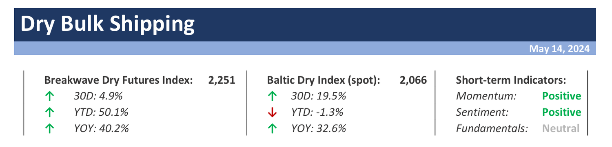
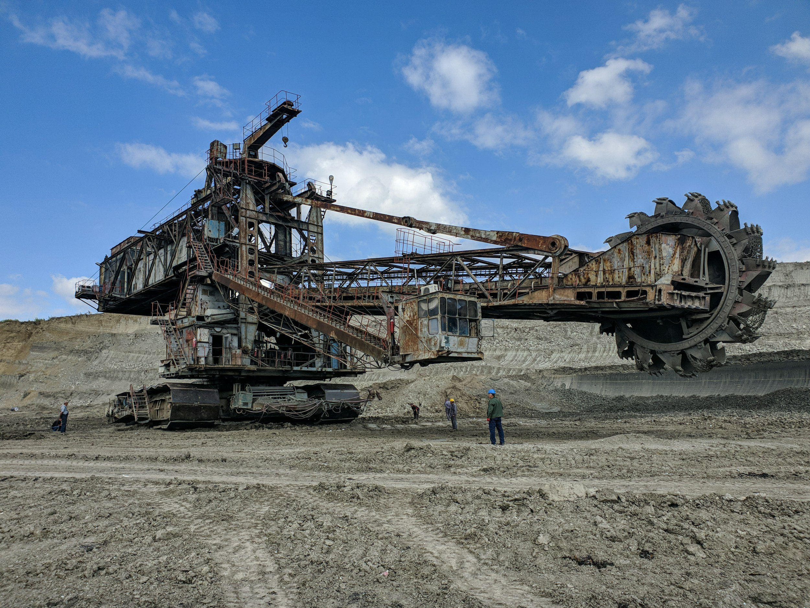

# Weekly Insights Review

**Date:** May 17, 2024  
**Publisher:** Breakwave Advisors | **Category:** Market Insights  
**Original URL:** [https://www.breakwaveadvisors.com/insights/2024/5/17/weekly-insights-review](https://www.breakwaveadvisors.com/insights/2024/5/17/weekly-insights-review)  

---

## Welcome to Our Weekly Insights Review

## Read Here Everything You Need to Know

**Dry Bulk Spot Rate Volatility Points to Ongoing Positional Imbalances Amidst Solid Volumes –**After bottoming in the high-teens, the Capesize Spot Index posted a**solid recovery**, pushing freight rates back towards the high-20,000 level,**in line with**where the**futures market**has been trading for weeks now.

[Read More](https://www.breakwaveadvisors.com/insights/2024514dry)

> **Figure 1: Dry+report+top**  
> **Interactive Data & Source:** [Breakwave Advisors Market Insights](https://www.breakwaveadvisors.com/insights/2024/5/13/baltic-indices-commenced-the-current-trading-week-with-a-quest-for-direction) | [Local Asset](file:///C:/Users/Dell/Github/Shipping/corpus/03-breakwave/insights/2024/assets/2024-05-17_weekly-insights-review_img_dry2breport2btop_a8e4c93fb865.png)

> **Figure 2: 011 Chrisea 24 01 24**  
> **Interactive Data & Source:** [Breakwave Advisors Market Insights](https://www.breakwaveadvisors.com/insights/2024/5/13/baltic-indices-commenced-the-current-trading-week-with-a-quest-for-direction) | [Local Asset](file:///C:/Users/Dell/Github/Shipping/corpus/03-breakwave/insights/2024/assets/2024-05-17_weekly-insights-review_img_011-chrisea-24-01-24_8977e75cc517.jpg)

## Baltic Indices Commenced the Current Trading Week with a Quest for Direction

Doric Weekly Market Insight

The cumulative volume of China's steel exports in the first four months of the year reached the highest level for the same period since 2016. This follows a strong performance in the January-March period, during which total exports hit an eight-year high.

> **Figure 3: Nissos Nikouria 4**  
> **Interactive Data & Source:** [Breakwave Advisors Market Insights](https://www.breakwaveadvisors.com/insights/2024/5/13/asset-price-ambiguity) | [Local Asset](file:///C:/Users/Dell/Github/Shipping/corpus/03-breakwave/insights/2024/assets/2024-05-17_weekly-insights-review_img_nissos-nikouria-4_967132817018.jpg)

## Asset Price Ambiguity

Gibson Tanker Market Report

VLCC asset prices appear to be caught in a paradoxical market scenario.

[Read More](https://www.breakwaveadvisors.com/insights/2024/5/13/asset-price-ambiguity)

> **Figure 4: Market Chart 4**  
> **Interactive Data & Source:** [Breakwave Advisors Market Insights](https://www.breakwaveadvisors.com/insights/2024/5/14/1bbo0t8vvlasaj6t8x0inogzg7domp) | [Local Asset](file:///C:/Users/Dell/Github/Shipping/corpus/03-breakwave/insights/2024/assets/2024-05-17_weekly-insights-review_img_image-asset_fb8e43d4f319.jpeg)

## Metals Gain As China Looks to Boost Stimulus Measures

Commodities Wrap

Supply side issues were the focus for energy and metals markets. The prospect of stimulus measures in China boosted sentiment across sectors.

> **Figure 5: Στιγμιότυπο Οθόνης 2024 05 15 114115**  
> **Interactive Data & Source:** [Breakwave Advisors Market Insights](https://www.breakwaveadvisors.com/insights/2024/5/15/usac-gasoline-demand-looking-better-than-margins-are-suggesting) | [Local Asset](file:///C:/Users/Dell/Github/Shipping/corpus/03-breakwave/insights/2024/assets/2024-05-17_weekly-insights-review_img_cea3cf84ceb9ceb3cebcceb9cf8ccf84cf85_de6460682e11.png)

## Usac Gasoline Demand Looking Better Than Margins Are Suggesting

Vortexa Freight Weekly

Global gasoline margins have weakened recently despite moving closer toward driving/gasoline season. We look at the recent downturn and what it means in the context of the changing refining dynamics in the Atlantic Basin.

> **Figure 6: Market Chart 6**  
> **Interactive Data & Source:** [Breakwave Advisors Market Insights](https://www.breakwaveadvisors.com/insights/2024/5/15/iron-ore-was-one-of-the-session-losers) | [Local Asset](file:///C:/Users/Dell/Github/Shipping/corpus/03-breakwave/insights/2024/assets/2024-05-17_weekly-insights-review_img_image-asset28129_94446043cb1c.jpeg)

## Iron Ore Was One of the Session Losers

The Fix - Global Market Update

The Baltic Dry Index declined for a fourth consecutive session on Tuesday, with all segments contributing to the headwinds amid generally softer demand. For the commodities, red dominated yesterday’s trading screens.

> **Figure 7: Market Chart 7**  
> **Interactive Data & Source:** [Breakwave Advisors Market Insights](https://www.breakwaveadvisors.com/insights/2024/5/15/panamax-market-insights) | [Local Asset](file:///C:/Users/Dell/Github/Shipping/corpus/03-breakwave/insights/2024/assets/2024-05-17_weekly-insights-review_img_image-asset28229_8e14766beb18.jpeg)

## Panamax Market Insights

Signal Ocean - Dry Weekly Market Monitor

The month of May presents challenges for the Capesize freight market prices, as uncertainties loom over Chinese macroeconomic fundamentals, potentially impacting future growth and demand.

[Read More](https://www.breakwaveadvisors.com/insights/2024/5/15/panamax-market-insights)

> **Figure 8: Market Chart 8**  
> **Interactive Data & Source:** [Breakwave Advisors Market Insights](https://www.breakwaveadvisors.com/insights/2024/5/16/no1wtz13cs03vxx5tbkjtfmz691yzt) | [Local Asset](file:///C:/Users/Dell/Github/Shipping/corpus/03-breakwave/insights/2024/assets/2024-05-17_weekly-insights-review_img_image-asset28329_692c400758d1.jpeg)

## China’s Weakened Crude Oil

Vortexa Freight Weekly

This week, in the East, we discuss falling VLCC utilisation to China and record-high LR2 global tonne-miles in April.

> **Figure 9: Market Chart 9**  
> **Interactive Data & Source:** [Breakwave Advisors Market Insights](https://www.breakwaveadvisors.com/insights/2024/5/16/oil-gains-amid-signs-of-stronger-demand) | [Local Asset](file:///C:/Users/Dell/Github/Shipping/corpus/03-breakwave/insights/2024/assets/2024-05-17_weekly-insights-review_img_image-asset28429_db9a9bd69f26.jpeg)

## Oil Gains Amid Signs of Stronger Demand

Commodities Wrap

A risk-on tone across markets was sparked by signs of falling inflation and a weaker USD. Renewed supply side issues also supported the gains.

> **Figure 10: Market Chart 10**  
> **Interactive Data & Source:** [Breakwave Advisors Market Insights](https://www.breakwaveadvisors.com/insights/2024/5/17/lmaejjhl32np15oz4y72du2v5g64lk) | [Local Asset](file:///C:/Users/Dell/Github/Shipping/corpus/03-breakwave/insights/2024/assets/2024-05-17_weekly-insights-review_img_image-asset28529_18117eccf045.jpeg)

## Even More Global Grain Exports Expected

From Commodore's Weekly Dry Bulk Reports

As we discussed in Commodore Research's most recent Weekly Dry Bulk Report (published before the start of every week), the United States Department of Agriculture (USDA) has released their first grain export forecast...

[Read More](https://www.breakwaveadvisors.com/insights/2024/5/17/lmaejjhl32np15oz4y72du2v5g64lk)

> **Figure 11: Market Chart 11**  
> **Interactive Data & Source:** [Breakwave Advisors Market Insights](https://www.breakwaveadvisors.com/insights/2024/5/17/oil-gains-as-market-contemplates-opecs-next-move) | [Local Asset](file:///C:/Users/Dell/Github/Shipping/corpus/03-breakwave/insights/2024/assets/2024-05-17_weekly-insights-review_img_image-asset28629_1326bb5abf3a.jpeg)

## Oil Gains As Market Contemplates Opec's Next Move

Commodities Wrap

Investor sentiment remained buoyed by the prospect of easing US monetary policy. Ongoing supply side issues in energy and metal markets also added support.

> **Figure 12: Market Chart 12**  
> **Interactive Data & Source:** [Breakwave Advisors Market Insights](https://www.breakwaveadvisors.com/insights/2024/5/17/vlcc-ag-china-tonne-days) | [Local Asset](file:///C:/Users/Dell/Github/Shipping/corpus/03-breakwave/insights/2024/assets/2024-05-17_weekly-insights-review_img_image-asset28729_3d03760e4fe7.jpeg)

## VLCC AG-China Tonne Days

Signal Ocean - Tanker Weekly Market Monitor

At the end of the second week of May, the demand growth for dirty tonne-days continues to challenge the solid improvement in market prices, particularly on the VLCC MEG-China route.

---

**Tags:** Shipping, Markets, Economy  
