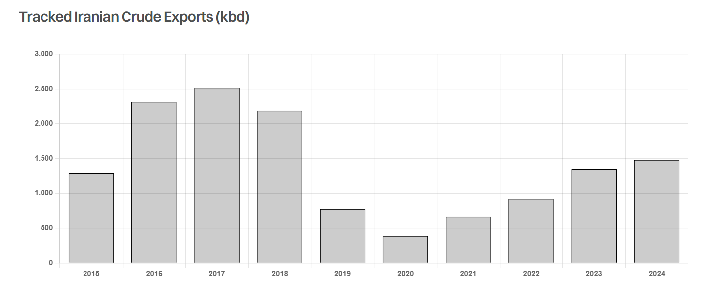

# Dark Flows

**Date:** May 20, 2024  
**Publisher:** Breakwave Advisors | **Category:** Market Insights  
**Original URL:** [https://www.breakwaveadvisors.com/insights/2024/5/20/dark-flows](https://www.breakwaveadvisors.com/insights/2024/5/20/dark-flows)  

---

> **Figure 1: Projects**  
> **Interactive Data & Source:** [Gibsons Co](https://www.gibsons.co.uk/market-reports) | [Local Asset](file:///C:/Users/Dell/Github/Shipping/corpus/03-breakwave/insights/2024/assets/2024-05-20_dark-flows_img_projects_41577ba61ed3.jpg)

Despite operating under long running sanctions, Iranian crude exports continue to flow. The large shadow tanker fleet as well as the network of traders and financial intermediaries that make this trade possible have occasionally faced sanctions enforcement. US Treasury officials have recently been in Malaysia and Singapore to have discussions with local players about the ongoing presence of large-scale Ship-to-Ship (STS) operations of sanctioned Iranian, Venezuelan crudes off the Malaysian coast. The basis of this latest action involves concerns that Iran is using this region to generate revenue to finance its proxies and terrorism in the Middle East.

Iran’s true level of crude exports is nearly impossible to identify given the opaque and clandestine shipping practices used. However, AIS data shows a sustained rise in exports since 2020 from 390 kbd to 1.5 mbd as of this year, with some barrels likely still missing. The vast majority of Iranian crude is transhipped via STS off Malaysia to China. The impact being, Malaysia on paper is exporting more crude than it produces.

With export volumes growing, Iran has been able to ramp up crude production despite sanctions on its upstream oil sector, with the IEA estimating current production in the region of 3.3 mbd (versus 2.4 mbd in 2021), which would support the view that Iranian crude exports could be higher than what is tracked even considering domestic consumption.

For the tanker sector, an increase in sanctions enforcement on the shipment of Iranian oil would in theory make this trade more difficult. However, it remains to be seen how much impact this will really have, given the time this parallel market has had to develop and become resistant to existing sanctions. Gibson’s vessel database indicates at least 90 VLCCs are dedicated to servicing Iranian exports (including the NITC fleet), representing approximately 10% of the global VLCC fleet. For the Suezmax sector, there are at least 34 vessels involved or 5% of the fleet. However, as mentioned with the case of estimating the volume of Iranian crude exports, the number of vessels could be higher.

Even if greater sanctions enforcement attempts to slow the growth of the Iranian shadow fleet, a considerable number of VLCCs are due to reach 20 years of age in the coming years. Whilst scrapping remains unattractive relative to the residual value on offer in sanctioned routes, this trade is likely to be highly lucrative until sanctions relief emerges. However, this does not seem likely at present, nor on the horizon. Time will tell how this trade develops and what eventually happens to this large pool of dark tankers.

> **Figure 2: Στιγμιότυπο Οθόνης 2024 05 20 104816**  
> **Interactive Data & Source:** [Gibsons Co](https://www.gibsons.co.uk/market-reports) | [Local Asset](file:///C:/Users/Dell/Github/Shipping/corpus/03-breakwave/insights/2024/assets/2024-05-20_dark-flows_img_cea3cf84ceb9ceb3cebcceb9cf8ccf84cf85_52f2d1bdfd1f.png)

Data source:[Gibson Shipbrokers](https://www.gibsons.co.uk/market-reports)

---

**Tags:** Tankers, Shipping, Crude Oil  
