# Enjoy the rally. What can possibly go wrong?

**Date:** May 21, 2024  
**Publisher:** Breakwave Advisors | **Category:** Market Insights  
**Original URL:** [https://www.breakwaveadvisors.com/insights/2024/5/21/06bdpcpoomito3yncev0ck4dlcc1nr](https://www.breakwaveadvisors.com/insights/2024/5/21/06bdpcpoomito3yncev0ck4dlcc1nr)  

---

The three things investors should know this week:

1. The US economy is still growing at a healthy pace, but slightly slower than anticipated. This has allowed investors to price in more rate cuts this year, and drive a bond and equity rally in the last few days.
2. Is this exuberant? While the Fed keeps mum, we don’t see any of the usual hallmarks of irrational exuberance.
3. However, allocating assets isn’t about getting market momentum right. Looking at factors that drive asset allocation decisions, we don’t see clear reasons why investors would raise their risk profiles either.

*By*[*George Lagarias*](https://www.linkedin.com/in/george-lagarias-mba-3baa769/)

The Dow broke the 40,000 limit last week. This is five times higher than its price during the depths of the Global Financial Crisis just fifteen years ago.

Global stocks and bonds rallied last week, on the back of slightly lower inflation and a string of relatively disappointing news for the US economy, which caused traders to increase their bets that the Fed could cut rates twice by the end of the year.

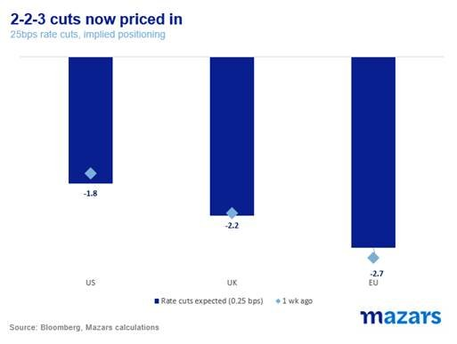

> **Figure 1: Market Chart 1**  
> **Interactive Data & Source:** [Bloomberg News](https://www.bloomberg.com/news/articles/2024-05-17/gamestop-amc-hertz-meme-stocks-are-back-or-are-they?srnd=all) | [Local Asset](file:///C:/Users/Dell/Github/Shipping/corpus/03-breakwave/insights/2024/assets/2024-05-21_06bdpcpoomito3yncev0ck4dlcc1nr_img_image012_a8b2192c265d.jpg)

So this is the picture thus far:

- The US economy is strong, but recent data (GDP, employment, retail sales) suggest that it may be just not strong enough to divert the Fed from cutting rates this year. This is music to the ears not only of traders but of the BoE and the ECB who are more eager to begin reducing their own rate of interest.

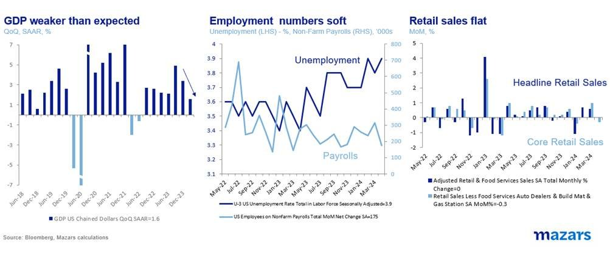

> **Figure 2: Market Chart 2**  
> **Interactive Data & Source:** [Bloomberg News](https://www.bloomberg.com/news/articles/2024-05-17/gamestop-amc-hertz-meme-stocks-are-back-or-are-they?srnd=all) | [Local Asset](file:///C:/Users/Dell/Github/Shipping/corpus/03-breakwave/insights/2024/assets/2024-05-21_06bdpcpoomito3yncev0ck4dlcc1nr_img_image013_dc8cac49f0d6.jpg)

- Inflation is dropping, however slowly.

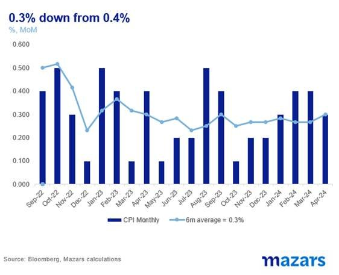

> **Figure 3: Market Chart 3**  
> **Interactive Data & Source:** [Bloomberg News](https://www.bloomberg.com/news/articles/2024-05-17/gamestop-amc-hertz-meme-stocks-are-back-or-are-they?srnd=all) | [Local Asset](file:///C:/Users/Dell/Github/Shipping/corpus/03-breakwave/insights/2024/assets/2024-05-21_06bdpcpoomito3yncev0ck4dlcc1nr_img_image014_f7f7d91cc1fe.jpg)

- Equity momentum is positive. US Equities are at or near all-time highs. European equities are catching up. Last week we even witnessed a meme stock rally.

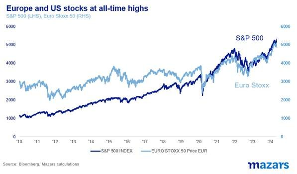

> **Figure 4: Market Chart 4**  
> **Interactive Data & Source:** [Bloomberg News](https://www.bloomberg.com/news/articles/2024-05-17/gamestop-amc-hertz-meme-stocks-are-back-or-are-they?srnd=all) | [Local Asset](file:///C:/Users/Dell/Github/Shipping/corpus/03-breakwave/insights/2024/assets/2024-05-21_06bdpcpoomito3yncev0ck4dlcc1nr_img_image015_1331d18486ad.jpg)

- Bonds have been weak all year but last week’s news finally allowed them to rebound

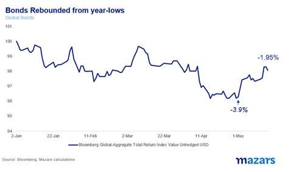

> **Figure 5: Market Chart 5**  
> **Interactive Data & Source:** [Bloomberg News](https://www.bloomberg.com/news/articles/2024-05-17/gamestop-amc-hertz-meme-stocks-are-back-or-are-they?srnd=all) | [Local Asset](file:///C:/Users/Dell/Github/Shipping/corpus/03-breakwave/insights/2024/assets/2024-05-21_06bdpcpoomito3yncev0ck4dlcc1nr_img_image016_f793a0536a59.jpg)

In other words, this is the perfect macroeconomic environment for traders. So what can go wrong? What is the key risk to the current bout of exuberance? The market isn’t presently flashing any red signs.

Despite the meme-stock rally (“Roaring Kitty” a.k.a. Keith Gill made an anodyne tweet which caused GameStop and AMC to[rally](https://www.bloomberg.com/news/articles/2024-05-17/gamestop-amc-hertz-meme-stocks-are-back-or-are-they?srnd=all)), there’s no evidence of “irrational exuberance”. Equity valuations are not too high versus history (earnings in the US[rising by 5.7%](../pdfs/2024-05-21_06bdpcpoomito3yncev0ck4dlcc1nr_earningsinsight-051724a_4efa5c0c717a.pdf)for the year have been supportive), and leveraged bets on the S&P are barely net short.

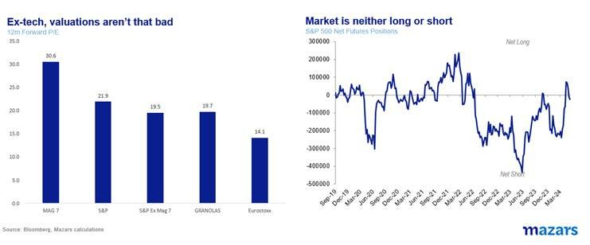

> **Figure 6: Market Chart 6**  
> **Interactive Data & Source:** [Pipelinecomics](https://www.pipelinecomics.com/asterix-v19-asterix-and-the-soothsayer/) | [Local Asset](file:///C:/Users/Dell/Github/Shipping/corpus/03-breakwave/insights/2024/assets/2024-05-21_06bdpcpoomito3yncev0ck4dlcc1nr_img_image017_361b661ae454.jpg)

Seasonality is an issue, and the coming summer could be a warning sign, but history simply doesn’t support “Sell in May and go Away”. On average, US equities have been positive over the period. Since 2009, in fact, summer months have contributed more than their fair share towards the index’s annual performance.

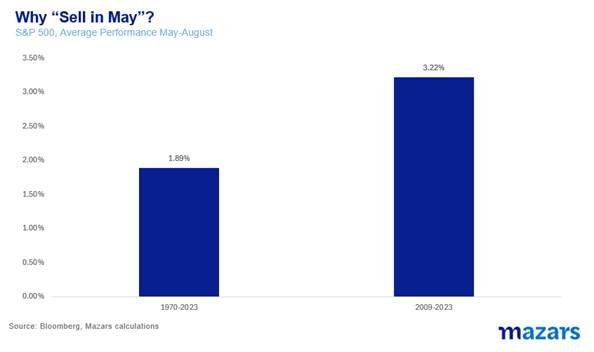

> **Figure 7: Market Chart 7**  
> **Interactive Data & Source:** [Pipelinecomics](https://www.pipelinecomics.com/asterix-v19-asterix-and-the-soothsayer/) | [Local Asset](file:///C:/Users/Dell/Github/Shipping/corpus/03-breakwave/insights/2024/assets/2024-05-21_06bdpcpoomito3yncev0ck4dlcc1nr_img_image018_7d0f0dddc1f8.jpg)

Inflation being somewhat misread could be a culprit for a correction. After all, it was really goods inflation that pushed the headline number lower. Services inflation remains flat at levers that are higher than those acceptable by the Fed. But the reality is that prices are coming down, even at a snail’s pace. And the Fed has shown no signs of wanting to upset the market pre-election.

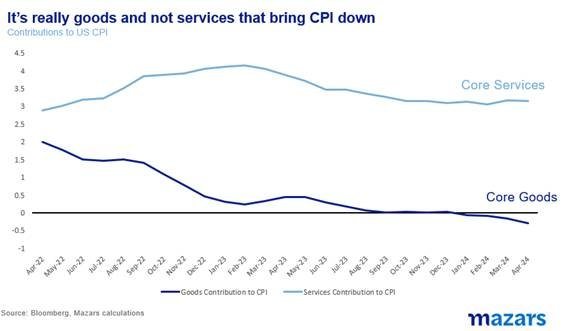

> **Figure 8: Market Chart 8**  
> **Interactive Data & Source:** [Pipelinecomics](https://www.pipelinecomics.com/asterix-v19-asterix-and-the-soothsayer/) | [Local Asset](file:///C:/Users/Dell/Github/Shipping/corpus/03-breakwave/insights/2024/assets/2024-05-21_06bdpcpoomito3yncev0ck4dlcc1nr_img_image019_944e180e9e86.jpg)

A recent flair-up in geopolitical turbulence has not translated into any sort of oil volatility, which is probably indicative of OPEC’s intentions. It is quite possible that shuttle diplomacy between Tel-Aviv and Riad and communication lines with Tehran are somewhat paying off. (I suspect that by the time his tenure ends, 62-year-old US Secretary of State Anthony Blinken might look older than his boss…).

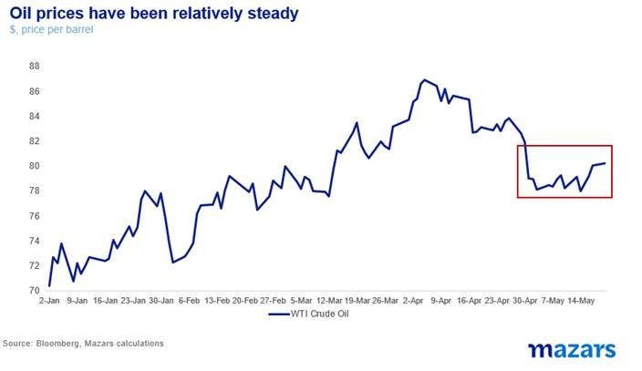

> **Figure 9: Market Chart 9**  
> **Interactive Data & Source:** [Pipelinecomics](https://www.pipelinecomics.com/asterix-v19-asterix-and-the-soothsayer/) | [Local Asset](file:///C:/Users/Dell/Github/Shipping/corpus/03-breakwave/insights/2024/assets/2024-05-21_06bdpcpoomito3yncev0ck4dlcc1nr_img_image020_60f1b3dd60c6.jpg)

So what can go wrong? Very few of the known knowns to be sure (valuations, earnings, Fed). It’s down to the known unknowns (war, inflation) to take a bad turn and of course the unknown unknowns.

But here’s the shocker. For all the analysis, we don’t invest by predicting the future. Why? Well. For one we don’t know it. Twelve thousand years of recorded human civilization (and possibly a multitude in unrecorded history) have established the existence of and trust in[soothsayers](https://www.pipelinecomics.com/asterix-v19-asterix-and-the-soothsayer/). But we don’t have one recorded instance of a person knowing the future. So we can’t invest like we do.

More importantly, we don’t know what we don’t know. We assume some risk is there. Instinctively, the more exuberance, the more we suspect that something is lurking in the corner.

But that’s still not how we invest money. The determinant is very simple.

We make some assumptions about the state of risk, and then ask: am I getting paid to take it?

Let’s look at equity risk.

Despite not-toppish valuations, US equity risk premiums (the differential between the earnings yield and bond yields) suggest that investors aren’t getting paid for assuming US equity risk. UK risk premia are in the same neighbourhood. Only EU stocks, for the time being, appear to compensate investors, possibly simply because the risk-free rate is lower.

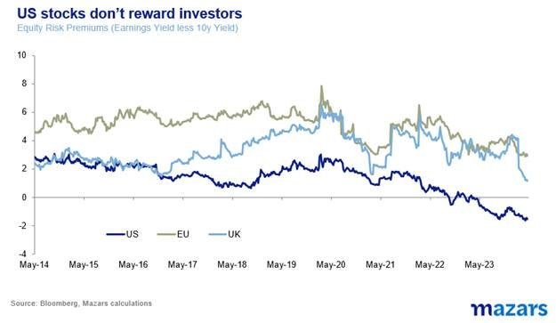

> **Figure 10: Market Chart 10**  
> **Interactive Data & Source:** [Bbc](https://www.bbc.com/news/business-69004520) | [Local Asset](file:///C:/Users/Dell/Github/Shipping/corpus/03-breakwave/insights/2024/assets/2024-05-21_06bdpcpoomito3yncev0ck4dlcc1nr_img_image021_9a0fdf9a3d22.jpg)

If we are not being paid for equities, are we then paid for bonds?

Well, again things are less clear. Corporate bond spreads, a determinant of the relative value of corporate to government debt which is perceived to be risk-free, are pretty thin.

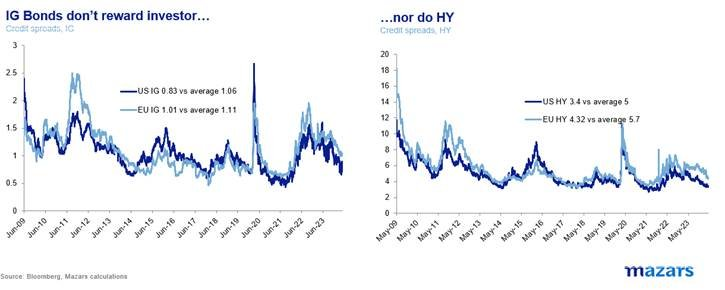

> **Figure 11: Market Chart 11**  
> **Interactive Data & Source:** [Bbc](https://www.bbc.com/news/business-69004520) | [Local Asset](file:///C:/Users/Dell/Github/Shipping/corpus/03-breakwave/insights/2024/assets/2024-05-21_06bdpcpoomito3yncev0ck4dlcc1nr_img_image022_2a17f6a3db4d.jpg)

So we are left with Developed Market sovereign debt. Is that worth the risk?

While yields are definitely higher than they have been in over a decade, there we are faced with long risks, namely the twin slow-moving trains of exponentially rising debt and uncertainty over inflation. China might be exporting deflation now, but last week’s[new tariffs](https://www.bbc.com/news/business-69004520)by the Biden administration are inherently inflationary, even if this takes some time for the figures to be priced in.

And therein lies the conundrum. We don’t see major risks playing out, but we aren’t certain investors are paid enough to materially increase risk either. The environment for major tactical asset allocation decisions is, to say the least, difficult. Outperforming the index will probably still rest on long-term strategic choices (Strategic Asset Allocation) and careful security selection.

---

**Tags:** Economy, Markets, Macro  
