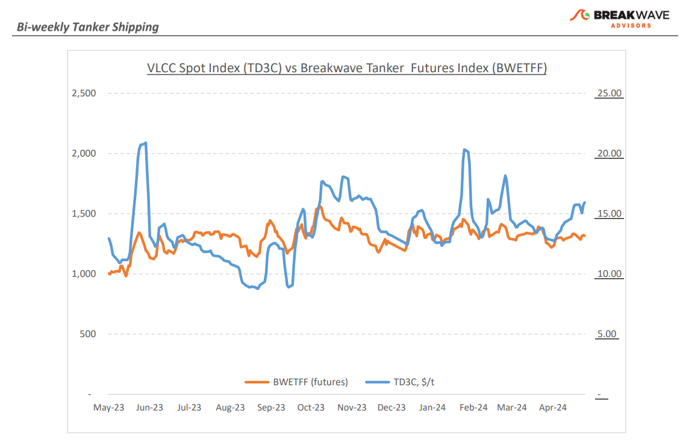
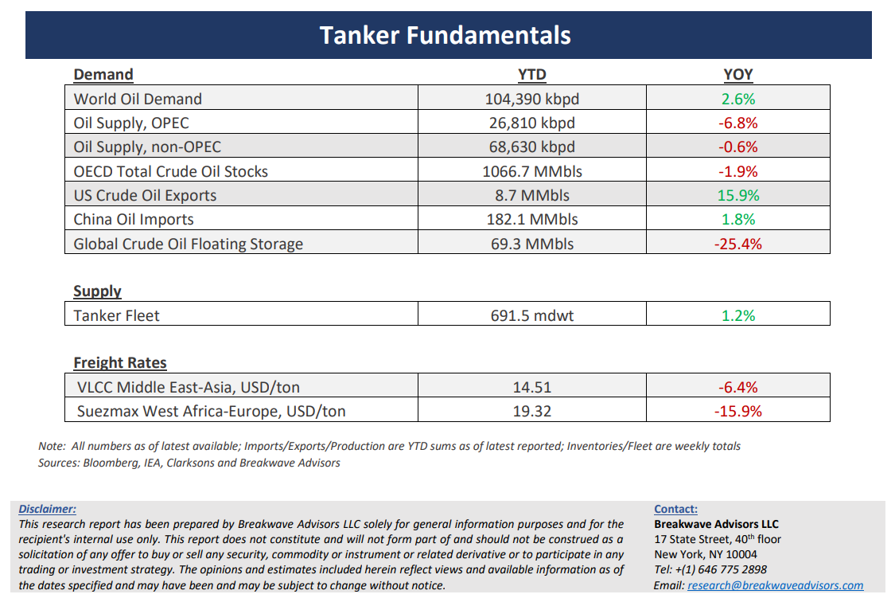

# Breakwave Bi-Weekly Tanker Report - May 21, 2024

**Date:** May 21, 2024  
**Publisher:** Breakwave Advisors | **Category:** Market Insights  
**Original URL:** [https://www.breakwaveadvisors.com/insights/2024521wet](https://www.breakwaveadvisors.com/insights/2024521wet)  

---

> **Figure 1: Tankerreporttop**  
> [Local Asset](file:///C:/Users/Dell/Github/Shipping/corpus/03-breakwave/insights/2024/assets/2024-05-21_2024521wet_img_tankerreporttop_9c275a576ff7.png)

**· The VLCC Market Remains Well Supported as Attention Turns to Summer Demand –**As the end of May approaches, the VLCC freight market has remained on a slight upward trajectory, with the benchmark rates from the Middle East Gulf to China up approximately 15% since the beginning of the month. While freight rates when measured on a time-chartered-equivalent basis have shown a significant improvement of ~50% versus last year, it remains to be seen if this recent stability will be long-lasting, which in turn will be uncharacteristic of a rather volatile shipping sector. In the short term, as the market is currently navigating the transition period between May and June stems in the Middle East Gulf (MEG) and as cargo activity has so far been subdued, there is an anticipation of potential upward pressure once June cargoes come into play, something that the freight futures market is also currently expecting. Once again, the supply of vessels is emerging as a critical determinant behind the fluctuations in market prices, influencing both upward and downward pressure, and currently this is also the case as the interplay between demand flows and tonnage availability will be pivotal in defining the market trajectory as we transition into June. With Chinese SPR inventories beginning to rise from recent multi-year lows, in the process adding some additional demand for tanker shipping, combined with the upcoming OPEC+ meeting in focus, the medium-term tanker demand trend remains favorable, something that is not currently fully priced in the futures market, in our view.

**· As Commodity Price Volatility Increases, Oil Prices Remain Subdued –**The recent spike in commodity price volatility across most sectors (see precious metals, base metals, agricultural commodities, etc.) has so far failed to translate to higher oil price volatility. Inventories remain at rather elevated levels and global oil supply is projected to increase by at least 0.5 million barrels per day (mbpd) to a new record high, yet there remains little concern regarding a shortage of crude oil, at least on a fundamental basis. Oil demand growth, which has been the subject of intense debate especially between the two main oil forecasters, namely OPEC and IEA, seems will end somewhere in the middle of the forecasted range of IEA’s low of 1.1 mbpd and OPEC’s high of 2.25 mbpd for 2024. With the broader geopolitical headlines a touch calmer when it comes to energy supplies, traders have little to worry about, even if the recent Chinese data points to some economic recovery for the world’s second largest economy, something that has pushed prices for other related commodities to multi-year highs. We also remain neutral on the direction of oil prices as we see little reason take aside on a market that appears well balanced for the time being.

**· Our Long-term View****–**The tanker market is recovering from a long period of staggered rates as the growth in new vessel supply shrinks while oil demand is recovering in line with the global economy. A historically low orderbook combined with favorable demand fundamentals should continue to support increased spot rate volatility, which combined with the ongoing geopolitical turmoil, should support freight rates in the medium to long term.

> **Figure 2: Tankerreportchart**  
> [Local Asset](file:///C:/Users/Dell/Github/Shipping/corpus/03-breakwave/insights/2024/assets/2024-05-21_2024521wet_img_tankerreportchart_8d052a747f04.png)

> **Figure 3: Tankerreportbottom**  
> [Local Asset](file:///C:/Users/Dell/Github/Shipping/corpus/03-breakwave/insights/2024/assets/2024-05-21_2024521wet_img_tankerreportbottom_e47c9f13dd2b.png)

### Subscribe:
