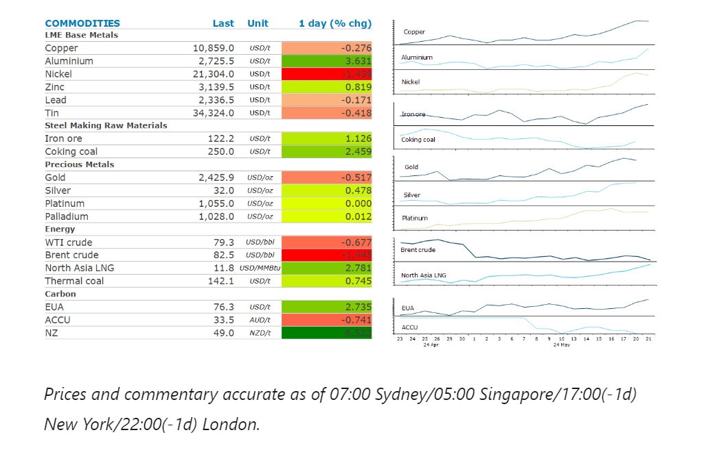
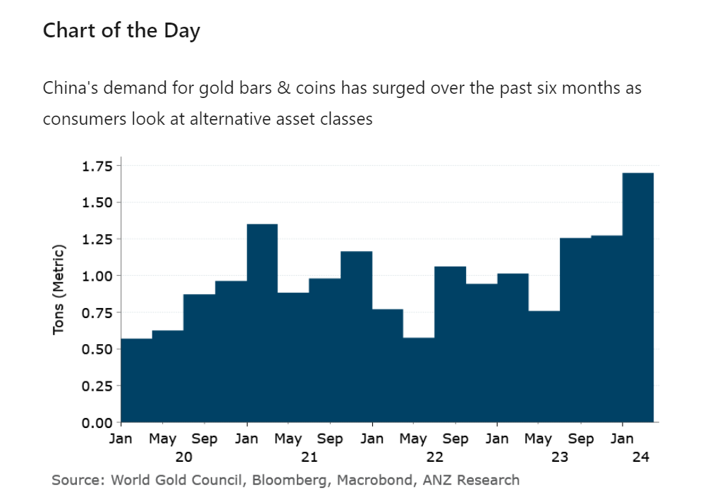

# Metals rally pauses as market reassess fundamentals

**Date:** May 22, 2024  
**Publisher:** Breakwave Advisors | **Category:** Market Insights  
**Original URL:** [https://www.breakwaveadvisors.com/insights/2024/5/22/metals-rally-pauses-as-market-reassess-fundamentals](https://www.breakwaveadvisors.com/insights/2024/5/22/metals-rally-pauses-as-market-reassess-fundamentals)  

---

A rally across metals cooled amid fears they had run ahead of fundamentals. More hawkish Fed speakers also weighed on sentiment.

*By*[*Daniel Hynes*](https://www.linkedin.com/in/dahynes/)

> **Figure 1: Στιγμιότυπο Οθόνης 2024 05 22 102919**  
> [Local Asset](file:///C:/Users/Dell/Github/Shipping/corpus/03-breakwave/insights/2024/assets/2024-05-22_metals-rally-pauses-as-market-reassess-fundamentals_img_cea3cf84ceb9ceb3cebcceb9cf8ccf84cf85_08c16e14060d.png)

### Market Commentary

**Gold**edged lower amid more hawkish commentary from Federal Reserve officials. Christopher Waller said he needs to see several more months of progress on inflation to support rate cuts. Raphael Bostic said the Fed is rethinking its view on the neutral policy rate. A soft US inflation report last week saw investors increase their bets on a potential rate cut in September. Recent gains are also having an impact on physical demand. China’s gold imports fell 30% m/m in April to 136t, the lowest total for the year. This followed a record high of 566t in Q1. Demand for gold bars and coins rose 67% y/y to 113t during the quarter. Bucking the trend was investor flows into gold-backed ETFs. Holdings of physical metal have gained five days in a row, according to Bloomberg data.

**Copper’s**rally cooled amid concerns it may be running ahead of weak fundamentals. Physical traders have been warning the demand remains tepid, especially in China where inventories are high, and suppliers of copper wire and rods have been cutting output. China’s beleaguered property sector offered little support. Land sales slumped to an eight year low, a key revenue source for local governments. Nevertheless, the copper concentrate market remains tight, despite a[**recent improvement in copper mine supply**](../pdfs/2024-05-22_metals-rally-pauses-as-market-reassess-fundamentals_commodity-tracker-out-of-favour_312e38584001.pdf). Lower copper treatment charges will likely weigh on refined copper output in China.**Aluminium**bucked the trend to move higher after Rio Tinto declared force majeure on alumina cargoes from its refineries in Queensland. The aluminium producer blamed gas shortages that are impacting power at its operations. This raised fears that lower feedstock could lead impact the production of refined metal. A cancellation of aluminium warrants also supported the move. A total of 81,500t are expected to be withdrawn from the London Metal Exchange.

**Iron ore**extended this week’s gains as recent support measures for China’s property sector continues to boost sentiment. This is despite data showing slack construction activity pushed steel demand 9% y/y lower in April. Declining steel mill profitability leaves little room for restart of idle capacity. Strong steel exports (+25% ytd) are mitigating sluggish domestic demand.

**North Asian LNG**prices rose to its highest level this year as resilient summer buying continues. Prices have risen more than 10% over the past week as importers such as Japan and South Korea restock inventories ahead of the Northern Hemisphere summer. A heatwave across the region is raising fears of stronger cooling demand. Even importers in India, where gas plays a minor role in the power mix, are buying any available cargoes. The scramble for LNG cargoes has been exacerbated by disruptions to supply in Malaysia and Australia. This spurred gains in the**European market**. Benchmark futures gained more than 3.4% amid the renewed competition for LNG across the globe.

**Crude oil**prices dropped amid signs of weakness in the physical market. The premium for spot Brent crude over front month futures fell to its lowest level since January. Refinery margins in the US also fell sharply. US gasoline demand is seasonally tracking at its lowest since 2020.

> **Figure 2: Στιγμιότυπο Οθόνης 2024 05 22 103043**  
> **Interactive Data & Source:** [Linkedin](https://www.linkedin.com/newsletters/commodities-wrap-6692196755876012032/?fbclid=IwAR3kiXJqZdxmp9ZcRwBNI7FsBySI-XSC0pfPur1qzjt7OZp7PTE59Tsl1QI) | [Local Asset](file:///C:/Users/Dell/Github/Shipping/corpus/03-breakwave/insights/2024/assets/2024-05-22_metals-rally-pauses-as-market-reassess-fundamentals_img_cea3cf84ceb9ceb3cebcceb9cf8ccf84cf85_0f403106a8c0.png)

Data source:[Commodities Wrap](https://www.linkedin.com/newsletters/commodities-wrap-6692196755876012032/?fbclid=IwAR3kiXJqZdxmp9ZcRwBNI7FsBySI-XSC0pfPur1qzjt7OZp7PTE59Tsl1QI)

---

**Tags:** Commodities, Economy, Markets  
