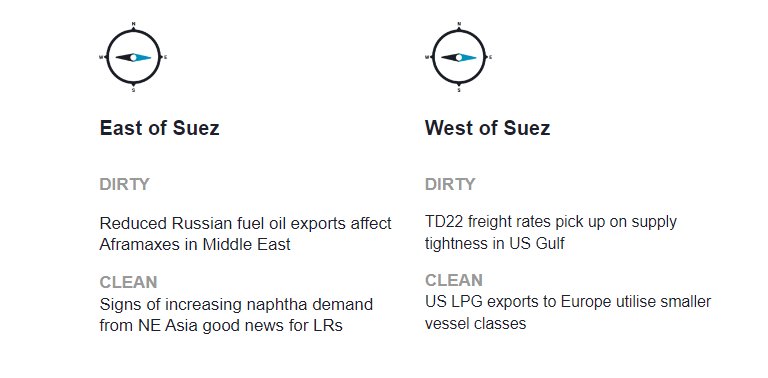
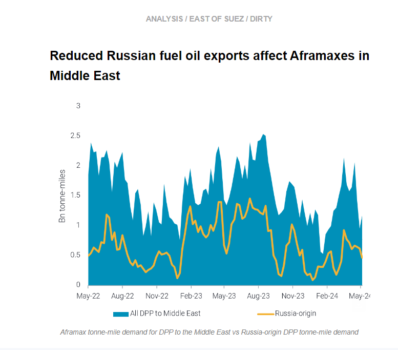
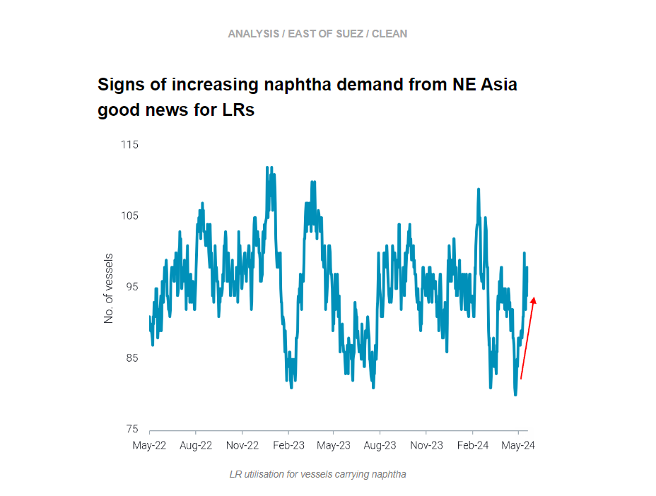
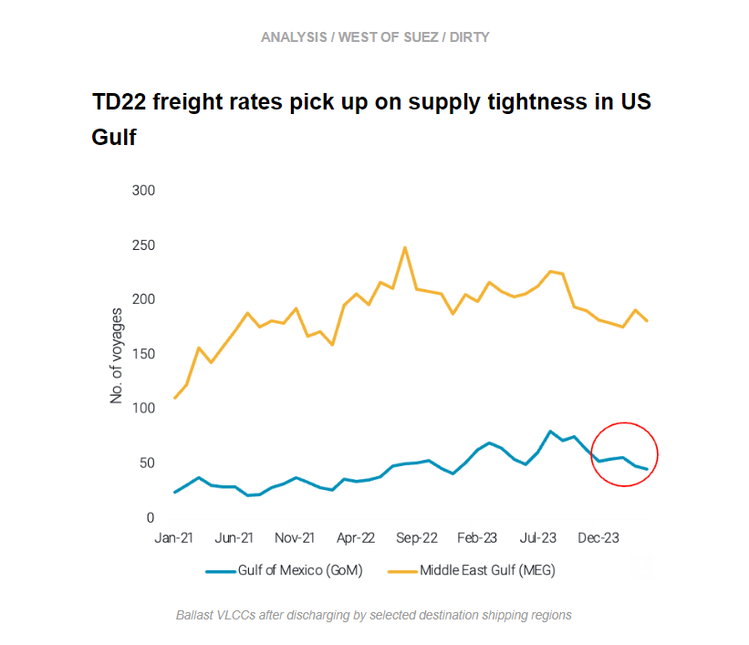
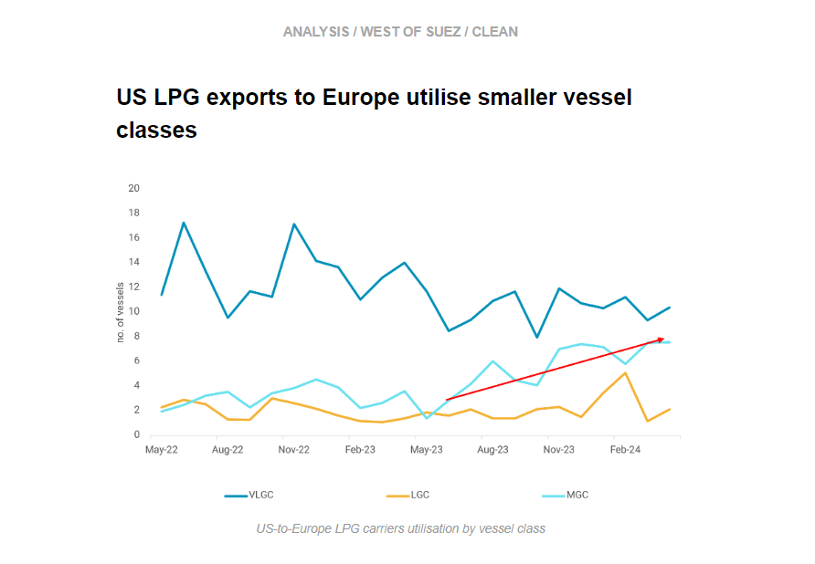

# Indications of a tightening in the fuel oil market

**Date:** May 23, 2024  
**Publisher:** Breakwave Advisors | **Category:** Market Insights  
**Original URL:** [https://www.breakwaveadvisors.com/insights/2024/5/23/indications-of-a-tightening-in-the-fuel-oil-market](https://www.breakwaveadvisors.com/insights/2024/5/23/indications-of-a-tightening-in-the-fuel-oil-market)  

---

This week, in the East, we discuss why reduced Russian fuel oil exports going to the Middle East affect the region’s Aframax supply. On the clean side, we investigate signs of increasing naphtha demand from East Asia and how it will affect LRs. In the West, we look at why the TD22 rally is supply-side driven, and we explore the increasing utilisation of MGCs for US LPG exports going to Europe.

*By*[*Mary Melton*](https://www.linkedin.com/search/results/all/?fetchDeterministicClustersOnly=true&heroEntityKey=urn%3Ali%3Afsd_profile%3AACoAABXVyecBtg-pRnIrZe0BoWk0ygPiUfbvhsw&keywords=mary%20melton&origin=RICH_QUERY_SUGGESTION&position=0&searchId=40e8d7d2-c4d0-4022-81e7-176f6eba418b&sid=H_Y&spellCorrectionEnabled=false)

> **Figure 1: Στιγμιότυπο Οθόνης 2024 05 23 103258**  
> **Interactive Data & Source:** [Marketingmail Vortexa](https://marketingmail.vortexa.com/ODM3LU1aRS01NzgAAAGTP5NDS1fhmuTpvfnF9DFEpiZyy-mKSp3QgfioGxar9i106iYfdOJqayf8HciDwm3pkktasWg=) | [Local Asset](file:///C:/Users/Dell/Github/Shipping/corpus/03-breakwave/insights/2024/assets/2024-05-23_indications-of-a-tightening-in-the-fuel-oil-market_img_cea3cf84ceb9ceb3cebcceb9cf8ccf84cf85_a05cda143870.png)

> **Figure 2: Στιγμιότυπο Οθόνης 2024 05 23 103321**  
> **Interactive Data & Source:** [Marketingmail Vortexa](https://marketingmail.vortexa.com/ODM3LU1aRS01NzgAAAGTP5NDS1fhmuTpvfnF9DFEpiZyy-mKSp3QgfioGxar9i106iYfdOJqayf8HciDwm3pkktasWg=) | [Local Asset](file:///C:/Users/Dell/Github/Shipping/corpus/03-breakwave/insights/2024/assets/2024-05-23_indications-of-a-tightening-in-the-fuel-oil-market_img_cea3cf84ceb9ceb3cebcceb9cf8ccf84cf85_47625bea97e3.png)

- [Lower Russian HSFO exports](https://marketingmail.vortexa.com/ODM3LU1aRS01NzgAAAGTP5NDS1fhmuTpvfnF9DFEpiZyy-mKSp3QgfioGxar9i106iYfdOJqayf8HciDwm3pkktasWg=)in March and April (an impact of Ukrainian drone strikes on refineries) appear to have solidified the notable reduction in 2024 of these volumes going to the Middle East compared to last year. This has translated to less[Aframax tonne-mile demand for DPP going to the Middle East](https://marketingmail.vortexa.com/ODM3LU1aRS01NzgAAAGTP5NDTGnItm57XwN1CsGC6olTHlLXRDrzQQdxNpio98aSe7rqlbCJDv9ti9tLpdb4gY4QMH4=), although intra-Middle East Aframax utilisation is healthy.

- Although a notable pick-up in tonne-mile demand did occur in March, this is much lower than last year’s seasonal pickup. After an increase in tonne-miles for Russia-origin Aframaxes beginning early March, demand is already declining. High imports of Iranian fuel oil into the region in April are to some extent replacing the Russian volumes.
- Reduced arrivals of Aframaxes in the Middle East led to a decline in[prompt tonnage availability](https://marketingmail.vortexa.com/ODM3LU1aRS01NzgAAAGTP5NDTGpdJT4T-6d8_WkdiQBDOLmlbZcC2n_Px_6rozBTIS88UZtTJGbjVRs2E17FNSTjNp8=)in the region and therefore potentially less vessel supply available for fuel oil exports to Asia. This is occurring at the same time of increasing indications of a tightening in the fuel oil market, as[Singapore net fuel oil exports](https://marketingmail.vortexa.com/ODM3LU1aRS01NzgAAAGTP5NDS3VYRMvcgYnx7Nb4Ic27iiHV2i7a9VKPcRuDQ9ZcxA7cQQn9NaSJM54MM18hqIsce2M=)have declined due to lower imports of Russian and Brazilian volumes.

> **Figure 3: Στιγμιότυπο Οθόνης 2024 05 23 103348**  
> **Interactive Data & Source:** [Marketingmail Vortexa](https://marketingmail.vortexa.com/ODM3LU1aRS01NzgAAAGTP5NDS0Tl1LD_PaK1a5tGMlKMzIFHoT34Um3F8j2cSP9ERU-ywW_jBmYjluksEDq5RIJyoq0=) | [Local Asset](file:///C:/Users/Dell/Github/Shipping/corpus/03-breakwave/insights/2024/assets/2024-05-23_indications-of-a-tightening-in-the-fuel-oil-market_img_cea3cf84ceb9ceb3cebcceb9cf8ccf84cf85_5c110ba32e71.png)

- A steady uptick in LR freight rates for naphtha MEG-to-NE Asia ([TC1](https://marketingmail.vortexa.com/ODM3LU1aRS01NzgAAAGTP5NDS0Tl1LD_PaK1a5tGMlKMzIFHoT34Um3F8j2cSP9ERU-ywW_jBmYjluksEDq5RIJyoq0=),[TC5](https://marketingmail.vortexa.com/ODM3LU1aRS01NzgAAAGTP5NDTHvty0IpD6zqNqziRRoXlkBHc_g4HjrhqS24PrBOPdo186t8nYwOi_818QIyEt1mp8g=)) are pointing to a comeback in demand on this route. Upward momentum in rates is not supply-side driven, as[prompt vessel supply](https://marketingmail.vortexa.com/ODM3LU1aRS01NzgAAAGTP5NDTAsPTwQfkqCkxXBytVYQBEcxwUrSJYwB5pDO56dUwtsLcyxsPz5bktG5o0F6Yl4f7T4=)in the region is steady and European demand for MEG diesel has softened.

- A few indicators point to healthy fundamentals for naphtha demand from NE Asia moving forward, which will benefit the LR segment. Steam crackers are returning from maintenance, which is likely prompting increased enquiries and fixing activity in the Middle East. There are questions around whether the same volume of naphtha exports out of the UAE will be possible as the Ruwais refinery crude slate turns heavier. However, it is likely that the other MEG grassroots refineries will be able to cover demand requirements.
- Even if Asia’s naphtha demand is not all fulfilled by the MEG, a currently open arbitrage for naphtha from the Med to NE Asia (Argus) will encourage Asian demand. Additionally, utilisation of[LRs carrying Russian naphtha](https://marketingmail.vortexa.com/ODM3LU1aRS01NzgAAAGTP5NDS_Ly01Pmcee0ObSeP64h6gPv8VF73nlg5Q_ojt03A4cZsLTYBKZFk_WYpZ-lZO6XdOc=)is increasing, currently at 4.5 month highs. All these indicators of increased returning naphtha demand point to[continued employment for LRs](https://marketingmail.vortexa.com/ODM3LU1aRS01NzgAAAGTP5NDSw8TCwdZl-gj50CDcI15o1R47FlCBf8zLo5hnwZDMOzLYvDnSN_tTT3kHO6jjGfIgtk=)even as Europe’s demand for EoS diesel on LRs weakens.

> **Figure 4: Στιγμιότυπο Οθόνης 2024 05 23 103412**  
> **Interactive Data & Source:** [Marketingmail Vortexa](https://marketingmail.vortexa.com/ODM3LU1aRS01NzgAAAGTP5NDSxhulPWACLKg7yR7sQYhDgg8t83KAFxUX2ibeuQPKsFwXdUp1YogmaauQamSz56RIyU=) | [Local Asset](file:///C:/Users/Dell/Github/Shipping/corpus/03-breakwave/insights/2024/assets/2024-05-23_indications-of-a-tightening-in-the-fuel-oil-market_img_cea3cf84ceb9ceb3cebcceb9cf8ccf84cf85_21bee3c4bc87.png)

- The recent increase in freight rates out of the US Gulf is related to tighter supply-side fundamentals as a higher number of VLCCs were ballasting towards[the Middle East](https://marketingmail.vortexa.com/ODM3LU1aRS01NzgAAAGTP5NDSxhulPWACLKg7yR7sQYhDgg8t83KAFxUX2ibeuQPKsFwXdUp1YogmaauQamSz56RIyU=)instead of the[Gulf](https://marketingmail.vortexa.com/ODM3LU1aRS01NzgAAAGTP5NDS7cjTgfwICIseqR-jgAZd0z0vDQ09ky7esWNYeQEFdXGXGD_ZS5rc3kEeLK1Wn8eNo0=)after discharging in East Asia, leaving a[tighter tonnage list in the USG](https://marketingmail.vortexa.com/ODM3LU1aRS01NzgAAAGTP5NDTMPMuz0MLjkiVMa5ESf9CeIT2jvVEoNDMqM8r_AxTBjMoEXS2leHJSrb1A8v6gahOpU=).

- While[there is an overall increase](https://marketingmail.vortexa.com/ODM3LU1aRS01NzgAAAGTP5NDTPpdE_mAKfYbV_-v4Grv5Bvxe408IeOgSOyio9TeL-oFeFExFKt4c_7KR99E092ZyKQ=)for global Cape of Good Hope (COGH) crude laden transits, Atlantic Basin-origin COGH transits heading to China[have remained rather stable](https://marketingmail.vortexa.com/ODM3LU1aRS01NzgAAAGTP5NDS_oT63wwOS9zfCUBDTUmZfo8wKwvYISWCGhEGrlkWOavo2bm7e22ongzGzufhfdFb6c=). An open arbitrage for transatlantic flows amidst subdued refinery margins in the Pacific speaks against a pick-up in demand for US crude to China.
- Looking ahead,[TD22](https://marketingmail.vortexa.com/ODM3LU1aRS01NzgAAAGTP5NDS6_pvhyA_Mp0yZB9YUy4hu42p8agkX6mOBF9U68QPM2iURAAq8V1a3CxcLDuh0L2Uy0=)freight rates will likely remain range-bound with more US exports expected to go transatlantic due to the poor refining margins in Asia. While recent new clean fuel export quotas will support China’s crude imports to a limited extent, lower domestic demand amid the slower-than-expected economic recovery may hamper China’s crude stockpiling efforts. The robust stockpiling seen from May to July last year may not be repeated this year unless Beijing mandates the oil majors to extend their crude reserves (read more[here](https://marketingmail.vortexa.com/ODM3LU1aRS01NzgAAAGTP5NDS0Gm_88Sm3gjrIpomwPVMXZM4DQeqeAY6_s9h2ksp0QEc4jzSHpPnZ36jGoHaFRkwBs=)).

> **Figure 5: Στιγμιότυπο Οθόνης 2024 05 23 103430**  
> **Interactive Data & Source:** [Marketingmail Vortexa](https://marketingmail.vortexa.com/ODM3LU1aRS01NzgAAAGTP5NDTImnyirRwP4XuIgh6mRcmgsCEUJxeP5NuVMV_cEgII592_Gy2Q9ddg5I1okgPGL4Jt4=) | [Local Asset](file:///C:/Users/Dell/Github/Shipping/corpus/03-breakwave/insights/2024/assets/2024-05-23_indications-of-a-tightening-in-the-fuel-oil-market_img_cea3cf84ceb9ceb3cebcceb9cf8ccf84cf85_d2ca232472a9.png)

- So far in 2024, we have observed increased employment of smaller vessel classes used for US LPG exports to Europe.[VLGC utilisation](https://marketingmail.vortexa.com/ODM3LU1aRS01NzgAAAGTP5NDTImnyirRwP4XuIgh6mRcmgsCEUJxeP5NuVMV_cEgII592_Gy2Q9ddg5I1okgPGL4Jt4=)on this route has remained relatively flat between Q4 2023 and Q1 2024. Over this same period,[MGC utilisation increased](https://marketingmail.vortexa.com/ODM3LU1aRS01NzgAAAGTP5NDTExLgt4rv1rDtJJ62iX2MfL1WWPiRzr-ybGO5QE0RqPjZc5v1Cpc6EkLlhq-DF1nPUY=).

- This shift has been partly led by imports into Belgium’s Advario Gas Terminal, which has received no US-origin VLGCs, compared to[regular VLGC arrivals through 1H 2023](https://marketingmail.vortexa.com/ODM3LU1aRS01NzgAAAGTP5NDS-o7uL57aby6AEY3mput_uN4HZuUalSNF5zunZ5tiEr0D2kZ3_SJ1Ripszu3RneOSMc=). The terminal has increased[its LPG imports from Norway and the UK (to some extent) on MGCs](https://marketingmail.vortexa.com/ODM3LU1aRS01NzgAAAGTP5NDS-v6bTmDudvtJPMyvqejW9v_mJPMd2qronHz8FqzyVFGz7WqC0HrZG7i4x8Tb1XGZMI=), reducing its need to import VLGC-sized cargoes from the US. We see a similar trend for[Sweden’s Borealis Terminal (Havden)](https://marketingmail.vortexa.com/ODM3LU1aRS01NzgAAAGTP5NDS4K_8C3TVivR2-K1RTJIeyfglc4jo8qbT3LH1TVKJHwPFqiRl4C5ESFhF9QW0SuGOQY=)in March and April.
- After a warm winter in Europe, summer approaching and weakness in petrochemical margins, traders could be optimising their parcel sizes in line with slowing LPG demand in the region. Apart from parcelling requirements, longer voyage distances for VLGCs[from](https://marketingmail.vortexa.com/ODM3LU1aRS01NzgAAAGTP5NDTKLpOmJ9ASOphTbJUU5gdiOC4V3puMBCMjk558LGCtDskmfQqyF7EAQmxS7q3PzaefM=)and[to](https://marketingmail.vortexa.com/ODM3LU1aRS01NzgAAAGTP5NDTFGzljgiFNkAtzgzoWwOen7pDTniVPLYe-cAf8ikl9BlbozoAqFUeGPP-3t4rWHFDEM=)the USG due to Panama Canal transit issues and Red Sea rerouting limit the availability of VLGCs.

Data Source:[Vortexa](https://www.vortexa.com//oil-gas-data-traders-analysts-data-scientists?gclid=Cj0KCQjw8_qRBhCXARIsAE2AtRZKOvMnbilZ_6_91d7huSFFy71pWLrnPwGwOHVzXsmsG-1a1mZnQw8aAt89EALw_wcB&hsa_acc=1782073842&hsa_ad=548425387665&hsa_cam=14746637662&hsa_grp=125038601902&hsa_kw=&hsa_mt=&hsa_net=adwords&hsa_src=g&hsa_tgt=dsa-1431852288425&hsa_ver=3&utm_campaign=%5BCD%5D%20-%20DSA%20-%20EMEA&utm_medium=cpc&utm_medium=ppc&utm_source=google&utm_source=adwords&utm_term=)

---

**Tags:** Shipping, Crude Oil, Tankers  
