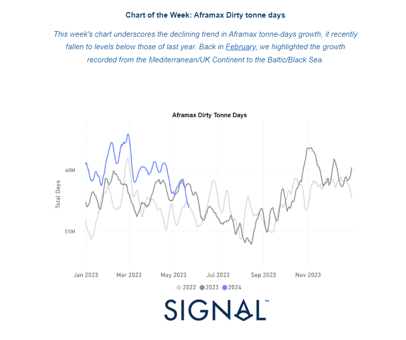
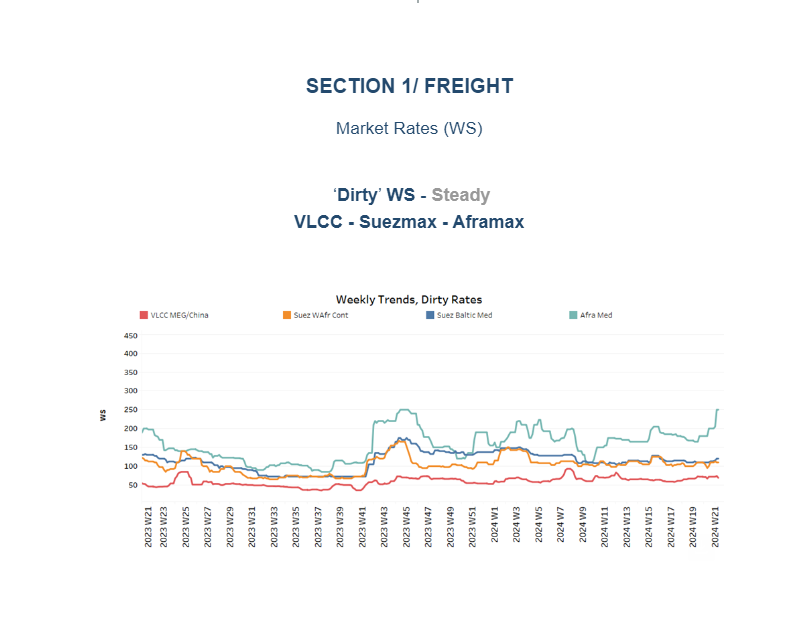
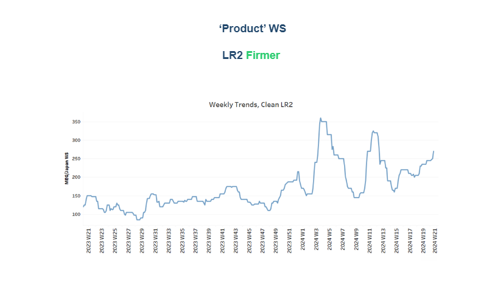
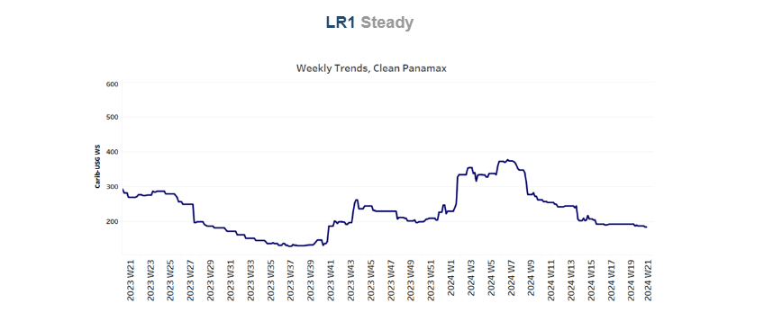
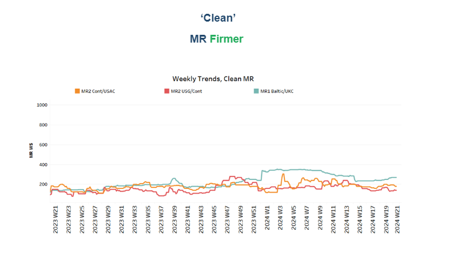
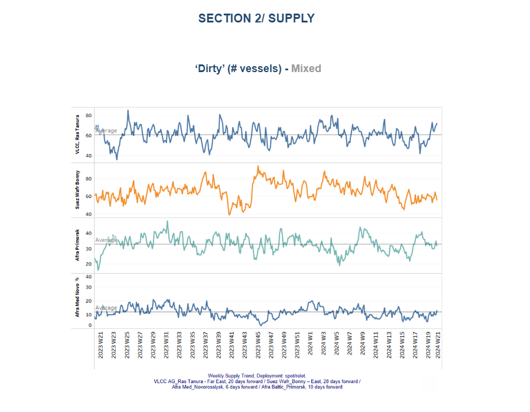
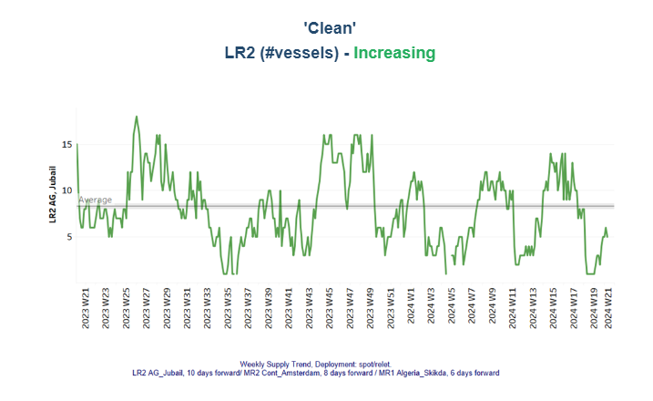
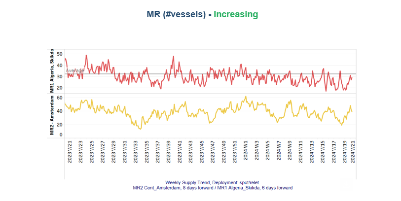
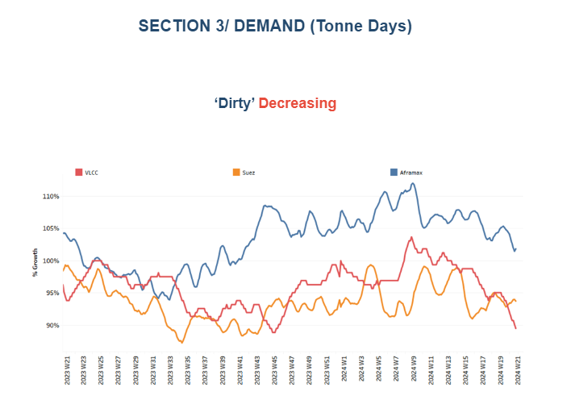
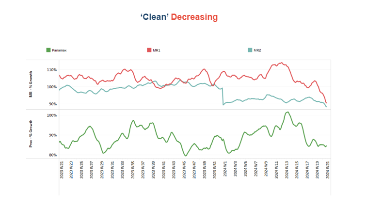

# Aframax Dirty tonne days

**Date:** May 24, 2024  
**Publisher:** Breakwave Advisors | **Category:** Market Insights  
**Original URL:** [https://www.breakwaveadvisors.com/insights/2024/5/24/aframax-dirty-tonne-days](https://www.breakwaveadvisors.com/insights/2024/5/24/aframax-dirty-tonne-days)  

---

## Tanker - Weekly Market Monitor

Snapshot of Crude and Product Freight Rates, Supply-Demand

Week 21, May 23, 2024

> **Figure 1: Στιγμιότυπο Οθόνης 2024 05 24 105017**  
> **Interactive Data & Source:** [Signal Ocean Platform](https://go.signalocean.com/e/983831/et-monitor-tanker-week-20-2024/2q721s/410794937/h/lJhZsURIm7wQtnwsjDBKikXSZpvadgTd3F9EgWt8Rjs) | [Local Asset](file:///C:/Users/Dell/Github/Shipping/corpus/03-breakwave/insights/2024/assets/2024-05-24_aframax-dirty-tonne-days_img_cea3cf84ceb9ceb3cebcceb9cf8ccf84cf85_f577e0e396b3.png)

The third week of May saw an upward trend in market prices for the Aframax Mediterranean market, while sentiment in the VLCC MEG-China route showed a gradual improvement. However, the increasing supply of vessels continues to challenge market price performance. On the demand side, there is no firm growth in tonne-days. This week's chart indicates a sharp downward trend in the Aframax segment, mirroring last week's highlighted decline in the[VLCC segment](https://go.signalocean.com/e/983831/et-monitor-tanker-week-20-2024/2q721s/410794937/h/lJhZsURIm7wQtnwsjDBKikXSZpvadgTd3F9EgWt8Rjs).

On the macroeconomic front,[recent developments](https://go.signalocean.com/e/983831/h-tone-inventory-shock-1432740/2q721w/410794937/h/lJhZsURIm7wQtnwsjDBKikXSZpvadgTd3F9EgWt8Rjs)have impacted the market. Oil prices have declined following news of potential rate hikes by the Federal Reserve. Additionally, the Energy Information Administration (EIA) reported an unexpected increase in U.S. crude oil inventories by 1.8 million barrels last week, contrary to expectations of a 2.5 million-barrel draw. This increase, attributed to a significant adjustment for unaccounted barrels, suggests a softer demand environment. Given the Fed’s indication of potential rate hikes and the unexpected rise in crude inventories, the short-term outlook for crude oil remains bearish. Traders should expect continued volatility as the market reacts to economic data and Fed policy signals. The interplay between inflation concerns, interest rates, and crude oil demand will be crucial in shaping market conditions in the coming weeks.

> **Figure 2: Στιγμιότυπο Οθόνης 2024 05 24 105041**  
> **Interactive Data & Source:** [Signal Ocean Platform](https://www.thesignalgroup.com/signal-ocean-platform) | [Local Asset](file:///C:/Users/Dell/Github/Shipping/corpus/03-breakwave/insights/2024/assets/2024-05-24_aframax-dirty-tonne-days_img_cea3cf84ceb9ceb3cebcceb9cf8ccf84cf85_06ae61307f98.png)

Before the end of May, sentiment surrounding crude oil market prices was mixed. However, Aframax Mediterranean rates displayed a clear upward trend this week, confirming the rise anticipated in the previous week.

- The**VLCC**MEG-China freight rates rose to 69WS, marking a 30% increase compared to the same week in May last year. Despite this rise, the market struggles to reach the peak levels of 70WS seen in mid-February, primarily due to the ongoing decline in VLCC tonne-days growth.
- Suezmax freight rates for shipments from**West Africa**to**continental Europe**stabilised around 110WS, marking a 10% monthly increase. Meanwhile, rates on the**Suez Baltic Med**route gained firmer momentum at approximately 120WS, though this reflects a nearly 7% decline compared to the same week last year.
- Aframax**Mediterranean**freight rates are currently hovering around WS250, reflecting a 37% increase from the end of the previous week and a similar 37% rise compared to a month ago.

> **Figure 3: Στιγμιότυπο Οθόνης 2024 05 24 105104**  
> **Interactive Data & Source:** [Signal Ocean Platform](https://www.thesignalgroup.com/signal-ocean-platform) | [Local Asset](file:///C:/Users/Dell/Github/Shipping/corpus/03-breakwave/insights/2024/assets/2024-05-24_aframax-dirty-tonne-days_img_cea3cf84ceb9ceb3cebcceb9cf8ccf84cf85_b1a95d9f578c.png)

- **LR2**AG freight rates rose WS270, points higher than the end of April, currently standing 116% higher than during a comparable week a year ago.

> **Figure 4: Στιγμιότυπο Οθόνης 2024 05 24 105123**  
> **Interactive Data & Source:** [Signal Ocean Platform](https://www.thesignalgroup.com/signal-ocean-platform) | [Local Asset](file:///C:/Users/Dell/Github/Shipping/corpus/03-breakwave/insights/2024/assets/2024-05-24_aframax-dirty-tonne-days_img_cea3cf84ceb9ceb3cebcceb9cf8ccf84cf85_d4224240e9db.png)

- **Panamax**Carib-to-USG rates sustained levels around WS190 from mid April, currently standing 35% weaker than during a comparable week a year ago.

> **Figure 5: Στιγμιότυπο Οθόνης 2024 05 24 105144**  
> **Interactive Data & Source:** [Signal Ocean Platform](https://www.thesignalgroup.com/signal-ocean-platform) | [Local Asset](file:///C:/Users/Dell/Github/Shipping/corpus/03-breakwave/insights/2024/assets/2024-05-24_aframax-dirty-tonne-days_img_cea3cf84ceb9ceb3cebcceb9cf8ccf84cf85_fa80988c1014.png)

- **MR1**rates for shipments from the**Baltic**to the continent are still hovering above 250WS, reflecting a similar firmness compared to the same week last year. Meanwhile,**MR2**rates for shipments from the continent to the USAC are at 170WS, marking a 10% weekly decrease and maintaining a similar momentum to that of the same week a month ago.

> **Figure 6: Στιγμιότυπο Οθόνης 2024 05 24 105203**  
> **Interactive Data & Source:** [Signal Ocean Platform](https://www.thesignalgroup.com/signal-ocean-platform) | [Local Asset](file:///C:/Users/Dell/Github/Shipping/corpus/03-breakwave/insights/2024/assets/2024-05-24_aframax-dirty-tonne-days_img_cea3cf84ceb9ceb3cebcceb9cf8ccf84cf85_70e1bcf00967.png)

The supply trend for crude tankers mirrors that of the previous week, with the number of VLCC vessels increasing in Ras Tanura, while the Aframax segment in Primosk continues to show a downward trend.

- **VLCC Ras Tanura:**The number of ships has risen to nearly 70, which is almost 30 more than the last low recorded in week 18.
- **Suezmax Wafr:**The current ship count hovers just below earlier estimates of around 60, reflecting a nearly steady trend compared to levels observed a week ago.
- **Aframax Primorsk**: The number of ships remains close to the annual average of 30, nearly 10 fewer than the levels recorded two weeks ago.
- **Aframax Med Novo**: The vessel count has stayed around the annual average of 10 for the past two weeks. It remains to be seen whether there will be a drop below the annual trend by the end of May.

> **Figure 7: Στιγμιότυπο Οθόνης 2024 05 24 105223**  
> **Interactive Data & Source:** [Signal Ocean Platform](https://www.thesignalgroup.com/signal-ocean-platform) | [Local Asset](file:///C:/Users/Dell/Github/Shipping/corpus/03-breakwave/insights/2024/assets/2024-05-24_aframax-dirty-tonne-days_img_cea3cf84ceb9ceb3cebcceb9cf8ccf84cf85_e4b33919298b.png)

> **Figure 8: Στιγμιότυπο Οθόνης 2024 05 24 105245**  
> **Interactive Data & Source:** [Signal Ocean Platform](https://www.thesignalgroup.com/signal-ocean-platform) | [Local Asset](file:///C:/Users/Dell/Github/Shipping/corpus/03-breakwave/insights/2024/assets/2024-05-24_aframax-dirty-tonne-days_img_cea3cf84ceb9ceb3cebcceb9cf8ccf84cf85_460fd36a1fb8.png)

- **Clean LR2 AG Jubail**: Despite recent indications of a downward revision, an upward trend has emerged. However, levels remain below the annual average of 8.

- **Clean MR**: Vessel activity for MR1 at Algeria's Skikda port has increased to 29, up from the low recorded two weeks ago, yet it remains below the annual average. In contrast, MR2 activity in Amsterdam has been rising since the end of week 17, reaching 39 vessels—11 more than the low recorded at the end of week 19.

> **Figure 9: Στιγμιότυπο Οθόνης 2024 05 24 105306**  
> **Interactive Data & Source:** [Signal Ocean Platform](https://www.thesignalgroup.com/signal-ocean-platform) | [Local Asset](file:///C:/Users/Dell/Github/Shipping/corpus/03-breakwave/insights/2024/assets/2024-05-24_aframax-dirty-tonne-days_img_cea3cf84ceb9ceb3cebcceb9cf8ccf84cf85_42441b0eecd9.png)

- **Dirty**tonne days: Before the end of May, there are no indications of an upward reversal in the growth of tonne-days for the VLCC segment. Additionally, the anticipated upward correction for Aframax has not materialised this week. It remains uncertain whether the recent upward trend in the Suezmax segment will persist for the remaining days of May.

> **Figure 10: Στιγμιότυπο Οθόνης 2024 05 24 105325**  
> **Interactive Data & Source:** [Signal Ocean Platform](https://www.thesignalgroup.com/signal-ocean-platform) | [Local Asset](file:///C:/Users/Dell/Github/Shipping/corpus/03-breakwave/insights/2024/assets/2024-05-24_aframax-dirty-tonne-days_img_cea3cf84ceb9ceb3cebcceb9cf8ccf84cf85_babc67cf5a5f.png)

- **Panamax**tonne days: The growth pace in the third week of May remains consistent with that at the beginning of the month, with the latest peak observed at the end of week 13. Clean**MR**tonne days: The tonne-day growth for both MR1 and MR2 vessel sizes has steadily declined over the past five weeks, with no signs of an imminent reversal. The last peak for MR1 was observed during weeks 17 and 18.​​​​​​

Data Source:[Signal Ocean Platform](https://www.thesignalgroup.com/signal-ocean-platform)

---

**Tags:** Tankers, Crude Oil, Shipping  
