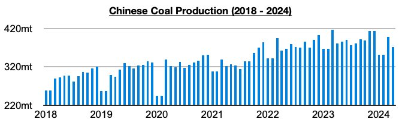
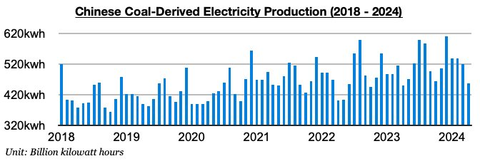
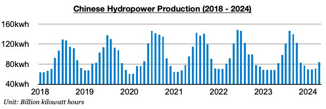

# Chinese Coal Import Prospects Remain Bullish

**Date:** May 24, 2024  
**Publisher:** Breakwave Advisors | **Category:** Market Insights  
**Original URL:** [https://www.breakwaveadvisors.com/insights/2024/5/24/q6dyw8u8u20yvz7j958p5ryv7svgvg](https://www.breakwaveadvisors.com/insights/2024/5/24/q6dyw8u8u20yvz7j958p5ryv7svgvg)  

---

*By*[*Jeffrey Landsberg*](https://www.linkedin.com/in/jeffrey-landsberg-70ab957/)

China's coal production totaled 371.7 million tons in April. This has marked a month-on-month decline of 27.6 million tons (-7%) and is down year-on-year by 9.8 million tons (-3%). China’s coal production has now contracted on a year-on-year basis during each of the last four months due to the ongoing coal mining safety overhaul. Prior to these last four months, the last time that China’s coal production contracted on a year-on-year basis was back in July 2021. The last time that there were four straight months with a year-on-year contraction was back in 2018.

> **Figure 1: Chart 1**  
> [Local Asset](file:///C:/Users/Dell/Github/Shipping/corpus/03-breakwave/insights/2024/assets/2024-05-24_q6dyw8u8u20yvz7j958p5ryv7svgvg_img_chart1_d09e9a99570c.jpg)

It is rare for China’s coal production to contract — but as we have been discussing in our Weekly China Reports and Weekly Dry Bulk Reports since late last year, we had been expecting that production would contract as China entered a new significant coal mining safety overhaul that has been in place since December. The coal production contraction remains beneficial for the dry bulk market as China's thermal coal-derived electricity generation has continued to grow. China's coal import demand has remained robust as a result.

China's coal-derived electricity generation totaled 457.9 billion kilowatt hours. This has marked a month-on-month decline of 62.2 billion kilowatt hours (-12%) but is up year-on-year by 8.5 billion kilowatt hours (2%). It is normal for coal-derived electricity generation to decline on a month-on-month basis in April. The year-on-year growth remains most significant, and remaining helpful for the coal and dry bulk markets is that China's coal-derived electricity generation growth has continued to exceed coal production growth.

> **Figure 2: Chart 2**  
> [Local Asset](file:///C:/Users/Dell/Github/Shipping/corpus/03-breakwave/insights/2024/assets/2024-05-24_q6dyw8u8u20yvz7j958p5ryv7svgvg_img_chart2_228fd444dad9.jpg)

Hydropower production totaled 83.5 billion kilowatt hours. This has marked a month-on-month increase of 12.3 billion kilowatt hours (17%) and is up year-on-year by 15.1 billion kilowatt hours (22%). China's hydropower production has now increased on a year-on-year basis for nine straight months, and last month's 22% year-on-year growth has dwarfed the 3% growth that was previously seen during the first three months of this year. However, the most recent 22% growth has still not stopped China’s coal-derived electricity generation from maintaining year-on-year growth.

> **Figure 3: Chart 3**  
> [Local Asset](file:///C:/Users/Dell/Github/Shipping/corpus/03-breakwave/insights/2024/assets/2024-05-24_q6dyw8u8u20yvz7j958p5ryv7svgvg_img_chart3_4c7e34d485ef.jpg)

---

**Tags:** Drybulk, Economy, Markets  
