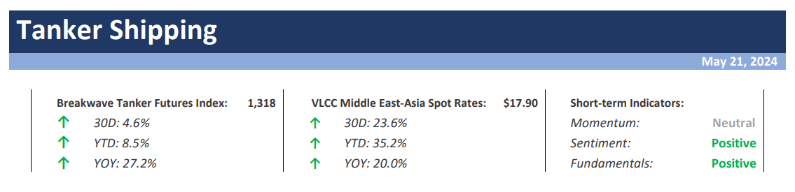
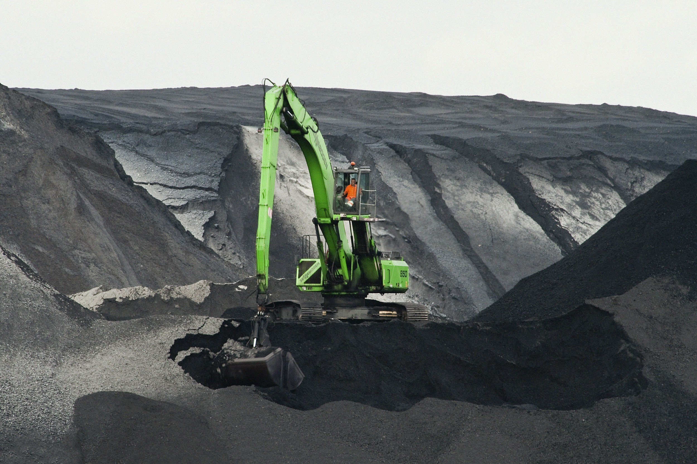

# Weekly Insights Review

**Date:** May 24, 2024  
**Publisher:** Breakwave Advisors | **Category:** Market Insights  
**Original URL:** [https://www.breakwaveadvisors.com/insights/2024/5/24/weekly-insights-review](https://www.breakwaveadvisors.com/insights/2024/5/24/weekly-insights-review)  

---

## Welcome to Our Weekly Insights Review

## Read Here Everything You Need to Know

## Breakwave Tanker Report

**The VLCC Market Remains Well Supported as Attention Turns to Summer Demand –**As the end of May approaches, the VLCC freight market has remained on a slight upward trajectory, with the benchmark rates from the Middle East Gulf to China up approximately 15% since the beginning of the month.

> **Figure 1: Tanker+report+top**  
> **Interactive Data & Source:** [Breakwave Advisors Market Insights](https://www.breakwaveadvisors.com/insights/2024/5/20/trade-war-between-the-united-states-and-china) | [Local Asset](file:///C:/Users/Dell/Github/Shipping/corpus/03-breakwave/insights/2024/assets/2024-05-24_weekly-insights-review_img_tanker2breport2btop_9c275a576ff7.png)

> **Figure 2: Read More**  
> **Interactive Data & Source:** [Breakwave Advisors Market Insights](https://www.breakwaveadvisors.com/insights/2024/5/20/trade-war-between-the-united-states-and-china) | [Local Asset](file:///C:/Users/Dell/Github/Shipping/corpus/03-breakwave/insights/2024/assets/2024-05-24_weekly-insights-review_img_image-asset28229_ae5824f19347.jpeg)

## Trade War

Doric Weekly Market Insight

Last month, the International Monetary Fund has emphasized that geoeconomic fragmentation could exert pressure on global trade and income growth in the forthcoming years.

> **Figure 3: Projects**  
> **Interactive Data & Source:** [Breakwave Advisors Market Insights](https://www.breakwaveadvisors.com/insights/2024/5/20/dark-flows) | [Local Asset](file:///C:/Users/Dell/Github/Shipping/corpus/03-breakwave/insights/2024/assets/2024-05-24_weekly-insights-review_img_projects_41577ba61ed3.jpg)

## Dark Flows

Gibson Tanker Market Report

Despite operating under long running sanctions, Iranian crude exports continue to flow. The large shadow tanker fleet as well as the network of traders and financial intermediaries...

[Read More](https://www.breakwaveadvisors.com/insights/2024/5/20/dark-flows)

> **Figure 4: 011**  
> **Interactive Data & Source:** [Breakwave Advisors Market Insights](https://www.breakwaveadvisors.com/insights/2024/5/20/outlook-for-the-global-economy) | [Local Asset](file:///C:/Users/Dell/Github/Shipping/corpus/03-breakwave/insights/2024/assets/2024-05-24_weekly-insights-review_img_011_ff9ed2d49e46.jpg)

## Outlook for the Global Economy

The Fix - Global Market Update

The past week saw all of the Baltic Exchange’s dry bulk indices ending in the red amid soft demand, with the headline Baltic Dry Index shedding more than thirteen per cent.

> **Figure 5: Market Chart 5**  
> **Interactive Data & Source:** [Breakwave Advisors Market Insights](https://www.breakwaveadvisors.com/insights/2024/5/21/06bdpcpoomito3yncev0ck4dlcc1nr) | [Local Asset](file:///C:/Users/Dell/Github/Shipping/corpus/03-breakwave/insights/2024/assets/2024-05-24_weekly-insights-review_img_image-asset28129_598d4d8bfd9c.jpeg)

## Enjoy the Rally. What Can Possibly Go Wrong?

Mazars Weekly Note

The three things investors should know this week:

1. The US economy is still growing at a healthy pace, but slightly slower than anticipated. This has allowed investors to price in more rate cuts this year, and drive a bond and equity rally in the last few days.
...

> **Figure 6: Market Chart 6**  
> **Interactive Data & Source:** [Breakwave Advisors Market Insights](https://www.breakwaveadvisors.com/insights/2024/5/22/jlf9xn3bwtdu797wjl6v4xmar7i8al) | [Local Asset](file:///C:/Users/Dell/Github/Shipping/corpus/03-breakwave/insights/2024/assets/2024-05-24_weekly-insights-review_img_image-asset28329_f5910133440a.jpeg)

## Tanker Demand Through the Remainder of 2024

Intermodal Weekly Market Report

The turbulent dynamics witnessed in oil markets during the five months of 2024 have had a direct impact on crude freight demand fundamentals.

> **Figure 7: Market Chart 7**  
> **Interactive Data & Source:** [Breakwave Advisors Market Insights](https://www.breakwaveadvisors.com/insights/2024/5/22/metals-rally-pauses-as-market-reassess-fundamentals) | [Local Asset](file:///C:/Users/Dell/Github/Shipping/corpus/03-breakwave/insights/2024/assets/2024-05-24_weekly-insights-review_img_image-asset28729_c33d6dc0f9ed.jpeg)

## Metals Rally Pauses As Market Reassess Fundamentals

Commodities Wrap

A rally across metals cooled amid fears they had run ahead of fundamentals. More hawkish Fed speakers also weighed on sentiment.

[Read More](https://www.breakwaveadvisors.com/insights/2024/5/22/metals-rally-pauses-as-market-reassess-fundamentals)

> **Figure 8: Premiership+(002)**  
> **Interactive Data & Source:** [Breakwave Advisors Market Insights](https://www.breakwaveadvisors.com/insights/2024/5/23/dry-bulk-flows) | [Local Asset](file:///C:/Users/Dell/Github/Shipping/corpus/03-breakwave/insights/2024/assets/2024-05-24_weekly-insights-review_img_premiership2b2800229_1d123fc2f81e.jpg)

## Dry Bulk Flows

Signal Ocean - Dry Weekly Market Monitor

In the third week of May, there are indications that the Capesize market segment is showing resistance, with rates in the Brazil to North China route seemingly holding firm and not expected to drop before the end of the month.

> **Figure 9: Market Chart 9**  
> **Interactive Data & Source:** [Breakwave Advisors Market Insights](https://www.breakwaveadvisors.com/insights/2024/5/23/indications-of-a-tightening-in-the-fuel-oil-market) | [Local Asset](file:///C:/Users/Dell/Github/Shipping/corpus/03-breakwave/insights/2024/assets/2024-05-24_weekly-insights-review_img_image-asset28429_91483b710776.jpeg)

## Indications of a Tightening in the Fuel Oil Market

Vortexa Freight Weekly

This week, in the East, we discuss why reduced Russian fuel oil exports going to the Middle East affect the region’s Aframax supply.

> **Figure 10: Market Chart 10**  
> **Interactive Data & Source:** [Breakwave Advisors Market Insights](https://www.breakwaveadvisors.com/insights/2024/5/24/q6dyw8u8u20yvz7j958p5ryv7svgvg) | [Local Asset](file:///C:/Users/Dell/Github/Shipping/corpus/03-breakwave/insights/2024/assets/2024-05-24_weekly-insights-review_img_image-asset28529_2d41ed2d61c8.jpeg)

## Chinese Coal Import Prospects Remain Bullish

From Commodore's Weekly Dry Bulk Reports

China's coal production totaled 371.7 million tons in April. This has marked a month-on-month decline of 27.6 million tons (-7%) and is down year-on-year by 9.8 million tons (-3%).

[Read More](https://www.breakwaveadvisors.com/insights/2024/5/24/q6dyw8u8u20yvz7j958p5ryv7svgvg)

> **Figure 11: Market Chart 11**  
> **Interactive Data & Source:** [Breakwave Advisors Market Insights](https://www.breakwaveadvisors.com/insights/2024/5/24/china-builds-crude-stock-amidst-turnaround-peak-hope-for-new-quotas) | [Local Asset](file:///C:/Users/Dell/Github/Shipping/corpus/03-breakwave/insights/2024/assets/2024-05-24_weekly-insights-review_img_image-asset28629_8d964ba32764.jpeg)

## China Builds Crude Stock Amidst Turnaround Peak, Hope for New Quotas

Vortexa Freight Weekly

China’s onshore crude stockpiles reflect demand weakness beyond seasonal norms.

> **Figure 12: Market Chart 12**  
> **Interactive Data & Source:** [Breakwave Advisors Market Insights](https://www.breakwaveadvisors.com/insights/2024/5/24/aframax-dirty-tonne-days) | [Local Asset](file:///C:/Users/Dell/Github/Shipping/corpus/03-breakwave/insights/2024/assets/2024-05-24_weekly-insights-review_img_image-asset_a7771483ed23.jpeg)

## Aframax Dirty Tonne Days

Signal Ocean - Tanker Weekly Market Monitor

The third week of May saw an upward trend in market prices for the Aframax Mediterranean market, while sentiment in the VLCC MEG-China route showed a gradual improvement.

---

**Tags:** Shipping, Markets, Economy  
