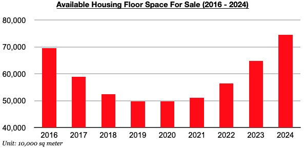
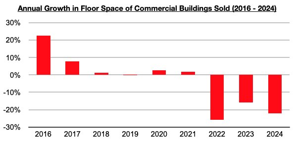

# Latest Developments For China's Excess Housing Supply

**Date:** May 27, 2024  
**Publisher:** Breakwave Advisors | **Category:** Market Insights  
**Original URL:** [https://www.breakwaveadvisors.com/insights/2024/5/27/latest-developments-for-chinas-excess-housing-supply](https://www.breakwaveadvisors.com/insights/2024/5/27/latest-developments-for-chinas-excess-housing-supply)  

---

*By*[*Jeffrey Landsberg*](https://www.linkedin.com/in/jeffrey-landsberg-70ab957/)

April ended with 746 million square meters of floor space available in China's commercial buildings (which includes residential buildings). This marks a tiny 0.5% decline from the end of March, but does at least mark a second straight month that available floor space has declined. Before these last two months, September was the last time that available floor space declined. Still, though, this 746 million square meter total remains a great deal higher than seen in previous years.

> **Figure 1: Chart 1 (1)**  
> [Local Asset](file:///C:/Users/Dell/Github/Shipping/corpus/03-breakwave/insights/2024/assets/2024-05-27_latest-developments-for-chinas-excess-housing-supply_img_chart128129_1faf9885aa3d.jpg)

As we have been stressing in Commodore Research's Weekly China Reports, the last several years have continued to struggle with a huge amount of excess floor space available in the housing market. This continues to come not from just more homes being built in China, but very significantly also from sales decreasing. Sales this year have contracted year-on-year by 22%, which continues to put this year on pace to end as the third straight year that sales have contracted

> **Figure 2: Chart 2 (1)**  
> [Local Asset](file:///C:/Users/Dell/Github/Shipping/corpus/03-breakwave/insights/2024/assets/2024-05-27_latest-developments-for-chinas-excess-housing-supply_img_chart228129_05405bd0fac0.jpg)

New finally, though, is that China's government recently announced it will be using 300 billion yuan ($42 billion) to buy unsold homes. Overall, we find that the funding of 300 billion yuan ($42 billion) to buy unsold homes will be supportive and we now anticipate that available housing floor space will start to decline by a much greater amount. Sentiment is also likely to strengthen greatly. We also do not expect that new construction will face any significant headwinds, even though more new homes are clearly not needed. The government wants new construction to continue in order to continue to support the economy.

---

**Tags:** Drybulk, Economy, Markets  
