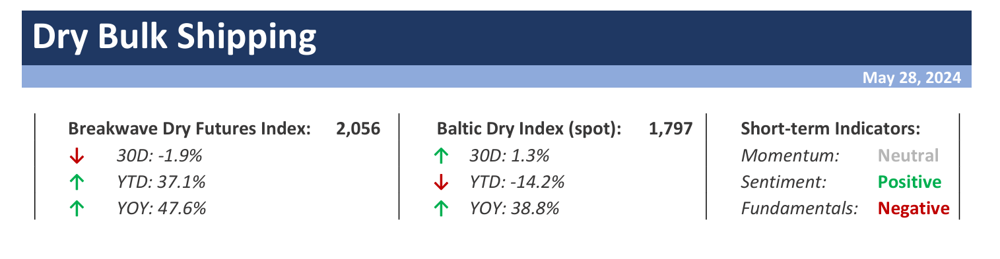
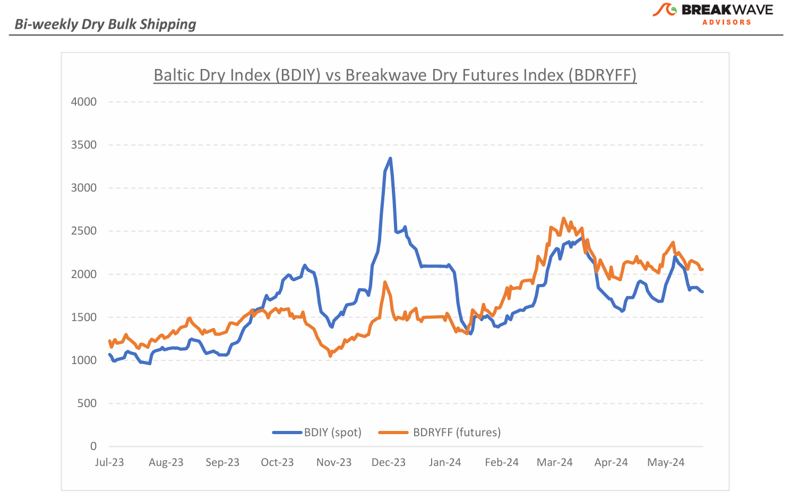
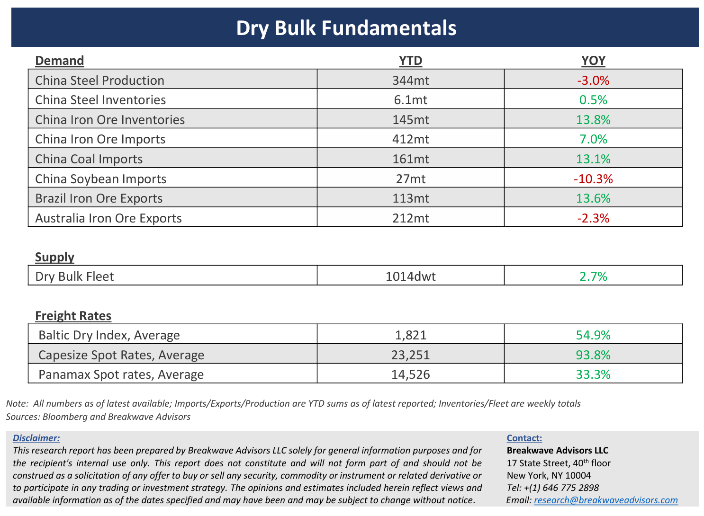

# Breakwave Bi-Weekly Dry Bulk Report - May 28, 2024

**Date:** May 28, 2024  
**Publisher:** Breakwave Advisors | **Category:** Market Insights  
**Original URL:** [https://www.breakwaveadvisors.com/insights/2024528dry](https://www.breakwaveadvisors.com/insights/2024528dry)  

---

> **Figure 1: Dryreporttop**  
> [Local Asset](file:///C:/Users/Dell/Github/Shipping/corpus/03-breakwave/insights/2024/assets/2024-05-28_2024528dry_img_dryreporttop_f4e7796b25ae.png)

**· Dry bulk spot rates move closer to seasonal averages as summer begins –**With the**strongest first quarter for Capesizes in 14 years**behind us, dry bulk rates have**now moved closer to the typical**rate for this time of the year, with the Baltic Dry Index sitting at roughly 15% above the 7-year average. Yet,**expectations remain**high, with the futures curve still in contango (futures above spot), especially for the more volatile Capesize vessels, something that has been the case for months now. However, such prospects, as priced by the futures curve, have declined significantly from the extremes of March as reality slowly settled in, and the second quarter rates seem to converge closer to the low-20,000 level versus the mid-30,000 that the futures were at first pointing to. We**believe the pattern of initially higher futures pricing and lower eventual settlements will remain the case**for the third quarter as well, given the looser supply/demand balance during the summer months. The impact of record-high asset prices on sentiment remains the main reason, in our view, for the elevated futures curve. Unlike previous instances of spikes in freight futures, this time around,**sentiment is the main driving force behind such a bullishness**and the secondhand vessel market is greatly contributing to the overall optimism around dry bulk. However, as futures continue to settle lower and losses amongst holders accumulate, it’s the cash flow reality that might eventually force the change and bring asset prices closer to historical risk-adjusted expected returns. As the**summer**progresses,**opportunities**to establish new positions should**develop**once rate pricing becomes aligned with the reality of underlying freight demand.

**· Mismatch between iron ore supply and demand hits record highs as inventories surge –**Historically, China has always been a buyer of any incremental ton of iron ore that hits the water and, so far, that has also been the case. However, with steel production remaining flat at the magic one-billion-ton mark for a third year in a row, elevated iron ore imports are rapidly being converted to inventories, which have been surging for the past six months now. Although still below the record highs reached in 2018, at least for portside stocks, we believe there is a**clear mismatch of imports and consumption**when it comes to the steelmaking material. Such a mismatch can be resolved in two ways: either a significant**decline**in future iron ore**imports**, a clear negative for both iron ore prices as well as freight rates, or a considerable**increase**in**steel production**. Yet, the fundamentals for an increase in steel consumption seem absent, as the real estate sector in China remains exceptionally weak and the prospects seem at best flat in terms of demand. The**risk for the second half**of the year is most likely tilted towards**lower iron ore imports**given that year-to-date imports are up 7% while steel production is down 3%, making the balance for the rest of the year unfavorable.

**· Our Long-term View –**The last few years have been characterized by increased geopolitical uncertainty. Going forward, we expect such events to continue to affect global trade and have a meaningful impact on effective vessel supply. Combined with the potential for a multi-year cyclical rebound in China’s economic activity following the recent economic turmoil, dry bulk shipping should experience higher volatility on top of a secular tightness driven by increasing bulk commodity demand and a slower fleet growth as a result of a relatively low orderbook.

> **Figure 2: Dryreportchart**  
> [Local Asset](file:///C:/Users/Dell/Github/Shipping/corpus/03-breakwave/insights/2024/assets/2024-05-28_2024528dry_img_dryreportchart_8dfd6dd51dd1.png)

> **Figure 3: Dryreportbottom**  
> [Local Asset](file:///C:/Users/Dell/Github/Shipping/corpus/03-breakwave/insights/2024/assets/2024-05-28_2024528dry_img_dryreportbottom_b787a29c9228.png)

### Subscribe:
