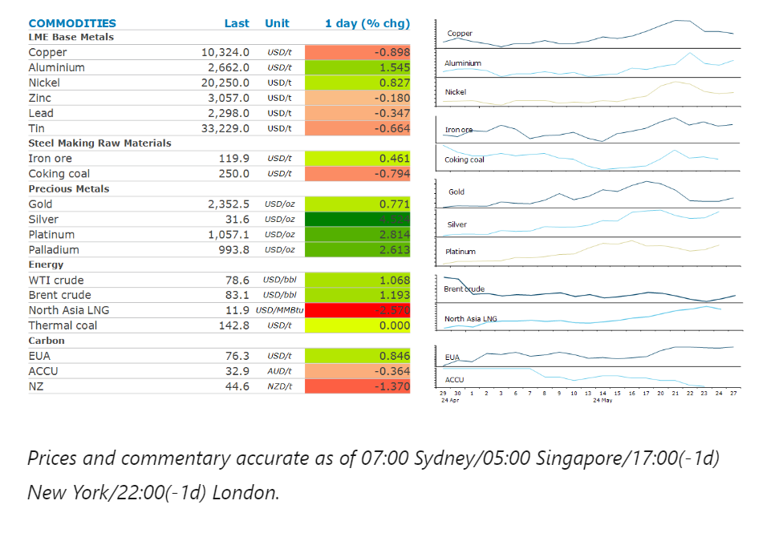
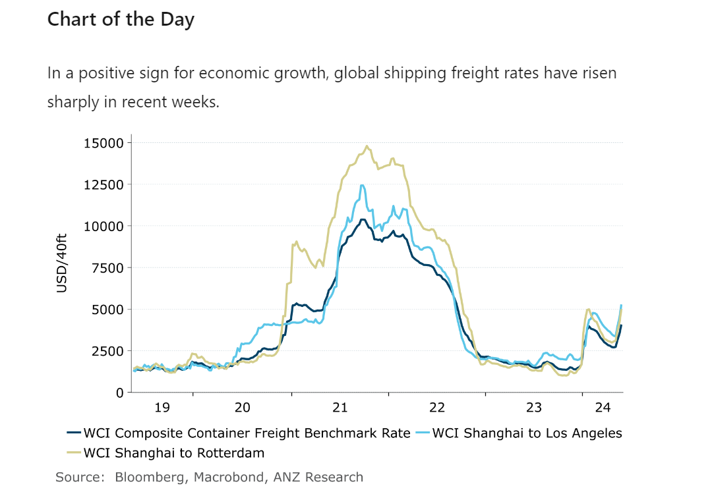

# Sentiment buoyed by signs of economic growth

**Date:** May 28, 2024  
**Publisher:** Breakwave Advisors | **Category:** Market Insights  
**Original URL:** [https://www.breakwaveadvisors.com/insights/2024/5/28/gxcojixxrgr12zhp5lag4me46kknzj](https://www.breakwaveadvisors.com/insights/2024/5/28/gxcojixxrgr12zhp5lag4me46kknzj)  

---

Trading was lacklustre with US and UK markets closed. However, sentiment was buoyed by signs of economic growth and dovish commentary from central bankers.

*By*[*Daniel Hynes*](https://www.linkedin.com/in/dahynes/)

> **Figure 1: Στιγμιότυπο Οθόνης 2024 05 28 112921**  
> **Interactive Data & Source:** [Linkedin](https://www.linkedin.com/newsletters/commodities-wrap-6692196755876012032/?fbclid=IwAR3kiXJqZdxmp9ZcRwBNI7FsBySI-XSC0pfPur1qzjt7OZp7PTE59Tsl1QI) | [Local Asset](file:///C:/Users/Dell/Github/Shipping/corpus/03-breakwave/insights/2024/assets/2024-05-28_gxcojixxrgr12zhp5lag4me46kknzj_img_cea3cf84ceb9ceb3cebcceb9cf8ccf84cf85_ec3125044b78.png)

### Market Commentary

**Oil**gained on hopes of stronger demand as the market looks ahead to the upcoming OPEC meeting. The US’s Memorial Holiday is the traditional start of the summer driving season. Early signs indicate a relatively strong level of holiday travel, but gasoline consumption may be tempered by improved fuel efficiency and electric vehicles. Jet fuel demand may fill the breach. The number of travellers expected to fly this holiday weekend may be the highest in nearly 20 years, according to the American Automobile Association. Jet fuel demand has already surged to its highest since 2019 for this time of year, according to EIA data. Crude oil prices were also supported by rising tensions in the Middle East. An Egyptian soldier was killed in a clash with Israeli forces at the Rafah border crossing. In another sign of elevated geopolitical risks, Iran’s stockpile of near bomb-grade uranium climbed 17% over the last three months, according to the UN nuclear watchdog. This comes as the nation prepares to hold presidential elections next month. This challenging backdrop will make OPEC’s decision on supply more difficult. The group is now expected to meet online on Sunday 2 June to review its roughly 2mb/d of voluntary output cuts. A Bloomberg survey showed 87% of traders and analysts expect the group to extend the curbs.

**European gas**prices extended last week’s gain at traders weighed up rising competition with LNG buyers in Asia. Supply concerns in Europe have left some buyers uneasy about refilling inventories over the coming summer. Last week Austria’s OMV AG warned of a possible disruption to flows from Russia after a European court decision that could interrupt its payments to Gazprom. In Asia, an outage at Brunei’s LNG plant is stretching into its eighth day. Asian cargoes are still highly sort after, as hot weather boosts demand. China’s LNG imports were up 11% y/y last week, according to ship tracking data.

A more dovish tone from central banks helped push**gold**prices higher. The ECB shouldn’t rule out lowering borrowing costs at both its June and July meetings, Governing Council member Francois Villeroy de Galhau said. On Friday, a survey showed US consumers expect prices to climb less quickly than earlier in the month. This raised hopes that the Fed’s inflation gauge due out later this week will show further signs of price pressures easing. Rising tensions in the Middle East also boosted safe haven buying.

**Base metals**didn’t trade with markets closed in the US and UK. However, data from China is likely to weigh on sentiment when they open later today. Copper stockpiles rose by 9,400t last week to 424,500t, according to SMM. Despite warnings of output cuts amid weak processing fees, Chinese smelters have maintained relatively high production rates. This may be in light of strengthening international demand. In a sign of strengthening economic growth, daily spot rates for a 40-foot container to the US West Coast from Asia jumped more than 13% last week to USD4,915. That’s more than triple the rate seen in December 2023.

**Iron ore**futures retreated as investors weighed up recent measures by Beijing to stabilise the property sector against signs of rising supply from exporters.

> **Figure 2: Στιγμιότυπο Οθόνης 2024 05 28 112941**  
> **Interactive Data & Source:** [Linkedin](https://www.linkedin.com/newsletters/commodities-wrap-6692196755876012032/?fbclid=IwAR3kiXJqZdxmp9ZcRwBNI7FsBySI-XSC0pfPur1qzjt7OZp7PTE59Tsl1QI) | [Local Asset](file:///C:/Users/Dell/Github/Shipping/corpus/03-breakwave/insights/2024/assets/2024-05-28_gxcojixxrgr12zhp5lag4me46kknzj_img_cea3cf84ceb9ceb3cebcceb9cf8ccf84cf85_0d7c6dfc5f38.png)

Data source:[Commodities Wrap](https://www.linkedin.com/newsletters/commodities-wrap-6692196755876012032/?fbclid=IwAR3kiXJqZdxmp9ZcRwBNI7FsBySI-XSC0pfPur1qzjt7OZp7PTE59Tsl1QI)

---

**Tags:** Commodities, Economy, Markets  
