# The Big Picture: Oil supply disrupters

**Date:** May 29, 2024  
**Publisher:** Breakwave Advisors | **Category:** Market Insights  
**Original URL:** [https://www.breakwaveadvisors.com/insights/2024/5/29/3adgr9d06xh9y2dm7e87zgs311yaqu](https://www.breakwaveadvisors.com/insights/2024/5/29/3adgr9d06xh9y2dm7e87zgs311yaqu)  

---

*By*[*Henry Curra*](https://www.linkedin.com/in/henry-curra-77253b/)

Oil demand and geopolitics drive tanker demand, but this year more than most it is oil supply that will provoke the biggest shifts in tanker trade patterns. From new oil refineries in the Middle East, West Africa and Mexico, to oil pipelines in Canada and voluntary OPEC+ production cuts, we tackle some of the main disrupters and assess how the tanker world will adjust.

### OPEC Output Cuts Likely to Be Extended

OPEC+ meets virtually this week to discuss whether or not certain members should extend 2.2m b/d of voluntary output cuts amid quota cheating by other members. These supply cuts were agreed last November – initially for just three months but subsequently extended. Just a few months ago - when oil prices were higher and geopolitics more tense – it was thought likely that cuts would gradually unwind from June onwards. Now that oil prices seems to have settled around a comfortable $80/bbl (down from $93/bbl mid-April) the cuts are more likely to be extended, at least for the next three months, we believe. Of course these are voluntary cuts, so there is no need for any announcement on the matter at or after the OPEC meeting. A key problem facing OPEC+ is the huge uncertainty over oil demand growth this year. The IEA has recently lowered its outlook for world oil demand growth to 1.06m b/d – fingering lower European demand in particular, while OPEC maintains its 2.25m b/d growth expectation.

### India Back in Love with Russian Oil

The G7’s Russian oil export price cap appears increasingly ineffective. Shadow tankers are now moving most of Russia’s oil, sold at levels comfortably above the price cap. India says this week that it will continue to buy Russian oil despite the higher prices and tightening of western sanctions on price cap breachers. India continues to take around two thirds of Russian Urals exports, hitting record levels in April of 1.5m b/d. For a short while at the end of last year / start of this year it looked like India would take less Russian oil as US tightened its sanctions on ships moving Russian oil, but such concerns appear to have been short-lived. Almost all Russia Urals moving to India and China routes via the Suez Canal.

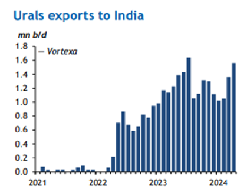

> **Figure 1: Market Chart 1**  
> [Local Asset](file:///C:/Users/Dell/Github/Shipping/corpus/03-breakwave/insights/2024/assets/2024-05-29_3adgr9d06xh9y2dm7e87zgs311yaqu_img_image0_bd8cf2d4ed0a.png)

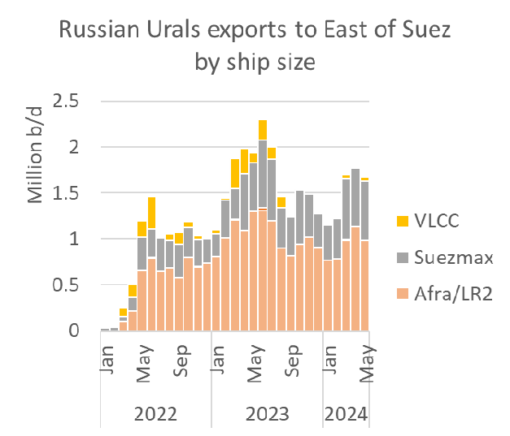

> **Figure 2: Market Chart 2**  
> [Local Asset](file:///C:/Users/Dell/Github/Shipping/corpus/03-breakwave/insights/2024/assets/2024-05-29_3adgr9d06xh9y2dm7e87zgs311yaqu_img_image1_15b2517791e3.png)

### For Other Inter-Basin Flows, No Let Up in Sight for Red Sea Diversions

In April, Houthi attacks in and around the Red Sea caused a 73% drop year on year in crude and refined product flows through the Suez Canal. Longer voyages for all ship types, particularly fast-steaming containerships, have boosted HSFO prices both in absolute terms and relative to VLSFO prices, which have softened. Singapore’s bunker sales are 30% up year on year since start of the year. Higher buying of HSFO relative to VLSFO has reduced the scrubber spread to its lowest in nine months in Singapore, and lowest in 5 months in Rotterdam. Today the scrubber spread sits at around $78/bbl.

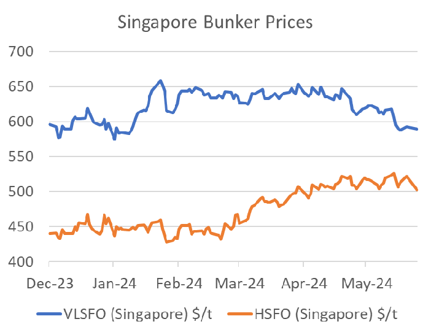

> **Figure 3: Market Chart 3**  
> [Local Asset](file:///C:/Users/Dell/Github/Shipping/corpus/03-breakwave/insights/2024/assets/2024-05-29_3adgr9d06xh9y2dm7e87zgs311yaqu_img_image2_f7bd1be246f8.png)

### Big Jump Mid East to Europe Product Flows

Middle Eastern seaborne diesel and jet flows to Europe have increased significantly in the past two months. Refinery capacity additions in Saudi Arabia (Jizan) and Oman (Duqm) have added around 140k b/d of diesel alone to Europe-bound flows. Jizan has a clear cost advantage as it loads within the Red Sea, thus avoiding Houthi hot spots (although the Houthis now claim to have extended their reach to the Med). Most Middle Eastern middle distillate flows to Europe still move longer-haul via the Cape of Good Hope. Oman’s recently-commissioned Duqm now makes up 10% of all Mid East diesel and gasoil shipments to Europe.

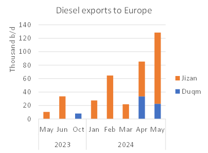

> **Figure 4: Market Chart 4**  
> [Local Asset](file:///C:/Users/Dell/Github/Shipping/corpus/03-breakwave/insights/2024/assets/2024-05-29_3adgr9d06xh9y2dm7e87zgs311yaqu_img_image3_8f81907a5a84.png)

A counter-seasonal diesel stock-build in Europe during a period of refining maintenance has weakened European distillate margins, although fuel oil cracks remain strong.

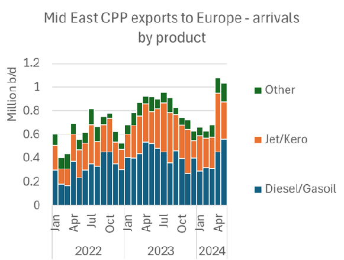

> **Figure 5: Market Chart 5**  
> [Local Asset](file:///C:/Users/Dell/Github/Shipping/corpus/03-breakwave/insights/2024/assets/2024-05-29_3adgr9d06xh9y2dm7e87zgs311yaqu_img_image4_d9c026d854d0.png)

### Tankers Prepare for Dangote Ramp Up

Nigeria’s 650kb/d Dangote refinery has just signedfirst offtake/supply deal with Total as it prepares to double production by the end of the year. The Lekki refinery started its crude unit in January. Naphtha exports followed in March and middle distillate production in April. Straight run fuel oil production is expected to start in June and gasoline production should begin within the next few months.

Aliko Dangote recently claimed that his refinery will produce enough gasoline to satisfy demand for West Africa, enough diesel for both West and Central Africa , and enough jet to supply the entire African continent and export surpluses to Brazil and Mexico. Last week we noted that Dangote has agreed a 2m bbl/month supply deal for US crude.

The Dangote refinery appears to be running at about half capacity. Once its reformer comes on stream in a few month’s time throughput is likely to rise to 500k b/d, and hit full capacity by the end of this year. This will increase its requirement for Suezmax stems to bring in local crudes, mostly on time-chartered tonnage. So far we have counted 40 Suezmax crude liftings (including 6 with STS onto VLCCs) and 11 VLCCs (all but one arriving from the US Gulf) with cargoes discharging or destined to discharge at the Lekki refinery. Many of the tankers discharging US crude have faced severe delays as sellers struggle to obtain letters of credit. The refinery has had difficulty accessing US$ as the Niara slides against the dollar. Restricted access to working capital has limited Dangote’s ability to buy large volumes of crude, delaying the ramping up of production.

### Dangote Feedstock Cuts Into Nigeria’s Crude Exports to Europe

State-run NNPC holds a 20% stake in Dangote and hopes to satisfy most of its crude oil needs with local production. But at full capacity, NNPC may struggle to keep pace with the refinery’s needs, in addition to higher throughput required at its other refineries in Port Hardcourt and Warri. This, and a need to diversify its crude slate, should keep Lekki looking overseas for some of its supply contracts.

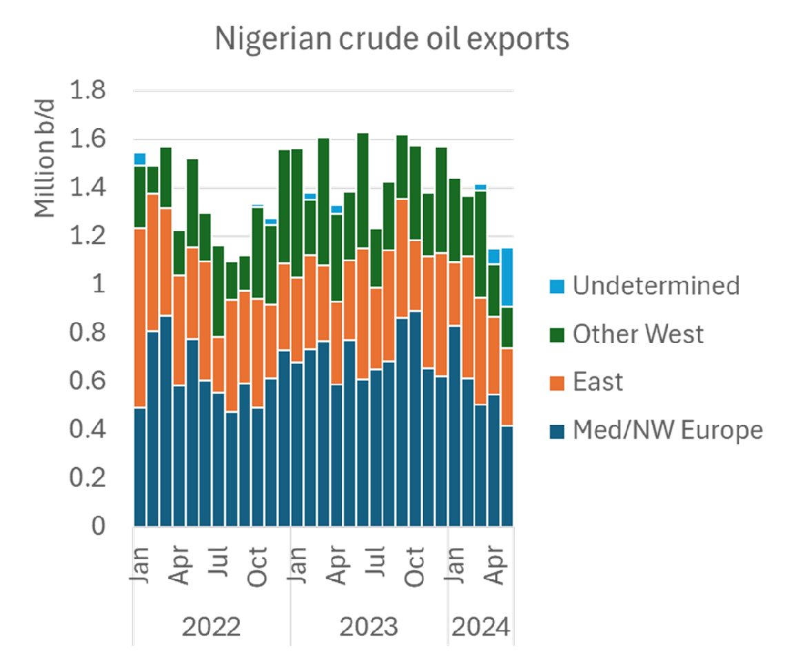

> **Figure 6: Market Chart 6**  
> [Local Asset](file:///C:/Users/Dell/Github/Shipping/corpus/03-breakwave/insights/2024/assets/2024-05-29_3adgr9d06xh9y2dm7e87zgs311yaqu_img_image5_922c636d7ed6.png)

That said, Nigerian seaborne crude exports have already fallen from around 1.6m b/d at the start of the year to just under 1.2m b/d so far in May. Most of the loss has focused on exports to Europe.

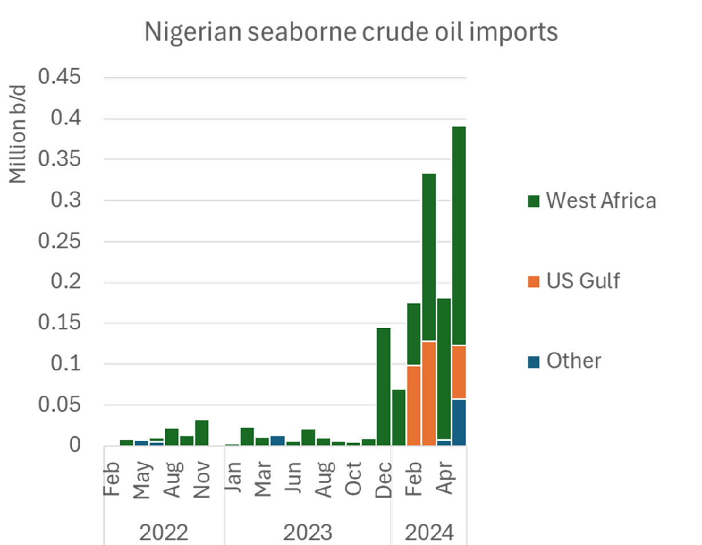

> **Figure 7: Market Chart 7**  
> [Local Asset](file:///C:/Users/Dell/Github/Shipping/corpus/03-breakwave/insights/2024/assets/2024-05-29_3adgr9d06xh9y2dm7e87zgs311yaqu_img_image6_3b4adf331f49.png)

Nigeria’s inbound seaborne crude trade, including flows from Nigerian oil terminals on Suezmaxes, has increased from nothing to nearly 400k b/d since the start of the Dangote refinery.

### Dangote Cpp Exports Jump, But Expect Gasoline to Stay Local

Most of Dangote’s CPP production today moves by sea, until local pipeline distribution networks are established.

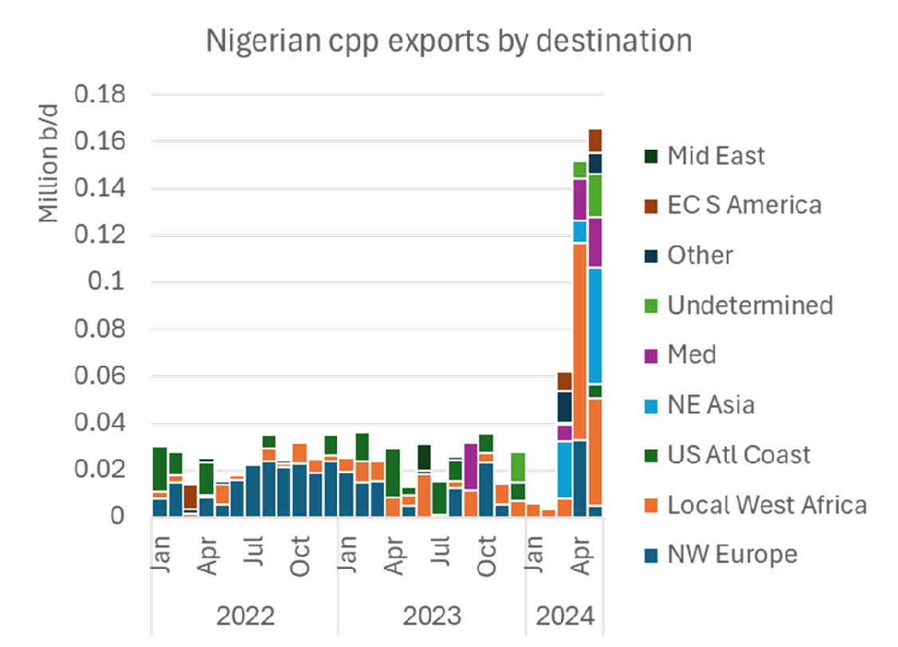

> **Figure 8: Market Chart 8**  
> [Local Asset](file:///C:/Users/Dell/Github/Shipping/corpus/03-breakwave/insights/2024/assets/2024-05-29_3adgr9d06xh9y2dm7e87zgs311yaqu_img_image7_af6d87f1ca58.png)

Inter-regional seaborne flows generally move on Nigerian cabotage vessels, but this is likely to shift onto Handy or larger tankers as volumes increase. It may also generate floating storage opportunities for tankers to facilitate regional product redistribution. So far this year over half Nigeria’s CPP exports have been naphtha. An additional third has been diesel and a small amount of jet.

Since Dangote started production, West African diesel imports (much of with comes from Russia) have fallen. Gasoline imports (the great majority of which come from Europe) have thus far been broadly unaffected.

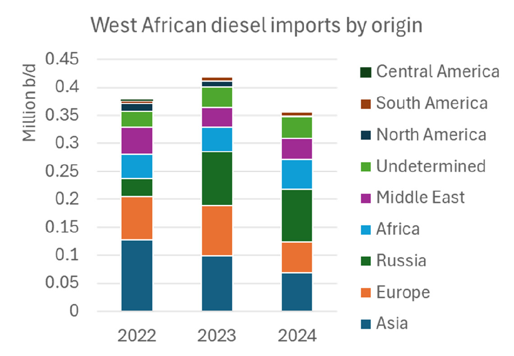

> **Figure 9: Market Chart 9**  
> [Local Asset](file:///C:/Users/Dell/Github/Shipping/corpus/03-breakwave/insights/2024/assets/2024-05-29_3adgr9d06xh9y2dm7e87zgs311yaqu_img_image8_26b9660375e0.png)

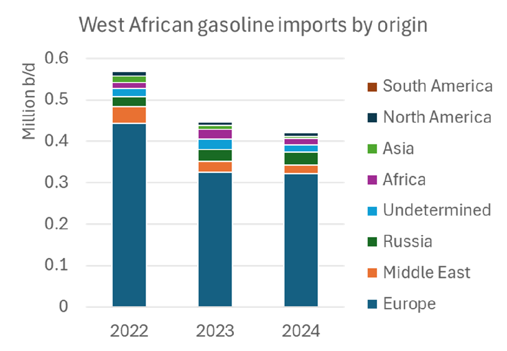

> **Figure 10: Market Chart 10**  
> [Local Asset](file:///C:/Users/Dell/Github/Shipping/corpus/03-breakwave/insights/2024/assets/2024-05-29_3adgr9d06xh9y2dm7e87zgs311yaqu_img_image9_6debdc2a6b77.png)

For now, Dangote produces over-specked product for the local market, but regional specifications are expected to quickly increase in line with local production.

### How Will Europe Adjust to Loss of West African Gasoline Demand?

The imminent loss of the West African market for Europe’s surplus gasoline in likely to force European refiners to look for outlets elsewhere, or cut runs. Today almost one third of European gasoline exported beyond European shores ends up in West Africa. So far this year, West Africa has imported about 320k b/d of gasoline from European refineries.

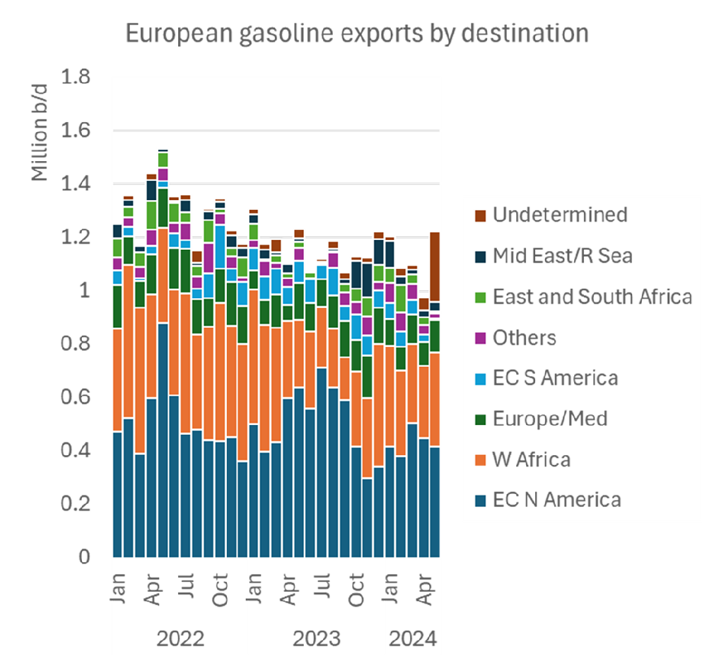

> **Figure 11: Market Chart 11**  
> [Local Asset](file:///C:/Users/Dell/Github/Shipping/corpus/03-breakwave/insights/2024/assets/2024-05-29_3adgr9d06xh9y2dm7e87zgs311yaqu_img_image10_6e14786c6026.png)

The East Coast of N America currently imports another 430k b/d of gasoline (average so far this year) from Europe. But the US East Coast is unlikely to lift imports of European gasoline in coming months. Instead, US Gulf refiners will be hoping that US Atlantic Coast demand will offset some of the decline it is experiencing from its all-important Mexican demand base. Mexico’s government needs to demonstrate a strong shift to energy self-sufficiency before elections next month, so further erosion of US gasoline imports is likely.

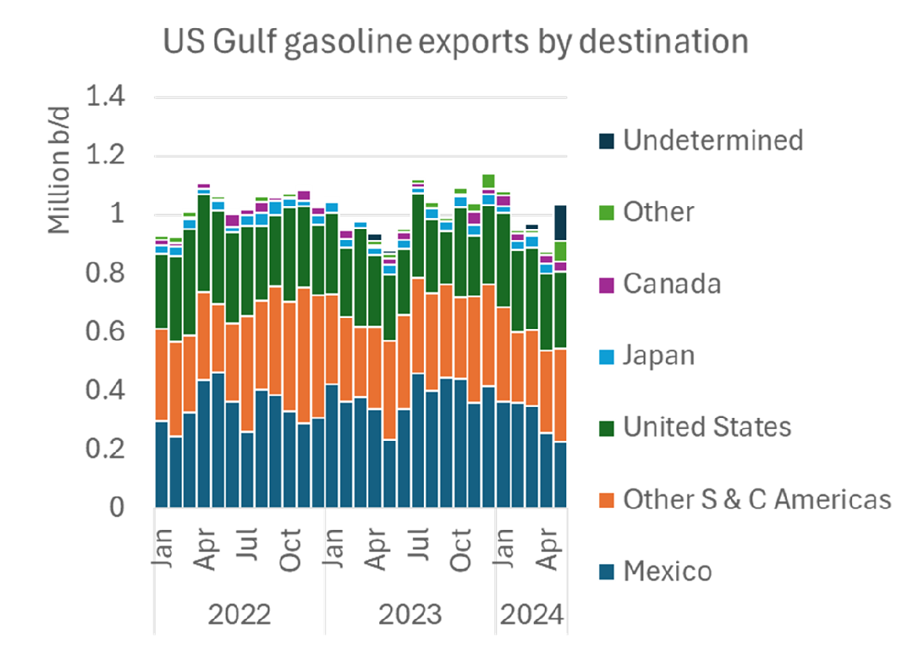

> **Figure 12: Market Chart 12**  
> [Local Asset](file:///C:/Users/Dell/Github/Shipping/corpus/03-breakwave/insights/2024/assets/2024-05-29_3adgr9d06xh9y2dm7e87zgs311yaqu_img_image11_8e23e9f89f13.png)

In 2023 around 380k b/d of US Gulf gasoline moved into Mexico. This volume has been in decline since the start of the year as Mexico ramped up its domestic gasoline production. Production from Mexico’s new Dos Bocas refinery has been delayed. Today only 177k b/d of crude is expected to be processed by the end of this year before hitting full production in 2025.

### How Does the Us Deal with the Loss of Mexican Crude?

The heavily-delayed Dos Bocas refinery does not appear to have prevented a precipitous decline in US imports of (mostly Mayan) crude oil from Mexico. US Gulf imports of Mexican crude oil hit a fresh low of 465k b/d in April – the last full month for which discharge data is available – compared to an average of 770k b/d last year.

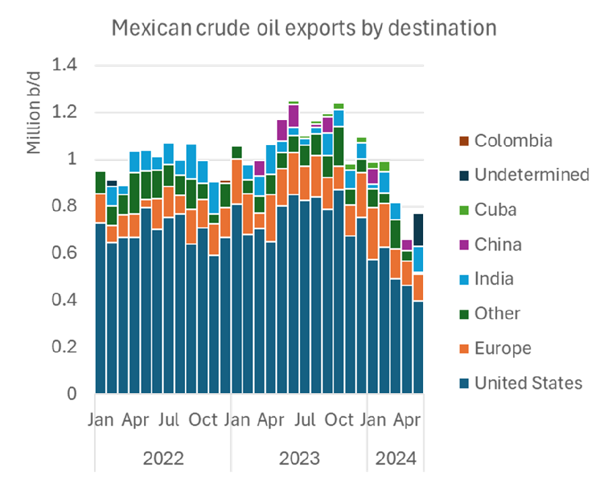

> **Figure 13: Market Chart 13**  
> [Local Asset](file:///C:/Users/Dell/Github/Shipping/corpus/03-breakwave/insights/2024/assets/2024-05-29_3adgr9d06xh9y2dm7e87zgs311yaqu_img_image12_369f64cfe82a.png)

Arrivals of Mexican crude into the US Gulf have picked up so far in May, but US Gulf refiners have nonetheless compensated for some of this year’s loss of Mexican crude by increasing crude purchasing from the Middle East, Colombia and Venezuela. Crude arrivals from the Middle East on VLCCs were up from 133k b/d in Jan 2024 to 267k b/d so far in May. US Gulf crude imports from Venezuela on Aframaxes have risen from 138k b/d in Jan to 222k b/d thus far in May, largely at the expense of Venezuelan exports to China. Colombian crude imports are up from 133k b/d to 174k b/d over the same period.

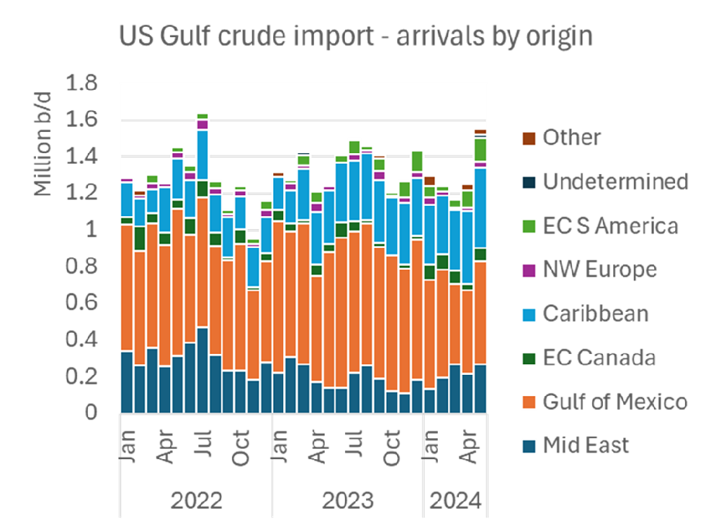

> **Figure 14: Market Chart 14**  
> [Local Asset](file:///C:/Users/Dell/Github/Shipping/corpus/03-breakwave/insights/2024/assets/2024-05-29_3adgr9d06xh9y2dm7e87zgs311yaqu_img_image13_98283bb85ebd.png)

With US sanctions on Venezuelan crude oil sector back in place this month, we expect a slight fall in US Gulf intake of Venezuelan crude from June onwards.

### Tmx Starts to Shake Up Us West Coast Tanker Market

US West Coast crude sourcing also faces disruption this month with the startup of 590k b/d TMX pipeline expansion, which loaded its first cargo in Vancouver this week. The volume, and destination of these new Canadian flows is still uncertain, as indeed is the size vessel it will benefit. Once running at full tilt, the 590k b/d capacity of the new pipeline requires roughly one Aframax lifting per day on top of existing volumes. Unusually efficient scheduling will be required to avoid logistical disruption.

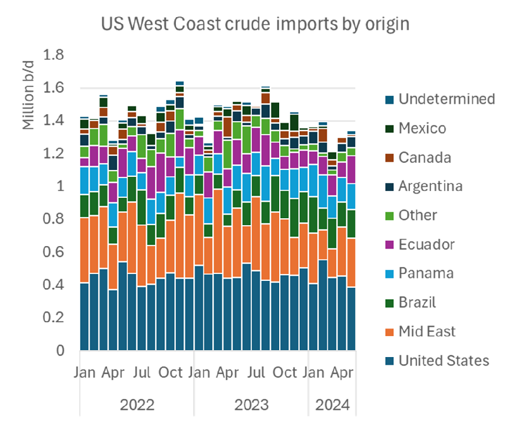

> **Figure 15: Market Chart 15**  
> [Local Asset](file:///C:/Users/Dell/Github/Shipping/corpus/03-breakwave/insights/2024/assets/2024-05-29_3adgr9d06xh9y2dm7e87zgs311yaqu_img_image14_afed5413a30b.png)

Much of the new Canadian crude flows are expected to head to US West Coast refineries, displacing crude from the East coast of North and South America (arriving mostly from Alaska on Suezmaxes and Ecuador/Panama on Aframaxes and some Suezmaxes), but principally from the Middle East (mostly Iraq and Saudi Arabia) on VLCCs. Some analysts see this as net bearish for VLCCs. However, displaced Alaskan and South American crude would most likely head to Asia on VLCCs or Suezmaxes and Canadian crude via TMX will also be tempted towards north Asia and (as evidenced by Shell’s recent VLCC fixture) as far away as India.

This could well move on VLCCs. So far, some Aframaxes loaded with Canadian crude have been granted permission to reverse lighter onto VLCCs in the Pacific Area Lighterage off the coast of southern California, but it is uncertain for how long these STS transfers in US waters will be tolerated.

VLCC owners maintain that Chinese charterers have a clear preference for bringing Canadian crude in on a handful of VLCCs rather than a swarm of Aframaxes. This would therefore open the possibility of VLCCs discharging Middle Eastern crude into China then ballasting to California (or Panama) to load Canadian crude back to Asia after ship-to-ship transfer.

---

**Tags:** Crude, Tankers, Shipping  
