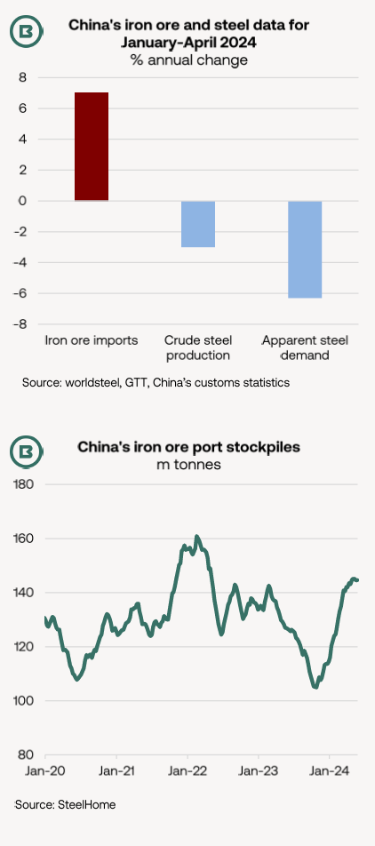
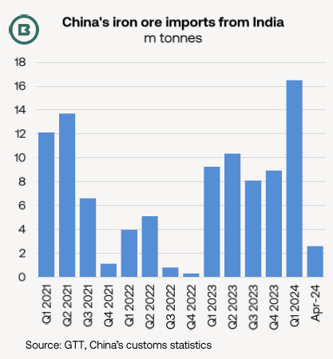

# The Big Picture: Dry Bulk 360 Degrees

**Date:** May 29, 2024  
**Publisher:** Breakwave Advisors | **Category:** Market Insights  
**Original URL:** [https://www.breakwaveadvisors.com/insights/2024/5/29/the-big-picture-dry-bulk-360-degrees](https://www.breakwaveadvisors.com/insights/2024/5/29/the-big-picture-dry-bulk-360-degrees)  

---

- *As China’s iron ore imports climbed 7% year-on-year during January-April, apparent steel demand dropped by -6%, with iron ore inventory rising.*
- *Real estate still faces severe difficulties, but manufacturing has performed better.*
- *Squeezed steel mill margins increased Chinese interest in Indian low-grade iron ore, resulting in Supra/Ultramaxes benefitting from the country’s yearly import growth in January-April.*

A**seeming discrepancy**exists between the strong pace of iron ore imports in 2023-24 and somewhat disappointing levels of steel demand and production.

In the first four months of 2024**iron ore imports into China jumped 27m tonnes (+7%)**to 412m tonnes, echoing the corresponding leap of 30m tonnes in January-April 2023, customs data show.

At the same time—paradoxically—the country’s**crude steel output retreated -3% YoY**, with**apparent steel demand**(in other words, steel production, plus imports and minus exports)**sliding -6%**.

This in part demonstrates the large contribution from**continuing expansion in net steel exports to production levels**. Net exports grew by an**additional****7m tonnes**(+28%) YoY in January-April.

**Crucially, iron ore port stockpiles in China have jumped a massive 30m tonnes from end-2023 to 144.7m tonnes by 24 May**, data from SteelHome show. This involved an unbroken sequence of gains numbering 17 weeks.

**There is another angle to consider.**

It should also be noted that the 7% yearly increase in China’s iron ore imports reported by customs authorities is not reflected in some shipment data, which record similar volumes for 2024, but fewer for 2023.

> **Figure 1: Market Chart 1**  
> [Local Asset](file:///C:/Users/Dell/Github/Shipping/corpus/03-breakwave/insights/2024/assets/2024-05-29_the-big-picture-dry-bulk-360-degrees_img_image028129_1b856bd09420.png)

### What of the Well-Documented Real Estate Crisis in China?

In 2022-23 additions to China’s production capacity of hot rolled coil (HRC), a steel product used in manufacturing and exported directly, have helped support output levels.

Meanwhile,**measures to support the real estate market**have yet to deliver substantial improvement.

Earlier this month, the Ministry of Finance issued 1 trillion yuan ($138bn) of long-term special government bonds to increase liquidity in financial markets. However, of eight industries targeted for bonds, only urban is steel-intensive. Other measures announced this month included lower mortgage rates and downpayment requirements for homebuyers.

As yet, there has been**little upward move in Chinese steel prices**to suggest a firm shift in market fundamentals. Prices of rebar, a construction steel, may have edged higher in May, but still lag February’s levels.

Steel mill margins have been squeezed.

In January-April operating income in the steel sector dropped by -4.2% YoY, whereas total profit across all industrial enterprises increased by 4.3%, according to the National Bureau of Statistics.

### China’s Iron Ore Imports From India

Lower steel mill margins have incentivised purchases of lower Fe-content ore from India.

In 2023 India overtook South Africa to become the third-largest exporter of iron ore to China (after Australia and Brazil).

Moreover, at 16.5m tonnes, the**Q1 was the strongest quarter for Chinese imports of Indian iron ore since 2011**.

With April being a slower month for Chinese imports from India (confirmed at 2.6m tonnes) and monsoon rains likely to suppress Q3 volumes, near-term slowdown can be expected.

> **Figure 2: Market Chart 2**  
> [Local Asset](file:///C:/Users/Dell/Github/Shipping/corpus/03-breakwave/insights/2024/assets/2024-05-29_the-big-picture-dry-bulk-360-degrees_img_image128129_82ff5f7ba02f.png)

It is certainly possible though that the**Chinese annual import total ex-India of 36.6m tonnes in 2023 could be surpassed**this year.

**From a shipping perspective**, Supra/Ultramax demand has been a (perhaps surprising) beneficiary of China’s iron ore import preferences.

---

**Tags:** Drybulk, China, Iron Ore  
