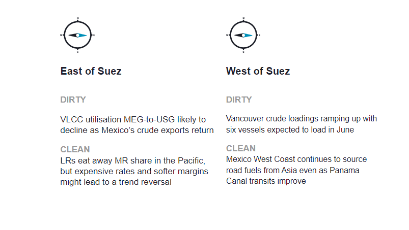
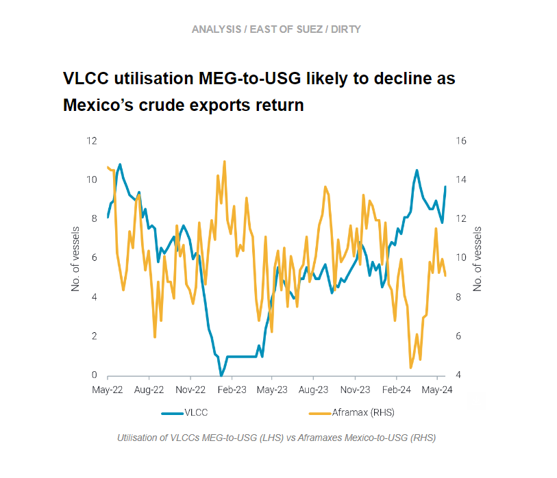
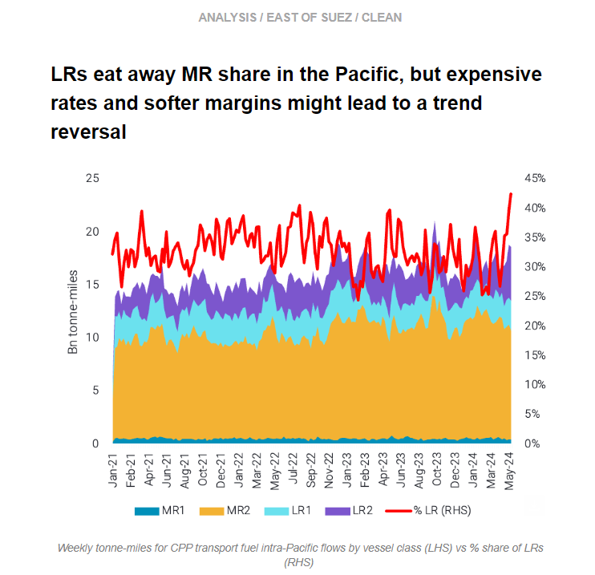
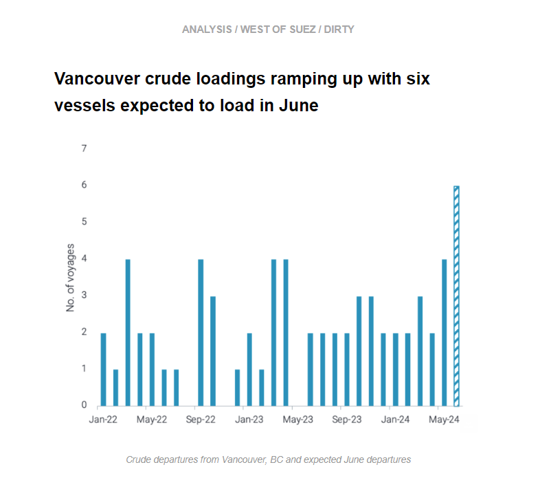
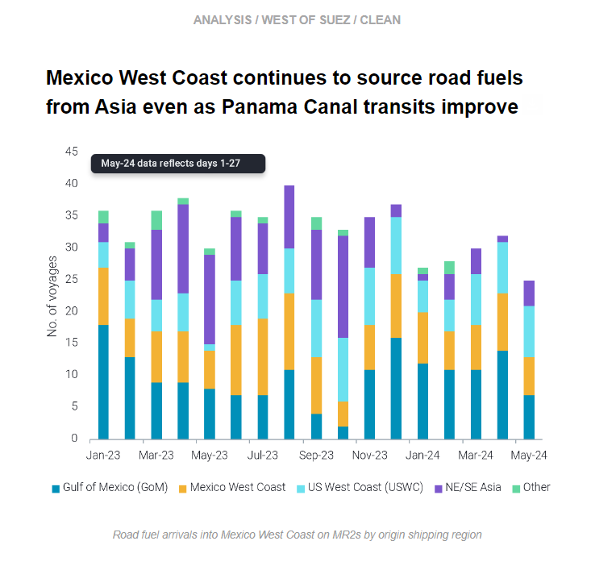

# VLCC utilisation MEG-to-USG likely to decline

**Date:** May 30, 2024  
**Publisher:** Breakwave Advisors | **Category:** Market Insights  
**Original URL:** [https://www.breakwaveadvisors.com/insights/2024/5/30/vlcc-utilisation-meg-to-usg-likely-to-decline](https://www.breakwaveadvisors.com/insights/2024/5/30/vlcc-utilisation-meg-to-usg-likely-to-decline)  

---

This week, in the East, we discuss why the return of Mexico’s crude exports is likely to dampen VLCC utilisation Middle East-to-US Gulf. On the clean side, we look at how LRs are eating away MR market share in the Pacific. In the West, we give an update on Aframax loadings in Vancouver since the TMX opening, and we investigate Mexico West Coast’s demand for transpacific road fuel cargoes and the impact on MRs.

*By*[*Mary Melton*](https://www.linkedin.com/search/results/all/?fetchDeterministicClustersOnly=true&heroEntityKey=urn%3Ali%3Afsd_profile%3AACoAABXVyecBtg-pRnIrZe0BoWk0ygPiUfbvhsw&keywords=mary%20melton&origin=RICH_QUERY_SUGGESTION&position=0&searchId=40e8d7d2-c4d0-4022-81e7-176f6eba418b&sid=H_Y&spellCorrectionEnabled=false)

> **Figure 1: Στιγμιότυπο Οθόνης 2024 05 30 104541**  
> **Interactive Data & Source:** [Marketingmail Vortexa](https://marketingmail.vortexa.com/ODM3LU1aRS01NzgAAAGTY5-iVC1_0iRg1eSmMBEidXwr2XOu6DBdqeH-qW8Fot8PKlh2CCDG2lKBQzJg_b8lB713lXs=) | [Local Asset](file:///C:/Users/Dell/Github/Shipping/corpus/03-breakwave/insights/2024/assets/2024-05-30_vlcc-utilisation-meg-to-usg-likely-to-decline_img_cea3cf84ceb9ceb3cebcceb9cf8ccf84cf85_5584735caefe.png)

> **Figure 2: Στιγμιότυπο Οθόνης 2024 05 30 104606**  
> **Interactive Data & Source:** [Marketingmail Vortexa](https://marketingmail.vortexa.com/ODM3LU1aRS01NzgAAAGTY5-iVC1_0iRg1eSmMBEidXwr2XOu6DBdqeH-qW8Fot8PKlh2CCDG2lKBQzJg_b8lB713lXs=) | [Local Asset](file:///C:/Users/Dell/Github/Shipping/corpus/03-breakwave/insights/2024/assets/2024-05-30_vlcc-utilisation-meg-to-usg-likely-to-decline_img_cea3cf84ceb9ceb3cebcceb9cf8ccf84cf85_37afd1ebac29.png)

- [Mexico’s crude exports](https://marketingmail.vortexa.com/ODM3LU1aRS01NzgAAAGTY5-iVC1_0iRg1eSmMBEidXwr2XOu6DBdqeH-qW8Fot8PKlh2CCDG2lKBQzJg_b8lB713lXs=)declined since January and hit a clear record-low in April. Exports are now recovering and have increased about 20% m-o-m so far in May (days 1-26). However, these volumes are still well-under historical levels. The loss of Mexico’s heavy crude prompted US Gulf refiners to turn to the Middle East.

- As a result,[VLCC utilisation MEG-to-USG](https://marketingmail.vortexa.com/ODM3LU1aRS01NzgAAAGTY5-iVaONCSZQEa1fme1lRyoFYqg_UdbKMYn5DOQzZvoFuY9umwtm5rXUMoIPyKvRGQCos64=)hit 2-year highs in mid-March, and remained at levels above those seen throughout last year. However, as Mexico’s crude exports increase, it is likely demand for these Middle East cargoes will decrease, further dampening VLCC employment on this route and keeping the tonnage in the MEG.
- [Aframax utilisation](https://marketingmail.vortexa.com/ODM3LU1aRS01NzgAAAGTY5-iVIaNTsdWbv1tXkzOjdzTEBMe52FqBkaFnhvbvPH80BEx3H9QGKyeT4gD3UUdif5R6oE=)for Mexican crude to the USG has continued to recover, demonstrating how US refiners favour short-haul heavy crude whenever it is available. However, in the longer-term the start-up of the Olmeca Refinery and higher domestic consumption of Mexican crude could support MEG-to-USG VLCC utilisation again.

> **Figure 3: Στιγμιότυπο Οθόνης 2024 05 30 105814**  
> **Interactive Data & Source:** [Marketingmail Vortexa](https://marketingmail.vortexa.com/ODM3LU1aRS01NzgAAAGTY5-iVDprXJcKnfaxvDlG2Fml25R7sK3iH7ufFgkXt1cDvkiS88sZwogXGGD1acjPweLfFm0=) | [Local Asset](file:///C:/Users/Dell/Github/Shipping/corpus/03-breakwave/insights/2024/assets/2024-05-30_vlcc-utilisation-meg-to-usg-likely-to-decline_img_cea3cf84ceb9ceb3cebcceb9cf8ccf84cf85_403aca2e6e2b.png)

- Demand for LRs in the Pacific for transport fuels has been currently at an all-time high as tonne-miles on these vessel classes surpass a 40% market share for intra-Pacific traffic at the expense of the smaller-sized MR tankers.

- This has supported[TC1 and TC5 freight rates](https://marketingmail.vortexa.com/ODM3LU1aRS01NzgAAAGTY5-iVDprXJcKnfaxvDlG2Fml25R7sK3iH7ufFgkXt1cDvkiS88sZwogXGGD1acjPweLfFm0=)(LR2 and LR1), which have materialised a mini-rally, surging by around 30% and 25% m-o-m respectively.
- Nevertheless, a trend reversal might be on the cards on the back of softer MR freight rates i[n the Pacific](https://marketingmail.vortexa.com/ODM3LU1aRS01NzgAAAGTY5-iVFST-kgyb_uDipNI6DY3QT0-okujIzrb3FOokGkcOPz0h-RapSMqKIcBk8-I-pD0fAc=)amidst a weaker demand outlook in the region. This is reflected in weak refining margins which could also result in smaller parcelling requirements. Read more about NE Asia’s refining outlook[here](https://marketingmail.vortexa.com/ODM3LU1aRS01NzgAAAGTY5-iVOJTkOuFkUyM4f-zQ3ldC4FzlsGR15LUT-lGDilL43xpAWZXtuAUIu9sPfWmU7TabNU=).

> **Figure 4: Στιγμιότυπο Οθόνης 2024 05 30 105932**  
> **Interactive Data & Source:** [Marketingmail Vortexa](https://marketingmail.vortexa.com/ODM3LU1aRS01NzgAAAGTY5-iVGkyYDFy9LbKan5cfzz29mefOmqVN6JQgT6Ugr91j8xQdYJELSo6a5nskrmOyouY6rI=) | [Local Asset](file:///C:/Users/Dell/Github/Shipping/corpus/03-breakwave/insights/2024/assets/2024-05-30_vlcc-utilisation-meg-to-usg-likely-to-decline_img_cea3cf84ceb9ceb3cebcceb9cf8ccf84cf85_4239087f2f4d.png)

- Four Aframaxes have loaded from Vancouver’s Westridge Marine Terminal so far in May. DUBAI ANGEL (chartered by Suncor) is en route to Laizhou, China and expected to discharge during the second week of June with the cargo most likely bought by Sinochem.

- The second vessel to load was AQUALEADER, which made a short voyage to P66 Ferndale Refinery in Washington state instead of China as expected earlier. These were followed by GARIBALDI SPIRIT - en route to Chevron El Segundo refinery in California - and PACIFIC RUBY, which is yet to declare a destination.
- For June, we have[six ballast vessels declaring for Vancouver](https://marketingmail.vortexa.com/ODM3LU1aRS01NzgAAAGTY5-iVGkyYDFy9LbKan5cfzz29mefOmqVN6JQgT6Ugr91j8xQdYJELSo6a5nskrmOyouY6rI=)and expected to load for the time being.

> **Figure 5: Στιγμιότυπο Οθόνης 2024 05 30 105956**  
> **Interactive Data & Source:** [Marketingmail Vortexa](https://marketingmail.vortexa.com/ODM3LU1aRS01NzgAAAGTY5-iVNn5UDDdjeNR_Ip6D2DLyEP0J5z5IGYFBw-WwkYG_QAaPY4D7OVjpUVTj3YEJj0AGJQ=) | [Local Asset](file:///C:/Users/Dell/Github/Shipping/corpus/03-breakwave/insights/2024/assets/2024-05-30_vlcc-utilisation-meg-to-usg-likely-to-decline_img_cea3cf84ceb9ceb3cebcceb9cf8ccf84cf85_25046a42bbcc.png)

- Mexico West Coast is still[sourcing road fuel from NE and SE Asia](https://marketingmail.vortexa.com/ODM3LU1aRS01NzgAAAGTY5-iVNn5UDDdjeNR_Ip6D2DLyEP0J5z5IGYFBw-WwkYG_QAaPY4D7OVjpUVTj3YEJj0AGJQ=), even after high refinery runs in recent months.[MR2 arrivals into the region](https://marketingmail.vortexa.com/ODM3LU1aRS01NzgAAAGTY5-iVAxQ8ZiihSie7wnfm9NujxTphQbhM5VZ-jKvG-hAHCwGT9crD1NiMiCSvn3ZjI2j6LI=)from NE and SE Asia accounted for 16% of May’s arrivals on a voyage count basis (days 1-27). Additionally, high voyage counts from the West Coast Americas (Mexico West Coast and US West Coast) point to the continued reliance on supplies from outside the US Gulf.

- At the same time, voyages from the US Gulf to Mexico West Coast are at healthy levels. As Panama Canal transits continue to recover, it is easier for vessels to move from West Coast Mexico back to the US Gulf after the discharge in Mexico. This increasing optionality for MR2s due to the easing of transit issues makes a transit to the Pacific Coast more manageable.
- Moving forward, reports of continued prompt buying of gasoline cargoes by Pemex for loadings from Singapore and China (Argus) will continue to bring MR2 supply transpacific. This could keep vessels in North America (both PADD 3 and PADD 5), especially as tanker demand in APAC is relatively muted with current weak refining margins.

Data Source:[Vortexa](https://www.vortexa.com//oil-gas-data-traders-analysts-data-scientists?gclid=Cj0KCQjw8_qRBhCXARIsAE2AtRZKOvMnbilZ_6_91d7huSFFy71pWLrnPwGwOHVzXsmsG-1a1mZnQw8aAt89EALw_wcB&hsa_acc=1782073842&hsa_ad=548425387665&hsa_cam=14746637662&hsa_grp=125038601902&hsa_kw=&hsa_mt=&hsa_net=adwords&hsa_src=g&hsa_tgt=dsa-1431852288425&hsa_ver=3&utm_campaign=%5BCD%5D%20-%20DSA%20-%20EMEA&utm_medium=cpc&utm_medium=ppc&utm_source=google&utm_source=adwords&utm_term=)

---

**Tags:** Shipping, Crude Oil, Tankers  
