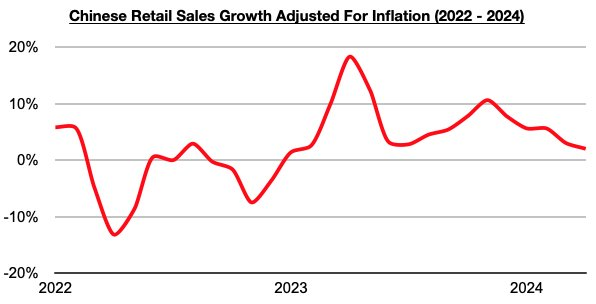

# Chinese Consumers Buying More Goods, But Strength Is Lessening

**Date:** May 31, 2024  
**Publisher:** Breakwave Advisors | **Category:** Market Insights  
**Original URL:** [https://www.breakwaveadvisors.com/insights/2024/5/31/5e6rjfxk0fvkss9wnk811q9r3k8o3k](https://www.breakwaveadvisors.com/insights/2024/5/31/5e6rjfxk0fvkss9wnk811q9r3k8o3k)  

---

*By*[*Jeffrey Landsberg*](https://www.linkedin.com/in/jeffrey-landsberg-70ab957/)

China’s retail sales in April grew year-on-year by only 2.3%, which is even lower than the 3.1% growth seen in March. Taking April’s 0.3% inflation into account, China's retail sales adjusted for inflation grew year-on-year by only 2%, which marks the lowest growth seen since January 2023.

> **Figure 1: Chart**  
> [Local Asset](file:///C:/Users/Dell/Github/Shipping/corpus/03-breakwave/insights/2024/assets/2024-05-31_5e6rjfxk0fvkss9wnk811q9r3k8o3k_img_chart_a770e1f9fc44.jpg)

China’s retail sales growth has continued to decline from November’s peak. Significant, though, is that retail sales have still come in higher than inflation during each of the last sixteen months (prior to these last adjusted months, retail sales growth had come in lower than inflation for four straight months). Overall, it remains positive that Chinese consumers continue to buy more goods than they did a year ago, which cannot be said about consumers in many other major economies.

In the United States, for example, citizens continue to buy less goods than they did a year ago. US retail sales growth has now come in under inflation during fourteen of the last eighteen months, including every month this year. Contractions also remain ongoing in various other developed nations.

---

**Tags:** China, Economy, Markets  
