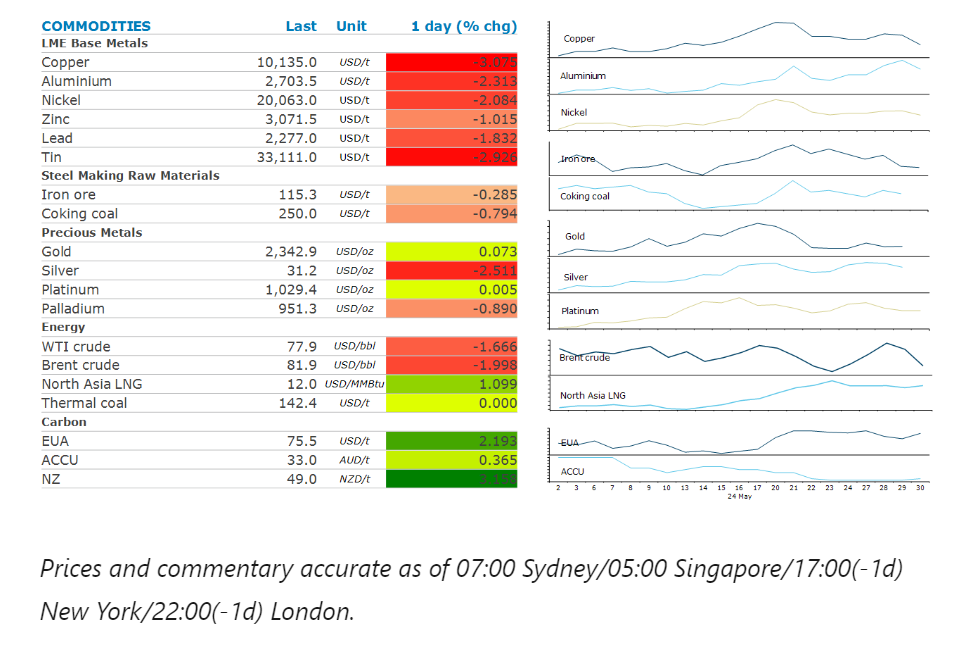
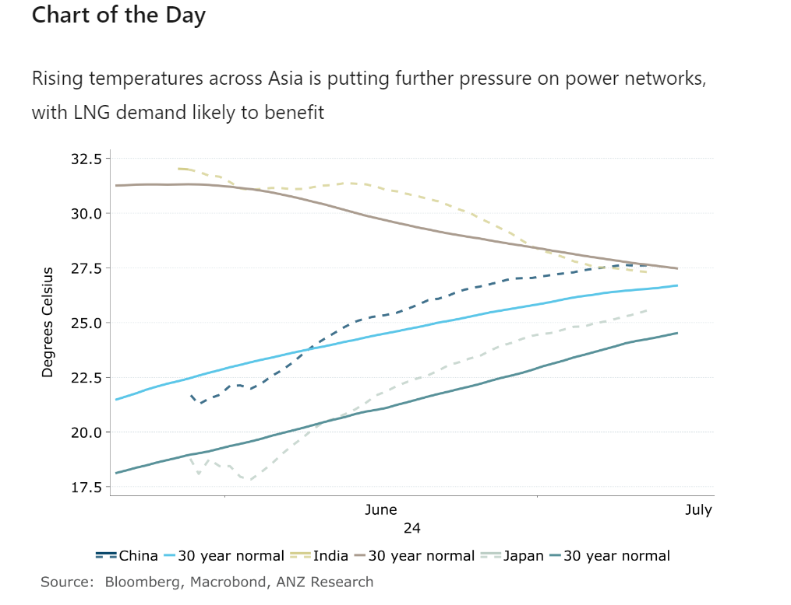

# Strong Asian demand pushed global gas prices higher

**Date:** May 31, 2024  
**Publisher:** Breakwave Advisors | **Category:** Market Insights  
**Original URL:** [https://www.breakwaveadvisors.com/insights/2024/5/31/strong-asian-demand-pushed-global-gas-prices-higher](https://www.breakwaveadvisors.com/insights/2024/5/31/strong-asian-demand-pushed-global-gas-prices-higher)  

---

Profit taking continued to weigh on prices across energy and metal markets. A weaker USD helped push precious metals higher.

*By*[*Daniel Hynes*](https://www.linkedin.com/in/dahynes/)

> **Figure 1: Στιγμιότυπο Οθόνης 2024 05 31 101633**  
> [Local Asset](file:///C:/Users/Dell/Github/Shipping/corpus/03-breakwave/insights/2024/assets/2024-05-31_strong-asian-demand-pushed-global-gas-prices-higher_img_cea3cf84ceb9ceb3cebcceb9cf8ccf84cf85_54d33e133d86.png)

### Market Commentary

**Global gas**prices gained amid heightened concerns over strong Asian demand. Extreme weather is putting pressure on Asian power markets. The job of meeting peak demand will likely rest with fossil fuels. The world posted an 11th month of record-breaking heat in April, with warmer conditions engulfing Asia. This has seen electricity prices rise strongly. Peak electricity demand in India edged above 235GW this week, a record for May. Similar but less severe weather is also affecting China, Japan and Thailand. Asia will need to rely on fossil fuels to meet this peak demand in coming months. There has already been a rise in coal imports in China. However,[**natural gas is likely to see the greatest benefit to demand**](../pdfs/2024-05-31_strong-asian-demand-pushed-global-gas-prices-higher_commodity-call-heating-up_9abca608e4c3.pdf). Imports have been rising since April in countries including China and India. This should leave the LNG market finely balanced. However, we see the risk around demand remaining firmly on the upside. Further, above average temperatures and more curtailment to renewable energy sources would quickly tighten the market and push global gas prices higher.

A large fall in US stockpiles failed to boost sentiment in the**crude oil**market. Commercial inventories fell 4,156kbbl last week, according to Energy Information Administration data. This was against market expectations of a fall of only 1.15kbbl. However, the market was more concerned about the rise in gasoline and distillate inventory, which rose 2,012kbbl and 2,544kbbl respectively. Gasoline’s implied demand also fell slightly to 9.148mb/d. This comes as the US driving season kicked off over the Memorial Day weekend. Sentiment was also impacted by US GDP, which was revised lower. The recent weakness in crude oil is likely to put pressure on OPEC to further support the market. Reports have emerged which suggest the oil group is looking at options to extend production curbs into 2025. It may also look to tighten compliance to current quotas as several members continue to overproduce.

**Gold**steadied on prospects of rate cuts later this year. It has been under pressure this week following hawkish comments from several Fed speakers. However, the Fed’s John Williams said he expects inflation to continue to fall in the second half of the year. This saw yields on US Treasuries fall and the USD weaken, providing some support to investor demand.

**Copper**led the base metals sector lower as profit taking accelerated. It recorded its sixth daily decline in seven sessions and is now looking like it will break back below USD10,000/t. Tentative improvements in the manufacturing and industrial sectors triggered a shift in sentiment earlier this month. This has been underpinned by ongoing supply side issues. However, data has failed to reflect any significant pick-up in demand.**Aluminium’s**decline was offset by the prospect of future supply cuts in China. Beijing announced new capacity limits on alumina refineries. It also reaffirmed strict implementation of the aluminium swap scheme, where any new smelter needs to be matched by the closing of an existing one.

> **Figure 2: Στιγμιότυπο Οθόνης 2024 05 31 101730**  
> **Interactive Data & Source:** [Linkedin](https://www.linkedin.com/newsletters/commodities-wrap-6692196755876012032/?fbclid=IwAR3kiXJqZdxmp9ZcRwBNI7FsBySI-XSC0pfPur1qzjt7OZp7PTE59Tsl1QI) | [Local Asset](file:///C:/Users/Dell/Github/Shipping/corpus/03-breakwave/insights/2024/assets/2024-05-31_strong-asian-demand-pushed-global-gas-prices-higher_img_cea3cf84ceb9ceb3cebcceb9cf8ccf84cf85_6677a4a02d84.png)

Data source:[Commodities Wrap](https://www.linkedin.com/newsletters/commodities-wrap-6692196755876012032/?fbclid=IwAR3kiXJqZdxmp9ZcRwBNI7FsBySI-XSC0pfPur1qzjt7OZp7PTE59Tsl1QI)

---

**Tags:** Commodities, Economy, Markets  
