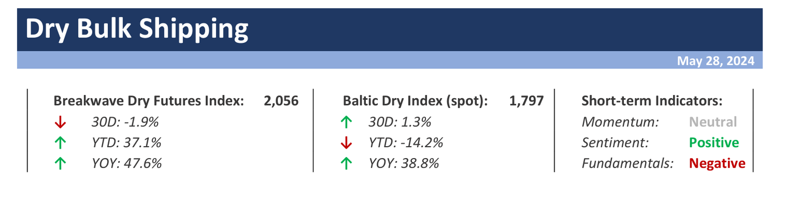

# Weekly Insights Review

**Date:** May 31, 2024  
**Publisher:** Breakwave Advisors | **Category:** Market Insights  
**Original URL:** [https://www.breakwaveadvisors.com/insights/2024/5/31/weekly-insights-review](https://www.breakwaveadvisors.com/insights/2024/5/31/weekly-insights-review)  

---

## Welcome to Our Weekly Insights Review

## Read Here Everything You Need to Know

## Breakwave Dry Bulk Report

**Dry bulk spot rates move closer to seasonal averages as summer begins –**With the**strongest first quarter for Capesizes in 14 years**behind us, dry bulk rates have**now moved closer to the typical**rate for this time of the year, with the Baltic Dry Index sitting at roughly 15% above the 7-year average.

> **Figure 1: Dry+report+top**  
> **Interactive Data & Source:** [Breakwave Advisors Market Insights](https://www.breakwaveadvisors.com/insights/2024/5/27/bafwp3ot2by3dhfu1qe1am2ttrykw7) | [Local Asset](file:///C:/Users/Dell/Github/Shipping/corpus/03-breakwave/insights/2024/assets/2024-05-31_weekly-insights-review_img_dry2breport2btop_c29fc0ecfd5d.png)

> **Figure 2: Read More**  
> **Interactive Data & Source:** [Breakwave Advisors Market Insights](https://www.breakwaveadvisors.com/insights/2024/5/27/bafwp3ot2by3dhfu1qe1am2ttrykw7) | [Local Asset](file:///C:/Users/Dell/Github/Shipping/corpus/03-breakwave/insights/2024/assets/2024-05-31_weekly-insights-review_img_image-asset_49b2e0dc39fb.jpeg)

## Amidst Challenging Conditions in the Steel and Property Markets

Doric Weekly Market Insight

Baltic indices continue to express skepticism about the tangible impact of the latest Chinese measures, with trends mostly sideways during the twenty-first trading week.

> **Figure 3: Market Chart 3**  
> **Interactive Data & Source:** [Breakwave Advisors Market Insights](https://www.breakwaveadvisors.com/insights/2024/5/27/latest-developments-for-chinas-excess-housing-supply) | [Local Asset](file:///C:/Users/Dell/Github/Shipping/corpus/03-breakwave/insights/2024/assets/2024-05-31_weekly-insights-review_img_image-asset28129_ada46d3b9bd9.jpeg)

## Latest Developments for China's Excess Housing Supply

From Commodore's Weekly Dry Bulk Reports

April ended with 746 million square meters of floor space available in China's commercial buildings (which includes residential buildings).

[Read More](https://www.breakwaveadvisors.com/insights/2024/5/27/latest-developments-for-chinas-excess-housing-supply)

> **Figure 4: Market Chart 4**  
> **Interactive Data & Source:** [Breakwave Advisors Market Insights](https://www.breakwaveadvisors.com/insights/2024/5/28/gxcojixxrgr12zhp5lag4me46kknzj) | [Local Asset](file:///C:/Users/Dell/Github/Shipping/corpus/03-breakwave/insights/2024/assets/2024-05-31_weekly-insights-review_img_image-asset28229_5af3f72f49f2.jpeg)

## Sentiment Buoyed by Signs of Economic Growth

Commodities Wrap

Trading was lacklustre with US and UK markets closed. However, sentiment was buoyed by signs of economic growth and dovish commentary from central bankers.

> **Figure 5: Market Chart 5**  
> **Interactive Data & Source:** [Breakwave Advisors Market Insights](https://www.breakwaveadvisors.com/insights/2024/5/28/northeast-asias-refineries-face-uncertainties-with-ramp-ups-post-turnaround) | [Local Asset](file:///C:/Users/Dell/Github/Shipping/corpus/03-breakwave/insights/2024/assets/2024-05-31_weekly-insights-review_img_image-asset28529_e6bdb15c16df.jpeg)

## Northeast Asia’s Refineries Face Uncertainties with Ramp Ups Post Turnaround

Vortexa Freight Weekly

Several Northeast Asian refiners are preparing to ramp up runs post maintenance, but a bearish margin outlook may force some to moderate runs.

> **Figure 6: Market Chart 6**  
> **Interactive Data & Source:** [Breakwave Advisors Market Insights](https://www.breakwaveadvisors.com/insights/2024/5/29/3adgr9d06xh9y2dm7e87zgs311yaqu) | [Local Asset](file:///C:/Users/Dell/Github/Shipping/corpus/03-breakwave/insights/2024/assets/2024-05-31_weekly-insights-review_img_image-asset28329_32bcf51d2868.jpeg)

## The Big Picture: Oil Supply Disrupters

Braemar - The real trade changers

Oil demand and geopolitics drive tanker demand, but this year more than most it is oil supply that will provoke the biggest shifts in tanker trade patterns.

> **Figure 7: Market Chart 7**  
> **Interactive Data & Source:** [Breakwave Advisors Market Insights](https://www.breakwaveadvisors.com/insights/2024/5/29/the-big-picture-dry-bulk-360-degrees) | [Local Asset](file:///C:/Users/Dell/Github/Shipping/corpus/03-breakwave/insights/2024/assets/2024-05-31_weekly-insights-review_img_image-asset28429_9ce78b9ad429.jpeg)

## The Big Picture: Dry Bulk 360 Degrees

Braemar - China’s iron ore and steel paradox

As China’s iron ore imports climbed 7% year-on-year during January-April, apparent steel demand dropped by -6%, with iron ore inventory rising.

> **Figure 8: Seanergy4**  
> **Interactive Data & Source:** [Breakwave Advisors Market Insights](https://www.breakwaveadvisors.com/insights/2024/5/30/baltic-dry-index-recorded-a-modest-retreat) | [Local Asset](file:///C:/Users/Dell/Github/Shipping/corpus/03-breakwave/insights/2024/assets/2024-05-31_weekly-insights-review_img_seanergy4_3e5b0f1bdf44.jpeg)

## Baltic Dry Index Recorded a Modest Retreat

The Fix - Global Market Update

The Baltic Dry Index recorded a modest retreat the day before yestrday, with weak demand in the mid-sized segments weighing on the headline indicator.

[Read More](https://www.breakwaveadvisors.com/insights/2024/5/30/baltic-dry-index-recorded-a-modest-retreat)

> **Figure 9: Market Chart 9**  
> **Interactive Data & Source:** [Breakwave Advisors Market Insights](https://www.breakwaveadvisors.com/insights/2024/5/30/vlcc-utilisation-meg-to-usg-likely-to-decline) | [Local Asset](file:///C:/Users/Dell/Github/Shipping/corpus/03-breakwave/insights/2024/assets/2024-05-31_weekly-insights-review_img_image-asset28629_761d9c32f443.jpeg)

## VLCC Utilisation MEG-to-USG Likely to Decline

Vortexa Freight Weekly

This week, in the East, we discuss why the return of Mexico’s crude exports is likely to dampen VLCC utilisation Middle East-to-US Gulf. On the clean side, we look at how LRs are eating away MR market share in the Pacific.

> **Figure 10: Reports**  
> **Interactive Data & Source:** [Breakwave Advisors Market Insights](https://www.breakwaveadvisors.com/insights/2024/5/30/opecs-dilemma) | [Local Asset](file:///C:/Users/Dell/Github/Shipping/corpus/03-breakwave/insights/2024/assets/2024-05-31_weekly-insights-review_img_reports_01511b1adf0e.jpg)

## Opec’s Dilemma

Gibson Tanker Market Report

Oil markets once again are carefully watching for any comments from OPEC+ officials, with speculation building what the group will decide during their upcoming meeting on June 2nd.

> **Figure 11: Market Chart 11**  
> **Interactive Data & Source:** [Breakwave Advisors Market Insights](https://www.breakwaveadvisors.com/insights/2024/5/31/5e6rjfxk0fvkss9wnk811q9r3k8o3k) | [Local Asset](file:///C:/Users/Dell/Github/Shipping/corpus/03-breakwave/insights/2024/assets/2024-05-31_weekly-insights-review_img_image-asset28729_dffb3310e667.jpeg)

## Chinese Consumers Buying More Goods, But Strength Is Lessening

From Commodore's Weekly Dry Bulk Reports

China’s retail sales in April grew year-on-year by only 2.3%, which is even lower than the 3.1% growth seen in March.

[Read More](https://www.breakwaveadvisors.com/insights/2024/5/31/5e6rjfxk0fvkss9wnk811q9r3k8o3k)

> **Figure 12: Market Chart 12**  
> **Interactive Data & Source:** [Breakwave Advisors Market Insights](https://www.breakwaveadvisors.com/insights/2024/5/31/strong-asian-demand-pushed-global-gas-prices-higher) | [Local Asset](file:///C:/Users/Dell/Github/Shipping/corpus/03-breakwave/insights/2024/assets/2024-05-31_weekly-insights-review_img_image-asset28829_7c53d52fed89.jpeg)

## Strong Asian Demand Pushed Global Gas Prices Higher

Commodities Wrap

Profit taking continued to weigh on prices across energy and metal markets. A weaker USD helped push precious metals higher.

> **Figure 13: 009**  
> **Interactive Data & Source:** [Breakwave Advisors Market Insights](https://www.breakwaveadvisors.com/insights/2024/5/31/gains-for-the-capesizes) | [Local Asset](file:///C:/Users/Dell/Github/Shipping/corpus/03-breakwave/insights/2024/assets/2024-05-31_weekly-insights-review_img_009_1d8e13d62721.jpg)

## Gains for the Capesizes

The Fix - Global Market Update

Gains for the capesizes amid improving demand were broadly offset by continued weakness for the panamaxes on Thursday, contributing to only a modest increase for the Baltic Dry Index.

---

**Tags:** Shipping, Markets, Economy  
