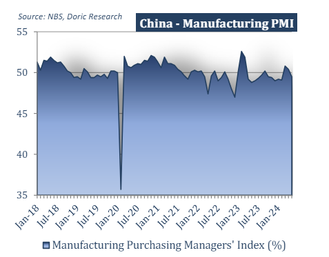

# Significant shifts have occurred in the spot market

**Date:** June 03, 2024  
**Publisher:** Breakwave Advisors | **Category:** Market Insights  
**Original URL:** [https://www.breakwaveadvisors.com/insights/2024/6/3/significant-shifts-have-occurred-in-the-spot-market](https://www.breakwaveadvisors.com/insights/2024/6/3/significant-shifts-have-occurred-in-the-spot-market)  

---

After a strong first quarter, April witnessed a downward correction, although rates remained higher than last year across all segments. May largely traded sideways, devoid of notable excitement but also steering clear of the steep downward corrections observed in the same period over the past couple of years.

*By*[*Michalis Voutsinas*](https://www.linkedin.com/in/michalis-voutsinas-587544163/)

In the spot market, last year’s mid-May steep downward correction resurfaced, with Baltic indices unable to resist the decline. The leading Capesize index signaled the retreat on Monday morning, and subsequently, all main indices trended downward. Reporting doubledigit weekly losses, the Baltic Capesize index ended the last full week of May at a two-month low of $13,956 daily. Similarly, Kamsarmax rates dropped sharply to late February levels, averaging $10,072 daily, a 64.4 percent decrease year-on-year. In the geared segments, the Baltic Supramax index fell to $10,403 daily, a level last seen on February 23. Meanwhile, the more stable Handysize segment closed at $10,585 daily on Friday, reaching a two-and-a-half-month low. This was the opening paragraph of our Weekly Insight one year ago.

Twelve months later, significant shifts have occurred in the spot market. After a strong first quarter, April witnessed a downward correction, although rates remained higher than last year across all segments. May largely traded sideways, devoid of notable excitement but also steering clear of the steep downward corrections observed in the same period over the past couple of years. With a monthly average of $23,145 per day, the leading Capesize index concluded today just a few dollars above its May average. Conversely, mid-size bulkers faced mild pressure over the past four weeks, ending May below their monthly average values. Specifically, both the Baltic Kamsarmax and Supramax indices finished the current trading month approximately $1,500 below their monthly averages, at $15,240 for BPI 5TC and $14,060 for BSI S10TC respectively. Despite being on a downward trend for much of May, Handies managed to regain some ground during the last few trading days, closing today just shy of $13,000 per day.

On the macroeconomic front, an International Monetary Fund (IMF) team visited China from May 16 to 28. Following the team's conclusion of the visit to the world’s second-largest economy, the IMF emphasized that China's economic growth is expected to "remain resilient" this year, propelled by robust first-quarter data and recent policy interventions. The IMF stated, “China's economic growth is projected to remain resilient at 5 percent in 2024 and slow to 4.5 percent in 2025. These projections reflect upward revisions of 0.4 percentage points for both years compared to the April World Economic Outlook (WEO) projections. Inflation is anticipated to increase but remain low as output stays below potential, with core inflation gradually rising to an average of 1 percent in 2024.” Moreover, the IMF highlighted, “The ongoing correction in the housing market, necessary for steering the sector towards a more sustainable trajectory, is expected to continue. Authorities have implemented various measures to guide the property market transition, including recent policy announcements concerning lending support for affordable housing. A comprehensive policy package would facilitate an efficient and less costly transition while guarding against downside risks.”

Despite the positivity injected by the IMF, China's manufacturing activity unexpectedly declined in May, intensifying calls for fresh stimulus as the prolonged property crisis in the world's secondlargest economy continues to dampen business, consumer, and investor confidence. According to the latest data published by the National Bureau of Statistics (NBS) on Friday, China’s official Manufacturing Purchasing Managers' Index (PMI) dropped from 50.4 in April to 49.5 in May. This reading fell well below the market consensus of 50.5 for the reported month, crossing below the crucial 50 mark that separates expansion from contraction. The NBS NonManufacturing PMI also decreased to 51.1 in May compared to April’s 51.2 figure and expectations of 51.5. Furthermore, retail sales last month experienced their slowest growth since December 2022, while new home prices plummeted at their fastest rate in nine years. These indicators suggest that it may be premature to conclude whether the beleaguered economy has reached a turning point.

> **Figure 1: Στιγμιότυπο Οθόνης 2024 06 03 093201**  
> **Interactive Data & Source:** [Doric](https://www.doric.gr/) | [Local Asset](file:///C:/Users/Dell/Github/Shipping/corpus/03-breakwave/insights/2024/assets/2024-06-03_significant-shifts-have-occurred-in-the-spot-market_img_cea3cf84ceb9ceb3cebcceb9cf8ccf84cf85_5a57ad671cdc.png)

Given these dynamics, iron ore futures continued to decline on Friday, ending the week lower due to softening near-term demand and uninspiring factory data from China. Throughout May, iron ore prices mostly moved sideways, lacking clear direction. In contrast, London copper prices rebounded on Friday after previous sell-offs, positioning the market for a modest monthly gain despite lingering weak physical demand in China. A speculative surge had pushed copper prices to record highs on May 20, but they subsequently fell amid profit-taking and concerns over the course of global economy. Baltic indices finished May at levels close to their year-to-date averages, showing little significant movement in either direction.

Data source:[Doric](https://www.doric.gr/)

---

**Tags:** Shipping, Drybulk, China  
