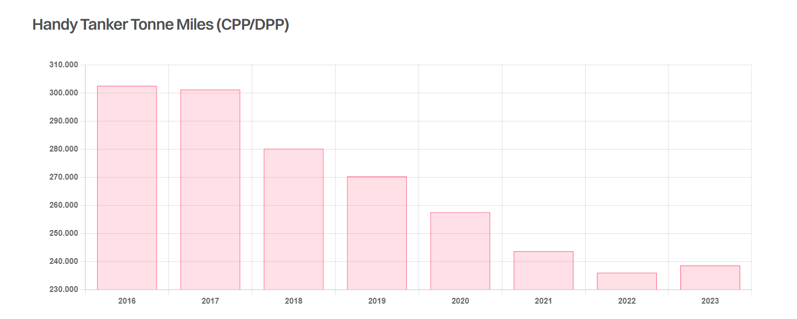

# Still Handy?

**Date:** June 03, 2024  
**Publisher:** Breakwave Advisors | **Category:** Market Insights  
**Original URL:** [https://www.breakwaveadvisors.com/insights/2024/6/3/still-handy](https://www.breakwaveadvisors.com/insights/2024/6/3/still-handy)  

---

> **Figure 1: Approach 2**  
> **Interactive Data & Source:** [Gibsons Co](https://www.gibsons.co.uk/market-reports) | [Local Asset](file:///C:/Users/Dell/Github/Shipping/corpus/03-breakwave/insights/2024/assets/2024-06-03_still-handy_img_approach-2_c21fe5da4c04.jpg)

Despite being the oldest deep sea tanker fleet, the Handy sector (32,000 – 42,000 dwt) has been the least invested tanker sector of the past decade. Whilst the Handy market has also been most impacted by the War in Ukraine, both from a sale and purchase and trading perspective, there is still a clear need for modern well approved tonnage, with the sector facing a major supply crunch in the years ahead.

From a demand perspective, one cannot hide the fact that demand has declined, with a reduction in Russian cargoes being the key factor. However, clean Handy demand has been stable since 2022, whilst the fleet continues to age. In the dirty market, demand also looks to be steady, with 2024 ytd tonne miles similar to 2023. Evidently for now the decline in demand appears to have paused.

Spot fixture activity has also evolved. Fixture numbers for Handies loading in the Med and NW Europe have grown steadily since 2021, as the need to distribute barrels across Europe has increased following the embargo on Russian oil. This has of course coincided with a drop on spot fixtures from Russia, although part of this drop will be attributable to a lack of transparency in Russian loadings. Nevertheless, it signals an increase in non-Russian trade, at a time where more Handies have been sold into the dark fleet.

From a supply perspective, as of today 74% of the fleet is over 15 years of age, whilst 29% stands over 20 years old. Due to the newbuilding boom prior to the financial crisis, we now see 223 vessels turning 20 years old between 2024 and 2028, with these vessels not being replaced, meaning that by 2028, ~70% of the Handy fleet could be over 20 years old. Today we count just 13 vessels on order, most of which are destined for specific trades. Given that the top charterers for Handies are typically European oil majors and large commodity traders, the ageing of the fleet is problematic. Whilst some vetting policies have had to adjust to market realities, stretching vetting criteria to accept vessels over 20 years of age may be step too far for many charterers.

As such, something needs to change. Either the market needs to move towards MR sized stems with port infrastructure being upgraded where possible, or if the market continues to prefer Handy sized tankers, then newbuilding investment will be required.

> **Figure 2: Στιγμιότυπο Οθόνης 2024 06 03 100014**  
> **Interactive Data & Source:** [Gibsons Co](https://www.gibsons.co.uk/market-reports) | [Local Asset](file:///C:/Users/Dell/Github/Shipping/corpus/03-breakwave/insights/2024/assets/2024-06-03_still-handy_img_cea3cf84ceb9ceb3cebcceb9cf8ccf84cf85_3d59220b2af8.png)

Data source:[Gibson Shipbrokers](https://www.gibsons.co.uk/market-reports)

---

**Tags:** Tankers, Shipping, Crude Oil  
