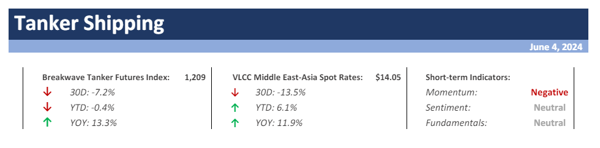
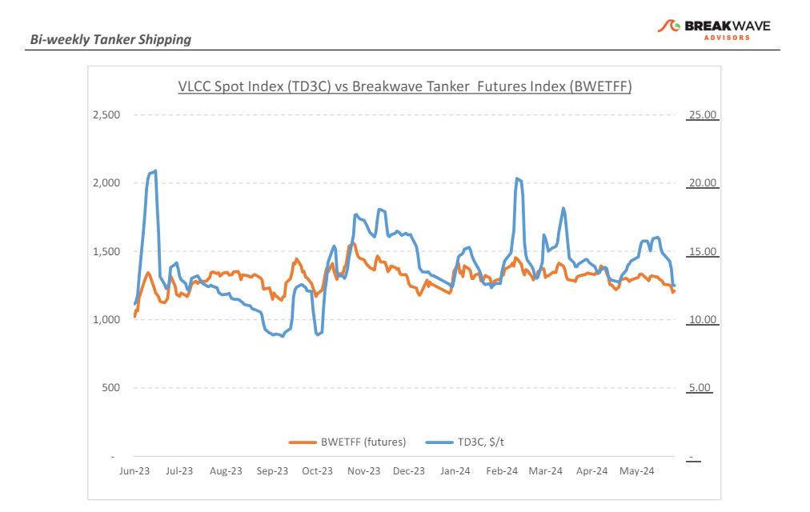
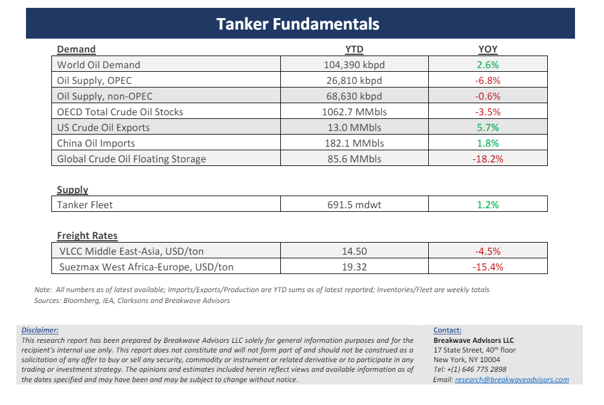

# Breakwave Bi-Weekly Tanker Report - June 4, 2024

**Date:** June 04, 2024  
**Publisher:** Breakwave Advisors | **Category:** Market Insights  
**Original URL:** [https://www.breakwaveadvisors.com/insights/202464wet](https://www.breakwaveadvisors.com/insights/202464wet)  

---

> **Figure 1: Cea3cf84ceb9ceb3cebcceb9cf8ccf84cf85**  
> [Local Asset](file:///C:/Users/Dell/Github/Shipping/corpus/03-breakwave/insights/2024/assets/2024-06-04_202464wet_img_cea3cf84ceb9ceb3cebcceb9cf8ccf84cf85_24fab1780f44.png)

·**VLCC Market Faces Downward Pressure Amid Sluggish Activity and OPEC+ Production Cuts –**The VLCC market is once again under**renewed pressure**as we enter the month of June. Although by Mid-May signs of firmness seemed evident driven by uncertainties about a potentially robust market heading into early summer, these expectations were dampened as concerns about an**oversupply of tonnage**proved to be well-founded and, as a result, the spot VLCC market weakened at the end of last week. On the key AG-China route, spot VLCC rates have now recorded an almost 40% decrease from the peak seen in mid-February, indicating**a continued downward trend**with some intermediate upside volatility due to temporary positional imbalances. Similarly, the West Africa-China route has also experienced a weakening momentum, with rates dropping by about 20% since mid-May. With stable oil supply expected throughout the summer at the current reduced OPEC+ production rates, it seems that once again the**doldrums will dominate sentiment**for the large oil tanker segment. Freight futures are also pricing in a slightly weaker but rather stable market for the next few months, and any surprise seems to lie on either a measurable tonnage positional imbalance or an unexpected geopolitical development, something that has been happening more often in the last few years. Finally, with a**miniscule orderbook**for VLCCs, any recovery in demand for crude oil will most likely have a disproportional positive impact on freight prices, an optionality that is currently not priced in the tanker freight futures curve, unlike other shipping segments.

·**OPEC+ meeting has something for everyone –**The June OPEC+ meeting resulted in a rather complicated announcement regarding future production levels. Although the primary headline of**extending production cuts**seemed bullish, the 2.2mbpd**voluntarily cuts are now set to expire**in September and then gradually add more barrels to the market for the next 15 months. The supply additions will be marginal from month to month, but it is clear that OPEC is anticipating stronger oil demand in the fourth quarter of the year and into 2025, a view that is not shared across the industry. The oil market reaction points to such a disagreement with OPEC’s own assessment, as**Brent crude oil prices declined**to the lowest level in three months following the announcement. We tend to believe that so far there is little evidence of an upcoming economic recovery, especially in**China**that in the last few months has experienced**muted oil demand**with May crude oil arrivals down from April. On the other hand, India continues to provide significant support to the global oil market, but due to the country’s proximity to the oil-rich Middle East, it is less important for the tanker market versus the longer-haul Asian regions.

·**Our Long-term View –**The tanker market is recovering from a long period of staggered rates as the growth in new vessel supply shrinks while oil demand is recovering in line with the global economy. A historically low orderbook combined with favorable demand fundamentals should continue to support increased spot rate volatility, which combined with the ongoing geopolitical turmoil, should support freight rates in the medium to long term.

> **Figure 2: Cea3cf84ceb9ceb3cebcceb9cf8ccf84cf85**  
> [Local Asset](file:///C:/Users/Dell/Github/Shipping/corpus/03-breakwave/insights/2024/assets/2024-06-04_202464wet_img_cea3cf84ceb9ceb3cebcceb9cf8ccf84cf85_e5f9b6c56a36.png)

> **Figure 3: Cea3cf84ceb9ceb3cebcceb9cf8ccf84cf85**  
> [Local Asset](file:///C:/Users/Dell/Github/Shipping/corpus/03-breakwave/insights/2024/assets/2024-06-04_202464wet_img_cea3cf84ceb9ceb3cebcceb9cf8ccf84cf85_93ace2f66e7e.png)

### Subscribe:
