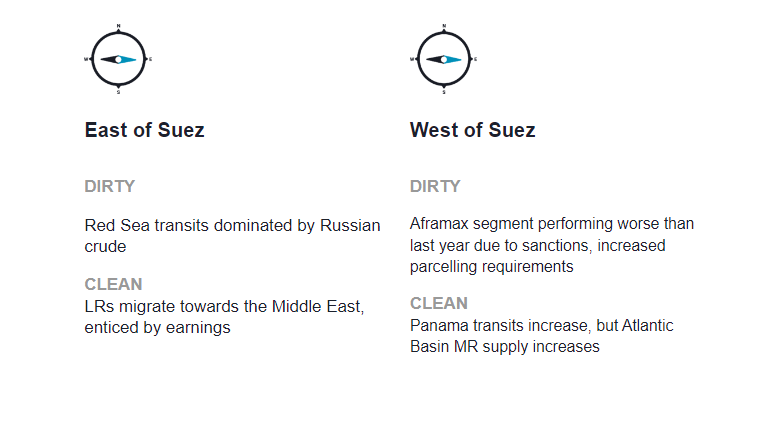
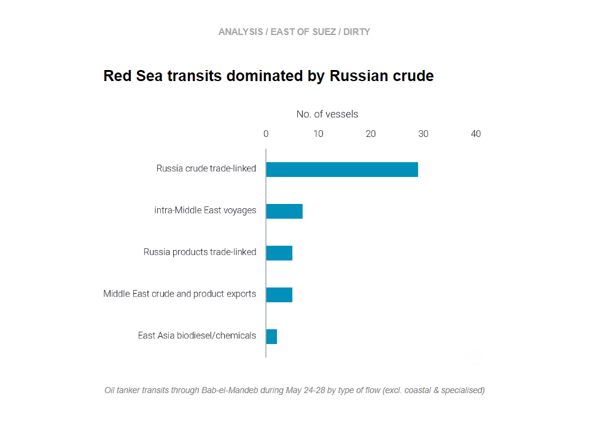
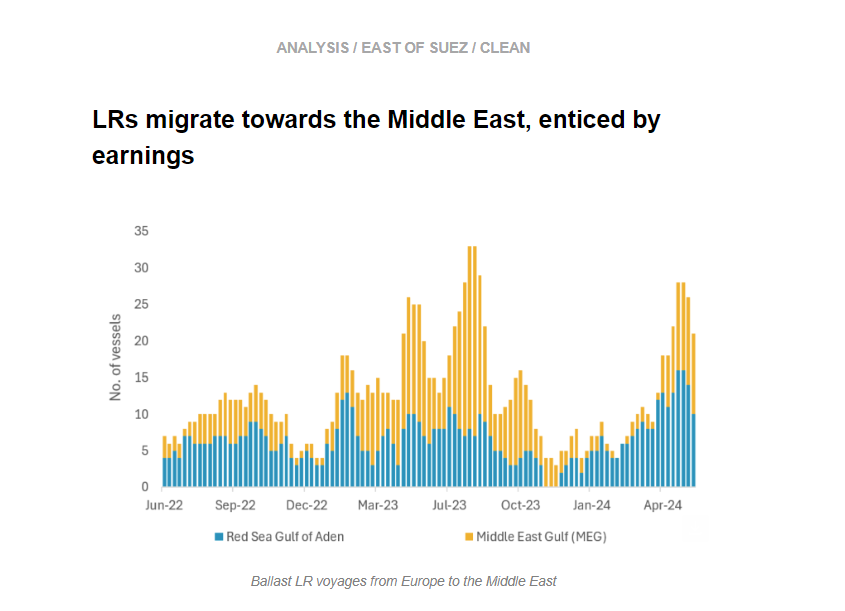
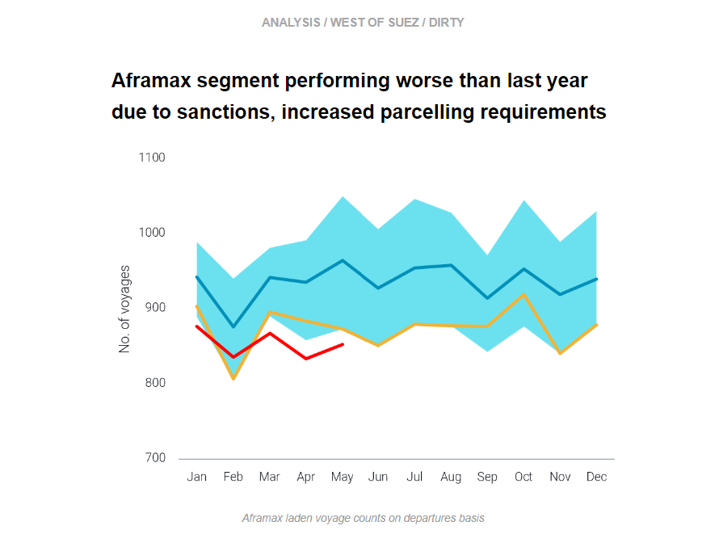
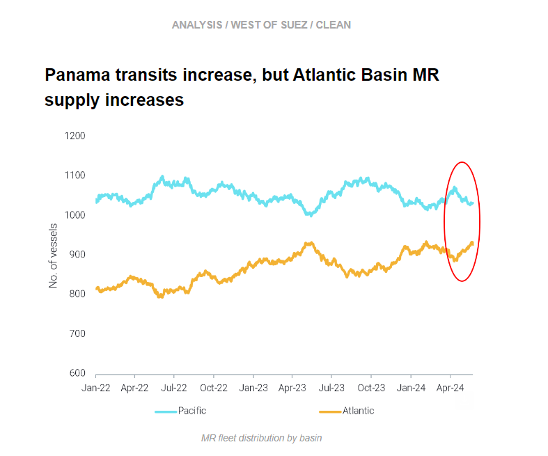

# Aframax performance muted

**Date:** June 05, 2024  
**Publisher:** Breakwave Advisors | **Category:** Market Insights  
**Original URL:** [https://www.breakwaveadvisors.com/insights/2024/6/5/aframax-performance-muted](https://www.breakwaveadvisors.com/insights/2024/6/5/aframax-performance-muted)  

---

This week, in the East, we investigate which vessels are transiting the Red Sea, and we discuss the increase in LRs repositioning from Europe to the Middle East. In the West, we explore the reasons for muted Aframax performance y-o-y. On the clean side, the increase in Panama Canal transits is leading to more MR supply in the Atlantic Basin, where demand is relatively muted.

*By*[*Mary Melton*](https://www.linkedin.com/search/results/all/?fetchDeterministicClustersOnly=true&heroEntityKey=urn%3Ali%3Afsd_profile%3AACoAABXVyecBtg-pRnIrZe0BoWk0ygPiUfbvhsw&keywords=mary%20melton&origin=RICH_QUERY_SUGGESTION&position=0&searchId=40e8d7d2-c4d0-4022-81e7-176f6eba418b&sid=H_Y&spellCorrectionEnabled=false)

> **Figure 1: Στιγμιότυπο Οθόνης 2024 06 05 165215**  
> **Interactive Data & Source:** [Marketingmail Vortexa](https://marketingmail.vortexa.com/ODM3LU1aRS01NzgAAAGThsJzzWR4PpxMS0ioP1iZtYqJOmr_iVXpFr1LtFlBCeEVGaoCPZS0yTaRp_0lQBkphWG0P1I=) | [Local Asset](file:///C:/Users/Dell/Github/Shipping/corpus/03-breakwave/insights/2024/assets/2024-06-05_aframax-performance-muted_img_cea3cf84ceb9ceb3cebcceb9cf8ccf84cf85_7e1def240e0e.png)

> **Figure 2: Στιγμιότυπο Οθόνης 2024 06 05 165233**  
> **Interactive Data & Source:** [Marketingmail Vortexa](https://marketingmail.vortexa.com/ODM3LU1aRS01NzgAAAGThsJzzWR4PpxMS0ioP1iZtYqJOmr_iVXpFr1LtFlBCeEVGaoCPZS0yTaRp_0lQBkphWG0P1I=) | [Local Asset](file:///C:/Users/Dell/Github/Shipping/corpus/03-breakwave/insights/2024/assets/2024-06-05_aframax-performance-muted_img_cea3cf84ceb9ceb3cebcceb9cf8ccf84cf85_92571230fc65.png)

- As we approach six months since avoiding a Red Sea transit became the new norm for most of the tanker market, has anything changed? We used our[fleet distribution data](https://marketingmail.vortexa.com/ODM3LU1aRS01NzgAAAGThsJzzWR4PpxMS0ioP1iZtYqJOmr_iVXpFr1LtFlBCeEVGaoCPZS0yTaRp_0lQBkphWG0P1I=)to take a snapshot of and categorise all vessels which transited the Bab-el-Mandeb during a recent 5-day period (24-28 May).

- Unsurprisingly, 71% of transits were by vessels carrying Russian cargoes or vessels transiting ballast Northbound to return to Russia after discharging in the East. 85% of all Russia-linked transits were carrying or had just carried Russian crude, accounting for 60% of all Bab-el-Mandeb tanker transits during this period.
- There has been a noticeable decline in Russian products (DPP and CPP) transiting the Red Sea, which are down 60% compared to a similar 5-day snapshot we took in January. This decline is due to a combination of reduced product exports out of Russia due to seasonal maintenance and Ukrainian refinery strikes, plus there are fewer[Russian products exports heading to Asia and the Middle East overall](https://marketingmail.vortexa.com/ODM3LU1aRS01NzgAAAGThsJzzkbA_z0aX_xUNC4x0oSYNzCq3U74zIJiO7ljcBpyKI9iqti1DYnR1pmB8CiuVaeELek=), especially y-o-y. Additionally, a greater proportion of more risk-averse Europe-linked operators carry Russian products compared to Russian crude.

> **Figure 3: Στιγμιότυπο Οθόνης 2024 06 05 165534**  
> **Interactive Data & Source:** [Marketingmail Vortexa](https://marketingmail.vortexa.com/ODM3LU1aRS01NzgAAAGThsJzziIy3G0TB_g2ixIuc9ZLx6D4MzLPNffxDaVxNnsaAahpm2dOJqafXzNrG6c3q6rncdk=) | [Local Asset](file:///C:/Users/Dell/Github/Shipping/corpus/03-breakwave/insights/2024/assets/2024-06-05_aframax-performance-muted_img_cea3cf84ceb9ceb3cebcceb9cf8ccf84cf85_2dd083b35173.png)

- A[growing number of LRs are ballasting out of Europe towards the Middle East](https://marketingmail.vortexa.com/ODM3LU1aRS01NzgAAAGThsJzziIy3G0TB_g2ixIuc9ZLx6D4MzLPNffxDaVxNnsaAahpm2dOJqafXzNrG6c3q6rncdk=)in recent weeks, a trend that is likely driven by a saturation of vessel supply in Europe and improved tanker earnings in the Middle East. Robust LR demand in the Middle East has been supported by strong clean product exports out of the region,[with volumes in May reaching 5.58mbd](https://marketingmail.vortexa.com/ODM3LU1aRS01NzgAAAGThsJzzT5UO3GiGhhNhY0PI-3spI3oVJ1qpBnpvQ-6hANPiKDj7wZgQUoA3wZyaqEsvgkbLG4=), the second highest month since last September.

- It is worth highlighting that nearly half of these active ballast vessels going to the Middle East have signalled for the MEG and are choosing to transit via the Cape of Good Hope. This is a much costlier route as opposed to the other vessels that are headed to the Red Sea/Gulf of Aden.
- [LR prompt availability in the Mideast Gulf](https://marketingmail.vortexa.com/ODM3LU1aRS01NzgAAAGThsJzzVFwlRg6RHLSi0XfGKc7OZ1hFd34RDu86I5x7dCSirXmscFwjP10CZv_4oXUeaAqceA=)has risen in the recent week, and growing vessel supply in the coming weeks could potentially cap further upside on tanker earnings.

> **Figure 4: Στιγμιότυπο Οθόνης 2024 06 05 170208**  
> **Interactive Data & Source:** [Marketingmail Vortexa](https://marketingmail.vortexa.com/ODM3LU1aRS01NzgAAAGThsJzzoADmjf1rXYuge5wgOe8GOZP-GYu62hhmoJN3mQgn7ZwQ_8eKp3N8Uu97FnSH-mZ0Po=) | [Local Asset](file:///C:/Users/Dell/Github/Shipping/corpus/03-breakwave/insights/2024/assets/2024-06-05_aframax-performance-muted_img_cea3cf84ceb9ceb3cebcceb9cf8ccf84cf85_4c691c148f63.png)

- Aframax is the only vessel class performing worse than last year. The reasons for the fall are varied: mostly higher parcelling requirements for flows to Europe and out of Russia, and sanctioning keeping Aframax employment subdued.

- More recently, the vessel class has taken a hit on[Intra-Americas voyages](https://marketingmail.vortexa.com/ODM3LU1aRS01NzgAAAGThsJzzoADmjf1rXYuge5wgOe8GOZP-GYu62hhmoJN3mQgn7ZwQ_8eKp3N8Uu97FnSH-mZ0Po=)as Mexican refineries have ramped up runs, reducing exports to the US, which in turn sources[Middle Eastern crude on VLCCs](https://marketingmail.vortexa.com/ODM3LU1aRS01NzgAAAGThsJzzlUcDTFrBImIiSfrVoDztHyQ5yW-A-khoy_SiTXAZW9c1rISQKEPmW9wspbzuaJnoe0=)as a replacement. Whether this is a long-lasting or a short-term effect driven remains a question mark considering recent outages in the refinery system but also the prospect of the Olmeca refinery start-up, which we discussed in last week’s newsletter.
- These factors make the TMX expansion paramount for the support of Aframax employment. According to our base case scenario, we expect 12- 16 Aframax to be utilised per month, mainly operated in the Vancouver-to-PADD 5 route. For now, however, only 7 vessels are signalling toward[Vancouver to load](https://marketingmail.vortexa.com/ODM3LU1aRS01NzgAAAGThsJzzUXs0QXlMyJ2XFWXGjmhsSuoFs8bMrVIijP9vawOWhf3DsxdOUBPq2OP3D6XJJbiYmo=), which nevertheless is a record-high.

> **Figure 5: Στιγμιότυπο Οθόνης 2024 06 05 170319**  
> **Interactive Data & Source:** [Marketingmail Vortexa](https://marketingmail.vortexa.com/ODM3LU1aRS01NzgAAAGThsJzzbwKmY-ufvxrSxMPF1QO2_ybCL7AMSiTOaJpcihFztN7dS_7OYhLgvjFv9LLz44WUok=) | [Local Asset](file:///C:/Users/Dell/Github/Shipping/corpus/03-breakwave/insights/2024/assets/2024-06-05_aframax-performance-muted_img_cea3cf84ceb9ceb3cebcceb9cf8ccf84cf85_5951b93b9c67.png)

- [Panama transits have edged upwards](https://marketingmail.vortexa.com/ODM3LU1aRS01NzgAAAGThsJzzbwKmY-ufvxrSxMPF1QO2_ybCL7AMSiTOaJpcihFztN7dS_7OYhLgvjFv9LLz44WUok=)once again, after a downward trajectory due to low water levels in Q4 2023. The comeback in transit numbers is allowing for higher MR fluidity, with vessels heading to the Atlantic amidst the summer driving season. However, these levels are still dwarfed (down 35%) when compared to 2022 levels.

- Despite an increase in[gasoline transatlantic voyages](https://marketingmail.vortexa.com/ODM3LU1aRS01NzgAAAGThsJzzS4iddTn97XI0d3eNt2szmIrUc9_T7gWxvUjDMtOIGoMJObueWYc6qM9QFFTePDThxg=)ahead of the summer driving season TC2 rates (Europe-to-PADD 1) are[remaining flat](https://marketingmail.vortexa.com/ODM3LU1aRS01NzgAAAGThsJzzYbWxZqug2KZrJCHMaIhqDMTKGDaEKLo8skDTr1t-pLhYOex1rbXkhWjEZMcihKL8cw=)on the back of an[MR tonnage increase in Europe](https://marketingmail.vortexa.com/ODM3LU1aRS01NzgAAAGThsJzzjJ2wWtxXhwccGgRGZ3A-Ecpv0JCCxcwto7GVaap7F58yXMJQ5DSfdiF64Pz9YgXBpk=)aided by the migration of vessels from the Pacific.
- This highlights the tonnage excess likely caused by an increasingly oversupplied European and South Atlantic market. This could be the beginning of a longer trend, with traditionally importing countries (such as Nigeria/Mexico) also attempting to get self- sufficient, which could hamper product trade demand.

Data Source:[Vortexa](https://www.vortexa.com//oil-gas-data-traders-analysts-data-scientists?gclid=Cj0KCQjw8_qRBhCXARIsAE2AtRZKOvMnbilZ_6_91d7huSFFy71pWLrnPwGwOHVzXsmsG-1a1mZnQw8aAt89EALw_wcB&hsa_acc=1782073842&hsa_ad=548425387665&hsa_cam=14746637662&hsa_grp=125038601902&hsa_kw=&hsa_mt=&hsa_net=adwords&hsa_src=g&hsa_tgt=dsa-1431852288425&hsa_ver=3&utm_campaign=%5BCD%5D%20-%20DSA%20-%20EMEA&utm_medium=cpc&utm_medium=ppc&utm_source=google&utm_source=adwords&utm_term=)

---

**Tags:** Shipping, Crude Oil, Tankers  
