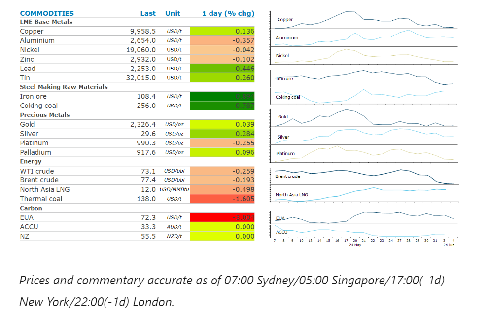
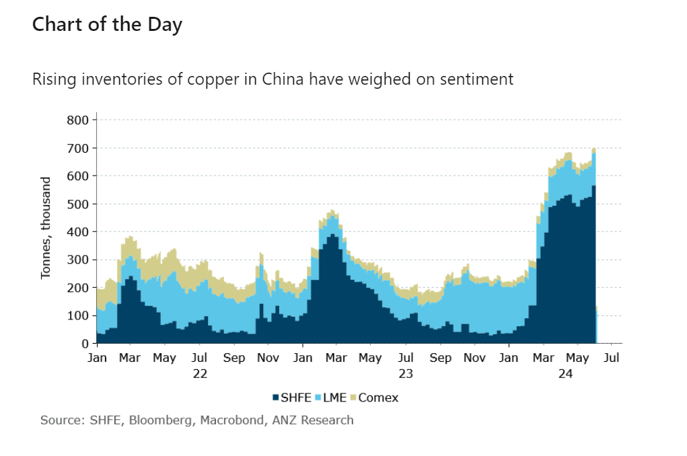

# Oil extends declines as OPEC looks to phase out supply cuts

**Date:** June 05, 2024  
**Publisher:** Breakwave Advisors | **Category:** Market Insights  
**Original URL:** [https://www.breakwaveadvisors.com/insights/2024/6/5/enypt0pu0gihyoyvad0cui9zv9t4jf](https://www.breakwaveadvisors.com/insights/2024/6/5/enypt0pu0gihyoyvad0cui9zv9t4jf)  

---

Easing supply side issues triggered falls across the commodity complex, despite rising prospects of rate cuts.

*By*[*Daniel Hynes*](https://www.linkedin.com/in/dahynes/)

> **Figure 1: Στιγμιότυπο Οθόνης 2024 06 05 102326**  
> **Interactive Data & Source:** [Linkedin](https://www.linkedin.com/newsletters/commodities-wrap-6692196755876012032/?fbclid=IwAR3kiXJqZdxmp9ZcRwBNI7FsBySI-XSC0pfPur1qzjt7OZp7PTE59Tsl1QI) | [Local Asset](file:///C:/Users/Dell/Github/Shipping/corpus/03-breakwave/insights/2024/assets/2024-06-05_enypt0pu0gihyoyvad0cui9zv9t4jf_img_cea3cf84ceb9ceb3cebcceb9cf8ccf84cf85_f1c7ac0201fa.png)

### Market Commentary

**Crude oil**extended recent declines, as OPEC plans to phase out voluntary output cuts, deepened the market’s bearish sentiment. The weekend’s meeting between OPEC and its allies saw the group extend its formal production agreement until the end of 2025. However, the voluntary cuts implemented by Saudi Arabia and Russia, among others, will begin being phased out from October this year. This added to the already bearish tone leading into the market amid uncertainty over the outlook for demand. US factory activity shrank in May. In China, the official PMI also fell back into contractionary territory. This saw Brent crude fall more than 5% to trade below USD78/bbl.

**Global gas**markets remained on edge on supply side issues. However, prices edged lower following Monday’s surge on hope the most recent disruptions will be shorter than expected.**European gas**benchmarks fell after reports that the outage at Norway’s massive Nyhamna gas processing plant may end as early Friday. However, there has been little details on the repair plan suggest by the network operator. Past outages at Norwegian facilities have often been extended. This also dragged North Asian LNG prices lower. This was exacerbated by reports that Chevron’s Gorgon facility had also restarted following an outage on Monday. In the meantime, the rally in prices has seen Chinese buyers make use of the gains to offload some cargo to take advantage of attractive international prices and weak domestic ones.

**Gold**struggled to hold recent gains despite data suggesting the US Federal Reserve may be in a position to cut rates. US job openings fell in April to its lowest level in more than three years. This follows data showing weaker than expected economic activity in the US. This pushed yields on Treasuries lower while the USD was little changed. The market has been reminded by Fed officials that rates may be structurally higher for the foreseeable future amid persistently high inflation. Nevertheless, we expect the prospect of rate cuts will eventually entice traders back into the market.

The prospect of easing monetary policy saw**copper**lead the base metals higher in early trading. However, that support evaporated amid concerns of weak demand. Stockpiles on the Shanghai Futures Exchange have climbed to their highest level since 2020. There has also been a steady stream of smaller inflows in London Metal Exchange warehouses located in Asia. While this is likely the result of an attractive arbitrage trade with international prices, it didn’t help sentiment. It was also on the back of weak manufacturing activity data in China. The market also shrugged off recent supply side issues. The suspension of operations at Taseko Mines’ Gibraltar copper mine in Canada due to a strike by union workers is expected to be short lived.

**Iron ore**futures remained under pressure over concerns on Chinese demand. The lack of a majority win by the Modi government also leaves a question mark over India’s infrastructure buildout which has supported steel demand.

> **Figure 2: Στιγμιότυπο Οθόνης 2024 06 05 102538**  
> **Interactive Data & Source:** [Linkedin](https://www.linkedin.com/newsletters/commodities-wrap-6692196755876012032/?fbclid=IwAR3kiXJqZdxmp9ZcRwBNI7FsBySI-XSC0pfPur1qzjt7OZp7PTE59Tsl1QI) | [Local Asset](file:///C:/Users/Dell/Github/Shipping/corpus/03-breakwave/insights/2024/assets/2024-06-05_enypt0pu0gihyoyvad0cui9zv9t4jf_img_cea3cf84ceb9ceb3cebcceb9cf8ccf84cf85_52c07a41a65b.png)

Data source:[Commodities Wrap](https://www.linkedin.com/newsletters/commodities-wrap-6692196755876012032/?fbclid=IwAR3kiXJqZdxmp9ZcRwBNI7FsBySI-XSC0pfPur1qzjt7OZp7PTE59Tsl1QI)

---

**Tags:** Commodities, Economy, Markets  
