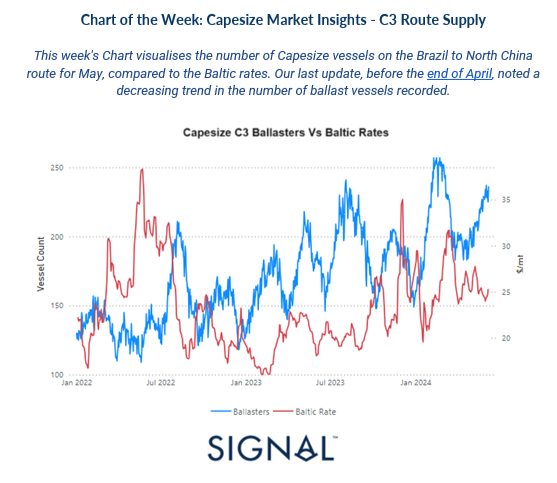
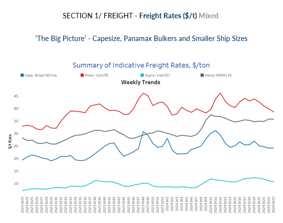
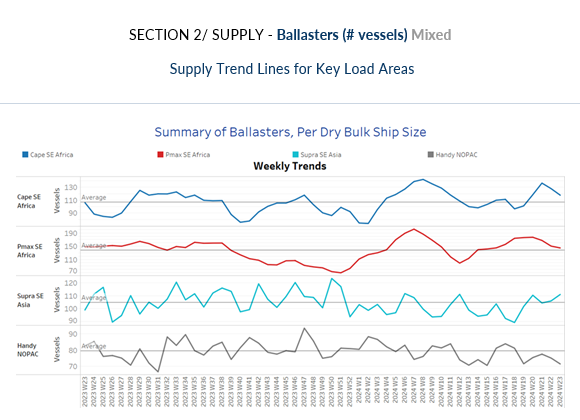
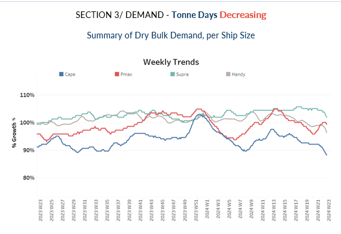
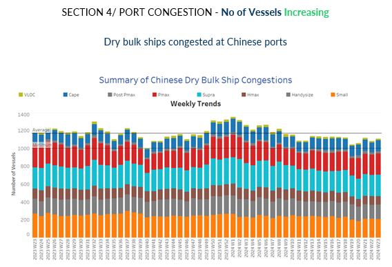

# Capesize Market Insights

**Date:** June 07, 2024  
**Publisher:** Breakwave Advisors | **Category:** Market Insights  
**Original URL:** [https://www.breakwaveadvisors.com/insights/2024/6/7/capesize-market-insights](https://www.breakwaveadvisors.com/insights/2024/6/7/capesize-market-insights)  

---

**Dry Weekly Market Monitor - Week 23.2024**
Snapshot of Spot Freight Rates, Supply-Demand Trends, Port Congestions
June 06, 2024

> **Figure 1: Screenshot 2024 06 07 13.41.05**  
> **Interactive Data & Source:** [Signal Ocean Platform](https://go.signalocean.com/e/983831/eel-demand-higher-supply-bets-/2q8f8r/414297883/h/S4dFLvQ5pHOWOC76lF8cjFMqeyCSxPelZvWUCF6sXMY) | [Local Asset](file:///C:/Users/Dell/Github/Shipping/corpus/03-breakwave/insights/2024/assets/2024-06-07_capesize-market-insights_img_screenshot2024-06-07134105_750548e23f62.png)

By the end of May, Capesize vessel rates on the Brazil to North China route have exhibited a weakening trend, while the number of ballasters has been increasing. Concurrently, the growth in demand tonne days continues to decline. The second quarter of the year brings uncertainty surrounding Chinese iron ore demand growth. This uncertainty is compounded by[recent declines in iron ore prices](https://go.signalocean.com/e/983831/eel-demand-higher-supply-bets-/2q8f8r/414297883/h/S4dFLvQ5pHOWOC76lF8cjFMqeyCSxPelZvWUCF6sXMY), following Beijing's reaffirmation of its policy to control crude steel output in 2024 and property crisis.

Iron ore futures experienced their fifth consecutive decline on Wednesday, reaching a seven-week low. This downward trend was driven by weakening steel demand and anticipation of increased shipments to China, the leading consumer, in June. On China’s Dalian Commodity Exchange (DCE), the most-traded September iron ore contract closed daytime trading 1.84% lower at 825 yuan ($113.86) per metric ton, marking its lowest level since April 16. Similarly, the benchmark July iron ore on the Singapore Exchange dropped 1.21% to $106.35 per ton as of 0714 GMT, hitting its lowest point since April 11. This trend reflects ongoing market apprehensions regarding future demand and price stability for iron ore, influenced by China's stringent production controls and economic policies.

> **Figure 2: Screenshot 2024 06 07 13.41.14**  
> **Interactive Data & Source:** [Signal Ocean Platform](https://www.thesignalgroup.com/signal-ocean-platform) | [Local Asset](file:///C:/Users/Dell/Github/Shipping/corpus/03-breakwave/insights/2024/assets/2024-06-07_capesize-market-insights_img_screenshot2024-06-07134114_2d94716aeebc.png)

​​​​In the first days of June, the dry bulk freight market has shown a mixed outlook. The Capesize Brazilian North China route has maintained firm freight rates, while the Panamax Continent-Far Eastern freight rates have continued to decline.

- **Capesize**vessel freight rates shipments from Brazil to North China are now at around $24 per ton, marking a 26% annual increase.
- **Panamax**vessel freight rates from the Continent to the Far East dropped below $40 per ton. However, recent data indicate a 18% surge compared to levels observed a year ago.
- **Supramax**vessel freight rates on the Indo-ECI route held levels around $11 per ton, marking a 49% increase compared to a comparable week from a year ago.
- **Handysize**freight rates for the NOPAC Far East route remained consistent with the sentiment of the previous three weeks, standing at approximately $36 per ton. This marks a notable 26% increase compared to levels observed a year ago.

> **Figure 3: Screenshot 2024 06 07 13.41.21**  
> **Interactive Data & Source:** [Signal Ocean Platform](https://www.thesignalgroup.com/signal-ocean-platform) | [Local Asset](file:///C:/Users/Dell/Github/Shipping/corpus/03-breakwave/insights/2024/assets/2024-06-07_capesize-market-insights_img_screenshot2024-06-07134121_75c091416d02.png)

June began with a drop in the number of ballast ships for the Capesize and Panamax routes from Southeast Africa.

- **Capesize SE Africa**: The count of ballast ships dropped to 116, a 15% decrease from the peak recorded during week 20.

- **Panamax SE Africa**: The number of ballast ships decreased to nearly 140, which is about 7 above the annual average and approximately 30 lower than the previous week's count of over 170.
- **Supramax SE Asia**: The count of ballast ships is now hovering above 100, 7 higher than the annual average, following two consecutive weeks of persistent increases.
- **Handysize NOPAC**: Since the end of week 17, the count of ballast ships has consistently remained below the annual average of 80. Recent indications recorded a decrease to around 70, with numbers appearing to follow a similar trend into the second week of June.

> **Figure 4: Screenshot 2024 06 07 13.41.28**  
> **Interactive Data & Source:** [Signal Ocean Platform](https://www.thesignalgroup.com/signal-ocean-platform) | [Local Asset](file:///C:/Users/Dell/Github/Shipping/corpus/03-breakwave/insights/2024/assets/2024-06-07_capesize-market-insights_img_screenshot2024-06-07134128_1d7ec45e3c8b.png)

In early June, a consistent decline in tonne-day growth was observed across all vessel size segments, indicating that the second quarter is likely to end with a lower growth rate for dry tonne days. However, there are signs of an upward trend in the Panamax vessel size segment, though its sustained firmness in the remaining days of June is yet to be confirmed.

- **Capesize**: Since the end of week 14, a clear downward trend has continued, with current levels remaining at their lowest since the peak observed in week 12.

- **Panamax**: The decline in tonne-day growth appears to have reversed, now showing an upward trajectory that indicates a potential recovery in early June.
- **Supramax**: Despite some indications of stabilisation in May, the growth rate declined in the first days of June, showing a further decrease from the levels observed the previous month.
- **Handysize**: The decline in the tonne-day growth rate has continued for over a month, with the current pace slower than the lowest point recorded since the end of the 9th week.

> **Figure 5: Screenshot 2024 06 07 13.41.35**  
> **Interactive Data & Source:** [Signal Ocean Platform](https://www.thesignalgroup.com/signal-ocean-platform) | [Local Asset](file:///C:/Users/Dell/Github/Shipping/corpus/03-breakwave/insights/2024/assets/2024-06-07_capesize-market-insights_img_screenshot2024-06-07134135_42d119dc800a.png)

The upward trend observed in preceding days of May has been affirmed in early June, as Chinese dry bulk congestion has notably increased across all vessel size segments.

- **Capesize**: Capesize ship congestion rose above 120 reflecting an increase of 10 from the levels observed a week ago.

- **Panamax**: The count of Panamax vessels held rising levels above 230.
- **Supramax**: For early June, congestion levels have climbed, almost surpassing the 240 mark, staying at a similar level of the previous week.
- **Handysize**: Congestion levels rose to around 160, maintaining similar highs for the past three weeks.

Data Source:[Signal Ocean Platform](https://www.thesignalgroup.com/signal-ocean-platform)

---

**Tags:** Drybulk, Shipping, Capesize  
