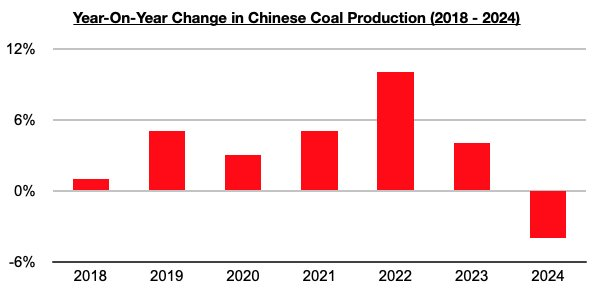
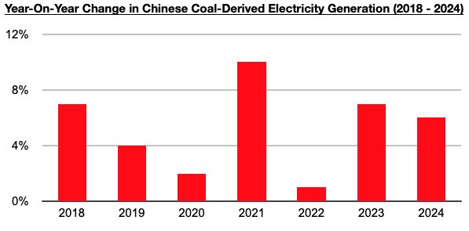

# How Bizarre

**Date:** June 07, 2024  
**Publisher:** Breakwave Advisors | **Category:** Market Insights  
**Original URL:** [https://www.breakwaveadvisors.com/insights/2024/6/7/how-bizarre](https://www.breakwaveadvisors.com/insights/2024/6/7/how-bizarre)  

---

*By*[*Jeffrey Landsberg*](https://www.linkedin.com/in/jeffrey-landsberg-70ab957/)

Back in April, we examined how bizarre it was that Bloomberg published an article, ”China’s Coal Price Slump Likely to Persist Until Start of Summer”, that discussed “record” Chinese coal production but amazingly omitted how production is actually faring this year. Their article discussed “record" coal production and stated “China’s domestic coal production rose 9% in 2022 and then by another 2.9% last year” — but it did not include 2024 data which was readily available at the time. Readers of the Bloomberg article, through no fault of their own, were left unaware that in January/February China’s coal production contracted year-on-year by 4%. At the time, this marked the first contraction seen since July 2021, which certainly was newsworthy. As we also have been stressing in Commodore Research's Weekly Dry Bulk Reports and Weekly China Reports since then, China’s coal production has contracted on a year-on-year basis during each of the last four months (January through April), which marks a development not seen since 2018.

> **Figure 1: 241**  
> [Local Asset](file:///C:/Users/Dell/Github/Shipping/corpus/03-breakwave/insights/2024/assets/2024-06-07_how-bizarre_img_241_3f75e434218f.jpg)

New more recently is that Bloomberg last week published an article, “China’s Falling Emissions Signal Peak Carbon May Already Be Here” that stated this year has seen “reductions in China’s coal-fired electricity generation”. Bloomberg this time appears to be unaware that China’s coal-fired electricity generation has climbed further this year. So far this year, China’s coal-fired electricity generation has grown year-on-year by 6%. More coal-fired electricity has been produced in China during the first four months of this year than during the first four months of any year. China’s coal-fired electricity generation set another record in 2023, and it is on pace to set yet another record this year. The Bloomberg piece was at least correct in stating emissions in China fell in March, but it could not have been any more wrong in stating that there have been reductions in China’s coal-fired electricity generation. Solar and wind are surging, but their contribution to total electricity output remains small and the decline in emissions occurred largely due to the fact that China’s steel production fell on a year-on-year basis in March by 6%.

> **Figure 2: 242**  
> [Local Asset](file:///C:/Users/Dell/Github/Shipping/corpus/03-breakwave/insights/2024/assets/2024-06-07_how-bizarre_img_242_50aa2c021d58.jpg)

---

**Tags:** Coal, Electricity, China  
