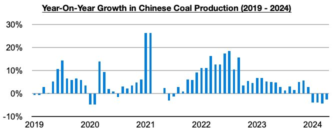
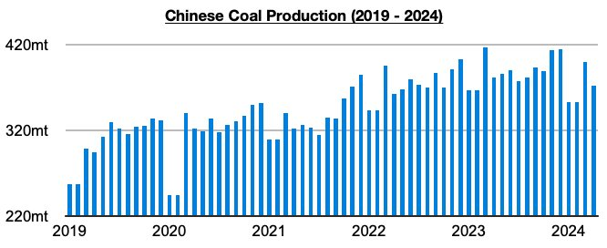

# Additional Coal Mine Accidents in China in May

**Date:** June 10, 2024  
**Publisher:** Breakwave Advisors | **Category:** Market Insights  
**Original URL:** [https://www.breakwaveadvisors.com/insights/2024/6/8/additional-coal-mine-accidents-in-china-in-may](https://www.breakwaveadvisors.com/insights/2024/6/8/additional-coal-mine-accidents-in-china-in-may)  

---

*By*[*Jeffrey Landsberg*](https://www.linkedin.com/in/jeffrey-landsberg-70ab957/)

As we discussed in Commodore Research's June 3rd Weekly Dry Bulk Report, two more coal mine accidents occurred in China last month which in total resulted in the deaths of three workers. Four additional workers were also missing and were presumed to be dead. As we have discussed in the past, coal mine accidents like these remain under even more scrutiny than usual as China has been in the midst of a significant coal mining safety overhaul that began late last year. The safety overhaul has caused China's coal production to finally revert back to a contraction this year -- and new accidents like these are likely to keep the safety overhaul in place and/or result in the overhaul becoming even stricter.

> **Figure 1: 241**  
> [Local Asset](file:///C:/Users/Dell/Github/Shipping/corpus/03-breakwave/insights/2024/assets/2024-06-10_additional-coal-mine-accidents-in-china-in-may_img_241_c7a800ec431d.jpg)

Going forward, we continue to anticipate that China's coal production will remain in a contraction this year (as a point of comparison, last year saw coal production grow by 4%, which worked out to 192 million tons). China’s coal production this year has contracted on a year-on-year basis during each of the last four months (data is still pending for May), which marks a development not seen since 2018. During these last four months, it has contracted year-on-year by 57 million tons (-4%).

> **Figure 2: 242**  
> [Local Asset](file:///C:/Users/Dell/Github/Shipping/corpus/03-breakwave/insights/2024/assets/2024-06-10_additional-coal-mine-accidents-in-china-in-may_img_242_10d1c6ad2d4c.jpg)

---

**Tags:** China, Coal, Drybulk  
