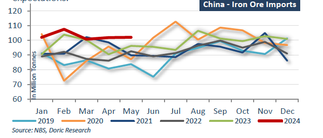
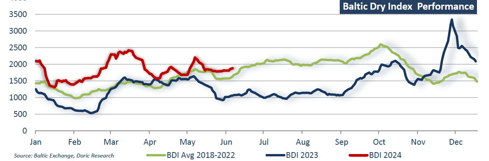

# Powering Ahead

**Date:** June 10, 2024  
**Publisher:** Breakwave Advisors | **Category:** Market Insights  
**Original URL:** [https://www.breakwaveadvisors.com/insights/2024/6/8/powering-ahead](https://www.breakwaveadvisors.com/insights/2024/6/8/powering-ahead)  

---

### “Life Is Really Good Right Now for All of Us”

*By*[*Michalis Voutsinas*](https://www.linkedin.com/in/michalis-voutsinas-587544163/)

During the first trading week of June, Baltic indices mostly trended upwards, with the Capesize index leading the charge. The largest bulkers reported a 6.3 percent weekly gain, concluding today at $24,867 per day. Similarly, the Panamax segment saw daily rates rise to $15,752 by Friday's close. The geared segments remained relatively stable, with Supramax rates at $13,789 and Handysize values at $12,848 per day. In addition to marking the start of the summer trading season, Posidonia 2024 took place in Athens during the twenty-third trading week.

Posidonia 2024, themed "Powering Ahead," highlighted the remarkable growth of the Greek fleet and the expansion of the event itself. Nikolas Martinos, principal at Thenamaris, set a positive tone for Posidonia as he addressed attendees at the kickoff golf event. “Life is really good right now for all of us,” he remarked to hundreds of employees and business partners at a seaside Athens club on Sunday, celebrating the traditional pre-Posidonia golf ceremony hosted by Thenamaris and Costamare, as reported by TradeWinds. Echoing this sentiment, major Greek Cypriot shipowner Polys Hajioannou stressed the importance of the shipping industry capitalizing on its current windfall profits by investing in cleaner vessels. With numerous visitors from around the world converging on Athens and Piraeus this week, a sense of euphoria permeated shipowning and shipbroking offices throughout Athens and its suburbs.

Injecting further optimism into the market, China's exports exceeded expectations last month despite heightened trade tensions, propelled by robust demand from Southeast Asia. However, customs data released on Friday revealed a contrasting picture, as imports fell short of forecasts. Exports in May surged by 7.6 percent compared to the previous year in USD terms, surpassing the anticipated 6 percent growth according to a Reuters poll. In contrast, imports during the same period saw a modest increase of 1.8 percent, failing to meet Reuters' forecast of 4.2 percent growth.

In the realm of dry bulk commodities, specifically focusing on China, iron ore imports in May maintained a steady pace above 100 million metric tonnes for the third consecutive month. Customs data revealed that the total for the first five months amounted to 513.75 million tonnes, marking a notable 7 percent increase compared to the previous year. Last month alone, the world's largest iron ore consumer imported 102.03 million metric tonnes of the steelmaking ingredient, slightly surpassing the figures for April (101.82 million tonnes) and May 2023 (96.17 million tonnes). In a similar vein, China's coal imports experienced an 11 percent surge in May compared to the previous year, as indicated by customs data and Reuters records. This spike was attributed to lower domestic output this year, prompting heightened shipments of international coal.

Throughout May, the world’ largest coal consumer imported 43.82 million metric tonnes, up from 39.58 million tonnes in May 2023. However, this represented a 3 percent decline from the 45.25 million tonnes of this April. China's coal output in April plummeted to its lowest level since October 2022, with safety inspections following several fatal mining accidents significantly impacting production. Notably, coal imports for the first five months of 2024 totaled 204.97 million tonnes, reflecting a substantial 12.6 percent increase from the corresponding period in the previous year. In contrast, China's soybean imports in May 2024 witnessed a steep 15 percent decline from May 2023, totaling 10.22 million metric tonnes. This drop was predominantly attributed to floods in Brazil, adversely affecting the harvest. For the first five months of 2024, China’s soybean imports amounted to 37.37 million tonnes, marking a 5.4 percent decrease compared to the same period in 2023. Despite the uptrend in hog prices stimulating demand, soybean imports fell short of expectations.

> **Figure 1: Screenshot 2024 06 08 19.08.46**  
> **Interactive Data & Source:** [Doric](https://www.doric.gr/) | [Local Asset](file:///C:/Users/Dell/Github/Shipping/corpus/03-breakwave/insights/2024/assets/2024-06-10_powering-ahead_img_screenshot2024-06-08190846_5aafdda2369a.png)

Putting Posidonia and Chinese imports aside, the ECB reduced its record-high deposit rate by 25 basis points to 3.75 percent, aligning with the central banks of Canada, Sweden, and Switzerland in initiating the unwinding process of some of the steepest rate hikes implemented to curb post-pandemic inflationary pressures. This move precedes actions by the US Federal Reserve and the Bank of England, marking the ECB's first rate reduction in five years. However, the bank refrained from indicating any further actions. "Interest rate decisions will be made based on our assessment of the inflation outlook considering incoming economic and financial data, underlying inflation dynamics, and the effectiveness of monetary policy transmission," stated the ECB in a release. "The Governing Council does not commit to a specific rate trajectory in advance.

The wrap-up of the Posidonia 2024 week left market sentiment notably upbeat, fueled by the rise in both Chinese imports and exports, as well as the ECB's landmark move to lower deposit rates for the first time in half a decade. Nevertheless, amid this overall positive atmosphere, a dissonant chord emerges with Chinese iron ore port stocks stubbornly holding at a two-year peak of 149.3 million tonnes, edging ever closer to the critical threshold of 150 million.

> **Figure 2: Screenshot 2024 06 08 19.08.56**  
> **Interactive Data & Source:** [Doric](https://www.doric.gr/) | [Local Asset](file:///C:/Users/Dell/Github/Shipping/corpus/03-breakwave/insights/2024/assets/2024-06-10_powering-ahead_img_screenshot2024-06-08190856_049d9befabab.png)

Data source:[Doric](https://www.doric.gr/)

---

**Tags:** Drybulk, Shipping, Posidonia2024  
