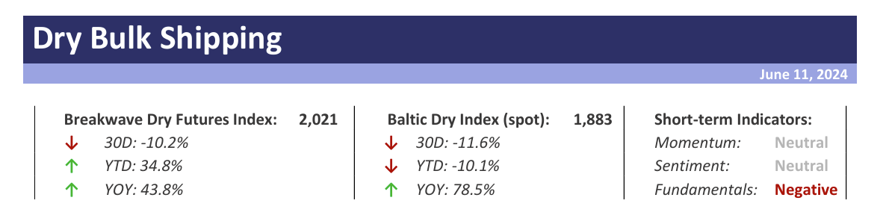
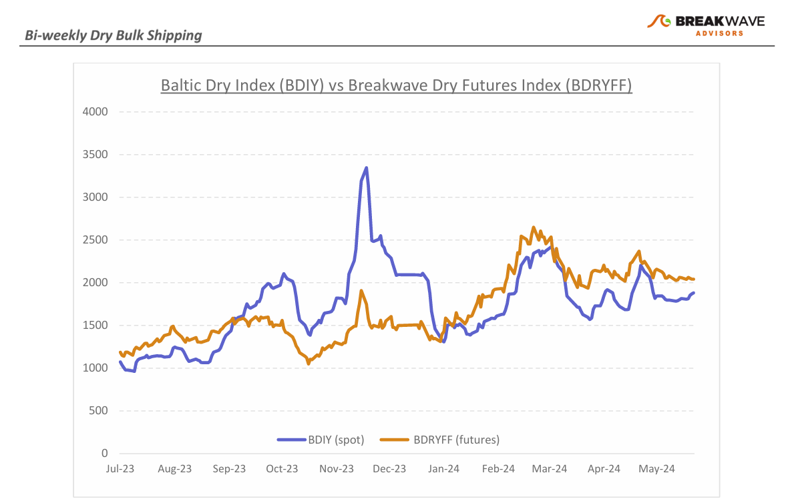
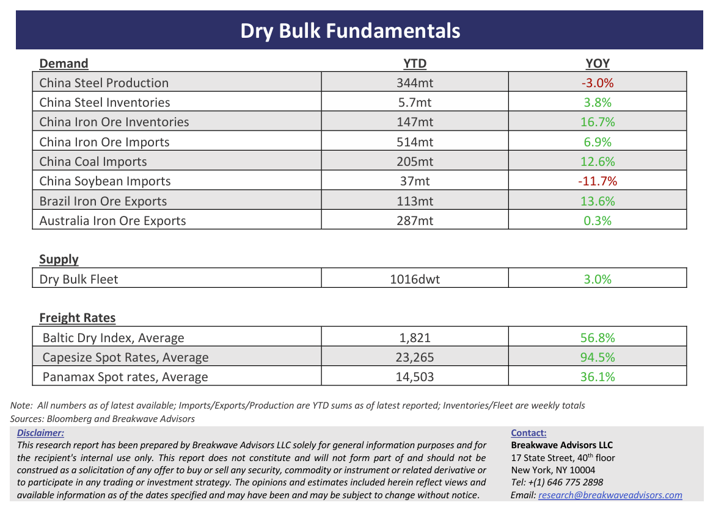

# Breakwave Bi-Weekly Dry Bulk Report - June 11, 2024

**Date:** June 11, 2024  
**Publisher:** Breakwave Advisors | **Category:** Market Insights  
**Original URL:** [https://www.breakwaveadvisors.com/insights/2024611dry](https://www.breakwaveadvisors.com/insights/2024611dry)  

---

> **Figure 1: Dryreporttop**  
> [Local Asset](file:///C:/Users/Dell/Github/Shipping/corpus/03-breakwave/insights/2024/assets/2024-06-11_2024611dry_img_dryreporttop_e1683f2a3964.png)

**· Steady as it goes while curve inverses and sentiment moderates –**The past few weeks have been**uncharacteristically calm**for the otherwise volatile dry bulk market. Although**spot**Capesize rates have been**ticking higher**, such a strength has not been jumpy as it usually is, at a time when**futures****were already pricing**some improvement going to the month of June. In the last few days though, the**futures curve has inverted**and now sits below spot, demonstrating some**skepticism**amongst traders as it relates to the**progression**of rates for the**first time in a while**. We also**anticipate**some**softening**in rates during the**summer**months, mainly reflecting**weaker Atlantic**market demand.**West Africa**enters its**rainy**season which tends to reduce bauxite as well as iron ore cargoes available for loading. Furthermore, a lot of iron ore has been already exported out of**Brazil**, and such “**frontloading**” could have a**negative impact**on demand for the reminder of the year. The combination of those factors leads us to a more cautious stance for the next few months as we continue to believe that for**iron ore and coal**, trade volumes will be**comparable**to**last year**(meaning the strong year-to-date volumes are now a headwind). For investors, a flattish futures curve becomes a more attractive proposition if indeed spot rates soften and weigh on futures along the process. The fourth quarter rates should once again prove to be stronger than the third, and**any potential summer dip**will reshuffle the existing bullish positioning,**creating opportunities**and**setting the stage**for a rebound trade in late summer.

**· China is not what it used to be when it comes to commodities and traders will soon take notice –**The argument of**peak mass construction**in China seems to be gaining traction, as the**historical inventory cycles**that drove prices seem to be**out of synch**and underlying**demand**has**little momentum**irrespective of stimulus or government measures. Commodity traders have relied on such inventory cycles over the past few decades in order to accumulate during soft patches and then sell during stronger demand periods such construction-related commodities. Are those cycles a thing of the past? China’s**steel production has been running at around 1 billion tons**for the fourth year in a row now, and given the underlying drivers (real estate, infrastructure and manufacturing), we are having a hard time identifying any change in trend anytime soon. The**steel export market is strong because of such domestic weakness**but cannot sustain the historical growth rates by itself (let alone the political pressure for flooding the global markets with cheap steel).**The period of massive construction might be over**and given the relatively high inventories and**elevated**iron ore**import**run rates, it will**take some time**before**iron ore fundamentals return**to a more favorable balance, in the process pushing prices to much lower levels in order to disincentivize new mining investments.

**· Our Long-term View –**The last few years have been characterized by increased geopolitical uncertainty. Going forward, we expect such events to continue to affect global trade and have a meaningful impact on effective vessel supply. Combined with the potential for a multi-year cyclical rebound in China’s economic activity following the recent economic turmoil, dry bulk shipping should experience higher volatility on top of a secular tightness driven by increasing bulk commodity demand and a slower fleet growth as a result of a relatively low orderbook.

> **Figure 2: Dryreportchart**  
> [Local Asset](file:///C:/Users/Dell/Github/Shipping/corpus/03-breakwave/insights/2024/assets/2024-06-11_2024611dry_img_dryreportchart_3158c3a6e001.png)

> **Figure 3: Dryreportbottom**  
> [Local Asset](file:///C:/Users/Dell/Github/Shipping/corpus/03-breakwave/insights/2024/assets/2024-06-11_2024611dry_img_dryreportbottom_942ea9fd8cba.png)

### Subscribe:
