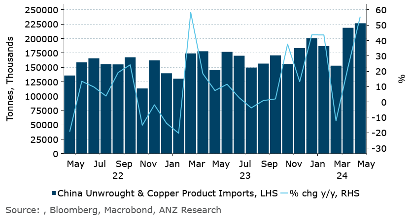

# Renewed supply issues push global gas prices higher

**Date:** June 12, 2024  
**Publisher:** Breakwave Advisors | **Category:** Market Insights  
**Original URL:** [https://www.breakwaveadvisors.com/insights/2024/6/12/renewed-supply-issues-push-global-gas-prices-higher](https://www.breakwaveadvisors.com/insights/2024/6/12/renewed-supply-issues-push-global-gas-prices-higher)  

---

*Metal markets remained under pressure amid concerns over demand in China. Ongoing supply side issues kept energy markets on edge.*

*By*[*Daniel Hynes*](https://www.linkedin.com/in/dahynes/)

**Crude oil**edged higher as OPEC maintained its forecasts for strengthening demand. It expects oil consumption will increase 2.3mb/d in the second half of the year, driven by China and other emerging economies. Despite announcing last week that itwill start to phase out some of the voluntary cuts later this year, its forecasts suggest it should be easily accepted by the market. OPEC projects that it will need to provide 43.6mb/d in Q3 2024, which is about 2.7mb/d more than it pumped last month. Some of the shortfall in supply will come from the US. The Energy Information Administration released its monthly outlook and raised its forecast for US supply by 310kb/d to 13.2mb/d in 2024. Trading was relatively subdued as investors await the FOMC’s decision on interest rates.

**Global gas**prices extended recent gains as further supply side issues emerged. Chevron suspended output from its Wheatstone LNG export facility to complete repairs to the offshore platform’s fuel system. This follows Petronas’s plans to delay some LNG shipments for June due to an outage at its Bintulu exports facility. The market has been concerned about extreme weather raising demand. High temperatures across Asia are escalating demand for cooling, which has helped push**North Asian LNG**prices above USD12/mmBtu.**European gas**futures edged higher as the supply outlook tightened. Despite nearly full inventories, consumers in the region will have increased competition for LNG shipments in the coming months, exacerbated by disruptions on the remaining gas flowing through Russian pipelines. A transit deal between Moscow and Kyiv expires in December, and the Ukraine has ruled out any negotiations.

**Gold**edged higher ahead of US inflation data and the Fed’s outlook on interest rates. A solid US Treasury sale saw yields fall across the board. This triggered speculation that Wednesday’s inflation reading will help the case for the Fed to cut rates later this year.**Platinum**struggled to follow gold, with investors continuing to liquidate positions after recent gains. Above-ground stocks of 3,620koz (47% of annual demand) are helping mitigate any near-term supply shortfall. Yet,[**a structural deficit of platinum**](../pdfs/2024-06-12_renewed-supply-issues-push-global-gas-prices-higher_the-vault-calm-before-the-storm_b3061ab2adbf.pdf)will reduce inventories in the medium term, which should eventually support the price.

The**copper**price fell on signs of weaker demand in China. Copper fabricators are finding it hard to pass higher prices on to customers. Henan Yuxing Copper said its sales orders fell about 20-30% in May, which is traditionally peak season. A survey by Shanghai Metals Market showed fabricator firms are expecting to cut run rates to 66% of capacity in May, down from 68% in April. That’s their lowest for the season since 2017. Even so, China continues to ramp up imports of refined copper. Volumes were up 15.7% y/y in May despite high inventories.

**Iron ore**future also headed lower on subdued sentiment, and this wasn’t helped by a Hong Kong court ordering real estate developer Dexin China to liquidate.

### Chart of the Day

China's demand for copper appears strong, with imports of primary copper up strongly in May

> **Figure 1: 242**  
> **Interactive Data & Source:** [Linkedin](https://www.linkedin.com/newsletters/commodities-wrap-6692196755876012032/?fbclid=IwAR3kiXJqZdxmp9ZcRwBNI7FsBySI-XSC0pfPur1qzjt7OZp7PTE59Tsl1QI) | [Local Asset](file:///C:/Users/Dell/Github/Shipping/corpus/03-breakwave/insights/2024/assets/2024-06-12_renewed-supply-issues-push-global-gas-prices-higher_img_242_c0b47e920891.png)

Data source:[Commodities Wrap](https://www.linkedin.com/newsletters/commodities-wrap-6692196755876012032/?fbclid=IwAR3kiXJqZdxmp9ZcRwBNI7FsBySI-XSC0pfPur1qzjt7OZp7PTE59Tsl1QI)

---

**Tags:** Commodities, Economy, Markets  
