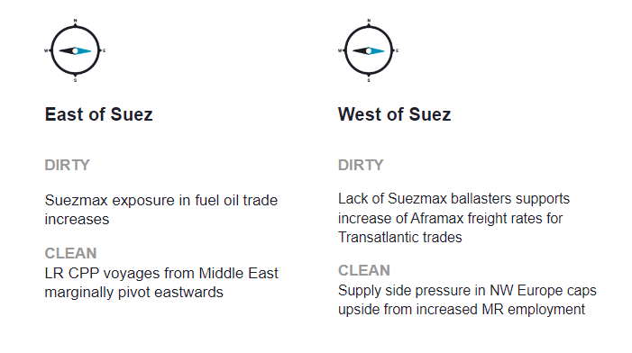
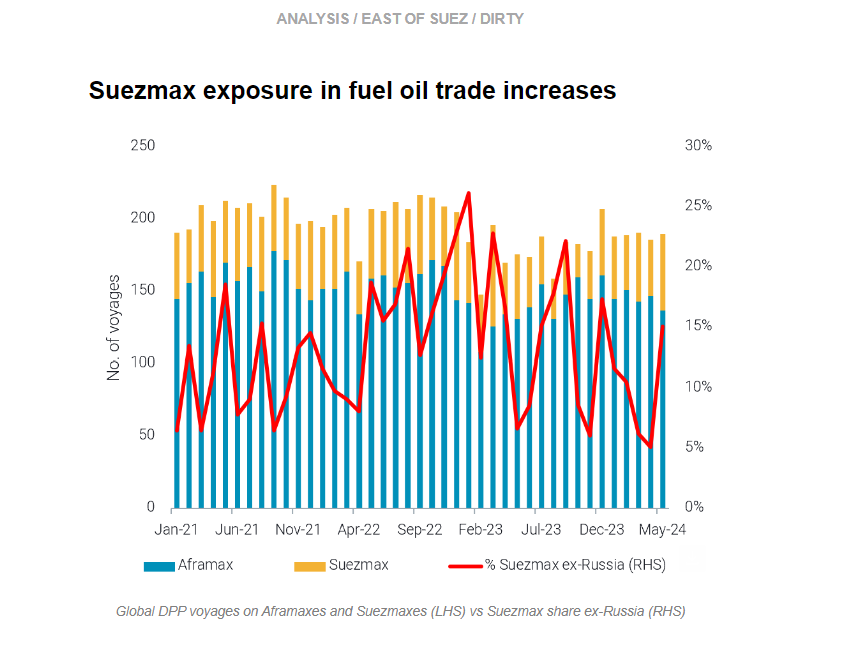
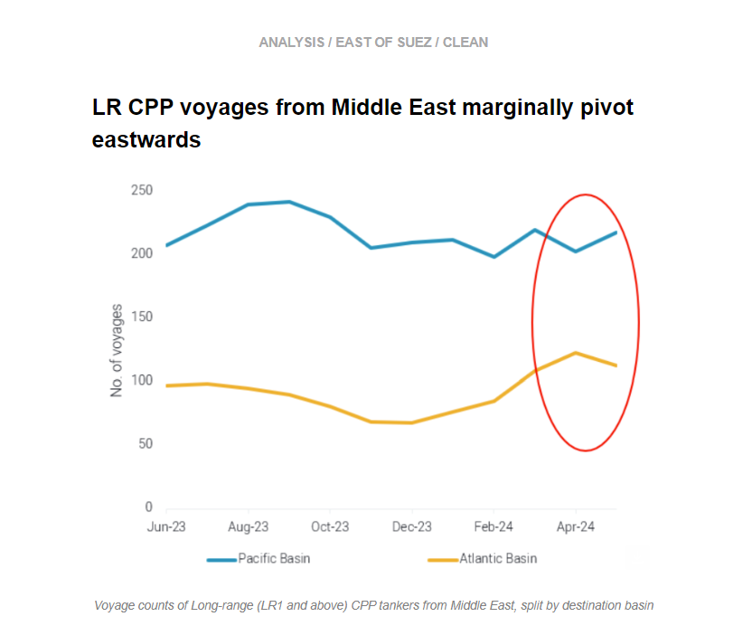
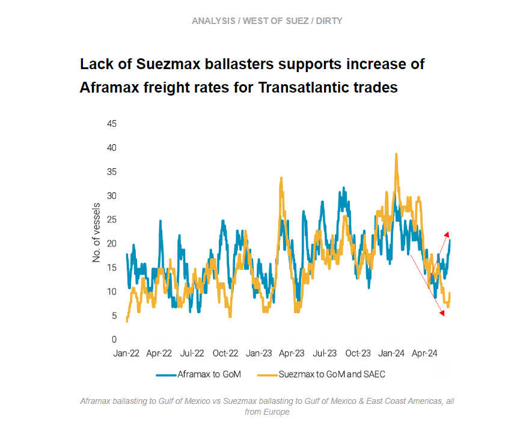
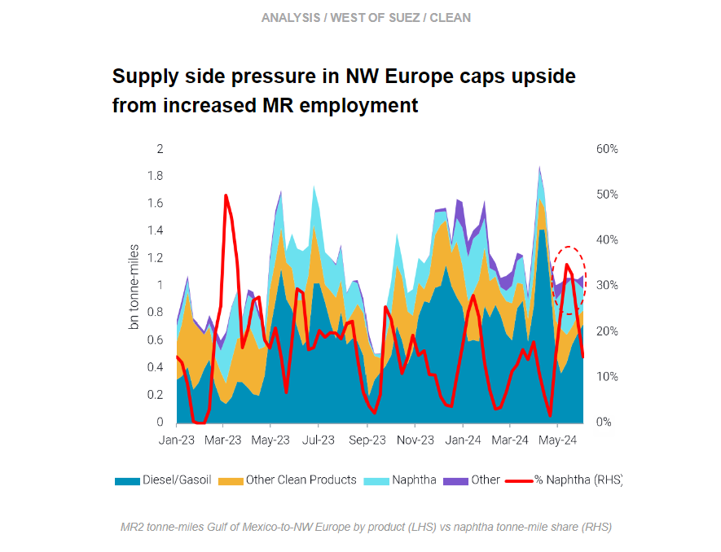

# Increase in Suezmaxes in fuel oil trade

**Date:** June 13, 2024  
**Publisher:** Breakwave Advisors | **Category:** Market Insights  
**Original URL:** [https://www.breakwaveadvisors.com/insights/2024/6/13/o4yqangkjngcfym616mwvcwlr2py7b](https://www.breakwaveadvisors.com/insights/2024/6/13/o4yqangkjngcfym616mwvcwlr2py7b)  

---

This week, in the East, we examine increasing Suezmax exposure in the fuel oil trade, and we look at the marginal pivot eastward for LRs ex-Middle East. In the West, we discuss why the lack of Suezmax ballasters in East Coast Americas is supporting TD25 Aframaxes. On the clean side, we explore why supply side pressure for MRs in NW Europe is capping any upside gained from a slight demand recovery.

*By*[*Mary Melton*](https://www.linkedin.com/search/results/all/?fetchDeterministicClustersOnly=true&heroEntityKey=urn%3Ali%3Afsd_profile%3AACoAABXVyecBtg-pRnIrZe0BoWk0ygPiUfbvhsw&keywords=mary%20melton&origin=RICH_QUERY_SUGGESTION&position=0&searchId=40e8d7d2-c4d0-4022-81e7-176f6eba418b&sid=H_Y&spellCorrectionEnabled=false)

> **Figure 1: Στιγμιότυπο Οθόνης 2024 06 13 123613**  
> **Interactive Data & Source:** [Marketingmail Vortexa](https://marketingmail.vortexa.com/ODM3LU1aRS01NzgAAAGTq6rSQqFKMwT9aK8nrBNINjYTAZnnswqXURT7QNrBL_rBMbXfqB5WCNm7b8RrdS7BXnpiHp8=) | [Local Asset](file:///C:/Users/Dell/Github/Shipping/corpus/03-breakwave/insights/2024/assets/2024-06-13_o4yqangkjngcfym616mwvcwlr2py7b_img_cea3cf84ceb9ceb3cebcceb9cf8ccf84cf85_b2a40b3ac528.png)

> **Figure 2: Στιγμιότυπο Οθόνης 2024 06 13 123635**  
> **Interactive Data & Source:** [Marketingmail Vortexa](https://marketingmail.vortexa.com/ODM3LU1aRS01NzgAAAGTq6rSQqFKMwT9aK8nrBNINjYTAZnnswqXURT7QNrBL_rBMbXfqB5WCNm7b8RrdS7BXnpiHp8=) | [Local Asset](file:///C:/Users/Dell/Github/Shipping/corpus/03-breakwave/insights/2024/assets/2024-06-13_o4yqangkjngcfym616mwvcwlr2py7b_img_cea3cf84ceb9ceb3cebcceb9cf8ccf84cf85_f8304a438584.png)

- Suezmaxes increased their share in the fuel oil trade in May.[Voyages on Suezmaxes](https://marketingmail.vortexa.com/ODM3LU1aRS01NzgAAAGTq6rSQqFKMwT9aK8nrBNINjYTAZnnswqXURT7QNrBL_rBMbXfqB5WCNm7b8RrdS7BXnpiHp8=)increased around 35% m-o-m, taking away market share from Aframaxes, which saw a 5% decline on m-o-m voyage counts despite higher overall voyages for DPP globally in the month of May.

- Russian DPP cargoes contributed to Suezmaxes’ increasing market share, with most of the gains in[Russian DPP departures in May realised on Suezmaxes](https://marketingmail.vortexa.com/ODM3LU1aRS01NzgAAAGTq6rSQxJL5L1OFmzeoSk3poDq2lHvOaBzTbYaN1K0uQsewpI0c6jmkc97KwScqlZ9tI9IW-I=). Out of a 35% m-o-m increase in voyages out of Russia in May, all but one of these were on Suezmaxes.
- Moving forward, the fuel oil trade will likely continue to attract Suezmaxes. A very hot summer is expected in the Middle East, and the resulting high HSFO demand will likely translate to high Aframax employment but could also benefit Suezmaxes.[Middle East HSFO imports](https://marketingmail.vortexa.com/ODM3LU1aRS01NzgAAAGTq6rSQgG9obnPlN5aZtBbR3wPjPjdKpQN-bP-lT-ZivPbEOLfvMk_n-dQkRQz76mjvAey4Jc=)hit an eight-month high in May, with a notable increase in Suezmax employment on this route. Additionally, the[Dangote refinery recently sent an LSFO cargo to Singapore on a Suezmax](https://marketingmail.vortexa.com/ODM3LU1aRS01NzgAAAGTq6rSQrZ3c4NYh_ZZSFFbrpMnYWlfZHh2DX68Le6kkP4cUZrEZNxXQHvAnkZT2VLaEKszHfo=). However, this is unlikely to be a common route when Dangote ramps up operations of secondary units, as the refinery’s aim is to satisfy domestic CPP demand.

> **Figure 3: Στιγμιότυπο Οθόνης 2024 06 13 124049**  
> **Interactive Data & Source:** [Marketingmail Vortexa](https://marketingmail.vortexa.com/ODM3LU1aRS01NzgAAAGTq6rSQlZGylZ5oDPBvVn7Z_yVaTR8NZymJZC361E7l0pY2CGplhRE5PHjal4F1qqDckVUpt8=) | [Local Asset](file:///C:/Users/Dell/Github/Shipping/corpus/03-breakwave/insights/2024/assets/2024-06-13_o4yqangkjngcfym616mwvcwlr2py7b_img_cea3cf84ceb9ceb3cebcceb9cf8ccf84cf85_1352207a633e.png)

- [CPP voyages counts for long-range tankers](https://marketingmail.vortexa.com/ODM3LU1aRS01NzgAAAGTq6rSQlZGylZ5oDPBvVn7Z_yVaTR8NZymJZC361E7l0pY2CGplhRE5PHjal4F1qqDckVUpt8=)(LR1 and above) from the Middle East have this year been heading increasingly towards the Atlantic Basin, rather than Pacific, on the back of rising middle distillates exports. Diesel and jet fuel exports from the Middle East have been climbing, boosted by ramp-ups at refineries such as[Al Zour, Duqm and Jizan, especially since Q2](https://marketingmail.vortexa.com/ODM3LU1aRS01NzgAAAGTq6rSQnZXmg3YJCiti156vf90EEUzG3qjqLws5YbzK0c1EnP6xtQFQhnwYZwJ9FXkJS_tjrs=), but bleaker diesel/jet fuel demand prospects in the European market is shifting some voyages toward the Pacific Basin.

- We see early indications of this in May, with a slight decline in Atlantic Basin-bound voyages amid a slight[pick-up in diesel/jet voyages heading to the Pacific Basin](https://marketingmail.vortexa.com/ODM3LU1aRS01NzgAAAGTq6rSQi8XIre322eC1I1jecuMRRn-2m4N7M2p2CKzteMoU3hpEfQdXYL17UC5TvWnuHxEW7Y=). This is boosting total CPP long range voyages eastwards despite recently slow[Middle East naphtha exports to Asia](https://marketingmail.vortexa.com/ODM3LU1aRS01NzgAAAGTq6rSQvvPtxLiWFXu4i7uL_IOxFKH5KgEf1dQmi3t-woGjgHuEVCiCrI3WN17q6Avz0dDlDw=).
- Looking ahead, flat-to-weak European diesel cracks, the emergence of contango on Ice gasoil futures and a closed East-West arbitrage all point to restricted Middle East-to-Atlantic Basin voyages. This could result in more LR tonnage in the Pacific Basin, which could compete more intensely with MR utilisation in the region.

> **Figure 4: Στιγμιότυπο Οθόνης 2024 06 13 124156**  
> **Interactive Data & Source:** [Marketingmail Vortexa](https://marketingmail.vortexa.com/ODM3LU1aRS01NzgAAAGTq6rSQoAw9AalN8K_L4_4FC8gsd09vsAushrLSoI3BfazvXhrv8QRkTjqj0Jnw0tExoznHwc=) | [Local Asset](file:///C:/Users/Dell/Github/Shipping/corpus/03-breakwave/insights/2024/assets/2024-06-13_o4yqangkjngcfym616mwvcwlr2py7b_img_cea3cf84ceb9ceb3cebcceb9cf8ccf84cf85_a3cbccae2b45.png)

- Aframax transatlantic[TD25](https://marketingmail.vortexa.com/ODM3LU1aRS01NzgAAAGTq6rSQoAw9AalN8K_L4_4FC8gsd09vsAushrLSoI3BfazvXhrv8QRkTjqj0Jnw0tExoznHwc=)freight rates have recorded an increase of 20% m-o-m, which was triggered by both supply and demand fundamentals.

- Enquiries for US Gulf barrels to Europe have increased amidst lower Saudi OSP prices to Asia and a softer Chinese demand outlook (which has brought[VLCC rates](https://marketingmail.vortexa.com/ODM3LU1aRS01NzgAAAGTq6rSQos2H1JQGvv-EQKZUGMXQu8mc-yRE9aM7V-2Ed9VdTyH4yXYCtG2kTAzLixX96S2m6w=)to an 8-month low), supporting smaller vessel classes.
- At the same time however, the[number of Suezmaxes ballasting across the Atlantic](https://marketingmail.vortexa.com/ODM3LU1aRS01NzgAAAGTq6rSQmQviJakvIUCr_TZZRmQgCInEly9eTulTzOeYJd5qWMNEEtszYPwPvyha2fNJvJsIxs=)from Europe remain at 14-month lows, which is supporting[Aframax](https://marketingmail.vortexa.com/ODM3LU1aRS01NzgAAAGTq6rSQuk3v6z_gwEC5zZyqrBlFOVsOhHUksMQmwZHCin4nNM8EIBLVTOumF4MfeoF8ea2LJE=)enquiries. As a result the spread between Aframax and Suezmax for the TA trade has widened to around 25 $/t according to Argus pricing assessments. This development could make Suezmaxes more appealing for chartering and increase ballasters to the American East Coast.

> **Figure 5: Στιγμιότυπο Οθόνης 2024 06 13 124316**  
> **Interactive Data & Source:** [Marketingmail Vortexa](https://marketingmail.vortexa.com/ODM3LU1aRS01NzgAAAGTq6rSQt8vkWldkGFualnJaPINTTS9TndfuSCbHtKeQQvMMmxFVtT-jAeR9Aqawu8Arpgvul8=) | [Local Asset](file:///C:/Users/Dell/Github/Shipping/corpus/03-breakwave/insights/2024/assets/2024-06-13_o4yqangkjngcfym616mwvcwlr2py7b_img_cea3cf84ceb9ceb3cebcceb9cf8ccf84cf85_ed984cfc8ffc.png)

- [Prompt MR2 availability](https://marketingmail.vortexa.com/ODM3LU1aRS01NzgAAAGTq6rSQt8vkWldkGFualnJaPINTTS9TndfuSCbHtKeQQvMMmxFVtT-jAeR9Aqawu8Arpgvul8=)in Northwest Europe has been rising since mid-May, hitting one-year highs and putting freight rates under pressure.[TC2 rates](https://marketingmail.vortexa.com/ODM3LU1aRS01NzgAAAGTq6rSQnUxhpWfDjW8lmB8fo267Kqa8t-oastce7kvbgS0ZcCq9ZNxbeapSW43PDibUytnSPM=)have fallen over 25% since the start of June.

- Vessel supply and demand factors are sending mixed signals in NW Europe. On the supply side,[increased naphtha imports from the US Gulf](https://marketingmail.vortexa.com/ODM3LU1aRS01NzgAAAGTq6rSQhPDKoLMYKH9tt0MS3_cLbwqKqh79fUVJV3PsB8TgPKA2tVzPefVdEd6MFGKUYh09jY=)have increased MR2 arrivals into NW Europe. This fairly uncommon flow likely came about due to maintenance at Algeria’s Skikda refinery causing NW Europe to increase its exposure to US naphtha. Additionally, overall[higher MR2 arrivals from North America](https://marketingmail.vortexa.com/ODM3LU1aRS01NzgAAAGTq6rSQrTFocClTKACH2_KpEcofPBk01bAoF2i5pBD74RuCA-FUII4cgGKTnCh9z3KtNd0uVw=)into NW Europe (up 85% w-o-w) have increased vessel supply in the region.
- On the demand side,[employment for MRs in NW Europe](https://marketingmail.vortexa.com/ODM3LU1aRS01NzgAAAGTq6rSQvPpKRLU9DwcoFaQsVEbw76Av0TGYjjctykVX0ktlpxAvyYXTx0fW_kcJh1I-U8L6hY=)so far in June has recovered to seasonal averages after low seasonal voyage counts in May. However, this slight demand increase is unlikely to win out over increasing supply side pressure in NW Europe. Moving forward, the return of European refiners from maintenance could stimulate MR demand, but weak European diesel demand and an oversupplied Atlantic Basin MR market will likely cap upside.

Data Source:[Vortexa](https://www.vortexa.com//oil-gas-data-traders-analysts-data-scientists?gclid=Cj0KCQjw8_qRBhCXARIsAE2AtRZKOvMnbilZ_6_91d7huSFFy71pWLrnPwGwOHVzXsmsG-1a1mZnQw8aAt89EALw_wcB&hsa_acc=1782073842&hsa_ad=548425387665&hsa_cam=14746637662&hsa_grp=125038601902&hsa_kw=&hsa_mt=&hsa_net=adwords&hsa_src=g&hsa_tgt=dsa-1431852288425&hsa_ver=3&utm_campaign=%5BCD%5D%20-%20DSA%20-%20EMEA&utm_medium=cpc&utm_medium=ppc&utm_source=google&utm_source=adwords&utm_term=)

---

**Tags:** Shipping, Crude Oil, Tankers  
