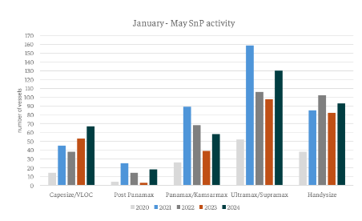
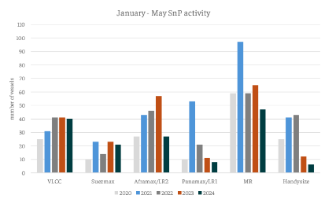

# Sale and purchase activity of dry bulk comparatively tanker

**Date:** June 13, 2024  
**Publisher:** Breakwave Advisors | **Category:** Market Insights  
**Original URL:** [https://www.breakwaveadvisors.com/insights/2024/6/13/sale-and-purchase-activity-of-dry-bulk-comparatively-tanker](https://www.breakwaveadvisors.com/insights/2024/6/13/sale-and-purchase-activity-of-dry-bulk-comparatively-tanker)  

---

*By*[*Yiannis Parganas*](https://www.linkedin.com/in/yiannis-p-36a2141a7/)

The dry bulk sale and purchase activity has demonstrated remarkable strength this year, achieving the second-largest volume of transactions in the sector's history, surpassed only by the record of 403 sales in 2021. Notably, in the first five months of 2024, 362 dry bulk sales (>20kdwt) were recorded, representing an increase of 87 transactions compared to the same period in 2023. Within the various size categories, geared sizes garnered the most attention. Specifically, the Ultramax/Supramax sector recorded 130 sales, followed by the Handysize segment with 93 units changing hands. Capesize units also saw significant interest, with 67 deals concluded in the first five months. This figure represents the highest number of sales in the first five months of a year followed by the 51 sales recorded in 2023. Additionally, 58 Panamax/Kamsarmax and 18 Post Panamax sales were completed.

> **Figure 1: Στιγμιότυπο Οθόνης 2024 06 13 155000**  
> **Interactive Data & Source:** [Intermodal](https://www.intermodal.gr/) | [Local Asset](file:///C:/Users/Dell/Github/Shipping/corpus/03-breakwave/insights/2024/assets/2024-06-13_sale-and-purchase-activity-of-dry-bulk-comparatively-tanker_img_cea3cf84ceb9ceb3cebcceb9cf8ccf84cf85_0252abd83987.png)

Conversely, tanker sale and purchase activity has been the weakest in the past five years, contrasting with the record levels recorded in 2022 and the highest number of sales for the first five months of a year that materialized in 2023, totaling 288 tanker sales. Specifically, in 2024 so far, a total of 156 tanker sales (>20kdwt) have been recorded. MR2 units dominate with 59 transactions, followed by 27 Aframax/LR2 deals. Both VLCC and Handies transactions stood at 25, while only 10 Suezmax and 10 Panamax vessels changed hands. Interestingly, although not the focus of our current analysis, it is noteworthy that the newbuilding interest for tanker vessels is following a completely divergent trend, marking a historically high number of new contracts.

> **Figure 2: Στιγμιότυπο Οθόνης 2024 06 13 155735**  
> **Interactive Data & Source:** [Intermodal](https://www.intermodal.gr/) | [Local Asset](file:///C:/Users/Dell/Github/Shipping/corpus/03-breakwave/insights/2024/assets/2024-06-13_sale-and-purchase-activity-of-dry-bulk-comparatively-tanker_img_cea3cf84ceb9ceb3cebcceb9cf8ccf84cf85_040e286d34f1.png)

Activity in the demolition market has also shown divergent trends across the two different sectors. Specifically, 25 bulkers were sent to scrapyards during the first five months of 2024, below the 5-year average of 32 vessels for the same period. However, tanker scrapping activity remains nearly nonexistent. According to our preliminary data, the mere 4 tankers sent for demolition mark the lowest tanker scrapping activity on record.

Data Source:[Intermodal](https://www.intermodal.gr/)

---

**Tags:** Dry Bulk, Shipping, Tankers  
