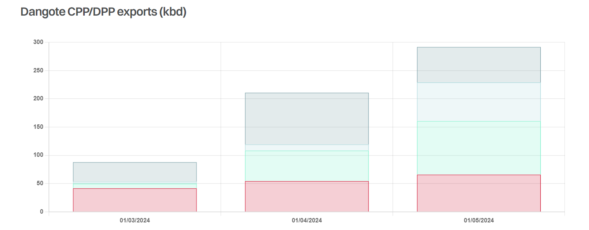

# A Lot of Moving Parts

**Date:** June 14, 2024  
**Publisher:** Breakwave Advisors | **Category:** Market Insights  
**Original URL:** [https://www.breakwaveadvisors.com/insights/2024/6/14/a-lot-of-moving-parts](https://www.breakwaveadvisors.com/insights/2024/6/14/a-lot-of-moving-parts)  

---

> **Figure 1: Img 3**  
> **Interactive Data & Source:** [Gibsons Co](https://www.gibsons.co.uk/market-reports) | [Local Asset](file:///C:/Users/Dell/Github/Shipping/corpus/03-breakwave/insights/2024/assets/2024-06-14_a-lot-of-moving-parts_img_img-3_0fbff3f0ce57.jpg)

The long-awaited change in the product tanker market due to the 650kbd Dangote refinery start-up appears to be approaching. The refinery imported its first crude cargo in December last year and over the past three months imports averaged between 230kbd and 310kbd, mainly consisting of Nigerian grades, supplemented by US barrels. The refinery has also started exporting clean and dirty products in March, with volumes reaching 290kbd in May, according to Kpler. Dirty petroleum products are finding a home primarily in the US, whilst some barrels have also been shipped into Europe and Singapore. The vast majority of exported naphtha is destined for Asia, the straight run gasoil/diesel is almost entirely staying local, whilst the jet fuel is redistributed into West/North Africa as well as Latin America, and with limited volumes shipped into NW Europe.

Recently, Argus reported that Nigeria’s downstream regulator NMDPRA has indicated that the refinery has now received approval to start its residual fluid catalytic cracker, which upgrades heavy feedstock into lighter products, such as gasoline. Furthermore, Dangote’s vice president for oil and gas also has also stated that the company expects to start sales of gasoline in June and anticipates beginning exports of 10 ppm diesel.

However, full operations could still be some time off, with naphtha exports, needed as a feedstock for a finished gasoline, remaining strong in May. Any major changes to these flows will offer a clue as to how fast Dangote is bringing its secondary units online. For now, general expectations are that the refinery will start meaningfully impacting the clean tanker market in Q4 2024/Q1 2025 but as always there are a lot of moving parts.

On its own, the anticipated decline in West African gasoline imports, when Dangote is fully up and running, will reduce demand not just for MRs but for larger LRs as well. Volume wise, over 60% of all Nigerian gasoline imports over the past two years have been carried on LR2s and LR1s. Faced with reduced trading opportunities West, this will inevitably increase Middle East LR availability.

Whilst the refinery is geared up to maximise gasoline production, it will still be producing sizable volumes of gasoil and jet. For now, products are mainly staying local, but Dangote’s high spec diesel and jet could find a natural home in Europe. Although it will create “new” clean tanker tonne miles, many of these barrels will be a backhaul cargo into Europe for tankers that will continue to move products into the rest of West Africa, so essentially not adding much new vessel demand. Furthermore, if we do indeed see Dangote trading into Europe, then East of Suez/Europe flows could come under downwards pressure and that will have a more profound effect on the overall clean tanker market due to the distances travelled. The same logic applies to TC14 flows.

The biggest question, however, is vulnerability of European refineries, which will struggle to find a new home for the gasoline they will no longer export to Nigeria. Possibly a bit more could flow into the US Atlantic Coast but the prospects for demand growth here are bleak. Some extra barrels could also be exported into Latin America, although here they will need to compete with Russian and US products. Already, over 600kbd of European refining capacity is earmarked to close between 2025 and 2027. The prospects for European demand are also uncertain but if refinery closures lead to growing European distillates intake, then there is an argument that further gains in East of Suez and USG flows into Europe will offset for the upcoming decline in CPP imports into West Africa.

> **Figure 2: Στιγμιότυπο Οθόνης 2024 06 14 100609**  
> **Interactive Data & Source:** [Gibsons Co](https://www.gibsons.co.uk/market-reports) | [Local Asset](file:///C:/Users/Dell/Github/Shipping/corpus/03-breakwave/insights/2024/assets/2024-06-14_a-lot-of-moving-parts_img_cea3cf84ceb9ceb3cebcceb9cf8ccf84cf85_20e927e85880.png)

Data source:[Gibson Shipbrokers](https://www.gibsons.co.uk/market-reports)

---

**Tags:** Tankers, Shipping, Crude Oil  
