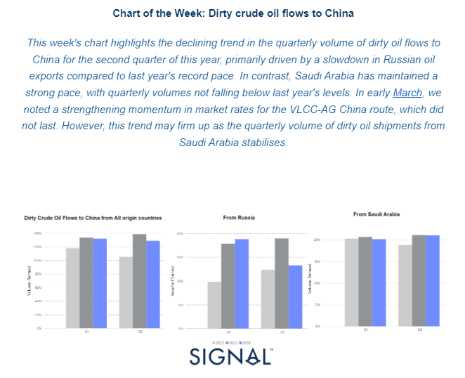
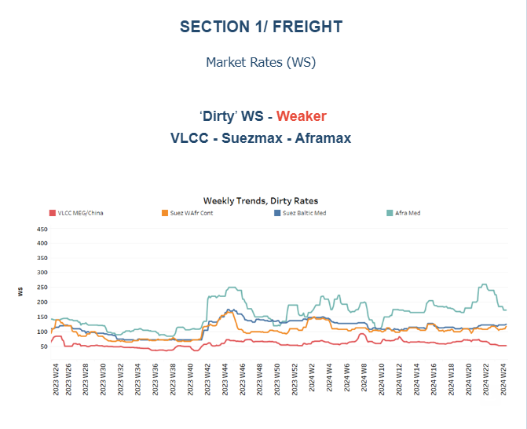
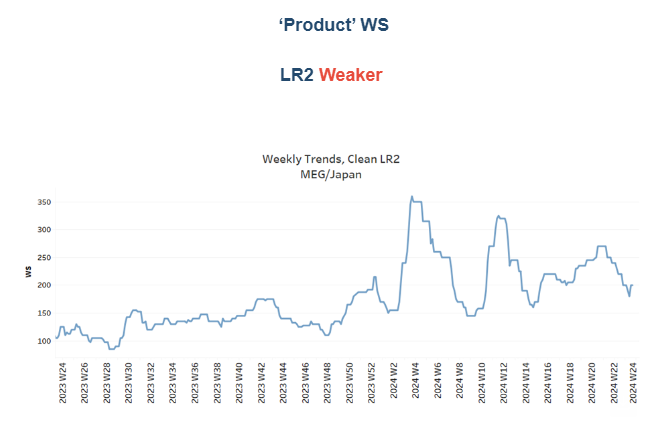
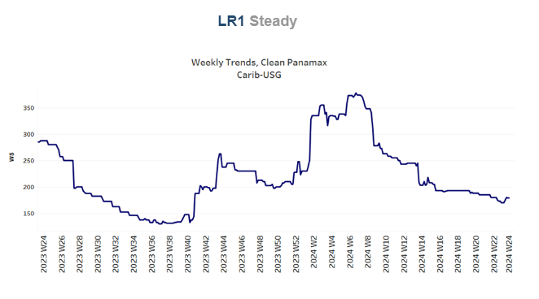
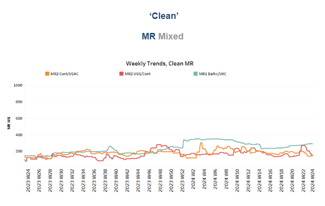
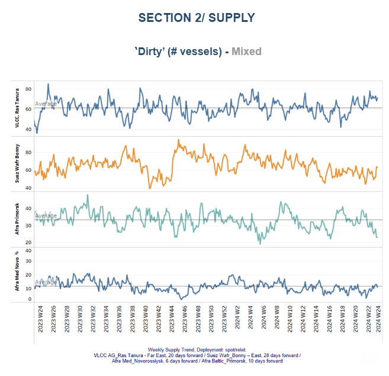
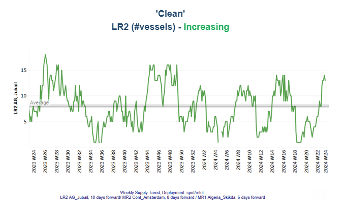
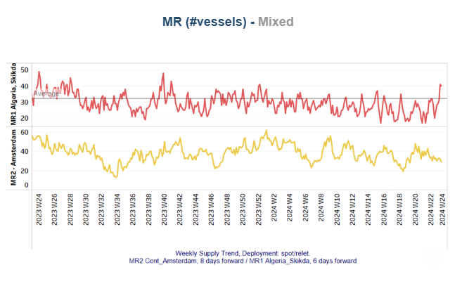
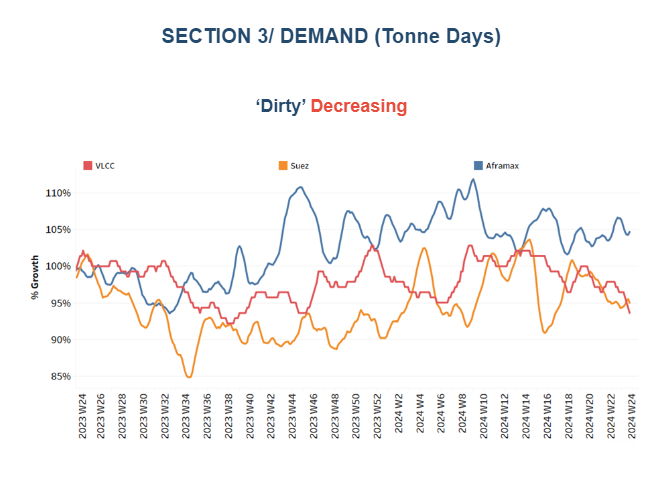
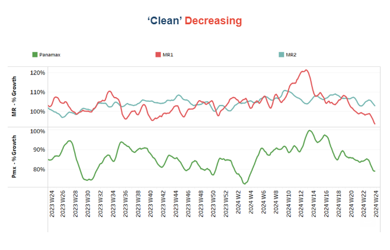

# Dirty crude oil flows to China

**Date:** June 14, 2024  
**Publisher:** Breakwave Advisors | **Category:** Market Insights  
**Original URL:** [https://www.breakwaveadvisors.com/insights/2024/6/14/dirty-crude-oil-flows-to-china](https://www.breakwaveadvisors.com/insights/2024/6/14/dirty-crude-oil-flows-to-china)  

---

## Tanker - Weekly Market Monitor

Snapshot of Crude and Product Freight Rates, Supply-Demand

Week 24, June 14, 2024

> **Figure 1: Στιγμιότυπο Οθόνης 2024 06 14 134600**  
> **Interactive Data & Source:** [Signal Ocean Platform](https://go.signalocean.com/e/983831/g-Oil-Output-Quota-in-May-html/2q99gt/416579658/h/YmQGcN6HpPmDlo1F3zpm5XVv1ntJq_SG7dWQykPQtuw) | [Local Asset](file:///C:/Users/Dell/Github/Shipping/corpus/03-breakwave/insights/2024/assets/2024-06-14_dirty-crude-oil-flows-to-china_img_cea3cf84ceb9ceb3cebcceb9cf8ccf84cf85_0013fd0b8a3d.png)

In the first half of May, there was a weakening trend in dirty freight rates for the VLCC AG-China market, along with a significant downward revision on the Aframax Med route. On the demand side, the growth in dirty and clean tonne days has yet to show an increasing pace. Consequently, the supply of vessels will play a critical role in maintaining the robust environment for dirty and clean freight rates in the coming days.

On the macroeconomic front,[Russia](https://go.signalocean.com/e/983831/g-Oil-Output-Quota-in-May-html/2q99gt/416579658/h/YmQGcN6HpPmDlo1F3zpm5XVv1ntJq_SG7dWQykPQtuw)is expected to meet its oil production quota in June after exceeding its target output under the OPEC+ deal in May, the Russian Energy Ministry announced on Thursday. According to the ministry, Russia slightly surpassed its OPEC+ quota in May, based on data from independent sources monitoring the agreement. The ministry added that "the issue with overproduction will be resolved in June, when the target will be achieved." The excess production volumes since April will be fully compensated for in the future, with the overproduction offset during the compensation period until the end of September 2025. The ministry also reiterated that "Russia remains fully committed to the fundamental principles of the OPEC+ deal."

> **Figure 2: Στιγμιότυπο Οθόνης 2024 06 14 134920**  
> **Interactive Data & Source:** [Signal Ocean Platform](https://www.thesignalgroup.com/signal-ocean-platform) | [Local Asset](file:///C:/Users/Dell/Github/Shipping/corpus/03-breakwave/insights/2024/assets/2024-06-14_dirty-crude-oil-flows-to-china_img_cea3cf84ceb9ceb3cebcceb9cf8ccf84cf85_5d060ecc842c.png)

The first half of June has seen a weakening trend in crude oil freight rates, with a particularly notable decline on the Aframax Med route.

- The**VLCC**MEG-China freight rates dropped to 50WS, marking a 30% increase compared to the same week in June last year.
- Suezmax freight rates for shipments from**West Africa**to**continental**Europe have held steady around 110 WS, marking a 7% increase from the previous month. Meanwhile, rates on the Suez Baltic Med route have continued to follow a similar trend as in May, approximately 120 WS, reflecting a nearly 12% increase compared to the same week last year.
- Aframax**Mediterranean**freight rates are currently hovering around WS160, reflecting a 10% monthly decrease. There is a trend toward further declines, as the last peak was reached at the end of week 22.

> **Figure 3: Στιγμιότυπο Οθόνης 2024 06 14 135117**  
> **Interactive Data & Source:** [Signal Ocean Platform](https://www.thesignalgroup.com/signal-ocean-platform) | [Local Asset](file:///C:/Users/Dell/Github/Shipping/corpus/03-breakwave/insights/2024/assets/2024-06-14_dirty-crude-oil-flows-to-china_img_cea3cf84ceb9ceb3cebcceb9cf8ccf84cf85_c7acb64f13a6.png)

- **LR2**AG freight rates have dropped to WS200, nearly 50 points lower than in mid-May. However, they are currently 90% higher than during the same week last year.

> **Figure 4: Στιγμιότυπο Οθόνης 2024 06 14 135218**  
> **Interactive Data & Source:** [Signal Ocean Platform](https://www.thesignalgroup.com/signal-ocean-platform) | [Local Asset](file:///C:/Users/Dell/Github/Shipping/corpus/03-breakwave/insights/2024/assets/2024-06-14_dirty-crude-oil-flows-to-china_img_cea3cf84ceb9ceb3cebcceb9cf8ccf84cf85_c54c9cc197df.png)

- **Panamax**Carib-to-USG rates sustained levels around WS 180 from mid May, currently standing 38% weaker than during a comparable week a year ago.

> **Figure 5: Στιγμιότυπο Οθόνης 2024 06 14 135416**  
> **Interactive Data & Source:** [Signal Ocean Platform](https://www.thesignalgroup.com/signal-ocean-platform) | [Local Asset](file:///C:/Users/Dell/Github/Shipping/corpus/03-breakwave/insights/2024/assets/2024-06-14_dirty-crude-oil-flows-to-china_img_cea3cf84ceb9ceb3cebcceb9cf8ccf84cf85_fd12f4a93fbe.png)

- **MR1**rates for shipments from the**Baltic to the continent**have risen above 250 WS, reflecting a 26% increase compared to the levels a year ago. Meanwhile,**MR2**rates for shipments from the**continent to the USAC**are at 160 WS, marking a 20% annual increase. In contrast, MR2 rates for the**USG-Cont**route have experienced a declining trend, dropping to 140 WS, a 37% decrease from the previous week.

> **Figure 6: Στιγμιότυπο Οθόνης 2024 06 14 135529**  
> **Interactive Data & Source:** [Signal Ocean Platform](https://www.thesignalgroup.com/signal-ocean-platform) | [Local Asset](file:///C:/Users/Dell/Github/Shipping/corpus/03-breakwave/insights/2024/assets/2024-06-14_dirty-crude-oil-flows-to-china_img_cea3cf84ceb9ceb3cebcceb9cf8ccf84cf85_a39e4aad0c34.png)

The supply trend for crude tankers mirrors a mixed picture, with the number of Aframax vessels decreasing in Primosk, while there are indications for an increase in the VLCC Ras Tanura and Suezmax Wafr Bonny.

- **VLCC Ras Tanura**: The number of ships has risen to nearly 71, which is almost 10 more than the annual average.
- **Suezmax Wafr**: The current ship count hovers above 60, reflecting an increasing trend compared to levels observed a week ago.
- **Aframax Primorsk**: The number of ships held levels significantly lower than the annual average of 30, nearly 15 fewer than the levels recorded four weeks ago.
- **Aframax Med Novo**: Since the end of week 22, the vessel count has remained close to the annual average of 10. It is uncertain whether this number will fall below the annual trend by the end of June.

> **Figure 7: Στιγμιότυπο Οθόνης 2024 06 14 135657**  
> **Interactive Data & Source:** [Signal Ocean Platform](https://www.thesignalgroup.com/signal-ocean-platform) | [Local Asset](file:///C:/Users/Dell/Github/Shipping/corpus/03-breakwave/insights/2024/assets/2024-06-14_dirty-crude-oil-flows-to-china_img_cea3cf84ceb9ceb3cebcceb9cf8ccf84cf85_3dc2d9ac5a6b.png)

> **Figure 8: Στιγμιότυπο Οθόνης 2024 06 14 135717**  
> **Interactive Data & Source:** [Signal Ocean Platform](https://www.thesignalgroup.com/signal-ocean-platform) | [Local Asset](file:///C:/Users/Dell/Github/Shipping/corpus/03-breakwave/insights/2024/assets/2024-06-14_dirty-crude-oil-flows-to-china_img_cea3cf84ceb9ceb3cebcceb9cf8ccf84cf85_64a25b9ef7ec.png)

- **Clean LR2 AG Jubail**: Over the past four weeks, the number of vessels has shown an upward trend, reaching 13. The lowest point was recorded in week 18.
- **Clean MR**: Vessel activity for MR1 at Algeria's Skikda port has increased to 40, doubling from the low recorded two weeks ago. In contrast, MR2 activity in Amsterdam has been decreasing since its peak at the end of week 20, now at 29 vessels—19 fewer than the high reached at that time.

> **Figure 9: Στιγμιότυπο Οθόνης 2024 06 14 135837**  
> **Interactive Data & Source:** [Signal Ocean Platform](https://www.thesignalgroup.com/signal-ocean-platform) | [Local Asset](file:///C:/Users/Dell/Github/Shipping/corpus/03-breakwave/insights/2024/assets/2024-06-14_dirty-crude-oil-flows-to-china_img_cea3cf84ceb9ceb3cebcceb9cf8ccf84cf85_9c0bfcd2e22d.png)

- **Dirty**tonne days: In the first half of June, there are no indications of an upward reversal in the growth of tonne-days for the VLCC and Suezmax segments. Although the Aframax segment saw an upward reversal in the previous two weeks, it has now corrected to a weakening trend.

> **Figure 10: Στιγμιότυπο Οθόνης 2024 06 14 135930**  
> **Interactive Data & Source:** [Signal Ocean Platform](https://www.thesignalgroup.com/signal-ocean-platform) | [Local Asset](file:///C:/Users/Dell/Github/Shipping/corpus/03-breakwave/insights/2024/assets/2024-06-14_dirty-crude-oil-flows-to-china_img_cea3cf84ceb9ceb3cebcceb9cf8ccf84cf85_a629b59723f0.png)

- **Panamax**tonne days: The growth pace in June continues to decline, with recent levels dropping to the lowest point since the peak at the end of week 14. For Clean**MR**tonne days, both MR1 and MR2 vessel sizes have experienced a steady decline over the past two weeks, with no signs of an imminent reversal. The last peak for**MR1**was observed in weeks 17 and 18.

Data Source:[Signal Ocean Platform](https://www.thesignalgroup.com/signal-ocean-platform)

---

**Tags:** Shipping, Tankers, Crude  
