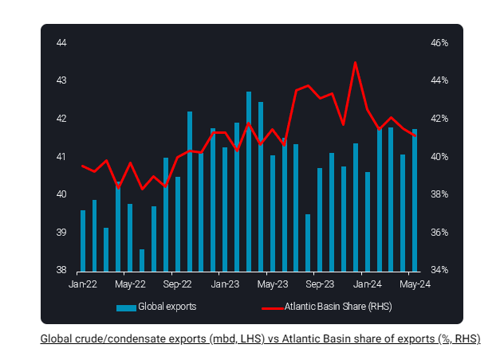
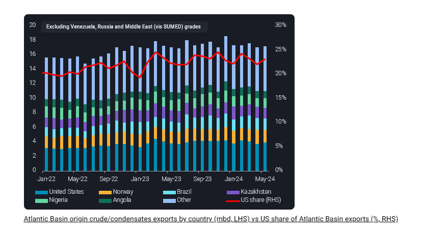

# Global crude exports recover in May but Atlantic Basin loses share

**Date:** June 14, 2024  
**Publisher:** Breakwave Advisors | **Category:** Market Insights  
**Original URL:** [https://www.breakwaveadvisors.com/insights/2024/6/14/global-crude-exports-recover-in-may-but-atlantic-basin-loses-share](https://www.breakwaveadvisors.com/insights/2024/6/14/global-crude-exports-recover-in-may-but-atlantic-basin-loses-share)  

---

Global crude supplies were buoyed in May by an almost 700kbd m-o-m rise in global exports, but total exports are still well below peaks seen last year. Meanwhile, the Atlantic Basin, often touted as a source of growing supply, has been losing market share.

*By*[*Jay Maroo*](https://www.linkedin.com/in/jay-m-336a3633/)

Global crude/condensate exports in May stood at just under 42mbd, nearing the levels seen in February and March this year. But this short-term rise was met with the Atlantic Basin’s share of exports falling to 41%, the lowest in almost a year (note: Atlantic Basin cargoes exclude Russian and Venezuelan origin crude and Middle East grades loaded via SUMED).

> **Figure 1: Στιγμιότυπο Οθόνης 2024 06 14 111028**  
> **Interactive Data & Source:** [Vortexa](https://www.vortexa.com//oil-gas-data-traders-analysts-data-scientists?gclid=Cj0KCQjw8_qRBhCXARIsAE2AtRZKOvMnbilZ_6_91d7huSFFy71pWLrnPwGwOHVzXsmsG-1a1mZnQw8aAt89EALw_wcB&hsa_acc=1782073842&hsa_ad=548425387665&hsa_cam=14746637662&hsa_grp=125038601902&hsa_kw=&hsa_mt=&hsa_net=adwords&hsa_src=g&hsa_tgt=dsa-1431852288425&hsa_ver=3&utm_campaign=%5BCD%5D%20-%20DSA%20-%20EMEA&utm_medium=cpc&utm_medium=ppc&utm_source=google&utm_source=adwords&utm_term=) | [Local Asset](file:///C:/Users/Dell/Github/Shipping/corpus/03-breakwave/insights/2024/assets/2024-06-14_global-crude-exports-recover-in-may-but-atlantic-basin-loses-share_img_cea3cf84ceb9ceb3cebcceb9cf8ccf84cf85_cac5a887e054.png)

Ongoing supply cuts from OPEC+ are scheduled to last until September this year, but after that, the trend for a falling share from the Atlantic Basin is likely to accelerate even further. Under the most recent agreements, Saudi Arabia and UAE will be able to produce up to 1.5mbd more in the 12 months from September.

Should this happen, Atlantic Basin suppliers may not keep pace to the same extent, or even at all. Other OPEC+ countries are also likely to add to supply (and therefore exports), albeit more modestly. In contrast, the potential for Atlantic Basin supply to grow further and the demand for Atlantic Basin crude are more uncertain.

There seems to be relatively small upside for Atlantic Basin crude/condensate exports in the short term and with recent months’ exports holding mostly flat this year, in a very tight range (between 17.1-17.6mbd). During this period, US exports – the largest supplier in the Basin – have generally trended lower.

> **Figure 2: Στιγμιότυπο Οθόνης 2024 06 14 111126**  
> **Interactive Data & Source:** [Vortexa](https://www.vortexa.com//oil-gas-data-traders-analysts-data-scientists?gclid=Cj0KCQjw8_qRBhCXARIsAE2AtRZKOvMnbilZ_6_91d7huSFFy71pWLrnPwGwOHVzXsmsG-1a1mZnQw8aAt89EALw_wcB&hsa_acc=1782073842&hsa_ad=548425387665&hsa_cam=14746637662&hsa_grp=125038601902&hsa_kw=&hsa_mt=&hsa_net=adwords&hsa_src=g&hsa_tgt=dsa-1431852288425&hsa_ver=3&utm_campaign=%5BCD%5D%20-%20DSA%20-%20EMEA&utm_medium=cpc&utm_medium=ppc&utm_source=google&utm_source=adwords&utm_term=) | [Local Asset](file:///C:/Users/Dell/Github/Shipping/corpus/03-breakwave/insights/2024/assets/2024-06-14_global-crude-exports-recover-in-may-but-atlantic-basin-loses-share_img_cea3cf84ceb9ceb3cebcceb9cf8ccf84cf85_ff574b657f3b.png)

Looking ahead, a major concern for Atlantic Basin producers will be how much crude will/won’t be pulled by one of its key customers, Europe.

Our latest inventory data shows crude inventories in the region have been rising, even as seasonal refinery maintenance draws to a close. This contrasts with the global trend which shows inventories reversing increases and moving lower since mid-May.

As of early June, European crude inventories have increased to levels last seen around 18 months ago. Though refinery maintenance was a contributing factor for this, this has been winding down and would have supported draws that have not materialised.

Weakness in European refined products pricing (e.g diesel crack spreads and contango) also paints a bearish demand picture for the region. Should this continue, Atlantic Basin supplies would likely have to travel further east for buyers and compete increasingly with Middle East producers – both of which would put even more pressure on global market share.

Data Source:[Vortexa](https://www.vortexa.com//oil-gas-data-traders-analysts-data-scientists?gclid=Cj0KCQjw8_qRBhCXARIsAE2AtRZKOvMnbilZ_6_91d7huSFFy71pWLrnPwGwOHVzXsmsG-1a1mZnQw8aAt89EALw_wcB&hsa_acc=1782073842&hsa_ad=548425387665&hsa_cam=14746637662&hsa_grp=125038601902&hsa_kw=&hsa_mt=&hsa_net=adwords&hsa_src=g&hsa_tgt=dsa-1431852288425&hsa_ver=3&utm_campaign=%5BCD%5D%20-%20DSA%20-%20EMEA&utm_medium=cpc&utm_medium=ppc&utm_source=google&utm_source=adwords&utm_term=)

---

**Tags:** Shipping, Crude Oil, Tankers  
